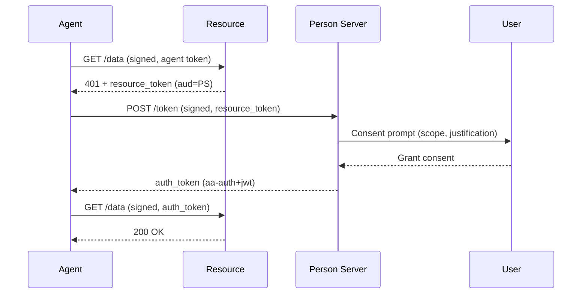

# Implementation Plan: README & Getting Started Documentation Update

## Phase 1: README.md — Three-Party Flow with Mermaid Diagram

### Changes

**File:** `README.md`

Replace the existing "Three-Party Flow" section with an expanded version including:

1. **Mermaid sequence diagram** showing the PS-Asserted (three-party) flow with user consent:

2. **Self-hosted agent setup** — concise code showing:
   - Key generation
   - Publishing agent metadata (`MapAAuthAgentWellKnown`)
   - Self-issuing agent tokens via `AgentTokenBuilder`
   - Building the signed client with challenge handling

3. **Resource-side example** — concise code showing:
   - Verification middleware registration
   - Resource metadata publication
   - Issuing resource tokens (challenge response)

4. **Agent calling the resource** — code showing the full client call and a brief "what happens" explanation

5. **Brief walk-through** of the exchange (numbered list):
   1. Agent signs GET with agent token → Resource verifies signature, reads `ps` from agent token
   2. Resource returns 401 with a `resource_token` (audience = PS URL)
   3. Agent POSTs resource_token to PS's token endpoint (signed request)
   4. PS validates agent token, prompts user for consent
   5. User grants consent; PS issues `auth_token` with identity claims
   6. Agent retries original request signed with auth token
   7. Resource verifies auth token signature + claims → 200 OK

### Definition of Done

- [x] Mermaid diagram renders correctly (3-party with user consent, 4 participants)
- [x] Self-hosted agent code example compiles conceptually (uses real SDK types)
- [x] Resource-side code example uses `UseAAuthVerification`, `MapAAuthWellKnown`, `ResourceTokenBuilder`
- [x] Agent-calls-resource code example uses `AAuthClientBuilder` with `WithChallengeHandling`
- [x] Walk-through text uses spec-accurate terminology (Person Server not "auth server", resource_token not "challenge token", auth_token not "access token")
- [x] No bearer tokens mentioned — every credential is bound to a signing key
- [x] README remains concise — detailed explanations go in getting-started

---

## Phase 2: Getting Started — Expanded Protocol & Enrollment Guide

### Changes

**File:** `docs/getting-started.md`

Add/expand the following sections after the existing "What Just Happened?" section and before "Self-Issued Agent Tokens":

#### 2a. "Understanding the Protocol Participants" section

Expand on what each party does, with emphasis on the **Agent Provider (AP)**:

- **What an AP does**: Issues agent tokens that bind a signing key to an agent identity. Acts as the trust anchor for agent identity. Analogous to a certificate authority for agents.
- **Self-hosted vs enrolled**:
  - Self-hosted: Agent has stable URL → is its own AP → publishes `/.well-known/aauth-agent.json` → self-signs tokens. No external enrollment. Used by web apps, APIs, orchestrators.
  - Enrolled (external AP): CLI/desktop/mobile agents register with an AP. AP holds public key, agent holds private key locally. Agent token refreshed automatically (SDK manages this).
- **Key separation**: Agent and AP never share a keystore. Agent holds private key in local `IKeyStore`; AP holds only the public key.

#### 2b. "Key Types & Cryptography" section

- **Ed25519** — required for signing keys (`AAuthKey.Generate()` produces Ed25519)
- **JWK Thumbprint (S256)** — how keys are identified without exposing the full key
- **JWT signing** — all AAuth tokens are Ed25519-signed JWTs
- Note: spec says EdDSA is RECOMMENDED; implementations MUST NOT accept `none`

#### 2c. "Supported Flows" section

Table + brief description of each flow with links:

| Flow | Parties | When to Use | Signing Mode |
|------|---------|-------------|--------------|
| Identity-Based | Agent + Resource | API-key replacement, simple access control | `hwk` or `jwks_uri` |
| Resource-Managed (two-party) | Agent + Resource | Resource handles its own auth (interaction, OAuth) | Any |
| PS-Asserted (three-party) | Agent + Resource + PS | User consent required, resource delegates auth to PS | `jwt` |
| Federated (four-party) | Agent + Resource + PS + AS | Cross-domain policy, resource has its own AS | `jwt` |

#### 2d. "Three-Party Flow Deep Dive" section

Detailed walk-through with:

1. **Mermaid diagram** (same as README but more detailed, showing consent interaction)
2. **Step-by-step explanation** of each message:
   - What headers are sent
   - What the resource checks
   - What the PS validates
   - How consent works (immediate vs deferred)
   - What claims the auth token contains
3. **Self-hosted agent code** (full example with metadata publishing)
4. **Resource-side code** (full example with verification + token issuance)
5. **Client code** calling the resource (showing automatic challenge handling)

#### 2e. "Enrollment: Hosted vs CLI/Desktop Agents" section

Restructure existing enrollment content into a clear comparison:

| Aspect | Self-Hosted (Web App/API) | Enrolled (CLI/Desktop) |
|--------|---------------------------|------------------------|
| AP needed? | No — agent IS its own AP | Yes — external AP |
| URL requirement | Stable HTTPS URL | None |
| Key lifecycle | Generated at startup, published via JWKS | Generated in keystore at enrollment, loaded by handle |
| Token acquisition | Self-signed at startup | AP refresh endpoint (automatic via SDK) |
| Metadata | Publishes `/.well-known/aauth-agent.json` | AP publishes it |
| Code entry point | `MapAAuthAgentWellKnown()` + `AgentTokenBuilder` | `AAuthClientBuilder.Bootstrap().EnrolAsync()` |

### Definition of Done

- [x] "Understanding the Protocol Participants" section explains AP role clearly
- [x] Self-hosted vs enrolled comparison table present
- [x] Key types section covers Ed25519, JWK thumbprint, JWT signing
- [x] Supported flows table covers all 4 modes with correct signing mode requirements
- [x] Three-party deep dive includes mermaid diagram with user consent
- [x] Step-by-step explanation covers headers, validation, consent (immediate + deferred)
- [x] Resource-side code example present (verification + metadata + token issuance)
- [x] All terminology matches spec exactly (Person Server, resource_token, auth_token, etc.)
- [x] No references to bearer tokens or OAuth concepts that don't apply
- [x] Links to detailed docs (signing-modes/overview, workflows/, server/) work correctly

---

## Phase 3: Review & Cross-References

### Changes

1. Ensure README links to the new getting-started sections
2. Ensure getting-started links to workflow docs, server docs, and signing-modes docs
3. Verify no terminology drift between README, getting-started, and spec
4. Ensure code examples are consistent across both files (same patterns, same type names)

### Definition of Done

- [x] README "See Getting Started" link points to correct anchor
- [x] Getting-started "Next Steps" links all resolve
- [x] Terminology audit: no "bearer token", "access token" (use "auth token"), "authorization server" (use "Access Server" or "Person Server")
- [x] Code examples use current SDK API surface (builder pattern, real type names)

---

## Out of Scope

| Item | Reason |
|------|--------|
| Updating workflow docs (`docs/workflows/`) | Separate concern; already well-documented |
| Adding new sample projects | Documentation-only change |
| Spec conformance testing of examples | Examples are illustrative, not runnable |
| Mission/governance documentation | Orthogonal layer, not part of basic getting-started |
| Four-party (federated) detailed example | Complex; three-party is the focus |
