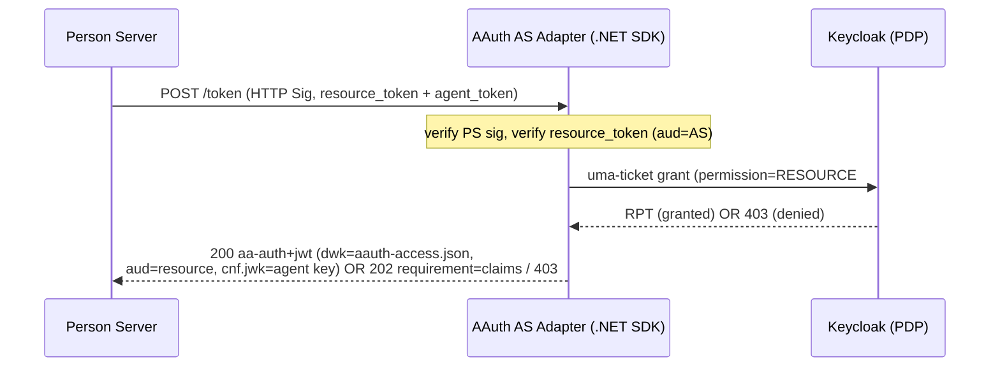

# Research: Four-Party (Federated) AAuth Example with Keycloak as the Access Server

Status: research-only. No task lists here — see [implementation-plan.md](implementation-plan.md).

Created: 2026-06-02

## Goal

Stand up a complete **four-party / federated** AAuth flow using the SDK in this
repo, where the **Access Server (AS)** role is backed by **Keycloak** acting as
the policy engine (Policy Decision Point). The four parties are:

| Party | Role | Candidate in this repo |
|---|---|---|
| Agent | Holds cryptographic identity, signs every request | `samples/AgentConsole` (or `SampleApp`) |
| Resource | Protects data; issues resource tokens with `aud` = AS URL | new `samples/MockResource` (or extend `WhoAmI`) |
| Person Server (PS) | Represents the user; federates to the AS | `samples/MockPersonServer` (needs federation support) |
| Access Server (AS) | Policy engine; issues auth tokens on behalf of the resource | new **AAuth↔Keycloak adapter** in front of Keycloak |

## What the spec says (source of truth)

All section anchors below refer to
[aauth-spec/draft-hardt-oauth-aauth-protocol.md](../../aauth-spec/draft-hardt-oauth-aauth-protocol.md)
(commit pinned in [SPEC-VERSION.md](../../aauth-spec/SPEC-VERSION.md)).

### Roles and modes

- The protocol defines four resource access modes; **federated access
  (four-party)** is `Agent + Resource + PS + AS` (spec §Resource Access Modes).
- **Access Server (AS)**: "A policy engine that evaluates token requests,
  applies resource policy, and issues auth tokens on behalf of a resource.
  Identified by an HTTPS URL and publishes metadata at
  `/.well-known/aauth-access.json`." (spec §Roles)
- The only party that ever calls an AS token endpoint is the **PS** (spec
  §PS-AS Federation). The agent never talks to the AS directly — federation is
  transparent to the agent (see [docs/workflows/federated-access.md](../../docs/workflows/federated-access.md)).

### Four-party wire flow (spec §Federated Access)

1. Agent → Resource: signed `POST authorization_endpoint` (or signed request →
   `401` with `requirement=auth-token`).
2. Resource → Agent: **resource token** with `aud` = **AS URL** (not PS URL).
   This `aud` value is the only thing that distinguishes four-party from
   three-party on the wire.
3. Agent → PS: signed `POST token_endpoint` with `resource_token`.
4. PS discovers the AS at `{aud}/.well-known/aauth-access.json` and makes a
   **signed** `POST {as}/token` with `resource_token` + `agent_token`
   (PS authenticates with HTTP Sig using `scheme=jwks_uri`). (spec
   §AS Token Endpoint → PS-to-AS Token Request)
5. AS → PS: **auth token** (`iss` = AS, `dwk` = `aauth-access.json`).
6. PS verifies the auth token (7 checks, spec §Auth Token Delivery) and returns
   it to the agent.
7. Agent → Resource: signed request presenting the auth token via
   `Signature-Key: sig=jwt`. Resource verifies against the AS JWKS (spec
   §Auth Token Verification, 9 checks).

### AS token endpoint contract (spec §AS Token Endpoint)

- Request body: `resource_token` (REQUIRED), `agent_token` (REQUIRED),
  `upstream_token` (OPTIONAL, call chaining).
- Responses follow the deferred loop: `200` (auth token), `202` (`requirement=
  claims | interaction | approval | clarification`), `402` (payment), terminal
  errors. For the first cut we target `200` and `202 requirement=claims`.
- `requirement=claims` (spec §Claims Required): `202` with body
  `{ "required_claims": [...] }`; PS POSTs the claims (incl. directed `sub`) to
  the `Location` URL. "The AS cannot know what claims it needs until it has
  processed the resource token."

### Auth token structure when issued by an AS (spec §Auth Token)

- Header `typ: aa-auth+jwt`, `alg` EdDSA recommended, never `none`.
- Required: `iss` (AS URL), `dwk: aauth-access.json`, `aud` (resource URL),
  `jti`, `agent`, `cnf.jwk` (agent key), `act` (`act.sub` = agent), `iat`,
  `exp` (≤ 1 hour).
- Conditional (≥1): `sub` (directed/pairwise), `scope`.
- Optional: `mission`, `tenant`.
- Verified by the resource against `{iss}/.well-known/aauth-access.json` JWKS.

### Access Server metadata (spec §Access Server Metadata)

`/.well-known/aauth-access.json`:

```json
{
  "issuer": "https://as.resource.example",
  "token_endpoint": "https://as.resource.example/token",
  "jwks_uri": "https://as.resource.example/.well-known/jwks.json"
}
```

`revocation_endpoint` optional.

### PS-AS trust (spec §PS-AS Trust Establishment)

Trust may be pre-established (business relationship / shared org) or established
dynamically via `202 requirement=interaction` (user binds PS at AS), `402`
(payment), or claims-only. **PS-AS collapse** (spec §ps-as-collapse): when the
agent's PS and the resource's chosen AS are the same server, federation is an
internal evaluation — auth token still carries `dwk: aauth-access.json` and the
resource trusts the AS's policy verdict (vs three-party `aauth-person.json`).

## Current SDK state — what already exists

Verified by reading `src/AAuth/**` on branch as of 2026-06-02.

| Building block | Location | Status |
|---|---|---|
| AS metadata endpoint | `MapAAuthAccessServerWellKnown` + `AAuthAccessServerMetadataOptions` ([WellKnownEndpoints.cs](../../src/AAuth/Server/WellKnownEndpoints.cs)) | exists, unused by samples |
| AS-issued auth token `dwk` | `AuthTokenBuilder.AccessDwk = "aauth-access.json"` ([AuthTokenBuilder.cs](../../src/AAuth/Tokens/AuthTokenBuilder.cs)) | exists |
| Resource token `aud` = AS URL | `ResourceTokenBuilder` aud comment; `ChallengeOptions` explicit audience ([ChallengeOptions.cs](../../src/AAuth/Server/ChallengeOptions.cs)) | exists |
| PS discovers AS metadata | `ServerMetadata.FetchAccessServerMetadataAsync` ([ServerMetadata.cs](../../src/AAuth/Discovery/ServerMetadata.cs)) | exists, not wired into PS |
| Resource verifies AS token (dual-dwk) | `TokenVerifier.VerifyResourceTokenAsync` / dual-dwk verify ([TokenVerifier.cs](../../src/AAuth/Tokens/TokenVerifier.cs)) | exists |
| Call-chaining `upstream_token` plumbing | `UpstreamTokenValidator`, `CallChainingRouter`, `CallChainingHandler` | exists (orthogonal, reusable) |
| Agent-side challenge handling | `WithChallengeHandling()` ([AAuthClientBuilder.cs](../../src/AAuth/HttpSig/AAuthClientBuilder.cs)) | exists; agent code is identical to three-party |

Key consequence: **agent-side code needs no changes** for four-party. The work
is concentrated in (a) a new AS, and (b) PS federation logic.

## Gaps (spec ↔ SDK/samples) — to close in the plan

| # | Gap | Spec ref | Notes |
|---|---|---|---|
| G1 | No PS→AS federation in `MockPersonServer`: PS always issues directly (three-party). It does not branch on `resource_token.aud != self`, discover the AS, or forward the token. | §PS-AS Federation | Core gap. |
| G2 | No SDK client for the signed **PS-to-AS token request** (build body `{resource_token, agent_token, upstream_token?}`, sign with `jwks_uri`, follow `200/202/402` loop). | §AS Token Endpoint | Likely a new `AccessServerClient` mirroring `TokenExchangeClient`. |
| G3 | No `requirement=claims` request/response machinery (emit `202 required_claims`; PS provides directed `sub`+claims to `Location`). | §Claims Required | Needed for a realistic Keycloak policy that wants `email`/`tenant`. |
| G4 | No AS sample server at all (no AAuth `/token` that accepts PS requests, verifies PS sig, evaluates policy, mints `aa-auth+jwt` with `dwk=aauth-access.json`). | §AS Token Endpoint, §Auth Token | This is where Keycloak plugs in. |
| G5 | No resource sample that emits a resource token with `aud` = **AS URL** and verifies an AS-issued (`aauth-access.json`) auth token end-to-end. | §Federated Access | `WhoAmI` today is three-party (aud=PS). |
| G6 | PS-side **Auth Token Delivery** verification (7 checks on the AS response before handing to agent) not implemented. | §Auth Token Delivery | Reuse `TokenVerifier` pieces. |
| G7 | No PS↔AS trust model in samples (pre-established vs interaction/`202`). First cut: pre-established/implicit trust (shared demo config). | §PS-AS Trust Establishment | Dynamic binding is a later phase. |
| G8 | No orchestration/e2e wiring (`make`, Playwright) for a four-party run. | n/a | Mirror existing three-party e2e. |
| G9 | GuidedTour has no Access Server actor: `Actor` enum in [StepRecord.cs](../../samples/GuidedTour/StepRecord.cs) is Agent/Resource/PersonServer/AgentProvider/Orchestrator only — needs `AccessServer` for a four-swimlane run. | n/a | Demo requirement. |
| G10 | No SampleApp page for the four-party flow with AS consent bubble-up. | §Claims/Interaction | Reuse `CallChain.razor` two-callback pattern. |

## SDK API findings (running log)

Candidate SDK additions/changes surfaced while researching (and to be appended
as we build the phases). **Process**: changes may land in whichever earlier
phase first needs them, but the *overall* public surface is reviewed and
ratified in [implementation-plan.md](implementation-plan.md) **Phase 11 (SDK API
investigation & design)** under its consultation gate — nothing public ships
without user sign-off. Keep this table current as work proceeds.

| ID | Proposed API / change | Consumer | Driven by | First needed in phase | Status |
|---|---|---|---|---|---|
| S1 | `AccessServerClient` — signed PS→AS token request (`{resource_token, agent_token, upstream_token?}`, `jwks_uri` signing, `200/202/402` loop). Mirrors `TokenExchangeClient`. | PS | G2, G6 | Phase 2 | proposed |
| S2 | `MapAAuthAccessServer` / `UseAAuthAccessServer` host helper (token endpoint + PS-sig + resource-token verify + `AuthTokenBuilder` mint), sibling to `MapAAuthResource`/`UseAAuthIntermediary`. | AS | G4 | Phase 1 | proposed |
| S3 | `IAccessPolicy` / `AccessDecision` pluggable decision seam (allow / deny / needs-interaction); keeps Keycloak out of core. | AS | G4, Keycloak | Phase 4 | proposed |
| S4 | Auth Token Delivery verifier — reusable PS-side 7-check helper (consolidate `TokenVerifier` pieces). | PS | G6 | Phase 2 | proposed |
| S5 | PS auto-federation toggle on `WithChallengeHandling` (federate when `resource_token.aud != self`). | PS | G1 | Phase 3 | proposed |
| S6 | Deferred-interaction ergonomics review — unify or canonicalize the two-callback (`WithChallengeHandling` + `WithInteractionHandling`) consent shape for four-party. | Client | G10 | Phase 5 | finding: non-chained four-party needs only **one** callback (`WithChallengeHandling`); the AS `202` is relayed on the PS-exchange path. Two callbacks remain a call-chaining concern. Revisit naming in Phase 12. |
| S7 | Resource "delegate to AS" audience ergonomics — confirm/name `ChallengeOptions` explicit audience for `aud`=AS. | Resource | G5 | Phase 1 | investigate |
| S8 | `Actor.AccessServer` (sample type, not core SDK) in GuidedTour `StepRecord`. | Demo | G9 | Phase 6 | done (Phase 6): `Actor.AccessServer` + `SubStep`/`SubStepsLabel` added; sample-only, no core SDK change. |
| S9 | Config-selected AS policy backend: `IAccessPolicy` resolved from `AccessServer__PolicyProvider=stub\|keycloak` (default `stub`), optional graceful fallback to stub when Keycloak is unreachable. Mirrors the `MockPersonServer__RequireConsent` env pattern. | AS | G4, CI | Phase 4 | proposed |

Backward-compat note: S1–S5 are intended as **additive** (new types/overloads).
Any breaking change to existing signatures must be flagged in the Phase 11
design note and approved before implementation.


## Demo deliverables (explicit requirements)

Two user-visible demos sit on top of the SDK/AS work:

1. **GuidedTour — four-party swimlanes**: a tour run that renders one swimlane per
   party (Agent, Resource, Person Server, Access Server), stepping through the
   resource token (`aud`=AS), the PS→AS federation, the Keycloak decision, and
   the AS-minted `aa-auth+jwt`. Requires adding `Actor.AccessServer` (G9).
2. **SampleApp — four-party entry with consent bubble-up**: a new page modeled on
   [samples/SampleApp/Components/Pages/CallChain.razor](../../samples/SampleApp/Components/Pages/CallChain.razor)
   that demonstrates the AS deferring on `202 requirement=interaction`, the PS
   relaying it, and the agent surfacing the consent URL.

### Consent bubble-up reuses the call-chain pattern

Deferred consent in the four-party flow uses the **same mechanism already proven
in the call-chain demo** — only the *source* of the `202` changes (the AS, via
Keycloak, instead of the Orchestrator). The agent wires two callbacks and polls:

- `WithChallengeHandling(opts.OnInteractionRequired)` — PS-exchange `202`.
- `WithInteractionHandling(opts.OnInteractionRequired)` — the relayed/chained
  `202` carrying `requirement=interaction; url; code`.
- Both funnel to a shared `SurfaceInteraction(userUrl)`; the client polls the
  pending URL until `200 + auth_token` (spec §12.4.3).

The AS adapter therefore must emit a spec-valid `202` (`AAuth-Requirement` +
`Location` pending URL + `Retry-After`) and expose a pending/poll endpoint, and
the PS must relay it — no new agent-side concepts are introduced.

### Findings from the GuidedTour four-party build (Phase 6)

Recorded for reuse by the SampleApp four-party page (Phase 7) and the demo
targets (Phase 8):

- **Federation is transparent to the agent.** The four-party agent code is
  byte-for-byte the three-party deferred agent: `WithChallengeHandling` +
  `OnInteractionRequired`. Only the PS behaves differently (it federates to the
  AS when `resource_token.aud != self`). The SampleApp page should therefore be
  modeled on `Deferred.razor` (single consent surface), **not** the two-hop
  `CallChain.razor` — the four-party consent arrives on the PS-exchange challenge
  pipeline, not the chained interaction pipeline.
- **The AS consent (`202 requirement=interaction`) is relayed by the PS** back to
  the agent's PS exchange, so the agent surfaces exactly one consent URL. A second
  `WithInteractionHandling` callback is only needed when an intermediary chains
  its *own* `202` (call-chaining), which the non-chained four-party flow does not.
- **Demo target parity is a real failure mode.** `make demo-federated` originally
  omitted the Orchestrator and ran the PS without
  `MockPersonServer__RequireConsent=true`; this silently broke the call-chain and
  deferred-consent flows **only under the federated target** (the PS minted a
  `200` directly, so no interaction URL existed and the consent button was dead).
  Any `*-federated*` demo target MUST boot the same backend set as its non-federated
  sibling plus the AS/Keycloak — adding the AS alone is insufficient.
- **Sequence-diagram rendering rules** (now codified in `SequenceDiagram.razor`):
  a step's response renders *after* its component's internal sub-steps box; inner
  sub-step responses (AS→PS) are on different lanes than the outer reply (PS→Agent)
  and are not duplicates; pure client-side work (parse challenge) is an
  `Agent→Agent` self-step to avoid two consecutive right-to-left arrows. These are
  GuidedTour-only concerns but document the canonical four-party message ordering
  the SampleApp explainer text should match.
- **Per-party color/labeling**: the Access Server gets its own swimlane color
  (red, `--danger`) and the federation sub-steps box is labeled "inside person
  server" (vs "inside orchestrator" for call-chaining) — the box label now names
  the component the inner steps run inside.

## Prior art evaluated (and not reused)

[github.com/christian-posta/aauth-full-demo](https://github.com/christian-posta/aauth-full-demo)
was reviewed and is **not reused**: it is a Python (FastAPI/A2A) + React + Go
`agentgateway` stack whose AAuth crypto lives in a separate, unbundled Go binary
(`extauth-aauth-resource`); it implements only Mode 1 (identity) and Mode 3
(PS-asserted, with a consent variant), has **no four-party/Access Server**
implementation, and explicitly **removed Keycloak** (it was only ever a human-UI
OIDC login, never an AAuth AS). Useful only as conceptual reference for the
deferred-consent UX and as inspiration for a richer business-policy demo
scenario.

## Keycloak as the Access Server

### What Keycloak gives us

Keycloak (Authorization Services, v26.x) is a mature **Policy Decision Point**:

- **Resource + scope registry** and fine-grained **policies** (RBAC, ABAC,
  group, client, time, JS/regex) with `Affirmative`/`Unanimous`/`Consensus`
  decision strategies. Source:
  [Keycloak Authorization Services Guide](https://www.keycloak.org/docs/latest/authorization_services/index.html).
- A policy-decision **token endpoint**: the `urn:ietf:params:oauth:grant-type:
  uma-ticket` grant evaluates all policies for the requested `permission`
  (`RESOURCE#SCOPE`) and returns either an **RPT** (a signed JWT carrying
  granted permissions) or `403 access_denied`. It supports `response_mode=
  decision` (just `{result: true}`) or `permissions`.
- **Pushing claims**: the PS's identity claims about the user (e.g. `email`,
  `tenant`, `groups`) can be pushed via the `claim_token` (base64 JSON,
  `claim_token_format=urn:ietf:params:oauth:token-type:jwt`) so ABAC/JS policies
  can evaluate them. JS policies can also `permission.addClaim(...)` back.
- Standard **JWKS** at `/.well-known/jwks.json`-style endpoints and JWT-signed
  tokens (RS/ES/EdDSA depending on realm key config).

### Why Keycloak alone is not an AAuth AS (the impedance mismatch)

Keycloak speaks OAuth2/OIDC/UMA, **not** AAuth. It does not natively:

- Verify **HTTP Message Signatures** (RFC 9421) or read the `Signature-Key`
  header / agent token carrier.
- Understand AAuth **resource tokens** or the `aa-auth+jwt` token shape
  (`dwk`, `agent`, `cnf.jwk`, `act`, directed `sub`).
- Publish `/.well-known/aauth-access.json` or bind the issued token to the
  agent's signing key (`cnf.jwk` proof-of-possession).

### Recommended architecture: thin AAuth↔Keycloak AS adapter

Put a small **.NET AS adapter** (built on this SDK) in front of Keycloak. The
adapter is the AAuth Access Server on the wire; Keycloak is its policy brain.



Responsibilities split:

| Concern | AAuth AS adapter (SDK) | Keycloak |
|---|---|---|
| `/.well-known/aauth-access.json` + JWKS | yes (`MapAAuthAccessServerWellKnown`) | n/a |
| Verify PS HTTP Sig (`jwks_uri`) | yes | n/a |
| Verify AAuth resource token (`aud`=AS) | yes (`TokenVerifier`) | n/a |
| Map `(resource iss, scope)` → Keycloak `RESOURCE#SCOPE` | yes (config map) | n/a |
| Policy decision (RBAC/ABAC) | delegate | yes (uma-ticket) |
| Mint `aa-auth+jwt` bound to `cnf.jwk` | yes (`AuthTokenBuilder`) | n/a |
| `requirement=claims` → ask PS for `email`/`tenant` | yes | drives the need via policy |
| User binding / consent (dynamic trust) | optional later | yes (login/consent) |

The adapter authenticates to Keycloak as a confidential service-account client
(`client_credentials` for a PAT, then `uma-ticket`), or pushes the PS claims via
`claim_token` so Keycloak evaluates ABAC policies without a Keycloak user
session. The simplest first cut uses **claims-only** policies (no Keycloak user
login), matching the spec's "claims only" trust mode.

### Alternatives considered

1. **Keycloak custom SPI / protocol mapper (Java)** to emit `aa-auth+jwt`
   directly. Most "native" but requires a Java extension, custom token type,
   and `cnf.jwk` binding inside Keycloak — high effort, off the .NET happy path.
   Out of scope for the first example; note for a future deep-dive.
2. **PS-AS collapse using a pure-SDK Mock AS** (no Keycloak). Simplest possible
   four-party demo and a good baseline/fallback (proves the wire flow before
   adding Keycloak). Recommended as an early phase so Keycloak is additive.
3. **Adapter + Keycloak** (recommended primary): realistic policy engine,
   reuses Keycloak's admin UI for policy authoring, keeps all AAuth crypto in
   .NET.

## Local Keycloak (dev) facts

- Container: `quay.io/keycloak/keycloak:26.x`, start with
  `start-dev` (HTTP, no TLS) for local; realm + clients importable via JSON.
- UMA discovery: `GET /realms/{realm}/.well-known/uma2-configuration` →
  `token_endpoint`, `resource_registration_endpoint`, `permission_endpoint`.
- Enable Authorization Services on a confidential client → it becomes the
  "resource server" registry; PAT via `client_credentials`
  (`uma_protection` scope) to register resources/scopes.
- Decision call: `POST {token_endpoint}` with
  `grant_type=urn:ietf:params:oauth:grant-type:uma-ticket`,
  `audience={rs_client_id}`, `permission=ResourceName#scope`,
  `response_mode=decision`, optional `claim_token`.
- HTTP vs HTTPS: AAuth requires HTTPS issuer URLs except a loopback carve-out
  (`AAuthServerId` allows `http://localhost`). The AS adapter and resource
  should run on `http://localhost:*` for parity with existing samples.

## Open questions

1. **Trust mode for v1**: pre-established/implicit (shared demo config) vs
   dynamic `202 requirement=interaction`? Leaning pre-established + claims-only
   first; interaction-based binding as a later phase.
2. **Where do PS-asserted claims come from** for Keycloak ABAC? `MockPersonServer`
   already asserts demo `roles`/`groups`/`sub`; confirm these map cleanly to
   Keycloak `claim_token` keys vs requiring `requirement=claims` round-trip.
3. **Directed `sub`**: who computes the pairwise `sub` per `aud` — PS (today) or
   AS? Spec says PS provides directed `sub` in the claims; AS echoes into auth
   token. Confirm `MockPersonServer` pairwise logic is reused.
4. **Resource sample**: extend `WhoAmI` with a federated mode (aud=AS) vs a new
   `MockResource`? New sample keeps `WhoAmI` flow-isolation intact.
5. **Keycloak token signature alg**: realm default may be RS256/ES256 — but the
   *AAuth auth token* is minted by the adapter (EdDSA), not Keycloak, so the RPT
   alg only matters for the adapter→Keycloak hop (it can ignore/discard the RPT
   and use `response_mode=decision`). Confirm.
6. **PS-AS collapse demo**: include as an explicit variant to contrast `dwk`
   `aauth-access.json` vs `aauth-person.json`?

## Source references

- Spec: [aauth-spec/draft-hardt-oauth-aauth-protocol.md](../../aauth-spec/draft-hardt-oauth-aauth-protocol.md)
  (§Roles, §Resource Access Modes, §Federated Access, §AS Token Endpoint,
  §Claims Required, §PS-AS Federation, §Auth Token, §Access Server Metadata).
- Workflow doc: [docs/workflows/federated-access.md](../../docs/workflows/federated-access.md).
- SDK: `src/AAuth/Server/WellKnownEndpoints.cs`, `.../Server/ChallengeOptions.cs`,
  `.../Discovery/ServerMetadata.cs`, `.../Tokens/AuthTokenBuilder.cs`,
  `.../Tokens/TokenVerifier.cs`, `.../Tokens/UpstreamTokenValidator.cs`.
- Sample PS: `samples/MockPersonServer/Program.cs`.
- Keycloak: <https://www.keycloak.org/docs/latest/authorization_services/index.html>
  (Authorization Services, uma-ticket grant, pushing claims, JS policies, PAT).
