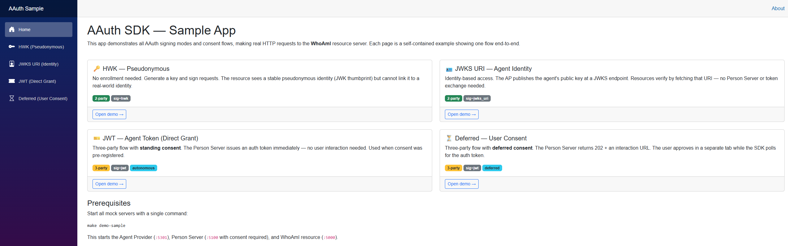
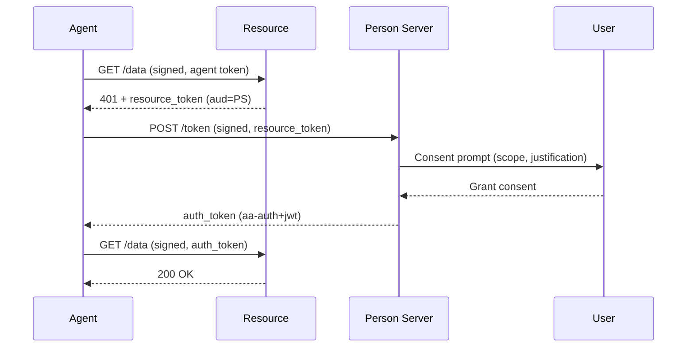

# AAuth SDK for .NET

[](https://github.com/aauth-dev/dotnet-samples/actions/workflows/ci.yml)
[](https://www.nuget.org/packages/AAuth)
[](https://www.nuget.org/packages/AAuth)


> 🚧 **Draft Specification** — The AAuth protocol is under active development. APIs and wire formats may change as the spec evolves. See [aauth-spec/](aauth-spec/) for the current draft. This SDK is not yet spec-complete — [open an issue](https://github.com/aauth-dev/dotnet-samples/issues) to give feedback or report bugs.

The [AAuth protocol](https://aauth.dev) SDK for .NET — agent-to-resource authorization with cryptographic proof-of-possession. Visit [aauth.dev](https://aauth.dev) for the full protocol documentation, tutorials, and community resources.

## What is AAuth?

AAuth is a four-party authorization protocol for AI agents. Every HTTP request carries a cryptographic signature — there are no bearer tokens. See the [protocol spec](aauth-spec/v08/draft-hardt-oauth-aauth-protocol.md) for full details.

The four parties are:

- **Agent** — signs every outbound HTTP request (RFC 9421) and presents keying material in the `Signature-Key` header.
- **Resource** — verifies the signature, optionally challenges with a `resource_token` to demand a person-scoped `auth_token`.
- **Person Server (PS)** — represents the user; manages missions, federates to AS, issues `aa-auth+jwt` proving the person delegated access.
- **Access Server (AS)** — issues auth tokens; enforces resource access policy.

> **Agent Provider (AP)** is a supporting role that issues `aa-agent+jwt` tokens binding an agent's signing key to its identity.

The SDK supports all four signing modes (`hwk`, `jwks_uri`, `jwt`, `jkt-jwt`), the full three-party challenge/exchange flow (autonomous and deferred user-consent), signature verification middleware, resource & auth token builders, JWKS / metadata discovery, and a Blazor `GuidedTour` walk-through. See the [SDK documentation](docs/) for complete usage guides.

## Access Modes

AAuth supports four resource access modes. Each adds parties and capabilities, and they build on one another — adoption is incremental. Run `make demo` (no Docker) to start every service plus both UIs, then follow the demo column below. For the live-Keycloak federated experience, use `make demo-keycloak`.

| Mode | Parties | When to Use | Signing | See it in the demos |
|------|---------|-------------|---------|---------------------|
| **Identity-Based** | Agent + Resource | Replacing API keys with cryptographic identity | `hwk` / `jwks_uri` | GuidedTour → [**Identity-based**](http://localhost:5400/tour?flow=Identity); SampleApp → [`/pseudonymous`](http://localhost:5240/pseudonymous) and [`/identified`](http://localhost:5240/identified) |
| **Resource-Managed** (two-party) | Agent + Resource | Resource manages authorization itself (interaction, OAuth/OIDC, internal policy) without an external PS or AS | Any | GuidedTour → [**Resource-Managed (Two-Party)**](http://localhost:5400/tour?flow=ResourceManaged); SampleApp → [`/inbox`](http://localhost:5240/inbox) |
| **PS-Asserted** (three-party) | Agent + Resource + PS | Resource accepts identity claims (`sub`, `email`, `tenant`, `groups`, `roles`) from any Person Server | `jwt` | GuidedTour → [**PS-Asserted (Direct Grant)**](http://localhost:5400/tour?flow=Autonomous) and [**PS-Asserted (Deferred)**](http://localhost:5400/tour?flow=Deferred); SampleApp → [`/calendar`](http://localhost:5240/calendar) and [`/calendar-deferred`](http://localhost:5240/calendar-deferred) |
| **Federated** (four-party) | Agent + Resource + PS + AS | Cross-domain access with the resource's own Access Server enforcing policy | `jwt` | GuidedTour → [**Federated (Four-Party)**](http://localhost:5400/tour?flow=Federated); SampleApp → [`/wallet`](http://localhost:5240/wallet). Live Keycloak consent: `make demo-keycloak` |

GuidedTour runs on [http://localhost:5400](http://localhost:5400) and SampleApp on [http://localhost:5240](http://localhost:5240). The GuidedTour home page lists every flow; pick one to walk it step by step. See [Getting Started](docs/getting-started.md#supported-flows) for the full breakdown of each mode.


## See It Run

Before writing any code, watch the protocol in action. The repo ships sample
services and two interactive Blazor apps. The dev container has everything
pre-configured; you can also run locally with the .NET 10 SDK.

```bash
make demo   # starts every service + the stub Access Server + both UIs
```

Then open the two UIs and click through the modes from the table above:

### Guided Tour — http://localhost:5400

Step-by-step walk-through showing every HTTP exchange, header, and token claim across all protocol flows.


### Sample App — http://localhost:5240

Self-contained Blazor app with one page per AAuth flow (HWK, JWKS URI, resource-managed Inbox, JWT direct grant, deferred user consent, call-chain multi-agent delegation, four-party federated).



For the live-Keycloak federated experience, run `make demo-keycloak` instead. See
[samples/README.md](samples/README.md) for the full list of sample projects and
configuration options.

### Dev container (recommended)

Open this repo in VS Code → **Reopen in Container**. The container
provides .NET 10, the `gh` CLI, and the C# Dev Kit extensions.

### Local setup

Install the [.NET 10 SDK](https://dotnet.microsoft.com/download/dotnet/10.0), then:

```bash
dotnet build AAuth.slnx
```

## Quick Start

```bash
dotnet add package AAuth --prerelease
```

The simplest mode is **pseudonymous (HWK)** — the agent signs every request with an inline public key. No Agent Provider, no Person Server, no registration. The resource sees a stable key thumbprint it can use for rate-limiting or access control, but doesn't know the agent's identity.

```csharp
using AAuth.Crypto;
using AAuth;

var key = AAuthKey.Generate(); // Ed25519 keypair

using var client = new AAuthClientBuilder(key)
    .UseHwk() // Pseudonymous mode: inline public key in Signature-Key header
    .Build();

var response = await client.GetAsync("https://resource.example/data");
// Request is signed per RFC 9421 — the resource verifies the signature
// using the public key from the Signature-Key: sig=hwk;jkt="...";jwk="..." header
```

### Three-Party Flow (Agent → Resource → Person Server)

The PS-Asserted flow is the primary authorization model. The resource delegates authorization to the agent's Person Server, which prompts the user for consent:



On the agent side, building the client with `WithChallengeHandling` makes the entire 401 → exchange → retry cycle automatic — your code just makes the request:

```csharp
using AAuth.Crypto;
using AAuth;

var key = AAuthKey.Generate();

// A hosted service acts as its own Agent Provider (self-issuing).
using var client = AAuthClientBuilder.SelfIssuing(key)
    .As("https://my-service.example", "aauth:my-service@my-service.example")
    .WithKid("svc-key-1")
    .WithPersonServer("https://ps.example")
    .WithChallengeHandling() // automatic 401 → PS exchange → retry
    .Build();

var response = await client.GetAsync("https://resource.example/data");
// 1. Agent signs GET with agent token → Resource verifies, returns 401 + resource_token
// 2. ChallengeHandler POSTs resource_token to PS token endpoint
// 3. PS validates agent, prompts user for consent, issues auth_token
// 4. Agent retries GET signed with auth_token → Resource verifies → 200 OK
```

**What happens step by step:**

1. Agent signs the request with its agent token (`Signature-Key: sig=jwt;jwt="..."`)
2. Resource verifies the signature, reads the `ps` claim, returns `401` with a `resource_token` (audience = PS URL)
3. Agent POSTs the `resource_token` to the PS's token endpoint (signed request)
4. PS validates the agent token, prompts the user for consent on the requested scope
5. User grants consent; PS issues an `auth_token` (`aa-auth+jwt`) containing identity claims (`sub`, `email`, etc.)
6. Agent retries the original request signed with the `auth_token`
7. Resource verifies the auth token signature and claims → `200 OK`

See [Getting Started](docs/getting-started.md#three-party-flow-deep-dive) for a detailed walk-through, including deferred consent.

## Building Servers

The snippets above are agent-side (the client). Hosting a party — a resource, or
a self-issuing agent service — uses the SDK's server helpers. Start with the
resource, since it's the party that issues the challenge.

### Resource (Server-Side)

The resource verifies signatures, publishes metadata, and issues resource token challenges:

```csharp
using AAuth.Crypto;
using AAuth;

var builder = WebApplication.CreateBuilder(args);
var resourceKey = AAuthKey.Generate();

// One DI call registers the verifier, discovery clients, JTI store, and metadata.
builder.Services.AddAAuthResource(options =>
{
    options.Issuer = "https://resource.example";
    options.SigningKeys["resource-key-1"] = resourceKey;
    options.ScopeDescriptions = new() { ["read"] = "Read your data" };
});
builder.Services.AddAAuthAuthentication();
builder.Services.AddAAuthAuthorization();

var app = builder.Build();

// Serve /.well-known/aauth-resource.json + JWKS
app.MapAAuthWellKnown();

// One declarative pipeline. Per-route scope/role lives on the endpoint; this
// single post-routing middleware verifies and challenges each matched endpoint.
app.UseRouting();
app.UseAAuth(o => o.TrustedAuthTokenIssuers = new HashSet<string> { "https://ps.example" });
app.UseAuthentication();
app.UseAuthorization();

// Protected endpoint — reached only after the auth token is verified.
app.MapGet("/data", (HttpContext ctx) => Results.Ok(new { ok = true }))
    .RequireAAuth(scope: "read");
```

The single `UseAAuth` middleware (placed after `UseRouting()`) reads each endpoint's `.RequireAAuth(...)` requirement: it verifies the HTTP signature and, when an auth token is required, automatically returns `401` with an `AAuth-Requirement` header carrying a resource token. The optional `TrustedAuthTokenIssuers` allow-list restricts which Person Servers the resource will accept auth tokens from; omit it (or assign `AAuthTrust.Any`) to accept any *verifiable* Person Server — the spec default — with claims namespaced by issuer.

### Self-Hosted Agent (Server-Side)

Hosted services act as their own Agent Provider — generate a key, publish metadata, and self-issue tokens:

```csharp
using AAuth.Crypto;
using AAuth;
using AAuth.Server.Metadata;

var builder = WebApplication.CreateBuilder(args);
var key = AAuthKey.Generate();
const string Kid = "svc-key-1";
var issuer = "https://my-service.example";

var app = builder.Build();

// Publish agent metadata so resources can discover the JWKS
app.MapAAuthAgentWellKnown(new AAuthAgentMetadataOptions
{
    Issuer = issuer,
    SigningKeys = new Dictionary<string, AAuthKey> { [Kid] = key },
});

// Build signed client with automatic token refresh and challenge handling
using var client = AAuthClientBuilder.SelfIssuing(key)
    .As(issuer, "aauth:my-service@my-service.example")
    .WithKid(Kid)
    .WithPersonServer("https://ps.example")
    .WithChallengeHandling()
    .Build();
```

See the [Server Guide](docs/server/verification-middleware.md) for the full resource-side token issuance, Person Server, and Access Server code.

## Documentation

Full SDK documentation lives in [`docs/`](docs/):

- [Getting Started](docs/getting-started.md) — install, generate a key, three-party flow deep dive, enrollment models
- [Concepts](docs/concepts.md) — the four participants and how the SDK maps to them
- [Glossary & Acronyms](docs/glossary.md) — every acronym and short protocol term used across the repo
- [Signing Modes](docs/signing-modes/overview.md) — hwk, jwks_uri, jwt, jkt-jwt
- [Workflows](docs/workflows/identity-based-access.md) — identity-based, PS-asserted, federated
- [Server Guide](docs/server/verification-middleware.md) — verification middleware, token issuance
- [Configuration Reference](docs/reference/configuration.md)

## Testing

```bash
dotnet test AAuth.slnx                # full suite (unit + conformance)
dotnet test tests/AAuth.Tests         # SDK unit + integration tests only
dotnet test tests/AAuth.Conformance   # spec conformance suite only
```

## Repository Layout

| Path | Description |
|------|-------------|
| [src/AAuth/](src/AAuth/) | AAuth SDK library (the NuGet package) |
| [docs/](docs/) | SDK documentation — signing modes, workflows, server guides |
| [samples/](samples/) | Sample applications — Profile, Calendar, Trips, Wallet, Inbox resource servers, Concierge, AgentConsole, MockPersonServer, MockAgentProvider, GuidedTour, SampleApp |
| [tests/](tests/) | Unit, integration, and spec-conformance tests |
| [aauth-spec/](aauth-spec/) | Protocol specifications (drafts 01, 02, and 08) from [dickhardt/AAuth](https://github.com/dickhardt/AAuth) |

## Spec Compatibility

This SDK targets **draft-08** of the AAuth protocol specification:

| Spec | Draft |
|------|-------|
| [draft-hardt-oauth-aauth-protocol](aauth-spec/v08/draft-hardt-oauth-aauth-protocol.md) | 08 |
| [draft-hardt-aauth-bootstrap](aauth-spec/v08/draft-hardt-aauth-bootstrap.md) | 01 |
| [draft-hardt-aauth-r3](aauth-spec/v08/draft-hardt-aauth-r3.md) | 00 |

The protocol tracks IETF **draft-08** ([`aauth-spec/v08/`](aauth-spec/v08/), source commit [`dd2b852`](https://github.com/dickhardt/AAuth/commit/dd2b8524eb8a6beb1a6cd922f285cc8bd0464cd8), 2026-06-25). Earlier draft-02 ([`aauth-spec/v02/`](aauth-spec/v02/)) and draft-01 ([`aauth-spec/v01/`](aauth-spec/v01/)) snapshots are retained for reference. All four resource access modes — including the `AAuth-Access` opaque-token flow (resource-managed, two-party access) — are implemented. See [SPEC-VERSION.md](aauth-spec/SPEC-VERSION.md) and [aauth-spec/CHANGELOG.md](aauth-spec/CHANGELOG.md) for details.

## Contributing

1. Open this repo in the dev container (ensures consistent tooling).
2. Create a branch off `main`.
3. Make your changes — run `dotnet build AAuth.slnx` and `dotnet test AAuth.slnx` before submitting.
4. Open a pull request against `main`.
