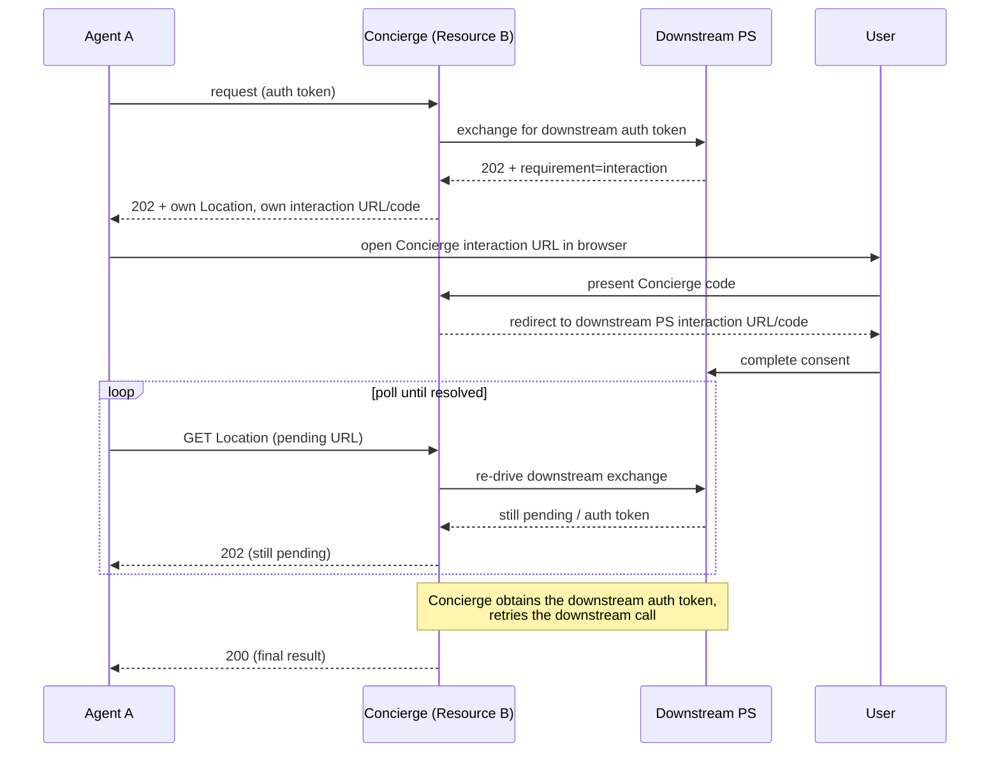

# Interaction Chaining

When an intermediary resource calls a downstream resource and the downstream PS/AS requires user consent, the intermediary must propagate the interaction requirement back through the call chain to the original agent.

## Resource-Initiated Permission

A resource token's `interaction` claim is a separate flow. The PS mapper returns
its authenticated resource interstitial, completes the resource callback, then
evaluates its own consent. An error callback terminates the pending request;
neither an allowing identity asserter nor stored mission consent bypasses the
resource step. Replacement tokens retain their verified mission/upstream context
and any new resource interaction must also finish before authorization resumes.
See [Document Release](../workflows/document-release.md) for both runnable apps
and the host's `ResourceInteractionSessions` configuration contract.

## Spec Requirement (§Interaction Chaining)

The intermediary returns its own pending `Location`, its own interaction URL,
and its own interaction code. The user visits the intermediary interaction URL,
which validates the intermediary code and redirects the browser to the
downstream PS/AS interaction. The sample aborts the downstream exchange on
interaction and re-drives it when the original caller polls, rather than
retaining a downstream poll connection.
See [Interaction Chaining](../../aauth-spec/v11/draft-hardt-oauth-aauth-protocol.md#interaction-chaining).

## Flow Diagram



## SDK Support: throw `AAuthInteractionChainedException`

When the downstream PS/AS requires consent, the intermediary's exchange surfaces an
`onInteractionRequired` callback. The intermediary cannot block and poll on the caller's
behalf — there is no user attached to the inbound request to relay the consent URL to.
Instead, the callback **throws** `AAuthInteractionChainedException` to abort the exchange
*before* the SDK starts its blocking poll. The endpoint catches that exception, parks the
flow, and re-emits its **own** `202 Accepted` to the caller:

```csharp
async Task<IResult> RunChainAsync(HttpContext ctx, string upstreamToken)
{
    using var downstream = AAuthClientBuilder.SelfIssuing(conciergeKey)
        .As(conciergeUrl, agentId)
        .WithKid(conciergeKid)
        .WithPersonServer(psUrl)
        .WithCallChaining(upstreamToken)
        .WithChallengeHandling(opts =>
        {
            // No user to relay to — abort the exchange and re-emit upward.
            opts.OnInteractionRequired = (interaction, _) =>
                throw new AAuthInteractionChainedException(interaction);
        })
        .Build();

    var response = await downstream.GetAsync($"{downstreamUrl}/events");
    var body = await response.Content.ReadFromJsonAsync<JsonNode>();
    return Results.Ok(new { chain = "ok", downstream = body });
}

app.MapGet("/", async (HttpContext ctx, PendingStore pending) =>
{
    var upstream = ctx.Features.Get<UpstreamAuthTokenFeature>()?.Token;
    if (upstream is null) return Results.Unauthorized();

    try
    {
        return await RunChainAsync(ctx, upstream);
    }
    catch (AAuthInteractionChainedException ex)
    {
        // Downstream needs consent. Park serializable operation state and the
        // downstream interaction, then re-emit our OWN 202 to the caller.
        var chained = AAuthChainedInteractions.Park(
            conciergeUrl, "/pending", "/chain-interaction", ex,
            "calendar.events", new JsonObject { ["path"] = "/events" },
            DateTimeOffset.UtcNow.AddMinutes(10));
        var entry = pending.Add(upstream, chained);
        return ReEmitChainedInteraction(ctx, entry);
    }
});
```

Throwing from the callback is what makes this work: the exchange wraps the callback in
`try { await onInteractionRequired(...) } finally { ... }` with **no** `catch`, so the
exception unwinds before `DeferredPoller.PollAsync` runs. There is no blocked poll and no
double-write to the response.

### Re-emitting the chained 202

`ReEmitChainedInteraction` writes the intermediary's own `202` carrying *its*
poll URL and *its* interaction `url`/`code`. The downstream interaction is held
server-side until the browser reaches the intermediary interaction URL:

```csharp
IResult ReEmitChainedInteraction(HttpContext ctx, PendingStore.Entry entry)
    => AAuthChainedInteractions.Accepted(ctx, entry.Interaction);

app.MapGet("/chain-interaction/{id}", (string id, string? code, PendingStore pending) =>
{
    var entry = pending.Get(id);
    if (entry is null || !AAuthInteractionCode.Matches(entry.Interaction.Code, code ?? ""))
        return AAuthProblemDetails.Polling(PollingErrorCode.InvalidCode);
    return AAuthChainedInteractions.RedirectToDownstream(entry.Interaction);
});
```

### Resuming at the poll endpoint

When the agent polls `/pending/{id}`, the intermediary retries the chain. If consent has
been granted the exchange now succeeds and the final result is returned; if it is still
pending the same chained `202` is re-emitted; a denial maps to `403`:

```csharp
app.MapMethods("/pending/{id}", ["GET", "DELETE"], async (HttpContext ctx, string id, PendingStore pending) =>
{
    var entry = pending.Get(id);
    if (entry is null || ctx.Request.Path != $"{entry.PendingPrefix}/{entry.Id}"
        || !entry.Matches(ctx.Features.Get<UpstreamAuthTokenFeature>()?.Token))
        return AAuth.Server.AAuthProblemDetails.Polling(AAuth.Errors.PollingErrorCode.InvalidCode);

    return await entry.Lifecycle.ExecuteAsync(ctx, entry.ExpiresAt, TimeProvider.System, async () =>
    {
        if (HttpMethods.IsDelete(ctx.Request.Method))
        {
            entry.Lifecycle.Cancel();
            return Results.NoContent();
        }
        try { return await RunChainAsync(ctx, entry.UpstreamToken); }
        catch (AAuthInteractionChainedException) { return ReEmitChainedInteraction(ctx, entry); }
        catch (AAuthInteractionDeniedException)
        {
            return AAuth.Server.AAuthProblemDetails.Create("denied", statusCode: 403);
        }
    });
});
```

> **Why not write the `202` from inside the callback?** Returning normally from
> `onInteractionRequired` tells the SDK to *block and poll* for the downstream token. An
> intermediary has no user to wait on, so it would hang for the full polling budget and
> then try to complete a response the endpoint may have already written. Throwing
> `AAuthInteractionChainedException` is the correct, non-blocking abort.

## Agent side: surfacing the chained 202

The original agent must handle **two** interaction points: the hop-1 PS challenge (via
`WithChallengeHandling`) and the hop-2 chained `202` the intermediary re-emits (a *resource*
`202`, handled by the top-level interaction pipeline via `WithInteractionHandling`). Wire
both so either hop can surface a consent URL:

```csharp
using var client = AAuthClientBuilder.SelfIssuing(agentKey)
    .As(issuer, agentId)
    .WithKid(kid)
    .WithPersonServer(psUrl)
    .WithChallengeHandling(opts =>          // hop 1: PS exchange 202
    {
        opts.OnInteractionRequired = (interaction, _) =>
            SurfaceToUser(interaction.BuildUserUrl());
    })
    .WithInteractionHandling(opts =>        // hop 2: intermediary's chained 202
    {
        opts.OnInteractionRequired = (interaction, _) =>
            SurfaceToUser(interaction.BuildUserUrl());
    })
    .Build();

var response = await client.GetAsync(intermediaryUrl);
```

`ChallengeHandler` only acts on `401` challenges, so the intermediary's `202` would pass
straight through unless `WithInteractionHandling` is also configured.

## Manual Pattern (Without Builder)

For full control over the interaction-chaining flow using `CallChainingHandler` directly,
apply the same throw-to-abort rule inside the `onInteractionRequired` callback. The
intermediary first requests a downstream person token with the caller's token as
`upstream_token` (at the PS that token names), presents it downstream, and passes the
resulting resource token **and** that person token (`presentedToken`) to the exchange:

```csharp
app.MapGet("/", async (HttpContext ctx, PendingStore pending) =>
{
    var upstream = ctx.Features.Get<UpstreamAuthTokenFeature>()!;
    var chainHandler = new CallChainingHandler(exchangeClient, chainingOptions);

    try
    {
        // Person token for the downstream resource, requested under the upstream token.
        var downstreamPersonToken = await exchangeClient.RequestPersonTokenAsync(
            CallChainingRouter.ResolveDownstreamServer(upstream.Token, exchangeClient.EgressPolicy),
            downstreamResource,
            new TokenExchangeRequest { UpstreamToken = upstream.Token });

        // ...present downstreamPersonToken downstream; its 401 carries resourceToken...
        var chainedToken = await chainHandler.ExchangeForDownstreamAsync(
            upstream.Token,
            resourceToken,
            downstreamPersonToken,
            onInteractionRequired: (interaction, _) =>
                // Abort before the blocking poll; the endpoint re-emits its own 202.
                throw new AAuthInteractionChainedException(interaction),
            pollerOptions: new DeferredPollerOptions
            {
                MaxTotalWait = TimeSpan.FromMinutes(5),
                PreferWaitSeconds = 45,
            });

        // Exchange succeeded — call downstream with the chained token.
        using var client = new AAuthClientBuilder(myKey)
            .UseJwt(chainedToken)
            .Build();
        return Results.Ok(await client.GetFromJsonAsync<JsonNode>(downstreamUrl));
    }
    catch (AAuthInteractionChainedException ex)
    {
        var chained = AAuthChainedInteractions.Park(
            "https://intermediary.example", "/pending", "/chain-interaction", ex,
            "downstream.read", new JsonObject { ["resource"] = downstreamUrl },
            DateTimeOffset.UtcNow.AddMinutes(10));
        var entry = pending.Add(upstream.Token, chained);
        return ReEmitChainedInteraction(ctx, entry);
    }
});
```

> **Note:** With `PreferWaitSeconds` set on a directly constructed `TokenExchangeClient`/`DeferredPoller`, ensure the underlying `HttpClient.Timeout` is greater than `PreferWaitSeconds` (or `Timeout.InfiniteTimeSpan`). A default `HttpClient` (100s timeout) would abort the in-flight long-poll with a `TaskCanceledException`. Clients built via `AAuthClientBuilder` already use `Timeout.InfiniteTimeSpan`.

## Pending Request Management

The intermediary must manage pending requests:

1. **Store**: When `onInteractionRequired` fires, store the operation name,
   JSON state, and downstream interaction details behind an intermediary-owned
   code (`AAuthChainedInteractions.Park` returns this serializable entry).
2. **Poll endpoint**: Expose a `/pending/{id}` endpoint that the original agent polls.
3. **Background completion**: When user consent completes, the downstream PS issues the token. The intermediary completes the original request.
4. **Cleanup**: Expire stale pending requests.

The SDK owns the wire mechanics for the chained `202`, code generation, and
downstream redirect. Applications still own durable persistence and operation
resume policy because different architectures (stateless, queue-backed,
actor-based) need different stores.

## See Also

- [Call Chaining](../workflows/call-chaining.md) — overall call-chaining workflow
- [Error Handling](error-handling.md) — `AAuthInteractionTimeoutException` and `AAuthInteractionDeniedException`
- [Deferred Consent](../workflows/deferred-consent.md) — agent-side 202 handling
