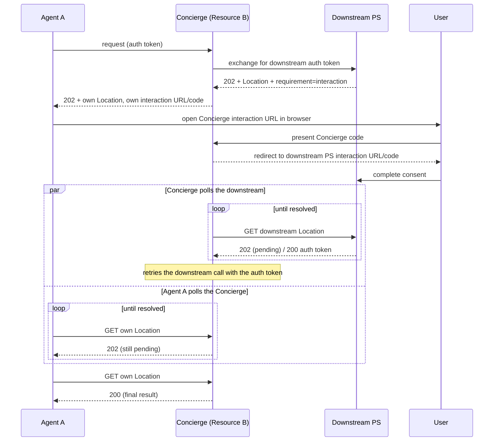

# Interaction Chaining

When an intermediary resource calls a downstream resource and the downstream PS/AS requires user consent, the intermediary must propagate the interaction requirement back through the call chain to the original agent.

## Resource-Initiated Permission

A resource token's `interaction` claim is a separate flow. The PS mapper returns
its authenticated resource interstitial, completes the resource callback, then
evaluates its own consent. An error callback terminates the pending request;
neither an allowing identity asserter nor stored mission consent bypasses the
resource step. Replacement tokens retain their verified mission/upstream context
and any new resource interaction must also finish before authorization resumes.
See [Document Release](../workflows/document-release.md) for both runnable apps
and the host's `ResourceInteractionSessions` configuration contract.

## Spec Requirement (§Interaction Chaining)

The intermediary returns its own pending `Location`, its own interaction URL,
and its own interaction code. The user visits the intermediary interaction URL,
which validates the intermediary code and redirects the browser to the
downstream PS/AS interaction. "When the user completes interaction and the
resource obtains the downstream auth token, the resource completes the original
request and returns the result at its pending URL."

Toward the downstream PS the intermediary is the agent, so §Polling with GET
applies: "After receiving a `202`, the agent switches to `GET` for all
subsequent requests to the `Location` URL and does not resend the original
request body." The intermediary keeps polling the downstream pending URL; it
never re-sends the downstream token request when its own caller polls.
See [Interaction Chaining](../../aauth-spec/v11/draft-hardt-oauth-aauth-protocol.md#interaction-chaining)
and [Deferred Responses](../../aauth-spec/v11/draft-hardt-oauth-aauth-protocol.md#deferred-responses).

## Flow Diagram



## SDK Support: `AAuthChainedOperation`

`AAuthChainedOperation<TResult>` runs the intermediary's downstream work and
returns as soon as it either finishes or first needs downstream user
interaction. Attach its `InteractionHandler` to each downstream request: when the
downstream answers `202` + `requirement=interaction`, the handler records the
interaction and returns normally, so the SDK keeps polling the downstream
`Location` with `GET` in the background. The endpoint parks the operation and
answers with its **own** `202`:

```csharp
async Task<IResult> RunChainAsync(string upstream, IAAuthInteractionHandler interactions, CancellationToken ct)
{
    using var downstream = AAuthClientBuilder.SelfIssuing(conciergeKey)
        .As(conciergeUrl, intermediaryAgentId)
        .WithKid(conciergeKid)
        .WithPersonServer(ps)
        .WithCallChaining(upstream)
        .WithChallengeHandling(opts => opts.Capabilities = [])
        .Build();

    // The operation outlives this inbound request: use only captured values
    // and the operation's cancellation token, never the request's HttpContext.
    using var request = new HttpRequestMessage(HttpMethod.Get, downstreamUrl);
    request.Options.Set(AAuthRequestOptions.InteractionHandler, interactions);
    using var response = await downstream.SendAsync(request, ct);
    var body = await response.Content.ReadFromJsonAsync<JsonNode>(ct);
    return Results.Ok(new { chain = "ok", downstream = body });
}

app.MapGet("/", async (HttpContext ctx, PendingStore pending) =>
{
    var upstream = ctx.Features.Get<UpstreamAuthTokenFeature>()?.Token;
    if (upstream is null) return Results.Unauthorized();

    var expiresAt = DateTimeOffset.UtcNow.AddMinutes(10);
    var operation = await AAuthChainedOperation<IResult>.StartAsync(
        (interactions, ct) => RunChainAsync(upstream, interactions, ct),
        expiresAt, app.Lifetime.ApplicationStopping);
    if (operation.Completion.IsCompleted)
        return await operation.Completion;

    // Downstream needs consent and is being polled. Park the operation under
    // an intermediary-owned code and pending URL, then answer with our OWN 202.
    // Read the interaction once; the operation may publish a newer one meanwhile.
    var snapshot = operation.Interaction!;
    var chained = AAuthChainedInteractions.Park(
        conciergeUrl, "/pending", "/chain-interaction", snapshot.Downstream,
        "calendar.events", new JsonObject { ["path"] = "/events" }, expiresAt);
    var entry = pending.Add(upstream, chained, "/pending", operation, snapshot.Version);
    return ReEmitChainedInteraction(ctx, entry);
});
```

When the downstream request can outlive the inbound request, pass the upstream
token explicitly (`WithCallChaining(upstream)` as above, or
`AAuthRequestOptions.UpstreamToken` on the request for an agent registered with
`ChainFromHttpContext`) rather than reading it from the inbound `HttpContext`.

`AAuthChainedOperation` is an in-memory coordinator: on restart the operation is
lost while the downstream PS may still hold its pending request. Persist the
parked entry durably if callers must survive restarts.

### Re-emitting the chained 202

`ReEmitChainedInteraction` writes the intermediary's own `202` carrying *its*
poll URL and *its* interaction `url`/`code`. The downstream interaction is held
server-side until the browser reaches the intermediary interaction URL:

```csharp
IResult ReEmitChainedInteraction(HttpContext ctx, PendingStore.Entry entry)
    => AAuthChainedInteractions.Accepted(ctx, entry.Interaction);

app.MapGet("/chain-interaction/{id}", (string id, string? code, PendingStore pending) =>
{
    var entry = pending.Get(id);
    if (entry is null || !entry.MatchesCode(code))
        return AAuthProblemDetails.Polling(PollingErrorCode.InvalidCode);
    return AAuthChainedInteractions.RedirectToDownstream(entry.Interaction);
});
```

If the downstream moves to a new interaction (for example an Access Server step
after Person Server consent), `operation.Interaction.Version` increases. Re-key
the parked entry with `AAuthChainedInteractions.Rekey` — a new intermediary
code, the same id and pending URL — so the caller's interaction handler surfaces
the new URL. Keep earlier codes valid and redirect them to the latest step.

### Answering polls from the operation

When the agent polls `/pending/{id}`, the intermediary reads the operation's
state. It never re-runs the chain: while the downstream is pending it re-emits
its `202`; once the operation finishes it returns the result, or maps a
downstream denial, expiry or revocation to the matching §Polling Error Codes
response with `AAuthChainedInteractions.PollingFailure`. `DELETE` cancels the
background operation:

```csharp
app.MapMethods("/pending/{id}", ["GET", "DELETE"], async (HttpContext ctx, string id, PendingStore pending) =>
{
    var entry = pending.Get(id);
    if (entry is null || ctx.Request.Path != $"{entry.PendingPrefix}/{entry.Id}"
        || !entry.Matches(ctx.Features.Get<UpstreamAuthTokenFeature>()?.Token))
        return AAuth.Server.AAuthProblemDetails.Polling(AAuth.Errors.PollingErrorCode.InvalidCode);

    return await entry.Lifecycle.ExecuteAsync(ctx, entry.ExpiresAt, TimeProvider.System, async () =>
    {
        if (HttpMethods.IsDelete(ctx.Request.Method))
        {
            entry.Operation?.Cancel();
            entry.Lifecycle.Cancel();
            return Results.NoContent();
        }
        if (entry.Operation is not { Completion.IsCompleted: true } operation)
            return ReEmitChainedInteraction(ctx, entry);
        try { return await operation.Completion; }
        catch (Exception ex) when (AAuthChainedInteractions.PollingFailure(ex) is { } failure) { return failure; }
    });
});
```

> **Why not throw from the callback?** `AAuthInteractionChainedException` still
> aborts an exchange before it polls, for an intermediary that cannot keep work
> running between requests. Aborting abandons the downstream pending request, so
> finishing later means sending a new token request, and each one asks the user
> again. Prefer `AAuthChainedOperation`, which keeps the single downstream request
> and polls it as the spec requires.

## Agent side: surfacing the chained 202

The original agent must handle **two** interaction points: the hop-1 PS challenge (via
`WithChallengeHandling`) and the hop-2 chained `202` the intermediary re-emits (a *resource*
`202`, handled by the top-level interaction pipeline via `WithInteractionHandling`). Wire
both so either hop can surface a consent URL:

```csharp
using var client = AAuthClientBuilder.SelfIssuing(agentKey)
    .As(issuer, agentId)
    .WithKid(kid)
    .WithPersonServer(psUrl)
    .WithChallengeHandling(opts =>          // hop 1: PS exchange 202
    {
        opts.OnInteractionRequired = (interaction, _) =>
            SurfaceToUser(interaction.BuildUserUrl());
    })
    .WithInteractionHandling(opts =>        // hop 2: intermediary's chained 202
    {
        opts.OnInteractionRequired = (interaction, _) =>
            SurfaceToUser(interaction.BuildUserUrl());
    })
    .Build();

var response = await client.GetAsync(intermediaryUrl);
```

`ChallengeHandler` only acts on `401` challenges, so the intermediary's `202` would pass
straight through unless `WithInteractionHandling` is also configured.

## Manual Pattern (Without Builder)

`CallChainingHandler` works the same way: run it inside
`AAuthChainedOperation.StartAsync` and pass the operation's handler as
`onInteractionRequired`. The intermediary first requests a downstream person
token with the caller's token as `upstream_token` (at the PS that token names),
presents it downstream, and passes the resulting resource token **and** that
person token (`presentedToken`) to the exchange:

```csharp
async Task<string> ExchangeDownstreamAsync(string upstream, IAAuthInteractionHandler interactions, CancellationToken ct)
{
    var chainHandler = new CallChainingHandler(exchangeClient, chainingOptions);

    // Person token for the downstream resource, requested under the upstream token.
    var downstreamPersonToken = await exchangeClient.RequestPersonTokenAsync(
        CallChainingRouter.ResolveDownstreamServer(upstream, exchangeClient.EgressPolicy),
        downstreamResource,
        new TokenExchangeRequest { UpstreamToken = upstream },
        ct);

    // ...present downstreamPersonToken downstream; its 401 carries resourceTokenJwt...
    // A downstream 202 + requirement=interaction is recorded by the operation and
    // then polled with GET until the user decides.
    return await chainHandler.ExchangeForDownstreamAsync(
        upstream,
        resourceTokenJwt,
        downstreamPersonToken,
        onInteractionRequired: interactions.OnInteractionRequiredAsync,
        pollerOptions: new DeferredPollerOptions
        {
            MaxTotalWait = TimeSpan.FromMinutes(5),
            PreferWaitSeconds = 45,
        },
        cancellationToken: ct);
}

var operation = await AAuthChainedOperation<string>.StartAsync(
    (interactions, ct) => ExchangeDownstreamAsync(upstreamToken, interactions, ct),
    DateTimeOffset.UtcNow.AddMinutes(10));
```

> **Note:** With `PreferWaitSeconds` set on a directly constructed `TokenExchangeClient`/`DeferredPoller`, ensure the underlying `HttpClient.Timeout` is greater than `PreferWaitSeconds` (or `Timeout.InfiniteTimeSpan`). A default `HttpClient` (100s timeout) would abort the in-flight long-poll with a `TaskCanceledException`. Clients built via `AAuthClientBuilder` already use `Timeout.InfiniteTimeSpan`.

## Pending Request Management

The intermediary must manage pending requests:

1. **Store**: When the operation first needs interaction, store it with the
   operation name, JSON state and downstream interaction behind an
   intermediary-owned code (`AAuthChainedInteractions.Park` returns this entry).
2. **Poll endpoint**: Expose a `/pending/{id}` endpoint that the original agent
   polls; answer it from the operation's state.
3. **Background completion**: The operation keeps polling the downstream pending
   URL. When the user consents, the downstream PS issues the token and the
   operation completes the original request.
4. **Cleanup**: Cancel the operation on `DELETE`, at expiry and on host
   shutdown, and expire stale pending entries.

The SDK owns the wire mechanics for the chained `202`, code generation,
downstream redirect and downstream polling. Applications still own durable
persistence and resume policy because different architectures (stateless,
queue-backed, actor-based) need different stores.

## See Also

- [Call Chaining](../workflows/call-chaining.md) — overall call-chaining workflow
- [Error Handling](error-handling.md) — `AAuthInteractionTimeoutException` and `AAuthInteractionDeniedException`
- [Deferred Consent](../workflows/deferred-consent.md) — agent-side 202 handling
