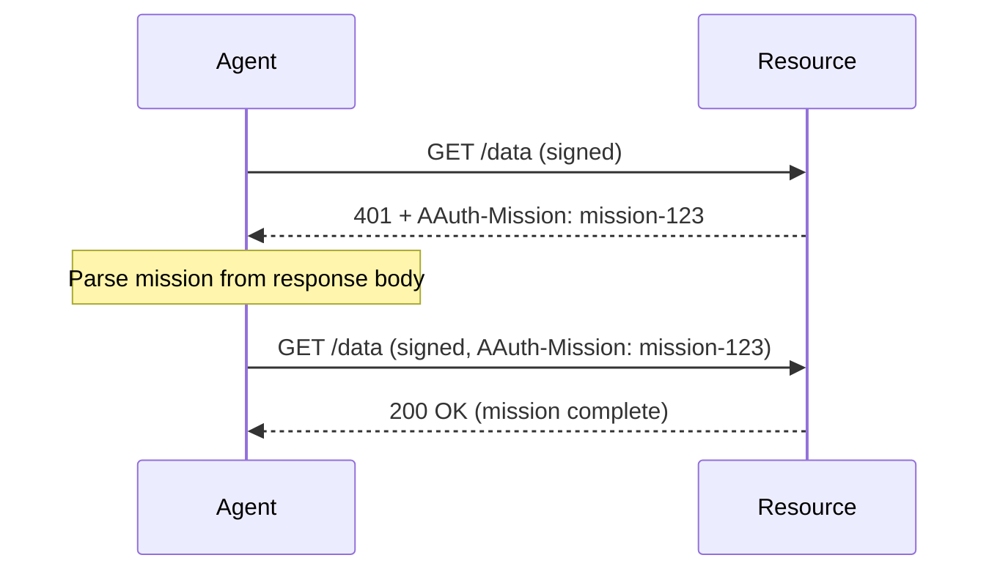

# Missions

> [Mission Lifecycle](https://explorer.aauth.dev/missions/lifecycle) | [Mission Comparison](https://explorer.aauth.dev/missions/compare)

## Overview

A mission is a structured, multi-step authorization negotiation between agent and resource. Unlike a single challenge/response, missions allow the resource to declare requirements progressively and the agent to fulfill them over multiple round-trips.

## AAuthMission

```csharp
namespace AAuth.Agent;

public sealed class AAuthMission
{
    public required string Id { get; init; }
    public required string Status { get; init; }        // "proposed", "active", "complete", "failed"
    public JsonArray? Requirements { get; init; }       // outstanding requirements
    public string? Description { get; init; }           // human-readable description
    public string? StatusUrl { get; init; }             // poll for status changes
    public string? InteractionUrl { get; init; }        // user-facing approval page

    public static AAuthMission FromJson(JsonObject json);
}
```

## AAuthMissionHeader

Resources propose missions via the `AAuth-Mission` response header:

```csharp
public static class AAuthMissionHeader
{
    public const string Name = "AAuth-Mission";
    public static string Format(string missionId);
}
```

## Mission Lifecycle



## Parsing a Mission Response

```csharp
var response = await client.GetAsync("https://resource.example/data");

if (response.StatusCode == HttpStatusCode.Unauthorized)
{
    var missionHeader = response.Headers.GetValues(AAuthMissionHeader.Name).FirstOrDefault();
    if (missionHeader is not null)
    {
        var body = await response.Content.ReadFromJsonAsync<JsonObject>();
        var mission = AAuthMission.FromJson(body!);

        Console.WriteLine($"Mission: {mission.Id}");
        Console.WriteLine($"Status: {mission.Status}");
        Console.WriteLine($"Requirements: {mission.Requirements}");
    }
}
```

## Sending a Mission Header

When continuing a mission, include the mission ID:

```csharp
var request = new HttpRequestMessage(HttpMethod.Get, "https://resource.example/data");
request.Headers.Add(AAuthMissionHeader.Name, AAuthMissionHeader.Format(missionId));
var response = await signedClient.SendAsync(request);
```

## Server-Side: Proposing a Mission

```csharp
app.MapGet("/data", (HttpContext context) =>
{
    var missionId = context.Request.Headers[AAuthMissionHeader.Name].FirstOrDefault();

    if (missionId is null)
    {
        // Propose a new mission
        var newMission = new { id = Guid.NewGuid().ToString(), status = "proposed",
            requirements = new[] { new { type = "auth_token", scope = "read" } } };
        context.Response.Headers.Append(AAuthMissionHeader.Name, 
            AAuthMissionHeader.Format(newMission.id));
        return Results.Json(newMission, statusCode: 401);
    }

    // Mission in progress — check if requirements are met
    return Results.Ok("Access granted");
});
```

## Further Reading

- [PS-Asserted Access](../workflows/ps-asserted-access.md) — single-exchange alternative
- [Deferred Consent](../workflows/deferred-consent.md) — user approval patterns
