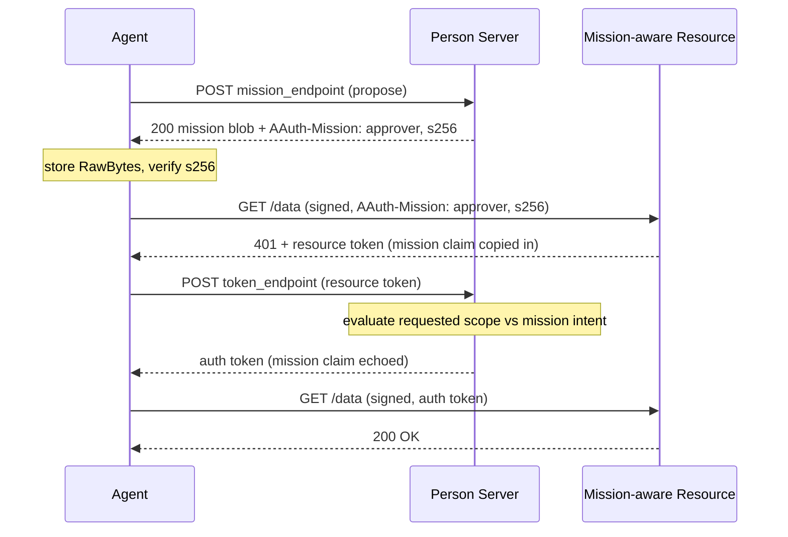

# Missions

> [Mission Lifecycle](https://explorer.aauth.dev/missions/lifecycle) | [Mission Comparison](https://explorer.aauth.dev/missions/compare)

## Overview

A mission is an **optional governance layer** that scopes everything an agent
does over a period of work to a single, user-approved intent. The agent
proposes a mission — a Markdown **description** of what it intends to accomplish,
plus an optional list of **tools** it wants to use — and the Person Server (PS)
approves it (§Mission Creation, §Mission Approval).

Once approved, the mission becomes the **context the PS evaluates every later
request against**. The PS is the contextual policy point: it judges each token
request and permission request against the mission's natural-language intent and
the running mission log, granting silently when a request fits, prompting the
user when it does not, and refusing once the mission is terminated.

Missions are orthogonal to the underlying access flows. Existing no-mission
flows remain valid; a mission is "a further restriction applied by the PS"
(§Rationale). For the agent-side governance clients that drive the lifecycle,
see [Mission Governance Clients](mission-governance-clients.md); for the PS-side
seams, see [Mission Governance (Server)](../server/mission-governance.md).

## The mission blob

An approved mission is a **blob** — the exact JSON body the PS returns from its
`mission_endpoint`. The agent stores those bytes verbatim so the mission's
identity (`s256`) stays verifiable.

```csharp
namespace AAuth.Agent;

public sealed class Mission
{
    public required string Approver { get; init; }            // HTTPS URL of the PS that approved it
    public required string Agent { get; init; }               // aauth:local@domain the mission is for
    public required DateTimeOffset ApprovedAt { get; init; }  // approval timestamp (keeps s256 unique)
    public required string Description { get; init; }         // Markdown intent
    public IReadOnlyList<MissionTool> ApprovedTools { get; init; }  // pre-approved tools (may be a subset)
    public IReadOnlyList<string> Capabilities { get; init; }  // capabilities the PS provides for the session
    public required string S256 { get; init; }                // base64url(SHA-256(blob)) — the identity
    public ReadOnlyMemory<byte> RawBytes { get; init; }       // verbatim approval body bytes

    public MissionState State { get; init; } = MissionState.Active;

    public static Mission FromApprovalBytes(ReadOnlySpan<byte> body); // parse + compute s256
    public bool VerifyS256(string expected);                  // constant-time compare
    public static string ComputeS256(ReadOnlySpan<byte> body);
}

public enum MissionState { Active, Terminated }

public sealed record MissionTool(string Name, string? Description = null);
```

### Identity: `s256`

The mission's identity is its `s256`: the base64url-encoded SHA-256 hash of the
exact approval body bytes (§Mission Approval). Because the hash is computed over
the bytes as received, the agent must **never re-serialize** the blob — it keeps
`RawBytes` and recomputes from those when verifying.

```csharp
// Build a Mission from the bytes the PS returned and verify the header's s256.
var mission = Mission.FromApprovalBytes(approvalBodyBytes);

if (!mission.VerifyS256(headerS256))
{
    throw new InvalidOperationException("Mission s256 mismatch.");
}
```

### Two states

A mission is either `Active` or `Terminated` (§Mission Management). There is no
`pending`/`denied`/`completed` ladder: approval produces an active mission, and
the PS moves it to terminated on completion or revocation. After termination the
PS answers governed requests with `mission_terminated` (see
[Error Handling](error-handling.md#mission-termination)).

### Tools vs scopes

A mission governs two kinds of authority **asymmetrically** — the central idea:

- **Tools are *declared*.** A tool is an action the agent runs itself (a tool
  call, file write, sending a message) — no resource is involved. The PS cannot
  observe a local action, so the mission names tools up front: `ApprovedTools`
  are pre-approved and resolve at the permission endpoint without a PS
  round-trip; any other action is referred to the user (§Permission Endpoint).
- **Scopes are *evaluated*, never declared.** A scope authorizes access to a
  remote resource, carried in an auth token through the challenge → exchange →
  retry pattern (§Scopes). A mission proposal contains **no scopes**. When the
  agent later exchanges a resource token, the PS judges the requested scope
  against the mission's description: if it fits, it is granted silently and
  remembered for the rest of the mission; otherwise the user is prompted.

See [Protocol Concepts → Governance](../concepts.md) for the full discussion.

## The `AAuth-Mission` header

The agent declares its mission context on outbound requests with the structured
`AAuth-Mission` header, carrying the `approver` and `s256` (§Call Chaining). The
mission content never leaves the PS — only the pointer travels.

```csharp
public static class AAuthMissionHeader
{
    public const string Name = "AAuth-Mission";

    // Produces: approver="https://ps.example"; s256="dBjf..."
    public static string FormatStructured(string approver, string s256);
    public static bool TryParseStructured(string? value, out string? approver, out string? s256);
}
```

```csharp
var request = new HttpRequestMessage(HttpMethod.Get, "https://resource.example/data");
request.Headers.TryAddWithoutValidation(
    AAuthMissionHeader.Name,
    AAuthMissionHeader.FormatStructured(mission.Approver, mission.S256));
var response = await signedClient.SendAsync(request);
```

## The binding chain

The mission travels end to end as a `MissionClaim` — `{ approver, s256 }` —
embedded in tokens (§Resource Token Structure, §Auth Token Structure):

```csharp
namespace AAuth.Tokens;

public sealed record MissionClaim(string Approver, string S256)
{
    public JsonObject ToJsonObject();
    public static MissionClaim? FromPayload(JsonObject? payload);
}
```

The chain is:



A **mission-aware resource** copies the mission object from the `AAuth-Mission`
header into the resource token it issues, so the mission context reaches the PS
even when the resource is not the approver (§Terminology). Enable it with
`ChallengeOptions.MissionAware` — see
[Challenge Middleware](../server/challenge-middleware.md#mission-aware-resources).

## Forwarding a mission in a call chain

When an intermediary resource calls downstream resources within a mission
context, it must forward the `AAuth-Mission` header so the downstream PS can
evaluate against the same mission. The SDK does this automatically via
`MissionForwardingHandler`, which reads `mission.approver` and `mission.s256`
from the upstream auth token and sets the structured header on every downstream
request.

```csharp
using var client = new AAuthClientBuilder(key)
    .UseJwt(agentToken)
    .WithCallChaining(httpContext) // also enables mission forwarding
    .Build();

// If the upstream auth token carries mission.approver + mission.s256,
// downstream requests include AAuth-Mission automatically.
await client.GetAsync("https://downstream.example");
```

The handler formats the structured header on every downstream request:

```text
AAuth-Mission: approver="https://ps.example"; s256="abc123..."
```

This gives the PS receiving the downstream exchange full mission context for
policy evaluation, enabling governed multi-hop access (§Call Chaining). See
[Call Chaining](../workflows/call-chaining.md) for the full multi-hop flow.

## Further reading

- [Mission Governance Clients](mission-governance-clients.md) — propose, request permission, audit, interact
- [Clarification Chat](clarification-chat.md) — answering the PS's follow-up questions during approval
- [Mission Governance (Server)](../server/mission-governance.md) — the PS-side policy seams
- [Mission-Governed Access](../workflows/mission-governed-access.md) — an end-to-end walkthrough
- [Error Handling](error-handling.md#mission-termination) — `mission_terminated`
