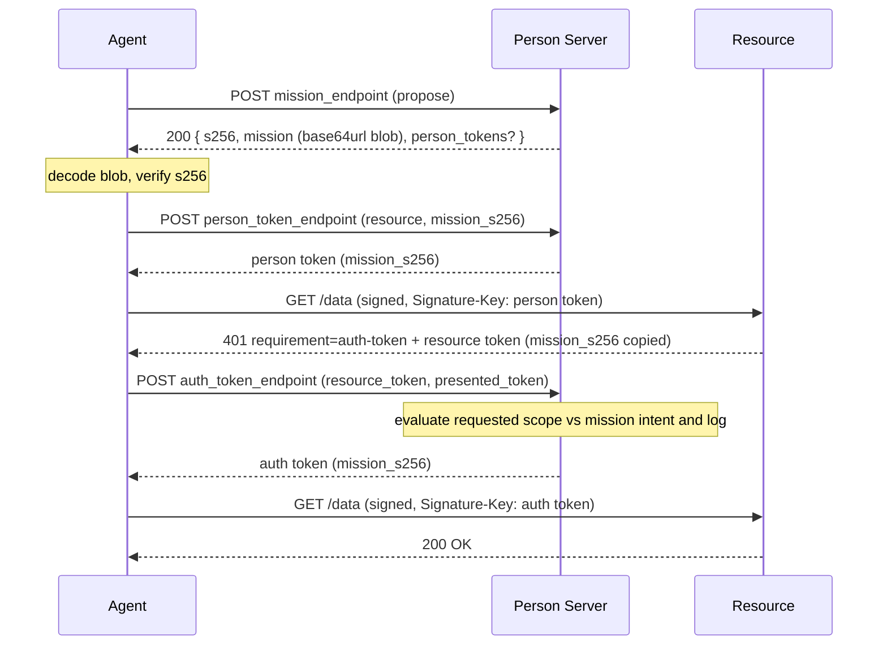

# Missions

> [Mission Lifecycle](https://explorer.aauth.dev/missions/lifecycle) | [Mission Comparison](https://explorer.aauth.dev/missions/compare)

## Overview

A mission is an **optional governance layer** that scopes everything an agent
does over a period of work to a single, user-approved intent. The agent
proposes a mission — a Markdown **description** of what it intends to accomplish,
plus an optional list of **tools** it wants to use — and the Person Server (PS)
approves it (§Mission Creation, §Mission Approval).

Once approved, the mission becomes the **context the PS evaluates every later
request against**. The PS is the contextual policy point: it judges each token
request and permission request against the mission's natural-language intent and
the running mission log, granting silently when a request fits, prompting the
user when it does not, and refusing once the mission is terminated.

Missions are orthogonal to the underlying access flows. Existing no-mission
flows remain valid; a mission is "a further restriction applied by the PS"
(§Rationale). For the agent-side governance clients that drive the lifecycle,
see [Mission Governance Clients](mission-governance-clients.md); for the PS-side
seams, see [Mission Governance (Server)](../server/mission-governance.md).

## The mission blob

An approved mission is a **blob** — the exact JSON bytes the PS persists for the
mission. The PS's `mission_endpoint` returns them base64url-encoded inside an
approval envelope `{ s256, mission, capabilities?, person_tokens? }`
(§Mission Approval). The agent keeps the decoded bytes verbatim so the mission's
identity (`s256`) stays verifiable.

```csharp
namespace AAuth.Agent;

public sealed class Mission
{
    public required string PersonServer { get; init; }        // the PS that approved it (named beside s256)
    public required string Agent { get; init; }               // aauth:local@domain the mission is for
    public required DateTimeOffset ApprovedAt { get; init; }  // approval timestamp (keeps s256 unique)
    public DateTimeOffset? ExpiresAt { get; init; }           // optional expires_at; terminated after it
    public required string Description { get; init; }         // Markdown intent
    public IReadOnlyList<MissionTool> ApprovedTools { get; init; }  // pre-approved tools (may be a subset)
    public IReadOnlyList<string> ApprovedResources { get; init; }   // resources pre-approved at proposal time
    public IReadOnlyList<string> Capabilities { get; init; }  // envelope: capabilities the PS provides now
    public IReadOnlyDictionary<string, string> PersonTokens { get; init; } // envelope: resource -> person token
    public required string S256 { get; init; }                // base64url(SHA-256(blob)) — the identity
    public ReadOnlyMemory<byte> RawBytes { get; init; }       // verbatim mission blob bytes

    public MissionState State { get; init; }                  // Active until terminated

    public static Mission FromApprovalResponse(ReadOnlySpan<byte> body, string personServer); // envelope + s256 check
    public static Mission FromBlob(ReadOnlySpan<byte> blob, string personServer,
        IReadOnlyList<string>? capabilities = null, IReadOnlyDictionary<string, string>? personTokens = null);
    public bool VerifyS256(string expected);                  // constant-time compare
    public static string ComputeS256(ReadOnlySpan<byte> body);
}

public enum MissionState { Active, Terminated }

public sealed record MissionTool(string Name, string? Description = null);
```

### Identity: `s256`

The mission's identity is its `s256`: the unpadded base64url SHA-256 hash of the
exact mission blob bytes (§Mission Identifier). It travels as the
`mission_s256` claim of person, resource, and auth tokens and as the
`mission_s256` parameter of PS requests; the approving PS is named beside it
(the `iss` of a person token, the `ps` claim of a resource or auth token). The
blob carries no approver member. Because the hash is computed over the bytes as
the PS persisted them, the agent must **never re-serialize** the blob — it keeps
`RawBytes` and recomputes from those when verifying.

`MissionClient.ProposeAsync` already does this for you. When you receive an
approval envelope yourself, parse it with `FromApprovalResponse`, which decodes
the blob and rejects an envelope whose `s256` does not match it:

```csharp
// Decode the approval envelope, verify its s256 against the blob, and bind the PS.
var mission = Mission.FromApprovalResponse(approvalBodyBytes, personServer);

// Later, check a mission_s256 you were handed (for example, in a token).
if (!mission.VerifyS256(s256))
{
    throw new InvalidOperationException("Mission s256 mismatch.");
}
```

### Two states

A mission is either `Active` or `Terminated` (§Mission Management). There is no
`pending`/`denied`/`completed` ladder: approval produces an active mission, and
the PS moves it to terminated on completion, revocation, supersession, or when
its `expires_at` passes. The reason is stored next to the mission as an open
string (`completed`, `revoked`, `expired`, `superseded`, `administrative`, or a
local value), not as another state. After termination the PS answers governed
requests with `403 mission_terminated`; a mission that does not exist, belongs
to another agent, or belongs to another PS is `404 mission_not_found` (see
[Error Handling](error-handling.md#mission-termination)).

### Tools vs scopes

A mission governs two kinds of authority **asymmetrically** — the central idea:

- **Tools are *declared*.** A tool is an action the agent runs itself (a tool
  call, file write, sending a message) — no resource is involved. The PS cannot
  observe a local action, so the mission names tools up front: `ApprovedTools`
  are pre-approved and resolve at the permission endpoint without a PS
  round-trip; any other action is referred to the user (§Permission Endpoint).
- **Scopes are *evaluated*, never declared.** A scope authorizes access to a
  remote resource, carried in an auth token through the challenge → exchange →
  retry pattern (§Scopes). A mission proposal contains **no scopes**. When the
  agent later exchanges a resource token, the PS judges the requested scope
  against the mission's description: if it fits, it is granted silently and
  remembered for the rest of the mission; otherwise the user is prompted.

See [Protocol Concepts → Governance](../concepts.md) for the full discussion.

## Acting under a mission

There is no mission header and no mission signature component. The agent names
its mission once per resource, when it **requests a person token** at the PS's
`person_token_endpoint` with the `mission_s256` parameter (§Person Token
Endpoint, §Mission Log). The PS validates that the mission is this agent's and
still active, and stamps `mission_s256` into the person token. From there it
flows by copy: the resource copies `mission_s256` from the presented token into
the resource token it issues, and the PS carries it into the auth token. The
mission content never leaves the PS — only the digest travels.

```csharp
// Ask the approving PS for a person token for one resource, under the mission.
var personToken = await exchangeClient.RequestPersonTokenAsync(
    mission.PersonServer,
    "https://resource.example",
    new TokenExchangeRequest { MissionS256 = mission.S256 });
```

If the proposal named `resources`, the approval envelope may already carry person
tokens for them in `Mission.PersonTokens`, each with `mission_s256` set, bound to
the proposing agent's key, and capped at the agent token's `exp`, the mission's
`expires_at`, and one hour. A resource the PS declined is simply absent; request
it through the person token endpoint as above.

### Carrying your own mission with `WithMission`

When the **originating** agent holds its own approved `Mission`, you don't have to
request person tokens by hand. `AAuthClientBuilder.WithMission(mission)` tags every
outbound request with the mission's `s256`; when a resource answers
`401` with `AAuth-Requirement: requirement=person-token`, the challenge handler
requests the person token with `mission_s256`, retries, and — if the resource
then asks for `requirement=auth-token` — exchanges the resource token together
with that person token. Compose it with `WithChallengeHandling()` /
`WithInteractionHandling()` so the entire resource-access leg — person token,
the `401` challenge, the token exchange, and the retry — collapses to a single
signed `SendAsync`:

```csharp
using var client = AAuthClientBuilder.SelfIssuing(identity.Key)
    .As(identity.Issuer, identity.AgentId)
    .WithKid(identity.KeyId)
    .WithPersonServer(personServer)
    .WithMission(mission)                 // person tokens are requested with mission_s256
    .WithChallengeHandling(o => o.OnInteractionRequired = SurfaceInteractionAsync)
    .WithInteractionHandling()
    .Build();

// If the resource challenges, the person token names the mission, the resource
// copies mission_s256 into its resource token, and the PS evaluates the
// requested scope against the mission's intent before issuing the auth token.
var response = await client.GetAsync("https://resource.example/data");
```

`WithMission(...)` is for the agent that holds its **own** approved mission. A
call-chaining intermediary never names a mission of its own: it presents the
*upstream* token it was called with, and the PS carries that token's
`mission_s256` forward. Such an intermediary uses `WithCallChaining(...)` instead
(see [Missions in a call chain](#missions-in-a-call-chain) below). The combined
[Mission Call Chain sample](../../samples/SampleApp/Components/Pages/MissionCallChain.razor)
uses `WithMission(...)` to carry one approved mission across a forwarded call chain.

## The binding chain

The mission travels end to end as the `mission_s256` string claim (§Person Token
Structure, §Resource Token Structure, §Auth Token Structure). `MissionReference`
names and validates it; `TokenVerifier.VerifiedToken.MissionS256` reads it from a
verified token.

```csharp
namespace AAuth.Tokens;

public static class MissionReference
{
    public const string ClaimName = "mission_s256";
    public static bool IsValid(string? value);          // unpadded base64url SHA-256 digest
    public static string? Read(JsonObject? document);   // null when absent; throws when malformed
}
```

The chain is:


```mermaid
sequenceDiagram
    participant Agent
    participant PS as Person Server
    participant Resource

    Agent->>PS: POST mission_endpoint (propose)
    PS-->>Agent: 200 { s256, mission (base64url blob), person_tokens? }
    Note over Agent: decode blob, verify s256

    Agent->>PS: POST person_token_endpoint (resource, mission_s256)
    PS-->>Agent: person token (mission_s256)
    Agent->>Resource: GET /data (signed, Signature-Key: person token)
    Resource-->>Agent: 401 requirement=auth-token + resource token (mission_s256 copied)
    Agent->>PS: POST auth_token_endpoint (resource_token, presented_token)
    Note over PS: evaluate requested scope vs mission intent and log
    PS-->>Agent: auth token (mission_s256)
    Agent->>Resource: GET /data (signed, Signature-Key: auth token)
    Resource-->>Agent: 200 OK
```

Every resource participates without configuration: the challenge middleware
copies `mission_s256` (and `tenant`) from the verified presented token into the
resource token it issues, and the PS rejects a pair whose `mission_s256` differs
(§Resource Token Verification). See
[Challenge Middleware](../server/challenge-middleware.md#missions-in-resource-tokens).

## Missions in a call chain

When an intermediary resource calls downstream resources within a mission
context, it presents the calling agent's token as `upstream_token` when it
requests a downstream person token and again on the downstream auth token
request (§Call Chaining). It sends no `mission_s256` of its own: the PS reads
the upstream token's `mission_s256`, stamps it into the downstream tokens, and
evaluates the downstream request against the same mission. The SDK does this
automatically — `WithCallChaining(...)` attaches the upstream token to every
downstream request and routes each hop to the PS the upstream token names (the
`iss` of a person token, the `ps` of an auth token).

```csharp
using var client = new AAuthClientBuilder(key)
    .UseJwt(agentToken)
    .WithCallChaining(httpContext) // forwards the caller's token as upstream_token
    .Build();

// If the upstream token carries mission_s256, the downstream person and auth
// tokens carry the same mission_s256.
await client.GetAsync("https://downstream.example");
```

This gives the PS receiving the downstream request full mission context for
policy evaluation, enabling governed multi-hop access (§Call Chaining). See
[Call Chaining](../workflows/call-chaining.md) for the full multi-hop flow.

## Further reading

- [Mission Governance Clients](mission-governance-clients.md) — propose, request permission, audit, interact
- [Clarification Chat](clarification-chat.md) — answering the PS's follow-up questions during approval
- [Mission Governance (Server)](../server/mission-governance.md) — the PS-side policy seams
- [Mission-Governed Access](../workflows/mission-governed-access.md) — an end-to-end walkthrough
- [Error Handling](error-handling.md#mission-termination) — `mission_terminated`
