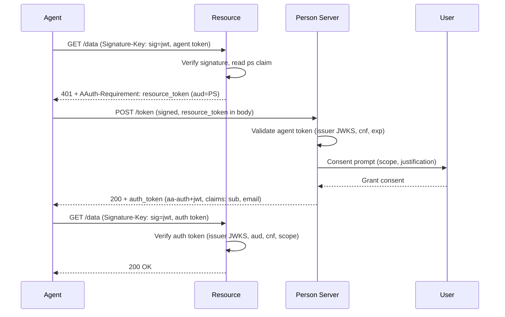

# Getting Started

## Prerequisites

- [.NET 10+](https://dotnet.microsoft.com/download) SDK

## Try the Flows Interactively

Before writing code, watch the protocol run. From the repo root:

```bash
make demo   # starts every service + the stub Access Server + both UIs
```

Then open the two interactive Blazor apps and click through each flow:

- **Guided Tour** — <http://localhost:5400> — step-by-step view of every HTTP exchange, header, and token claim.
- **Sample App** — <http://localhost:5240> — one page per flow (HWK, JWKS URI, JWT direct grant, deferred consent, call-chain, four-party federated).

For the live-Keycloak federated experience, run `make demo-keycloak` instead.

## Install

```bash
dotnet add package AAuth --prerelease
```

Or, if working within this repository, add a project reference:

```bash
dotnet add reference src/AAuth/AAuth.csproj
```

## Generate a Key

```csharp
using AAuth.Crypto;

var key = AAuthKey.Generate(); // Ed25519 keypair
var publicJwk = key.ToPublicJwk(); // Export for registration
var thumbprint = key.ComputeJwkThumbprint(); // JWK thumbprint (S256)
```

## Make Your First Signed Request

The simplest mode is pseudonymous (HWK) — no Agent Provider needed:

```csharp
using AAuth.Crypto;
using AAuth.HttpSig;

var key = AAuthKey.Generate();

using var client = new AAuthClientBuilder(key)
    .UseHwk()
    .Build();

var response = await client.GetAsync("https://resource.example/data");
// Request is signed with HTTP Message Signatures (RFC 9421)
// Resource sees: Signature-Key: sig=hwk;jkt="<thumbprint>";jwk="<public-key>"
```

### Alternative: One-liner with static factory

```csharp
using var client = AAuthSigningHandler.CreateClient(key, new HwkSignatureKeyProvider(key));
```

### Alternative: DI / IHttpClientFactory

```csharp
// In Program.cs
builder.Services.AddAAuthAgent("agent", options =>
{
    options.Key = key;
    options.PersonServer = "https://ps.example"; // omit for signing-only
});

// Inject via IHttpClientFactory
public class MyService(IHttpClientFactory factory)
{
    private readonly HttpClient _client = factory.CreateClient("agent");
}
```

## What Just Happened?

- `AAuthKey.Generate()` created an Ed25519 keypair.
- `AAuthClientBuilder` configured the HWK signing mode and produced an `HttpClient`.
- `AAuthSigningHandler` signs the request per RFC 9421 covering `@method`, `@authority`, `@path`, and `signature-key`.
- The resource verifies the signature using the inline public key from `Signature-Key`.

## Understanding the Protocol Participants

AAuth is a four-party protocol. Each party has a distinct role:

| Role | What It Does |
|------|--------------|
| **Agent** | HTTP client acting on behalf of a person. Signs every request with its private key. Identified by `aauth:local@domain`. |
| **Resource** | Protected API. Verifies HTTP signatures, issues resource tokens as challenges, enforces access policy. |
| **Person Server (PS)** | Represents the user. Manages consent, asserts identity claims (`sub`, `email`, `tenant`), brokers authorization. |
| **Access Server (AS)** | Policy engine for a resource. Issues auth tokens. Used in federated (four-party) mode. |

### The Agent Provider (AP)

The **Agent Provider** is a supporting role that issues agent tokens (`aa-agent+jwt`) binding a signing key to an agent identity. It is the trust anchor for agent identity — analogous to a certificate authority, but for agents.

Two deployment models exist:

| Model | How It Works | Used By |
|-------|--------------|---------|
| **Self-hosted** | Agent has a stable HTTPS URL → acts as its own AP → publishes `/.well-known/aauth-agent.json` → self-signs tokens | Web apps, APIs, orchestrators |
| **Enrolled (external AP)** | Agent registers with an external AP that holds the public key and issues tokens | CLI tools, desktop apps, mobile apps |

In both models, the agent holds the **private** signing key locally in its own keystore (`IKeyStore`). The AP holds only the **public** key. They never share a keystore.

## Key Types & Cryptography

AAuth uses a minimal set of cryptographic primitives:

| Primitive | Purpose | SDK |
|-----------|---------|-----|
| **Ed25519** | Signing key for all HTTP signatures and JWT tokens | `AAuthKey.Generate()` |
| **JWK Thumbprint (S256)** | Compact key identifier — a SHA-256 hash of the canonical public key | `key.ComputeJwkThumbprint()` |
| **JWT (Ed25519-signed)** | All AAuth tokens (`aa-agent+jwt`, `aa-resource+jwt`, `aa-auth+jwt`) | `AgentTokenBuilder`, `ResourceTokenBuilder`, `AuthTokenBuilder` |

The spec requires EdDSA (Ed25519) and prohibits the `none` algorithm. Every request is signed per RFC 9421 (HTTP Message Signatures) — there are no bearer tokens anywhere in the protocol.

## Supported Flows

AAuth supports four resource access modes. Each adds parties and capabilities:

| Flow | Parties | When to Use | Signing Mode | See it run |
|------|---------|-------------|--------------|------------|
| **[Identity-Based](workflows/identity-based-access.md)** | Agent + Resource | API-key replacement, simple access control by identity | `hwk` or `jwks_uri` | GuidedTour flow **2**; SampleApp `/hwk`, `/jwks-uri` |
| **[Resource-Managed](workflows/resource-managed-access.md)** (two-party) | Agent + Resource | Resource handles its own auth (interaction, existing OAuth) | Any (`hwk`, `jwks_uri`, or `jwt`) | Workflow guide |
| **[PS-Asserted](workflows/ps-asserted-access.md)** (three-party) | Agent + Resource + PS | User consent required, resource delegates auth to PS | `jwt` | GuidedTour flows **3** & **4**; SampleApp `/jwt`, `/deferred` |
| **[Federated](workflows/federated-access.md)** (four-party) | Agent + Resource + PS + AS | Cross-domain policy, resource has its own Access Server | `jwt` | GuidedTour flow **6**; SampleApp `/federated` (live Keycloak: `make demo-keycloak`) |

Adoption is incremental — each party can add support independently, and modes build on each other. See [Signing Modes](signing-modes/overview.md) for details on each scheme.

## Three-Party Flow Deep Dive

The PS-Asserted flow is the most common authorization model. The resource issues a challenge; the agent exchanges it at the Person Server for an auth token with user consent.

### Sequence



### Step-by-Step Explanation

**1. Agent → Resource (initial request)**

The agent signs the request with its agent token:

```
GET /data HTTP/1.1
Host: resource.example
Signature-Key: sig=jwt;jwt="<agent-token>"
Signature-Input: sig=("@method" "@authority" "@path" "signature-key");...
Signature: sig=:<base64-signature>:
```

**2. Resource → Agent (401 challenge)**

The resource verifies the HTTP signature, extracts the `ps` claim from the agent token, and issues a `resource_token` (`aa-resource+jwt`) with `aud` set to the PS URL:

```
HTTP/1.1 401 Unauthorized
AAuth-Requirement: requirement=auth-token; resource-token="<resource-token>"
```

The resource token contains: issuer (resource URL), audience (PS URL), agent identifier, agent key thumbprint (`agent_jkt`), and requested scope.

**3. Agent → Person Server (token exchange)**

The agent POSTs the resource token to the PS's token endpoint (discovered via `/.well-known/aauth-person.json`):

```
POST /token HTTP/1.1
Host: ps.example
Content-Type: application/json
Signature-Key: sig=jwt;jwt="<agent-token>"

{"resource_token": "<resource-token>"}
```

**4. Person Server validates and prompts for consent**

The PS:
- Verifies the agent token signature against the AP's published JWKS
- Verifies `cnf.jwk` matches the request's signing key
- Decodes the resource token and verifies it was issued by the resource (via resource JWKS)
- Prompts the user for consent on the requested scope

**5. Consent: immediate vs deferred**

- **Immediate**: User is online and grants consent in real time. PS returns the auth token directly.
- **Deferred**: User is not available. PS returns `202 Accepted` with `requirement=interaction` and a `pending` URL. The agent polls until the user consents (SDK handles this via `InteractionHandlingOptions`).

**6. Person Server → Agent (auth token)**

The PS issues an `auth_token` (`aa-auth+jwt`) containing:
- `iss`: PS URL
- `aud`: Resource URL
- `sub`: User identifier (stable, PS-scoped)
- `cnf.jwk`: Agent's public key (proof-of-possession binding)
- `scope`: Granted scope
- Optional identity claims: `email`, `tenant`, `groups`, `roles`

**7. Agent → Resource (retry with auth token)**

The agent retries the original request, now signed with the auth token:

```
GET /data HTTP/1.1
Host: resource.example
Signature-Key: sig=jwt;jwt="<auth-token>"
Signature-Input: sig=("@method" "@authority" "@path" "signature-key");...
Signature: sig=:<base64-signature>:
```

The resource verifies the auth token:
- Fetches the PS's JWKS (from `{iss}/.well-known/aauth-person.json`) and verifies the JWT signature
- Checks `aud` matches its own identifier
- Confirms `cnf.jwk` matches the key used to sign the HTTP request (proof-of-possession)
- Evaluates the granted `scope` against the requested operation
- Optionally checks the issuer is in `TrustedAuthTokenIssuers`

Per the spec, any PS can assert identity claims to any resource without bilateral setup — the resource namespaces claims by the PS's issuer URL (the same `sub` from a different PS is a different subject). Resources that want to restrict which PSes they accept set `TrustedAuthTokenIssuers`.

### Self-Hosted Agent Example

A hosted service (web app, API, orchestrator) acts as its own Agent Provider:

```csharp
using AAuth.Crypto;
using AAuth.HttpSig;
using AAuth.Server;

var builder = WebApplication.CreateBuilder(args);
var key = AAuthKey.Generate();
const string Kid = "svc-key-1";
var issuer = "https://my-service.example";

var app = builder.Build();

// Publish /.well-known/aauth-agent.json so resources can discover the JWKS
app.MapAAuthAgentWellKnown(new AAuthAgentMetadataOptions
{
    Issuer = issuer,
    SigningKeys = new Dictionary<string, AAuthKey> { [Kid] = key },
});

// Build a signed HTTP client with automatic token refresh and challenge handling
using var client = AAuthClientBuilder.SelfIssuing(key)
    .As(issuer, "aauth:my-service@my-service.example")
    .WithKid(Kid)
    .WithPersonServer("https://ps.example")
    .WithChallengeHandling()
    .Build();

// Every request is signed; 401 challenges are handled automatically
var response = await client.GetAsync("https://resource.example/data");
```

### Resource-Side Example

A resource that verifies signatures and issues resource token challenges:

```csharp
using AAuth.Crypto;
using AAuth.DependencyInjection;
using AAuth.Server;

var builder = WebApplication.CreateBuilder(args);
var resourceKey = AAuthKey.Generate();

// Register resource services (metadata + signing key)
builder.Services.AddAAuthResource(options =>
{
    options.Issuer = "https://resource.example";
    options.SigningKeys = new() { ["resource-key-1"] = resourceKey };
    options.ScopeDescriptions = new()
    {
        ["read"] = "Read access to your documents",
        ["write"] = "Write access to your documents",
    };
});

var app = builder.Build();

// Serve /.well-known/aauth-resource.json and JWKS endpoint
app.MapAAuthWellKnown();

// Verify HTTP signatures and auth tokens from trusted Person Servers
app.UseAAuthVerification(new AAuthVerificationOptions
{
    ResourceIdentifier = "https://resource.example",
    RequireIssuerVerification = true,
    // Restrict which Person Servers this resource trusts.
    // The resource verifies auth tokens against the PS's JWKS
    // (discovered at {iss}/.well-known/aauth-person.json).
    // Omit to dynamically accept any PS — claims are namespaced by issuer.
    TrustedAuthTokenIssuers = new HashSet<string> { "https://ps.example" },
});

// Issue 401 + resource_token when agent presents only an agent token
app.UseAAuthChallenge(new ChallengeOptions
{
    ResourceSigningKey = resourceKey,
    ResourceKeyId = "resource-key-1",
    ResourceIdentifier = "https://resource.example",
});

// Protected endpoint — reached only after auth token is verified
app.MapGet("/data", (HttpContext ctx) =>
{
    var agent = ctx.GetAAuthAgent(); // parsed from verified signature
    return Results.Ok(new { message = $"Hello {agent.Subject}" });
});

app.Run();
```

### Agent Calling the Resource

With the SDK's `ChallengeHandler`, the entire three-party exchange is automatic:

```csharp
var response = await client.GetAsync("https://resource.example/data");
Console.WriteLine(await response.Content.ReadAsStringAsync());
// {"message":"Hello aauth:my-service@my-service.example"}
```

The `ChallengeHandler` intercepts the `401`, extracts the resource token, exchanges it at the PS, caches the resulting auth token, and retries — all transparently.

### Going Four-Party (Federated)

When the resource has its own **Access Server (AS)**, the resource token's `aud` points at the AS instead of the PS. The PS recognizes this and federates to the AS, which mints the auth token. **The agent code is unchanged** — `WithChallengeHandling` handles it transparently, including any AS-side interactive consent. See [Federated Access](workflows/federated-access.md) for the PS- and AS-side code.

## Enrollment: Hosted vs CLI/Desktop Agents

| Aspect | Self-Hosted (Web App/API) | Enrolled (CLI/Desktop) |
|--------|---------------------------|------------------------|
| AP needed? | No — agent IS its own AP | Yes — external AP |
| URL requirement | Stable HTTPS URL | None |
| Key lifecycle | Generated at startup, published via JWKS | Generated in keystore at enrollment, loaded by handle |
| Token acquisition | Self-signed at startup | AP refresh endpoint (automatic via SDK) |
| Metadata | Publishes `/.well-known/aauth-agent.json` | AP publishes it |
| Code entry point | `MapAAuthAgentWellKnown()` + `AgentTokenBuilder` | `AAuthClientBuilder.Bootstrap(url, agentId).EnrolAsync()` |

## Self-Issued Agent Tokens (Hosted Services)

Hosted services (web apps, APIs, orchestrators) that have a stable URL act as their own Agent Provider per spec §Self-Hosted Agents. They generate a key at startup, publish agent metadata at `/.well-known/aauth-agent.json`, and self-sign agent tokens. No external AP enrollment is needed — see the [Self-Hosted Agent Example](#self-hosted-agent-example) above for the `MapAAuthAgentWellKnown` + `AAuthClientBuilder.SelfIssuing` setup.

## Bootstrap with an Agent Provider (CLI / Desktop Agents)

For agents that do NOT have a stable URL (CLI tools, desktop apps, mobile apps), registration with an external **Agent Provider (AP)** provides identity and key discovery. Enrollment is a **provisioning step** that runs once (in a CLI tool or setup script). The durable signing key is generated inside a keystore and never extracted — the app references it by ID. The agent token is short-lived (typically 1 hour) and refreshed automatically by the SDK.

### Provisioning (run once per device/install)

```csharp
using AAuth.Agent;
using AAuth.Crypto;
using AAuth.HttpSig;

// Key is generated INSIDE the store — private material never leaves
var keyStore = FileKeyStore.Default(); // ~/.aauth/keys/ (or plug in HSM/Key Vault)

var enrol = await AAuthClientBuilder
    .Bootstrap(
        enrollEndpoint: "https://ap.example/enrol",
        agentId: "aauth:myagent@example.com")
    .WithPersonServer("https://ps.example")
    .WithKeyStore(keyStore)
    .EnrolAsync();

// Only the local key handle needs to be recorded in app config
// (the key itself is already in the keystore; defaults to the JWK thumbprint)
Console.WriteLine($"Enrolled. Add to config: AAuth:LocalKeyHandle = {enrol.LocalKeyHandle}");
```

### Application (every startup)

Load the key by handle from the store and let the SDK manage agent tokens:

```csharp
using AAuth.Agent;
using AAuth.Crypto;
using AAuth.HttpSig;

var keyStore = FileKeyStore.Default();
var localKeyHandle = configuration["AAuth:LocalKeyHandle"]!;
var apRefreshEndpoint = configuration["AAuth:ApRefreshEndpoint"]!;
var key = await keyStore.LoadAsync(localKeyHandle)
    ?? throw new InvalidOperationException($"Key '{localKeyHandle}' not found. Run enrollment first.");

// The SDK acquires the agent token lazily on first request
// via WithTokenRefresh, then keeps it fresh automatically.
using var client = AAuthClientBuilder.Enrolled(key)
    .RefreshingFrom(apRefreshEndpoint, localKeyHandle)
    .WithKeyStore(keyStore)
    .WithChallengeHandling("https://ps.example")
    .Build();

var response = await client.GetAsync("https://resource.example/protected");
Console.WriteLine(await response.Content.ReadAsStringAsync());
```

> **Shortcut — `From(EnrollResult)`**: If you still have the enrollment result object
> (e.g. in a CLI that enrols and immediately calls a resource), use the convenience factory
> to auto-configure the signing mode:
>
> ```csharp
> using var client = AAuthClientBuilder.Enrolled(enrol.Key)
>     .RefreshingFrom(enrol.ApRefreshEndpoint, enrol.LocalKeyHandle)
>     .WithKeyStore(keyStore)
>     .WithChallengeHandling("https://ps.example")
>     .Build();
> ```
>
> `From()` sets up `UseJwksUri` when the enrollment includes a `JwksUri` and `AgentTokenKid`,
> falling back to the default `jwt` mode otherwise.

<details>
<summary>Step-by-Step (Advanced)</summary>

### 1. Enrol with the Agent Provider

```csharp
using AAuth.Agent;
using AAuth.Crypto;
using AAuth.Discovery;
using AAuth.HttpSig;

var apClient = new AgentProviderClient(new HttpClient(), new InMemoryKeyStore());
var enrol = await apClient.EnrolAsync(
    apIssuer: "https://ap.example",
    agentId: "aauth:myagent@example.com",
    enrollEndpoint: "https://ap.example/enrol",
    personServer: "https://ps.example");

// enrol.Key            — your Ed25519 signing key (in keystore)
// enrol.LocalKeyHandle — agent-local IKeyStore handle (defaults to JWK thumbprint); persist this
// enrol.AgentTokenKid  — AP-internal JWT `kid` (opaque; diagnostic only)
// enrol.AgentToken     — initial aa-agent+jwt (short-lived, do not persist)
```

### 2. Build the Signed Client with Challenge Handling

```csharp
using var client = AAuthClientBuilder.Enrolled(enrol.Key)
    .RefreshingFrom("https://ap.example/refresh", enrol.LocalKeyHandle)
    .WithKeyStore(keyStore)
    .WithChallengeHandling(personServer: "https://ps.example")
    .Build();
```

### 3. Make Requests

```csharp
var response = await client.GetAsync("https://resource.example/protected");
Console.WriteLine(await response.Content.ReadAsStringAsync());
```

</details>

<details>
<summary>Manual Pipeline Setup (Low-Level)</summary>

This shows the internal handler pipeline for educational purposes. Use `WithTokenRefresh` + `WithChallengeHandling` in production code.

```csharp
// Acquire a fresh agent token via the AP refresh endpoint
var apClient = new AgentProviderClient(new HttpClient(), keyStore);
var agentToken = await apClient.RefreshAsync("https://ap.example/refresh", keyId);

// Carrier-token holder — shared between signer and challenge handler.
var holder = new AAuthTokenHolder(agentToken);

var signingHandler = new AAuthSigningHandler(
    key, new JwtSignatureKeyProvider(() => holder.Current))
{
    InnerHandler = new HttpClientHandler(),
};

var exchangeHttp = new HttpClient(
    new AAuthSigningHandler(key, new JwtSignatureKeyProvider(() => agentToken))
    { InnerHandler = new HttpClientHandler() });

var exchange = new TokenExchangeClient(exchangeHttp, new MetadataClient(new HttpClient()));

var pipeline = new ChallengeHandler(exchange, holder, "https://ps.example")
{
    InnerHandler = signingHandler,
};

using var client = new HttpClient(pipeline);
```

</details>

### What Happens Under the Hood

1. Agent sends a signed GET → Resource replies **401** with `AAuth-Requirement: requirement=auth-token` and a `resource_token`.
2. `ChallengeHandler` extracts the resource token, POSTs it to the Person Server's token endpoint.
3. The PS validates the agent token, confirms user consent (or defers), and returns an `auth_token`.
4. `AAuthTokenHolder` is updated; the handler retries the original request signed with the auth token.
5. Subsequent requests reuse the auth token until it expires.

## Next Steps

- [Signing Modes Overview](signing-modes/overview.md) — choose the right mode for your use case
- [Identity-Based Access](workflows/identity-based-access.md) — simplest workflow (no PS needed)
- [Resource-Managed Access](workflows/resource-managed-access.md) — resource runs its own authorization
- [PS-Asserted Access](workflows/ps-asserted-access.md) — full three-party authorization flow
- [Federated Access](workflows/federated-access.md) — four-party flow with an Access Server
- [Call Chaining](workflows/call-chaining.md) — multi-agent delegation with nested `act`
- [Bootstrap & Enrollment](workflows/bootstrap-enrollment.md) — detailed AP enrollment for CLI/desktop agents
- [Server Guide](server/verification-middleware.md) — verification middleware and token issuance
- [Protocol Concepts](concepts.md) — understand the full picture

## Protocol Reference

Explore the interactive protocol specification at <https://explorer.aauth.dev/>.
