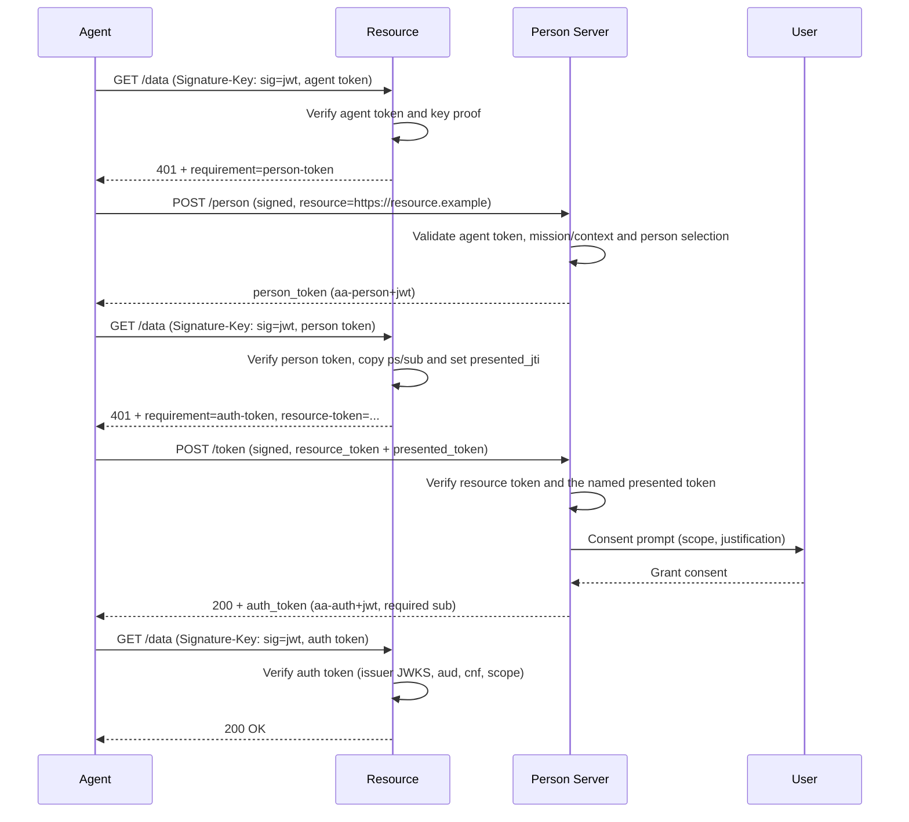

# Getting Started

## Prerequisites

- [.NET 10+](https://dotnet.microsoft.com/download) SDK

## Try the Flows Interactively

Before writing code, watch the protocol run. From the repo root:

```bash
make demo   # starts every service + the stub Access Server + both UIs
```

Then open the two interactive Blazor apps and click through each flow:

- **Guided Tour** — <http://localhost:5400> — step-by-step view of every HTTP exchange, header, and token claim.
- **Sample App** — <http://localhost:5240> — one page per flow (HWK, JWKS URI, resource-managed Inbox, JWT direct grant, deferred consent, call-chain, four-party federated).

For the live-Keycloak federated experience, run `make demo-keycloak` instead.

## Install

```bash
dotnet add package AAuth --prerelease
```

Or, if working within this repository, add a project reference:

```bash
dotnet add reference src/AAuth/AAuth.csproj
```

## Generate a Key

```csharp
using AAuth.Crypto;

var key = AAuthKey.Generate(); // Ed25519 keypair
var publicJwk = key.ToPublicJwk(); // Export for registration
var thumbprint = key.ComputeJwkThumbprint(); // JWK thumbprint (S256)
```

## Make Your First Signed Request

Enroll with your configured AP, retain the durable key locally, and use the
issued agent JWT for resource access. The example endpoints are deployment
placeholders; `make demo` uses the explicit [loopback policy](../samples/README.md#network-admission).

```csharp
using AAuth.Crypto;
using AAuth;

var keyStore = FileKeyStore.Default();
var key = keyStore.LoadOrCreate("my-agent");
var enrollment = await AAuthClientBuilder.Bootstrap("https://ap.example/enrol")
    .WithKey(key).WithKeyStore(keyStore).EnrolAsync();
using var client = AAuthClientBuilder.Enrolled(key)
    .RefreshingFrom("https://ap.example/refresh", enrollment.LocalKeyHandle!)
    .WithKeyStore(keyStore)
    .Build();

var response = await client.GetAsync("https://resource.example/data");
// Request is signed with HTTP Message Signatures (RFC 9421)
// Signature-Key: sig=jwt;jwt="<aa-agent+jwt>"
```

### Alternative: One-liner with static factory

```csharp
using var client = AAuthSigningHandler.CreateClient(key, new JwtSignatureKeyProvider(() => agentToken));
```

### Alternative: DI / IHttpClientFactory

```csharp
// In Program.cs
builder.Services.AddAAuthAgent("agent", options =>
{
    options.Signer = key;
    options.AgentToken = agentToken;
});

// Inject via IHttpClientFactory
public class MyService(IHttpClientFactory factory)
{
    private readonly HttpClient _client = factory.CreateClient("agent");
}
```

## What Just Happened?

- `FileKeyStore.LoadOrCreate()` retained the agent's software key locally.
- Signed enrollment bound its public key to an AP-assigned identity.
- The enrolled builder configures AP token refresh and produces an `HttpClient`.
- `AAuthSigningHandler` signs the request per RFC 9421 covering `@method`, `@authority`, `@path`, and `signature-key`.
- The resource verifies the AP assertion and the matching HTTP proof. Generic
    [HWK](signing-modes/pseudonymous-hwk.md) examples use a different explicit profile.

## Understanding the Protocol Participants

AAuth is a four-party protocol. Each party has a distinct role:

| Role | What It Does |
|------|--------------|
| **Agent** | HTTP client acting on behalf of a person. Signs every request with its private key. Identified by `aauth:local@domain`. |
| **Resource** | Protected API. Verifies HTTP signatures, issues resource tokens as challenges, enforces access policy. |
| **Person Server (PS)** | Represents the user. Manages consent, asserts identity claims (`sub`, `email`, `tenant`), brokers authorization. |
| **Access Server (AS)** | Policy engine for a resource. Issues auth tokens. Used in federated (four-party) mode. |

### The Agent Provider (AP)

The **Agent Provider** is a supporting role that issues agent tokens (`aa-agent+jwt`) binding a signing key to an agent identity. It is the trust anchor for agent identity — analogous to a certificate authority, but for agents.

Two deployment models exist:

| Model | How It Works | Used By |
|-------|--------------|---------|
| **Self-hosted** | Agent has a stable HTTPS URL → acts as its own AP → publishes `/.well-known/aauth-agent.json` → self-signs tokens | Web apps, APIs, concierges |
| **Enrolled (external AP)** | Agent registers with an external AP that holds the public key and issues tokens | CLI tools, desktop apps, mobile apps |

In both models, the agent holds the **private** signing key locally in its own keystore (`IKeyStore`). The AP holds only the **public** key. They never share a keystore.

## Key Types & Cryptography

AAuth uses a minimal set of cryptographic primitives:

| Primitive | Purpose | SDK |
|-----------|---------|-----|
| **Ed25519** | Signing key for all HTTP signatures and JWT tokens | `AAuthKey.Generate()` |
| **JWK Thumbprint (S256)** | Compact key identifier — a SHA-256 hash of the canonical public key | `key.ComputeJwkThumbprint()` |
| **JWT (Ed25519-signed)** | All AAuth tokens (`aa-agent+jwt`, `aa-person+jwt`, `aa-resource+jwt`, `aa-auth+jwt`) | `AgentTokenBuilder`, `PersonTokenBuilder`, `ResourceTokenBuilder`, `AuthTokenBuilder` |

Ed25519 is required; the SDK also supports ES256. Fully specified algorithms are
required in JWKs and JWT headers; polymorphic `EdDSA`, `none` and symmetric keys
are rejected. HTTP signatures follow RFC 9421 and do not add an `alg` parameter.

## Supported Flows

AAuth supports five resource access modes. Each adds parties and capabilities:

| Flow | Parties | When to Use | Signing Mode | See it run |
|------|---------|-------------|--------------|------------|
| **[Agent identity](workflows/identity-based-access.md)** | Agent + Resource | Resource authorizes verified agent identity | `jwt` | Profile `/identified` accepts agent JWT; generic Profile demos are separate |
| **[Resource-Managed](workflows/resource-managed-access.md)** (two-party) | Agent + Resource | Resource handles its own authorization | `jwt` plus opaque AAuth-Access | GuidedTour **Resource-Managed (Two-Party)**; SampleApp `/inbox` |
| **Person Identity** | Agent + Resource + PS | Resource needs a person identifier before deciding what to challenge for | `jwt` with a person token | Intermediate `requirement=person-token` step in PS authorization flows |
| **[PS Authorization](workflows/ps-asserted-access.md)** (three-party) | Agent + Resource + PS | User consent required, resource delegates auth to PS | `jwt` | GuidedTour **PS Authorization (Direct Grant)** & **(Deferred)**; SampleApp `/calendar`, `/calendar-deferred` |
| **[Federated authorization](workflows/federated-access.md)** (four-party) | Agent + Resource + PS + AS | Cross-domain policy, resource has its own Access Server | `jwt` | GuidedTour **Federated authorization (Four-Party)**; SampleApp `/wallet` (live Keycloak: `make demo-keycloak`) |

Adoption is incremental — each party can add support independently, and modes build on each other. See [Signing Modes](signing-modes/overview.md) for details on each scheme.

## Three-Party Flow Deep Dive

The PS authorization flow is the common three-party authorization model. Draft-11
is a two-challenge sequence: first the resource asks for a person token
(`#requirement-person-token`, L615), then it uses that verified person token to
mint a resource token whose `presented_jti` names the person token's `jti`
(`#resource-token`, L725-L760). The agent sends both the `resource_token` and
the exact `presented_token` to the PS auth-token endpoint (`#ps-token-endpoint`,
L924-L968), and the returned auth token contains a required `sub`
(`#auth-token-structure`, L1768-L1790).

### Sequence


```mermaid
sequenceDiagram
    participant Agent
    participant Resource
    participant PS as Person Server
    participant User

    Agent->>Resource: GET /data (Signature-Key: sig=jwt, agent token)
    Resource->>Resource: Verify agent token and key proof
    Resource-->>Agent: 401 + requirement=person-token

    Agent->>PS: POST /person (signed, resource=https://resource.example)
    PS->>PS: Validate agent token, mission/context and person selection
    PS-->>Agent: person_token (aa-person+jwt)

    Agent->>Resource: GET /data (Signature-Key: sig=jwt, person token)
    Resource->>Resource: Verify person token, copy ps/sub and set presented_jti
    Resource-->>Agent: 401 + requirement=auth-token, resource-token=...

    Agent->>PS: POST /token (signed, resource_token + presented_token)
    PS->>PS: Verify resource token and the named presented token
    PS->>User: Consent prompt (scope, justification)
    User-->>PS: Grant consent
    PS-->>Agent: 200 + auth_token (aa-auth+jwt, required sub)

    Agent->>Resource: GET /data (Signature-Key: sig=jwt, auth token)
    Resource->>Resource: Verify auth token (issuer JWKS, aud, cnf, scope)
    Resource-->>Agent: 200 OK
```

### Step-by-Step Explanation

**1. Agent → Resource (initial request)**

The agent signs the request with its agent token:

```
GET /data HTTP/1.1
Host: resource.example
Signature-Key: sig=jwt;jwt="<agent-token>"
Signature-Input: sig=("@method" "@authority" "@path" "signature-key");...
Signature: sig=:<base64-signature>:
```

**2. Resource → Agent (401 `requirement=person-token`)**

The resource can verify the agent token, but it cannot issue a resource token
until it has verified a person or auth token. It asks the agent to obtain a
person token from the PS (`#requirement-person-token`, L615):

```http
HTTP/1.1 401 Unauthorized
AAuth-Requirement: requirement=person-token
```

**3. Agent → Person Server (`/person`)**

The agent makes a signed POST to the PS `person_token_endpoint` (`/person` in
the SDK defaults), presenting its agent token via `Signature-Key: sig=jwt` and
naming the resource that will receive the person token (`#person-token-endpoint`,
L801):

```http
POST /person HTTP/1.1
Host: ps.example
Content-Type: application/json
Signature-Key: sig=jwt;jwt="<agent-token>"

{
  "resource": "https://resource.example",
  "justification": "Read calendar events"
}
```

The PS validates the agent token, mission/context values, optional
`capabilities`, and the person selection policy. It returns an `aa-person+jwt`
whose `aud` is the resource and whose `sub` is the directed person identifier.

```http
HTTP/1.1 200 OK
Content-Type: application/json

{
  "person_token": "<person-token>",
  "expires_in": 3600
}
```

**4. Agent → Resource (retry with person token)**

The agent retries with the person token. The resource verifies it, then issues a
resource token because it now knows the PS/person namespace. The resource token
copies `ps` and `sub` from the token the request carried and sets
`presented_jti` to that token's `jti`
(`#resource-token`, L725-L760):

```http
HTTP/1.1 401 Unauthorized
AAuth-Requirement: requirement=auth-token; resource-token="<resource-token>"
```

The resource token contains the resource issuer, the recipient (`aud` = PS for
three-party, AS for four-party), the `ps`/`sub` copied from the person token,
`presented_jti` equal to the person token's `jti`, `agent_jkt`, and the
requested scope.

**5. Agent → Person Server (auth-token request)**

The agent posts both the resource token and the exact token named by
`presented_jti` to the PS `auth_token_endpoint` (`#ps-token-endpoint`,
L924-L968):

```http
POST /token HTTP/1.1
Host: ps.example
Content-Type: application/json
Prefer: wait=45
Signature-Key: sig=jwt;jwt="<agent-token>"

{
  "resource_token": "<resource-token>",
  "presented_token": "<person-token>",
  "justification": "Read calendar events"
}
```

The PS verifies the resource token, verifies the presented person token against
the resource token, checks that its `jti` equals `presented_jti`, then applies
consent, mission and policy. For a four-party resource, the PS sends the same
bound pair to the resource's AS.

**6. Person Server → Agent (auth token)**

When the request can be resolved immediately, the PS or AS issues an
`auth_token` (`aa-auth+jwt`):

```http
HTTP/1.1 200 OK
Content-Type: application/json

{
  "auth_token": "<auth-token>",
  "expires_in": 3600
}
```

If user interaction is required, the PS returns a deferred response
(`#deferred-responses`, L2478-L2538) instead. The agent polls the same-origin
`Location` with signed `GET` requests and may include `Prefer: wait=N` on those
polls:

```http
HTTP/1.1 202 Accepted
Location: /pending/f7a3b9c
Retry-After: 1
Cache-Control: no-store
AAuth-Requirement: requirement=interaction; url="https://ps.example/interact"; code="abc123"
Content-Type: application/json

{
  "status": "pending"
}
```

The final `auth_token` uses `typ: aa-auth+jwt`, follows the common JWT profile
(`jti`, `iat`, `exp`, `cnf`), and contains:

- `iss`: PS URL for three-party, AS URL for four-party.
- `dwk`: `aauth-person.json` for PS-issued tokens or `aauth-access.json` for AS-issued tokens.
- `aud`: Resource URL.
- `ps`: Person Server URL.
- `sub`: Required directed person identifier, scoped to the issuer/resource pair.
- `cnf.jwk`: Agent's public key (proof-of-possession binding).
- `exp`: No more than 1 hour, bounded by the agent token, the `presented_token`,
  and any upstream token or mission expiry.
- Optional `scope`, `account`, `mission_s256`, `tenant`, and identity claims.

**7. Agent → Resource (retry with auth token)**

The agent retries the original request, now signed with the auth token:

```
GET /data HTTP/1.1
Host: resource.example
Signature-Key: sig=jwt;jwt="<auth-token>"
Signature-Input: sig=("@method" "@authority" "@path" "signature-key");...
Signature: sig=:<base64-signature>:
```

The resource verifies the auth token:
- Fetches the PS or AS JWKS and verifies the JWT signature
- Checks `aud` matches its own identifier
- Confirms `cnf.jwk` matches the key used to sign the HTTP request (proof-of-possession)
- Evaluates the granted `scope` against the requested operation
- Optionally checks the issuer against `Trust.AuthTokenIssuers`

If a later endpoint requires a broader `scope` than the presented auth token
grants, `RequireAAuth(scope:)` performs step-up by returning another `401` with
`requirement=auth-token` and a fresh resource token, not a `403`.

Per the spec, any trusted, verifiable PS can assert identity claims to a
resource. The resource namespaces claims by issuer URL: the same `sub` from a
different PS is a different person. Resources that want to restrict which PSes
or ASes they accept configure `Trust.AuthTokenIssuers`.

### Self-Hosted Agent Example

A hosted service (web app, API, concierge) acts as its own Agent Provider:

```csharp
using AAuth.Crypto;
using AAuth;
using AAuth.Server.Metadata;

var builder = WebApplication.CreateBuilder(args);
var key = AAuthKey.Generate();
const string Kid = "svc-key-1";
var issuer = "https://my-service.example";

var app = builder.Build();

// Publish /.well-known/aauth-agent.json so resources can discover the JWKS
app.MapAAuthAgentWellKnown(options =>
{
    options.Issuer = issuer;
    options.SigningKeys = new AAuthSigningKeySet(Kid, key);
});

// Build a signed HTTP client with automatic token refresh and challenge handling
using var client = AAuthClientBuilder.SelfIssuing(key)
    .As(issuer, "aauth:my-service@my-service.example")
    .WithKid(Kid)
    .WithPersonServer("https://ps.example")
    .WithChallengeHandling()
    .Build();

// Every request is signed; 401 challenges are handled automatically
var response = await client.GetAsync("https://resource.example/data");
```

### Resource-Side Example

A resource that verifies signatures and issues resource token challenges:

```csharp
using AAuth.Crypto;
using AAuth;

var builder = WebApplication.CreateBuilder(args);
var resourceKey = AAuthKey.Generate();

// One DI call registers the verifier, discovery clients, JTI store, and metadata.
builder.Services.AddAAuthResource(options =>
{
    options.Issuer = "https://resource.example";
    options.SigningKeys["resource-key-1"] = resourceKey;
    options.ScopeDescriptions = new()
    {
        ["read"] = "Read access to your documents",
        ["write"] = "Write access to your documents",
    };
});
builder.Services.AddAAuthAuthentication();
builder.Services.AddAAuthAuthorization();

var app = builder.Build();

// Serve /.well-known/aauth-resource.json and JWKS endpoint
app.MapAAuthWellKnown();

// One declarative pipeline: this single post-routing middleware verifies the
// signature and, when an endpoint needs an auth token, challenges for one.
// Restrict which Person Servers this resource trusts — the resource verifies
// auth tokens against the PS's JWKS (discovered at
// {iss}/.well-known/aauth-person.json). Leave Trust.AuthTokenIssuers unset (or assign
// AAuthTrust.Any to its Predicate) to accept any *verifiable* PS dynamically — claims are
// namespaced by issuer; leaving it open logs a startup warning.
app.UseRouting();
app.UseAAuth(o => o.Trust.AuthTokenIssuers.Allowed = new HashSet<string> { "https://ps.example" });
app.UseAuthentication();
app.UseAuthorization();

// Protected endpoint — declares the scope it needs; reached only after the
// auth token is verified.
app.MapGet("/data", (HttpContext ctx) =>
{
    var result = ctx.GetAAuthVerification()!; // parsed from the verified signature
    return Results.Ok(new { message = $"Hello {result.Subject}" });
}).RequireAAuth(scope: "read");

app.Run();
```

### Agent Calling the Resource

With the SDK's `ChallengeHandler`, the entire three-party exchange is automatic:

```csharp
var response = await client.GetAsync("https://resource.example/data");
Console.WriteLine(await response.Content.ReadAsStringAsync());
// {"message":"Hello person-123"}
```

The `ChallengeHandler` handles the draft-11 sequence transparently: it first
answers the `requirement=person-token` challenge by requesting a person token,
then answers the `requirement=auth-token` challenge by POSTing both
`resource_token` and `presented_token` to the PS, caches the resulting auth
token, and retries.

### Going Four-Party (Federated)

When the resource has its own **Access Server (AS)**, the resource token's `aud` points at the AS instead of the PS. The PS recognizes this and federates to the AS, which mints the auth token. **The agent code is unchanged** — `WithChallengeHandling` handles it transparently, including any AS-side interactive consent. See [Federated authorization](workflows/federated-access.md) for the PS- and AS-side code.

## Enrollment: Hosted vs CLI/Desktop Agents

| Aspect | Self-Hosted (Web App/API) | Enrolled (CLI/Desktop) |
|--------|---------------------------|------------------------|
| AP needed? | No — agent IS its own AP | Yes — external AP |
| URL requirement | Stable HTTPS URL | None |
| Key lifecycle | Generated at startup, published via JWKS | Generated in keystore at enrollment, loaded by handle |
| Token acquisition | Self-signed at startup | AP refresh endpoint (automatic via SDK) |
| Metadata | Publishes `/.well-known/aauth-agent.json` | AP publishes it |
| Code entry point | `MapAAuthAgentWellKnown()` + `AgentTokenBuilder` | `AAuthClientBuilder.Bootstrap(url, agentId).EnrolAsync()` |

## Self-Issued Agent Tokens (Hosted Services)

Hosted services (web apps, APIs, concierges) that have a stable URL act as their own Agent Provider per spec §Self-Hosted Agents. They generate a key at startup, publish agent metadata at `/.well-known/aauth-agent.json`, and self-sign agent tokens. No external AP enrollment is needed — see the [Self-Hosted Agent Example](#self-hosted-agent-example) above for the `MapAAuthAgentWellKnown` + `AAuthClientBuilder.SelfIssuing` setup.

## Bootstrap with an Agent Provider (CLI / Desktop Agents)

For agents that do NOT have a stable URL (CLI tools, desktop apps, mobile apps), registration with an external **Agent Provider (AP)** provides identity and key discovery. Enrollment is a **provisioning step** that runs once (in a CLI tool or setup script). The durable signing key is generated inside a keystore and never extracted — the app references it by ID. The agent token is short-lived (typically 1 hour) and refreshed automatically by the SDK.

### Provisioning (run once per device/install)

```csharp
using AAuth.Agent;
using AAuth.Crypto;
using AAuth;

// Key is generated INSIDE the store — private material never leaves
var keyStore = FileKeyStore.Default(); // ~/.aauth/keys/ (or plug in HSM/Key Vault)

var enrol = await AAuthClientBuilder
    .Bootstrap(enrollEndpoint: "https://ap.example/enrol")
    .WithKey(keyStore.LoadOrCreate("myagent"))
    .WithPersonServer("https://ps.example")
    .WithKeyStore(keyStore)
    .EnrolAsync();

// Only the local key handle needs to be recorded in app config
// (the key itself is already in the keystore; defaults to the JWK thumbprint)
Console.WriteLine($"Enrolled. Add to config: AAuth:LocalKeyHandle = {enrol.LocalKeyHandle}");
```

### Application (every startup)

Load the key by handle from the store and let the SDK manage agent tokens:

```csharp
using AAuth.Agent;
using AAuth.Crypto;
using AAuth;

var keyStore = FileKeyStore.Default();
var localKeyHandle = configuration["AAuth:LocalKeyHandle"]!;
var apRefreshEndpoint = configuration["AAuth:ApRefreshEndpoint"]!;
var key = keyStore.Load(localKeyHandle)
    ?? throw new InvalidOperationException($"Key '{localKeyHandle}' not found. Run enrollment first.");

// The SDK acquires the agent token lazily on first request
// via the configured AP refresh endpoint, then keeps it fresh automatically.
using var client = AAuthClientBuilder.Enrolled(key)
    .RefreshingFrom(apRefreshEndpoint, localKeyHandle)
    .WithKeyStore(keyStore)
    .WithChallengeHandling("https://ps.example")
    .Build();

var response = await client.GetAsync("https://resource.example/protected");
Console.WriteLine(await response.Content.ReadAsStringAsync());
```

> **Shortcut — `From(EnrollResult)`**: If you still have the enrollment result object
> (e.g. in a CLI that enrols and immediately calls a resource), use the convenience factory
> to use its already-issued agent JWT:
>
> ```csharp
> using var client = AAuthClientBuilder.From(enrol)
>     .WithChallengeHandling("https://ps.example")
>     .Build();
> ```
>
> `From()` always selects `jwt` from `enrol.AgentToken`, regardless of JWKS metadata.
> It does not enroll or refresh. Use `Enrolled(...).RefreshingFrom(...).WithKeyStore(...)`
> for automatic AP renewal. A later explicit scheme selector disables configured
> refresh; a later `WithTokenRefresh` selects a refreshed JWT carrier. Flow options
> do not change the scheme or add an authorization party.

<details>
<summary>Step-by-Step (Advanced)</summary>

### 1. Enrol with the Agent Provider

```csharp
using AAuth.Agent;
using AAuth.Crypto;
using AAuth.Discovery;

using var apHttp = AAuthHttpTransport.CreateClient();
var keyStore = new InMemoryKeyStore();
var apClient = new AgentProviderClient(apHttp, keyStore);
var enrol = await apClient.EnrolAsync(
    apIssuer: "https://ap.example",
    agentId: null,
    enrollEndpoint: "https://ap.example/enrol",
    personServer: "https://ps.example");

// enrol.Key            — your Ed25519 signing key (in keystore)
// enrol.LocalKeyHandle — agent-local IKeyStore handle (defaults to JWK thumbprint); persist this
// enrol.AgentTokenKid  - per-agent JWKS key selector for explicit generic jwks signing
// enrol.AgentToken     — initial aa-agent+jwt (short-lived, do not persist)
```

### 2. Build the Signed Client with Challenge Handling

```csharp
using var client = AAuthClientBuilder.Enrolled(enrol.Key)
    .RefreshingFrom("https://ap.example/refresh", enrol.LocalKeyHandle)
    .WithKeyStore(keyStore)
    .WithChallengeHandling(personServer: "https://ps.example")
    .Build();
```

### 3. Make Requests

```csharp
var response = await client.GetAsync("https://resource.example/protected");
Console.WriteLine(await response.Content.ReadAsStringAsync());
```

</details>

<details>
<summary>Manual Pipeline Setup (Low-Level)</summary>

This shows the internal handler pipeline for educational purposes. Use
`RefreshingFrom(...)` + `WithChallengeHandling(...)` in production code.

```csharp
// Acquire a fresh agent token via the AP refresh endpoint
using var apHttp = AAuth.Discovery.AAuthHttpTransport.CreateClient();
var apClient = new AgentProviderClient(apHttp, keyStore);
var agentToken = await apClient.RefreshAsync("https://ap.example/refresh", localKeyHandle);

// Carrier-token holder — shared between signer and challenge handler.
var holder = new AAuthTokenHolder(agentToken);

var signingHandler = new AAuthSigningHandler(
    key, new JwtSignatureKeyProvider(() => holder.Current))
{
    InnerHandler = AAuth.Discovery.AAuthHttpTransport.CreateHandler(),
};

using var exchangeHttp = AAuth.Discovery.AAuthHttpTransport.AttachPolicy(new HttpClient(
    new AAuthSigningHandler(key, new JwtSignatureKeyProvider(() => agentToken))
    { InnerHandler = AAuth.Discovery.AAuthHttpTransport.CreateHandler() }),
    AAuth.Discovery.AAuthEgressPolicy.Production, AAuth.Discovery.AAuthTransportContract.EnforcesEgressPolicy);

using var metadata = new MetadataClient();
using var jwks = new JwksClient();
var verifier = new TokenVerifier();
var exchange = new TokenExchangeClient(exchangeHttp, metadata);

var pipeline = new ChallengeHandler(exchange, holder, verifier, metadata, jwks, "https://ps.example")
{
    InnerHandler = signingHandler,
};

using var client = new HttpClient(pipeline);
```

</details>

### What Happens Under the Hood

1. Agent sends a signed GET with an agent token → Resource replies **401** with
   `AAuth-Requirement: requirement=person-token`.
2. `ChallengeHandler` requests a person token from the PS `person_token_endpoint`
   and retries the resource with that person token.
3. Resource verifies the person token → replies **401** with
   `AAuth-Requirement: requirement=auth-token` and a resource token whose
   `presented_jti` names the person token's `jti`.
4. `ChallengeHandler` POSTs both `resource_token` and `presented_token` to the
   PS auth-token endpoint. The PS validates the pair, confirms consent directly
   or returns a `202` deferred interaction, and then returns an `auth_token`.
5. `AAuthTokenHolder` is updated; the handler retries the original request signed
   with the auth token. Subsequent requests reuse the auth token until it expires
   or needs step-up.

## Next Steps

- [Signing Modes Overview](signing-modes/overview.md) — choose the right mode for your use case
- [Agent identity access](workflows/identity-based-access.md) — simplest workflow (no PS needed)
- [Resource-Managed Access](workflows/resource-managed-access.md) — resource runs its own authorization
- [PS authorization](workflows/ps-asserted-access.md) — full three-party authorization flow
- [Federated authorization](workflows/federated-access.md) — four-party flow with an Access Server
- [Call Chaining](workflows/call-chaining.md) — multi-hop access with `upstream_token`
- [Bootstrap & Enrollment](workflows/bootstrap-enrollment.md) — detailed AP enrollment for CLI/desktop agents
- [Server Guide](server/verification-middleware.md) — verification middleware and token issuance
- [Protocol Concepts](concepts.md) — understand the full picture

## Protocol Reference

Explore the interactive protocol specification at <https://explorer.aauth.dev/>.
