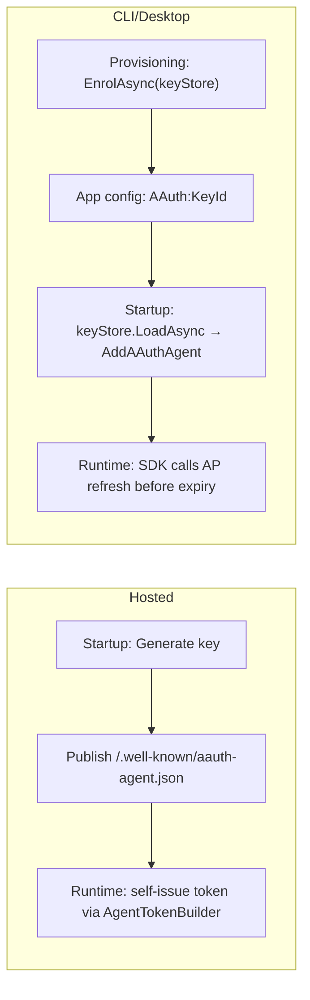

# Dependency Injection

Register AAuth services in ASP.NET Core and hosted applications using the built-in DI extensions.

## Key Principle

How your agent obtains its token depends on its deployment model:

- **Hosted services** (web apps, APIs, orchestrators with a stable URL): Self-issue agent tokens at runtime. Generate a key at startup, publish `/.well-known/aauth-agent.json`, and build tokens locally. No external AP needed.
- **CLI / desktop / mobile agents** (no stable URL): Enrol with an Agent Provider once (provisioning step), then refresh tokens from the AP at runtime.

In both cases, the agent token is short-lived (typically 1 hour) and refreshed automatically by the SDK. You never persist it.



See [Bootstrap & Enrollment](../workflows/bootstrap-enrollment.md) for the CLI/desktop provisioning step, or [Getting Started](../getting-started.md#self-issued-agent-tokens-hosted-services) for the self-issued path.

## Agent Registration (Outbound Requests)

### Pseudonymous (HWK) — Signing Only

No enrollment required. Generate or load a key and register:

```csharp
var key = AAuthKey.Generate(); // or load from persistent storage

builder.Services.AddAAuthAgent("signing-only", options =>
{
    options.Key = key;
    // No AgentToken → defaults to HWK mode
});
```

### Identity-Based (JWT) — Self-Issued (Hosted Services)

No AP enrollment needed. The service generates a key and self-issues tokens:

```csharp
var key = AAuthKey.Generate();
const string Kid = "svc-key-1";
var issuer = "https://my-service.example";

builder.Services.AddAAuthAgent("self-issued", options =>
{
    options.Key = key;
    options.PersonServer = "https://ps.example";
    options.TokenRefresher = new SelfIssuedTokenRefresher(key, Kid, issuer,
        agentId: "aauth:my-service@my-service.example",
        personServer: "https://ps.example");
});

// Also publish agent metadata so verifiers can discover the JWKS
app.MapAAuthAgentWellKnown(new AAuthAgentMetadataOptions
{
    Issuer = issuer,
    SigningKeys = new Dictionary<string, AAuthKey> { [Kid] = key },
});
```

### Identity-Based (JWT) — AP-Enrolled (CLI/Desktop Agents)

Load the key by ID from the store and configure token refresh:

```csharp
var keyStore = KeyStore.Default();
var keyId = configuration["AAuth:KeyId"]!;
var key = await keyStore.LoadAsync(keyId)
    ?? throw new InvalidOperationException($"Key '{keyId}' not found.");

builder.Services.AddAAuthAgent("identity", options =>
{
    options.Key = key;
    options.PersonServer = "https://ps.example";
    options.TokenRefresher = new ApTokenRefresher(apRefreshEndpoint, keyStore, keyId);
});
```

If your AP issues longer-lived tokens and you manage refresh externally, you can still configure the refresher accordingly:

```csharp
builder.Services.AddAAuthAgent("identity", options =>
{
    options.Key = key;
    options.PersonServer = "https://ps.example";
    options.TokenRefresher = new ApTokenRefresher(apRefreshEndpoint, keyStore, keyId);
});
```

### With User Interaction (Deferred Consent)

When the Person Server requires user approval, provide interaction callbacks:

```csharp
builder.Services.AddAAuthAgent("interactive", options =>
{
    options.Key = key;
    options.PersonServer = "https://ps.example";
    options.TokenRefresher = new ApTokenRefresher(apRefreshEndpoint, keyStore, keyId);
    options.OnInteractionRequired = async (interaction, ct) =>
    {
        // Present interaction.UserUrl and interaction.Code to user
        logger.LogInformation("Approve at {Url} with code {Code}",
            interaction.UserUrl, interaction.Code);
    };
    options.PollingTimeout = TimeSpan.FromMinutes(3);
});
```

### With Token Refresh

For long-lived agents, enable automatic token refresh before expiry:

```csharp
builder.Services.AddAAuthAgent("refreshing", options =>
{
    options.Key = key;
    options.PersonServer = "https://ps.example";
    options.TokenRefresher = new AgentProviderRefresher(
        apRefreshEndpoint: "https://ap.example/refresh",
        keyStore: keyStore,
        keyId: keyId);
});
```

## Resource Registration (Inbound Verification)

### Verification Middleware

```csharp
builder.Services.AddAAuthResource(options =>
{
    options.Issuer = "https://my-resource.example";
    options.SigningKeys = new() { ["key-1"] = resourceKey };
    options.EnableReplayDetection = true; // JTI-based (default)
});

var app = builder.Build();
app.UseAAuthVerification(); // HTTP sig + JWT issuer verification middleware
app.MapAAuthWellKnown();    // /.well-known/aauth-resource.json + /jwks.json
```

### With Scope Descriptions (Published in Metadata)

```csharp
builder.Services.AddAAuthResource(options =>
{
    options.Issuer = "https://my-resource.example";
    options.SigningKeys = new() { ["key-1"] = resourceKey };
    options.ClientName = "Supply Chain Service";
    options.ScopeDescriptions = new()
    {
        ["data:read"] = "Read supply chain data",
        ["data:write"] = "Modify supply chain records",
    };
});
```

### Custom Key Resolver

Override the default resolver for advanced scenarios (e.g., restricted schemes):

```csharp
builder.Services.AddAAuthResource(options =>
{
    options.Issuer = "https://my-resource.example";
    options.SigningKeys = new() { ["key-1"] = resourceKey };
    options.KeyResolver = new DefaultSignatureKeyResolver(jwksClient);
});
```

## Shared Discovery Services

Register shared `MetadataClient` and `JwksClient` singletons with custom cache settings:

```csharp
builder.Services.AddAAuthDiscovery(options =>
{
    options.MetadataCacheTtl = TimeSpan.FromMinutes(10);
    options.JwksCacheTtl = TimeSpan.FromHours(2);
    options.JwksMinRefreshInterval = TimeSpan.FromMinutes(1); // spec minimum
});
```

Both `AddAAuthAgent` and `AddAAuthResource` register their own discovery clients if `AddAAuthDiscovery` has not been called. Call it explicitly to share instances and control cache behavior.

## Consuming Registered Clients

### Via IHttpClientFactory

```csharp
public class MyAgentService(IHttpClientFactory factory)
{
    private readonly HttpClient _client = factory.CreateClient("identity");

    public async Task<string> FetchDataAsync()
    {
        var response = await _client.GetAsync("https://resource.example/data");
        response.EnsureSuccessStatusCode();
        return await response.Content.ReadAsStringAsync();
    }
}
```

### Multiple Named Clients

Register different clients for different resources or signing modes:

```csharp
builder.Services.AddAAuthAgent("internal-api", options =>
{
    options.Key = key;
    options.PersonServer = "https://ps.internal";
    options.TokenRefresher = internalRefresher;
});

builder.Services.AddAAuthAgent("external-api", options =>
{
    options.Key = externalKey;
    options.PersonServer = "https://ps.partner.example";
    options.TokenRefresher = externalRefresher;
});
```

## Complete Example: Agent + Resource in One App

An app that verifies inbound AAuth requests AND makes signed outbound requests.
See `samples/Orchestrator` for a full working implementation with call chaining.

```csharp
var builder = WebApplication.CreateBuilder(args);

// Inbound: verify signatures on incoming requests
builder.Services.AddAAuthResource(options =>
{
    options.Issuer = "https://my-service.example";
    options.SigningKeys = new() { ["rs-1"] = resourceKey };
});

// Outbound: sign requests to downstream resources
builder.Services.AddAAuthAgent("downstream", options =>
{
    options.Key = agentKey;
    options.PersonServer = "https://ps.example";
    options.TokenRefresher = new ApTokenRefresher(apRefreshEndpoint, keyStore, keyId);
});

var app = builder.Build();
app.UseAAuthVerification();
app.MapAAuthWellKnown();

app.MapGet("/data", async (HttpContext ctx, IHttpClientFactory factory) =>
{
    // Inbound request was verified by middleware
    var parsed = (SignatureKeyParser.ParsedSignatureKeyInfo)
        ctx.Items[AAuthVerificationMiddleware.ParsedInfoItemKey]!;

    // Make signed outbound request
    var client = factory.CreateClient("downstream");
    var downstream = await client.GetStringAsync("https://other-resource.example/api");

    return Results.Ok(new { agent = parsed.Payload?["sub"]?.ToString(), downstream });
});

app.Run();
```

## Options Reference

### AAuthAgentOptions

| Property | Type | Default | Description |
|----------|------|---------|-------------|
| `Key` | `IAAuthKey` | required | Agent signing key (must have private component) |
| `PersonServer` | `string?` | `null` | PS URL; with TokenRefresher, enables challenge handling |
| `OnInteractionRequired` | `Func<...>?` | `null` | Callback for user interaction prompts |
| `OnResourceInteraction` | `Func<...>?` | `null` | Callback for resource-initiated interaction |
| `OnApprovalPending` | `Func<...>?` | `null` | Callback for approval-pending state |
| `TokenRefresher` | `ITokenRefresher?` | `null` | Auto-refresh before token expiry |
| `PollingTimeout` | `TimeSpan` | 5 min | Max time to poll for deferred responses |

### AAuthResourceOptions

| Property | Type | Default | Description |
|----------|------|---------|-------------|
| `Issuer` | `string` | required | Resource HTTPS URL (metadata + audience) |
| `SigningKeys` | `Dictionary<string, AAuthKey>` | empty | Keys for signing resource tokens |
| `MaxSignatureAge` | `TimeSpan` | 60s | Max inbound signature age |
| `MaxFutureSkew` | `TimeSpan` | 5s | Future clock skew tolerance |
| `Clock` | `Func<DateTimeOffset>?` | `null` | Clock source (null = UtcNow) |
| `EnableReplayDetection` | `bool` | `true` | JTI-based replay protection |
| `KeyResolver` | `ISignatureKeyResolver?` | `null` | Custom resolver (null = default) |
| `ClientName` | `string?` | `null` | Human-readable name in metadata |
| `ScopeDescriptions` | `Dictionary<string, string>?` | `null` | Scope descriptions in metadata |

### AAuthDiscoveryOptions

| Property | Type | Default | Description |
|----------|------|---------|-------------|
| `MetadataCacheTtl` | `TimeSpan` | 5 min | How long to cache well-known metadata |
| `JwksCacheTtl` | `TimeSpan` | 1 hour | How long to cache JWKS documents |
| `JwksMinRefreshInterval` | `TimeSpan` | 1 min | Minimum time between JWKS fetches |

## Call Chaining (AAuthClientBuilder)

For intermediary services that act as both resource and agent, `AAuthClientBuilder` provides call-chaining methods:

```csharp
// From HttpContext (reads UpstreamAuthTokenFeature set by middleware)
var client = new AAuthClientBuilder(key)
    .WithTokenRefresh(refreshFunc)
    .WithCallChaining(httpContext)
    .Build();

// From a raw upstream token string
var client = new AAuthClientBuilder(key)
    .WithTokenRefresh(refreshFunc)
    .WithCallChaining(upstreamAuthToken)
    .Build();

// From a dynamic provider
var client = new AAuthClientBuilder(key)
    .WithTokenRefresh(refreshFunc)
    .WithCallChaining(() => GetUpstreamToken())
    .Build();
```

`WithCallChaining` automatically:
- Routes downstream exchanges to the correct PS/AS via `CallChainingRouter`
- Passes `upstream_token` in exchange POST body
- Inserts `MissionForwardingHandler` to propagate `AAuth-Mission` headers
- Handles the full 401 → exchange → retry cycle
