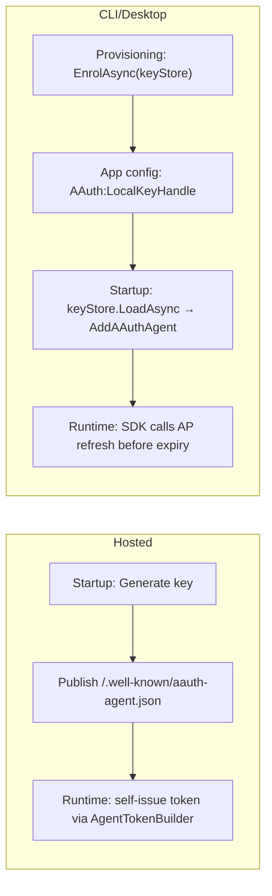

# Dependency Injection

Register AAuth services in ASP.NET Core and hosted applications using the built-in DI extensions.

## Key Principle

How your agent obtains its token depends on its deployment model:

- **Hosted services** (web apps, APIs, concierges with a stable URL): Self-issue agent tokens at runtime. Generate a key at startup, publish `/.well-known/aauth-agent.json`, and build tokens locally. No external AP needed.
- **CLI / desktop / mobile agents** (no stable URL): Enrol with an Agent Provider once (provisioning step), then refresh tokens from the AP at runtime.

In both cases, the agent token is short-lived (typically 1 hour) and refreshed automatically by the SDK. You never persist it.



See [Bootstrap & Enrollment](../workflows/bootstrap-enrollment.md) for the CLI/desktop provisioning step, or [Getting Started](../getting-started.md#self-issued-agent-tokens-hosted-services) for the self-issued path.

## Agent Registration (Outbound Requests)

### Pseudonymous (HWK) — Signing Only

No enrollment required. Generate or load a key and register:

```csharp
var key = AAuthKey.Generate(); // or load from persistent storage

builder.Services.AddAAuthAgent("signing-only", options =>
{
    options.Key = key;
    // No TokenRefresher set → the agent signs with HWK (pseudonymous) by default.
});
```

### Identity-Based (JWT) — Self-Issued (Hosted Services)

No AP enrollment needed. The service generates a key and self-issues tokens:

```csharp
var key = AAuthKey.Generate();
const string Kid = "svc-key-1";
var issuer = "https://my-service.example";

builder.Services.AddAAuthAgent("self-issued", options =>
{
    options.Key = key;
    options.PersonServer = "https://ps.example";
    options.TokenRefresher = SelfIssuedTokenRefresher.Create(key, issuer, "aauth:my-service@my-service.example")
        .WithKid(Kid)
        .WithPersonServer("https://ps.example")
        .Build();
});

// Also publish agent metadata so verifiers can discover the JWKS
app.MapAAuthAgentWellKnown(new AAuthAgentMetadataOptions
{
    Issuer = issuer,
    SigningKeys = new Dictionary<string, AAuthKey> { [Kid] = key },
});
```

### Identity-Based (JWT) — AP-Enrolled (CLI/Desktop Agents)

Load the key by local handle from the store and configure token refresh:

```csharp
var keyStore = FileKeyStore.Default();
var localKeyHandle = configuration["AAuth:LocalKeyHandle"]!;
var key = await keyStore.LoadAsync(localKeyHandle)
    ?? throw new InvalidOperationException($"Key '{localKeyHandle}' not found.");
var apRefreshEndpoint = configuration["AAuth:ApRefreshEndpoint"]!;

builder.Services.AddAAuthAgent("identity", options =>
{
    options.Key = key;
    options.PersonServer = "https://ps.example";
    options.TokenRefresher = AgentProviderTokenRefresher.Create(apRefreshEndpoint, localKeyHandle)
        .WithKeyStore(keyStore)
        .Build();
});
```

If your AP issues longer-lived tokens and you manage refresh externally, you can still configure the refresher accordingly:

```csharp
builder.Services.AddAAuthAgent("identity", options =>
{
    options.Key = key;
    options.PersonServer = "https://ps.example";
    options.TokenRefresher = AgentProviderTokenRefresher.Create(apRefreshEndpoint, localKeyHandle)
        .WithKeyStore(keyStore)
        .Build();
});
```

### With User Interaction (Deferred Consent)

When the Person Server requires user approval, provide interaction callbacks:

```csharp
builder.Services.AddAAuthAgent("interactive", options =>
{
    options.Key = key;
    options.PersonServer = "https://ps.example";
    options.TokenRefresher = AgentProviderTokenRefresher.Create(apRefreshEndpoint, localKeyHandle)
        .WithKeyStore(keyStore)
        .Build();
    // A resource returning 202 + requirement=interaction surfaces here.
    options.OnResourceInteraction = async (url, code, ct) =>
    {
        // Present URL and code to user
        logger.LogInformation("Approve at {Url} with code {Code}", url, code);
    };
    options.PollingTimeout = TimeSpan.FromMinutes(3);
});
```

### With Token Refresh

For long-lived agents, enable automatic token refresh before expiry:

```csharp
builder.Services.AddAAuthAgent("refreshing", options =>
{
    options.Key = key;
    options.PersonServer = "https://ps.example";
    options.TokenRefresher = AgentProviderTokenRefresher.Create("https://ap.example/refresh", localKeyHandle)
        .WithKeyStore(keyStore)
        .Build();
});
```

## Resource Registration (Inbound Verification)

### Verification Middleware

```csharp
builder.Services.AddAAuthResource(options =>
{
    options.Issuer = "https://my-resource.example";
    options.SigningKeys = new() { ["key-1"] = resourceKey };
});

var app = builder.Build();
app.UseAAuthVerification(); // HTTP sig + JWT issuer verification middleware
app.MapAAuthWellKnown();    // /.well-known/aauth-resource.json + /jwks.json
```

### With Scope Descriptions (Published in Metadata)

```csharp
builder.Services.AddAAuthResource(options =>
{
    options.Issuer = "https://my-resource.example";
    options.SigningKeys = new() { ["key-1"] = resourceKey };
    options.Name = "Supply Chain Service";
    options.ScopeDescriptions = new()
    {
        ["data:read"] = "Read supply chain data",
        ["data:write"] = "Modify supply chain records",
    };
});
```

### Custom Authorization Endpoint

Override the authorization endpoint for advanced scenarios (e.g., custom access server):

```csharp
builder.Services.AddAAuthResource(options =>
{
    options.Issuer = "https://my-resource.example";
    options.SigningKeys = new() { ["key-1"] = resourceKey };
    options.AuthorizationEndpoint = "https://as.example/authorize";
});
```

### Authentication & Authorization Policies

To map verification results into a `ClaimsPrincipal` and enforce per-endpoint
access, register the AAuth authentication scheme, the authorization handlers, and
any named scope/role policies:

```csharp
builder.Services.AddAAuthAuthentication();   // maps result → ClaimsPrincipal
builder.Services.AddAAuthAuthorization();    // scope handler + built-in policies

// Named convenience policies (apply with RequireAuthorization(...)):
builder.Services.AddAAuthScopePolicy("AAuth.Scope.data:read", "data:read");
builder.Services.AddAAuthRolePolicy("AAuth.Role.admin", "admin");
```

- `AddAAuthAuthorization()` registers the built-in `AAuth.Authenticated`,
  `AAuth.Identified`, and `AAuth.Authorized` policies plus `AAuthScopeHandler`.
- `AddAAuthScopePolicy(policyName, requiredScope)` registers a policy that requires
  an `AAuthLevel.Authorized` auth token carrying `requiredScope` — an agent-token-only
  (PoP) request cannot satisfy it.
- `AddAAuthRolePolicy(policyName, requiredRole)` registers a policy that requires an
  `AAuthLevel.Authorized` auth token plus `requiredRole` (mapped from the token's
  `roles` claim to the standard `ClaimTypes.Role`).

See [Authorization Policies](../server/authorization-policies.md) for details.

## Shared Discovery Services

Register shared `MetadataClient` and `JwksClient` singletons with custom cache settings:

```csharp
builder.Services.AddAAuthDiscovery(options =>
{
    options.MetadataCacheTtl = TimeSpan.FromMinutes(10);
    options.JwksCacheTtl = TimeSpan.FromHours(2);
});
```

Both `AddAAuthAgent` and `AddAAuthResource` register their own discovery clients if `AddAAuthDiscovery` has not been called. Call it explicitly to share instances and control cache behavior.

## Consuming Registered Clients

### Via IHttpClientFactory

```csharp
public class MyAgentService(IHttpClientFactory factory)
{
    private readonly HttpClient _client = factory.CreateClient("identity");

    public async Task<string> FetchDataAsync()
    {
        var response = await _client.GetAsync("https://resource.example/data");
        response.EnsureSuccessStatusCode();
        return await response.Content.ReadAsStringAsync();
    }
}
```

### Multiple Named Clients

Register different clients for different resources or signing modes:

```csharp
builder.Services.AddAAuthAgent("internal-api", options =>
{
    options.Key = key;
    options.PersonServer = "https://ps.internal";
    options.TokenRefresher = internalRefresher;
});

builder.Services.AddAAuthAgent("external-api", options =>
{
    options.Key = externalKey;
    options.PersonServer = "https://ps.partner.example";
    options.TokenRefresher = externalRefresher;
});
```

## Complete Example: Agent + Resource in One App

An app that verifies inbound AAuth requests AND makes signed outbound requests.
See `samples/Concierge` for a full working implementation with call chaining.

```csharp
var builder = WebApplication.CreateBuilder(args);

// Inbound: verify signatures on incoming requests
builder.Services.AddAAuthResource(options =>
{
    options.Issuer = "https://my-service.example";
    options.SigningKeys = new() { ["rs-1"] = resourceKey };
});

// Outbound: sign requests to downstream resources
builder.Services.AddAAuthAgent("downstream", options =>
{
    options.Key = agentKey;
    options.PersonServer = "https://ps.example";
    options.TokenRefresher = AgentProviderTokenRefresher.Create(apRefreshEndpoint, localKeyHandle)
        .WithKeyStore(keyStore)
        .Build();
});

var app = builder.Build();
app.UseAAuthVerification();
app.MapAAuthWellKnown();

app.MapGet("/data", async (HttpContext ctx, IHttpClientFactory factory) =>
{
    // Inbound request was verified by middleware
    var parsed = ctx.GetAAuthParsedKey()!;

    // Make signed outbound request
    var client = factory.CreateClient("downstream");
    var downstream = await client.GetStringAsync("https://other-resource.example/api");

    return Results.Ok(new { agent = parsed.Payload?["sub"]?.ToString(), downstream });
});

app.Run();
```

## Options Reference

### AAuthAgentOptions

| Property | Type | Default | Description |
|----------|------|---------|-------------|
| `Key` | `IAAuthKey` | required | Agent signing key (must have private component) |
| `PersonServer` | `string?` | `null` | PS URL; with `TokenRefresher`, enables 401 challenge handling |
| `OnInteractionRequired` | `Func<Interaction, CancellationToken, Task>?` | `null` | PS interaction during token exchange (deferred consent) |
| `OnResourceInteraction` | `Func<string, string, CancellationToken, Task>?` | `null` | Resource `202` + `requirement=interaction` (URL + code) |
| `OnApprovalPending` | `Func<CancellationToken, Task>?` | `null` | Resource `202` + `requirement=approval` |
| `TokenRefresher` | `ITokenRefresher?` | `null` | Auto-refresh before token expiry (JWT identity); omit for HWK signing |
| `PollingTimeout` | `TimeSpan` | 5 minutes | Max deferred polling time |
| `EnableResourceManagedAccess` | `bool` | `false` | Capture + replay the opaque `AAuth-Access` token (resource-managed, two-party) |
| `AAuthAccessStore` | `IAAuthAccessStore?` | `null` | Per-origin token store for the resource-managed flow (default in-memory) |

### AAuthResourceOptions

| Property | Type | Default | Description |
|----------|------|---------|-------------|
| `Issuer` | `string` | required | Resource HTTPS URL (metadata + audience) |
| `SigningKeys` | `Dictionary<string, AAuthKey>` | empty | Keys for signing resource tokens |
| `Name` | `string?` | `null` | Human-readable name in metadata (`name`) |
| `ScopeDescriptions` | `Dictionary<string, string>?` | `null` | Scope descriptions in metadata |
| `SignatureWindow` | `int?` | `null` | Advertised signature validity (seconds) |
| `AuthorizationEndpoint` | `string?` | `null` | AS authorization URL |
| `RevocationEndpoint` | `string?` | `null` | Revocation endpoint URL |
| `EnableResourceManagedAccess` | `bool` | `false` | Register a default `IOpaqueTokenStore` for the resource-managed (two-party) flow |

### AAuthDiscoveryOptions

| Property | Type | Default | Description |
|----------|------|---------|-------------|
| `MetadataCacheTtl` | `TimeSpan` | 5 min | How long to cache well-known metadata |
| `JwksCacheTtl` | `TimeSpan` | 1 hour | How long to cache JWKS documents |

## Call Chaining (AAuthClientBuilder)

For intermediary services that act as both resource and agent, `AAuthClientBuilder` provides call-chaining methods:

```csharp
// From HttpContext (reads UpstreamAuthTokenFeature set by middleware)
var client = new AAuthClientBuilder(key)
    .UseJwt(() => tokenHolder.Token)
    .WithTokenRefresh(refresher)
    .WithCallChaining(httpContext)
    .Build();

// From a raw upstream token string
var client = new AAuthClientBuilder(key)
    .UseJwt(() => tokenHolder.Token)
    .WithTokenRefresh(refresher)
    .WithCallChaining(upstreamAuthToken)
    .Build();

// From a dynamic provider
var client = new AAuthClientBuilder(key)
    .UseJwt(() => tokenHolder.Token)
    .WithTokenRefresh(refresher)
    .WithCallChaining(() => GetUpstreamToken())
    .Build();
```

`WithCallChaining` automatically:
- Routes downstream exchanges to the correct PS/AS via `CallChainingRouter`
- Passes `upstream_token` in exchange POST body
- Inserts `MissionForwardingHandler` to propagate `AAuth-Mission` headers
- Handles the full 401 → exchange → retry cycle

## Governance

### Agent side: the governance client

The mission governance client is built from `AAuthClientBuilder`, which wires the
signed channel for you. The client is **bound to one Person Server**, so the builder
must set both a signing mode and a Person Server before `BuildGovernance()`. Use the
`AddAAuthGovernanceClient(...)` DI extension to register it as a singleton:

```csharp
builder.Services.AddAAuthGovernanceClient(sp =>
    new AAuthClientBuilder(agentKey)
        .UseJwt(agentToken)
        .WithPersonServer("https://ps.example")); // bound governance client
```

There is also a factory overload — `AddAAuthGovernanceClient(sp => /* AAuthGovernanceClient */)`
— when you need full control over construction. To build one inline instead of via
DI, call `BuildGovernance()` on a configured builder:

```csharp
var governance = new AAuthClientBuilder(agentKey)
    .UseJwt(agentToken)
    .WithPersonServer("https://ps.example")
    .BuildGovernance(); // AAuthGovernanceClient
```

`BuildGovernance()` requires an explicit signing mode **and** a configured Person
Server (`WithPersonServer`), and throws `InvalidOperationException` otherwise. See
[Mission Governance Clients](../advanced/mission-governance-clients.md).

### Person Server side: the governance seams

`AddAAuthGovernance()` registers the in-memory mission storage seams as
singletons. It uses `TryAdd`, so register durable implementations first to
override them. The policy and user-channel seams (`IPermissionDecider`,
`IAuditSink`, `IInteractionRelay`) default to conservative no-op implementations;
a real PS overrides them.

```csharp
builder.Services.AddAAuthGovernance(); // InMemoryMissionStore + InMemoryMissionLog

builder.Services.AddSingleton<IPermissionDecider, MyPermissionDecider>();
builder.Services.AddSingleton<IAuditSink, MyAuditSink>();
builder.Services.AddSingleton<IInteractionRelay, MyInteractionRelay>();
```

The user channel can also be supplied as a lambda instead of a full class, via
`AddAAuthInteractionRelay(...)` (backed by `DelegateInteractionRelay`). It removes
any previously registered relay (including the no-op default) and registers the
delegate-backed one:

```csharp
builder.Services.AddAAuthInteractionRelay((request, ct) =>
    Task.FromResult(new InteractionRelayResult { Accepted = true }));
```

See [Mission Governance (Server)](../server/mission-governance.md) for the seams
and the decision model.

### Person Server side: the token-issuance seams

The one-call PS issuer `MapAAuthPersonServer` resolves two seams from DI — the
identity/consent decision (`IIdentityClaimsAsserter`) and the deferred-consent
park store (`IPersonPendingStore`):

```csharp
builder.Services.AddSingleton<IIdentityClaimsAsserter>(
    new DefaultIdentityClaimsAsserter("user-42"));     // swap in a real asserter
builder.Services.AddSingleton<IPersonPendingStore, InMemoryPersonPendingStore>();

var app = builder.Build();
app.MapAAuthPersonServer(new AAuthPersonServerOptions
{
    Issuer               = psIssuer,
    SigningKeys          = new Dictionary<string, AAuthKey> { [PsKid] = psKey },
    TrustedAccessServers = trustedAccessServers,        // omit ⇒ three-party only
});
```

When the resource token carries a `mission` claim, the helper also resolves the
`IMissionStore` / `IMissionLog` primitives registered by `AddAAuthGovernance()`.
See [Token Issuance → One-Call Person Server](../server/token-issuance.md#one-call-person-server-mapaauthpersonserver).

