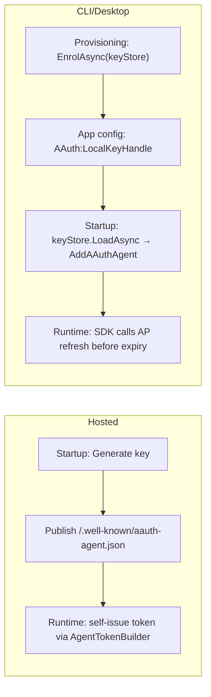

# Dependency Injection

Register AAuth services in ASP.NET Core and hosted applications using the built-in DI extensions.

## Key Principle

How your agent obtains its token depends on its deployment model:

- **Hosted services** (web apps, APIs, concierges with a stable URL): Self-issue agent tokens at runtime. Generate a key at startup, publish `/.well-known/aauth-agent.json`, and build tokens locally. No external AP needed.
- **CLI / desktop / mobile agents** (no stable URL): Enrol with an Agent Provider once (provisioning step), then refresh tokens from the AP at runtime.

In both cases, the agent token is short-lived (typically 1 hour) and refreshed automatically by the SDK. You never persist it.


```mermaid
flowchart LR
    subgraph Hosted
        H1["Startup: Generate key"] --> H2["Publish /.well-known/aauth-agent.json"]
        H2 --> H3["Runtime: self-issue token via AgentTokenBuilder"]
    end
    subgraph CLI/Desktop
        P["Provisioning: EnrolAsync(keyStore)"] --> C["App config: AAuth:LocalKeyHandle"]
        C --> S["Startup: keyStore.LoadAsync → AddAAuthAgent"]
        S --> R["Runtime: SDK calls AP refresh before expiry"]
    end
```

See [Bootstrap & Enrollment](../workflows/bootstrap-enrollment.md) for the CLI/desktop provisioning step, or [Getting Started](../getting-started.md#self-issued-agent-tokens-hosted-services) for the self-issued path.

## Agent Registration (Outbound Requests)

### Pseudonymous (HWK) — Signing Only

No enrollment required. Generate or load a key and register:

```csharp
var key = AAuthKey.Generate(); // or load from persistent storage

builder.Services.AddAAuthAgent("signing-only", options =>
{
    options.Key = key;
    options.SignatureKeyProvider = new HwkSignatureKeyProvider(key);
});
```

### Identity-Based (JWT) — Self-Issued (Hosted Services)

No AP enrollment needed. The service generates a key and self-issues tokens:

```csharp
var key = AAuthKey.Generate();
const string Kid = "svc-key-1";
var issuer = "https://my-service.example";

builder.Services.AddAAuthAgent("self-issued", options =>
{
    options.Key = key;
    options.PersonServer = "https://ps.example";
    options.TokenRefresher = SelfIssuedTokenRefresher.Create(key, issuer, "aauth:my-service@my-service.example")
        .WithKid(Kid)
        .WithPersonServer("https://ps.example")
        .Build();
});

// Also publish agent metadata so verifiers can discover the JWKS
app.MapAAuthAgentWellKnown(options =>
{
    options.Issuer = issuer;
    options.SigningKeys = new AAuthSigningKeySet(Kid, key);
});
```

### Identity-Based (JWT) — AP-Enrolled (CLI/Desktop Agents)

Load the key by local handle from the store and configure token refresh:

```csharp
IKeyStore keyStore = FileKeyStore.Default();
var localKeyHandle = configuration["AAuth:LocalKeyHandle"]!;
var key = await keyStore.LoadAsync(localKeyHandle)
    ?? throw new InvalidOperationException($"Key '{localKeyHandle}' not found.");
var apRefreshEndpoint = configuration["AAuth:ApRefreshEndpoint"]!;

builder.Services.AddHttpClient("identity")
    .ConfigurePrimaryHttpMessageHandler(() => AAuthClientBuilder.Enrolled(key)
        .RefreshingFrom(apRefreshEndpoint, localKeyHandle)
        .WithKeyStore(keyStore)
        .WithChallengeHandling("https://ps.example")
        .BuildHandler());
```

The factory owns each pipeline and its internally created refresh transport.
For an already-held token with externally managed renewal, use the explicit
options API:

```csharp
builder.Services.AddAAuthAgent("identity", options =>
{
    options.Key = key;
    options.PersonServer = "https://ps.example";
    options.AgentToken = heldAgentToken;
});
```

### With User Interaction (Deferred Consent)

When the Person Server requires user approval, provide interaction callbacks:

```csharp
using var refresher = AgentProviderTokenRefresher.Create(apRefreshEndpoint, localKeyHandle)
    .WithKeyStore(keyStore).Build();
builder.Services.AddAAuthAgent("interactive", options =>
{
    options.Key = key;
    options.PersonServer = "https://ps.example";
    options.TokenRefresher = refresher;
    // A resource returning 202 + requirement=interaction surfaces here.
    options.OnResourceInteraction = async (url, code, ct) =>
    {
        // Present URL and code to user
        logger.LogInformation("Approve at {Url} with code {Code}", url, code);
    };
    options.PollingTimeout = TimeSpan.FromMinutes(3);
});
```

### With Token Refresh

For long-lived agents, enable automatic token refresh before expiry:

```csharp
using var refresher = AgentProviderTokenRefresher.Create("https://ap.example/refresh", localKeyHandle)
    .WithKeyStore(keyStore).Build();
builder.Services.AddAAuthAgent("refreshing", options =>
{
    options.Key = key;
    options.PersonServer = "https://ps.example";
    options.TokenRefresher = refresher;
});
```

## Resource Registration (Inbound Verification)

### Resource Pipeline

```csharp
builder.Services.AddAAuthResource(options =>
{
    options.Issuer = "https://my-resource.example";
    options.SigningKeys["key-1"] = resourceKey;
});
builder.Services.AddAAuthAuthentication();
builder.Services.AddAAuthAuthorization();

var app = builder.Build();
app.MapAAuthWellKnown(); // /.well-known/aauth-resource.json + /jwks.json
app.UseRouting();
app.UseAAuth(o => o.Trust.AuthTokenIssuers.Allowed = new HashSet<string> { "https://ps.example" });
app.UseAuthentication();
app.UseAuthorization();

// Each protected endpoint declares what it needs:
app.MapGet("/data", (HttpContext ctx) => Results.Ok(ctx.GetAAuthVerification()!.Scopes))
    .RequireAAuth(scope: "data:read");
```

> `Trust.AuthTokenIssuers` is optional. Leave it unset (or assign `AAuthTrust.Any` to its
> `Predicate`) to accept any *verifiable* Person Server — the spec default — with claims
> namespaced by `iss`; set `Allowed` or `Predicate` to
> restrict. Leaving it unset while issuer verification is on logs an open-trust
> `Warning` at startup.

### With Scope Descriptions (Published in Metadata)

```csharp
builder.Services.AddAAuthResource(options =>
{
    options.Issuer = "https://my-resource.example";
    options.SigningKeys = new() { ["key-1"] = resourceKey };
    options.Name = "Supply Chain Service";
    options.ScopeDescriptions = new()
    {
        ["data:read"] = "Read supply chain data",
        ["data:write"] = "Modify supply chain records",
    };
});
```

### Custom Authorization Endpoint

Advertise the resource's proactive authorization endpoint for agents to start
authorization without first receiving a resource challenge. This does not select
an Access Server: configure `AccessServer` on the challenge options to
set the resource token's AS recipient (unset means the presented token's PS).

```csharp
builder.Services.AddAAuthResource(options =>
{
    options.Issuer = "https://my-resource.example";
    options.SigningKeys = new() { ["key-1"] = resourceKey };
    options.AuthorizationEndpoint = "https://my-resource.example/authorize";
});
```

### Authentication & Authorization Policies

To map verification results into a `ClaimsPrincipal` and enforce per-endpoint
access, register the AAuth authentication scheme and the authorization handlers,
then declare each endpoint's requirement inline:

```csharp
builder.Services.AddAAuthAuthentication();   // maps result → ClaimsPrincipal
builder.Services.AddAAuthAuthorization();    // scope handler + built-in policies

var app = builder.Build();
app.UseRouting();
app.UseAAuth(o => o.Trust.AuthTokenIssuers.Allowed = new HashSet<string> { "https://ps.example" });
app.UseAuthentication();
app.UseAuthorization();

// Per-route scope/role lives on the endpoint:
app.MapGet("/data", handler).RequireAAuth(scope: "data:read");
app.MapGet("/admin", handler).RequireAAuth(scope: "data:read", role: "admin");
app.MapGet("/me", handler).RequireAAuthSignature(identified: true); // agent identity, no token
```

- `AddAAuthAuthorization()` registers the built-in `AAuth.Authenticated`,
  `AAuth.Identified`, and `AAuth.Authorized` policies plus `AAuthScopeHandler`.
- `.RequireAAuth(scope: "x")` requires an `AAuthLevel.Authorized` auth token carrying
  `x` — an agent-token-only (PoP) request cannot satisfy it. Add `role: "y"` to also
  require a role (mapped from the token's `roles` claim to the standard `ClaimTypes.Role`).
- `.RequireAAuthSignature()` requires only a verified HTTP signature (identity-based or
  resource-managed access); pass `identified: true` to require at least an agent token.

See [Authorization Policies](../server/authorization-policies.md) for details.

## Shared Discovery Services

Register shared `MetadataClient` and `JwksClient` singletons with custom cache settings:

```csharp
builder.Services.AddAAuthDiscovery(options =>
{
    options.MetadataCacheTtl = TimeSpan.FromMinutes(10);
    options.JwksCacheTtl = TimeSpan.FromHours(2);
});
```

Both `AddAAuthAgent` and `AddAAuthResource` register their own discovery clients if `AddAAuthDiscovery` has not been called. Call it explicitly to share instances and control cache behavior.

## Consuming Registered Clients

### Via IHttpClientFactory

```csharp
public class MyAgentService(IHttpClientFactory factory)
{
    private readonly HttpClient _client = factory.CreateClient("identity");

    public async Task<string> FetchDataAsync()
    {
        var response = await _client.GetAsync("https://resource.example/data");
        response.EnsureSuccessStatusCode();
        return await response.Content.ReadAsStringAsync();
    }
}
```

### Multiple Named Clients

Register different clients for different resources or signing modes:

```csharp
builder.Services.AddAAuthAgent("internal-api", options =>
{
    options.Key = key;
    options.PersonServer = "https://ps.internal";
    options.TokenRefresher = internalRefresher;
});

builder.Services.AddAAuthAgent("external-api", options =>
{
    options.Key = externalKey;
    options.PersonServer = "https://ps.partner.example";
    options.TokenRefresher = externalRefresher;
});
```

## Complete Example: Agent + Resource in One App

An app that verifies inbound AAuth requests AND makes signed outbound requests.
See `samples/Concierge` for a full working implementation with call chaining.

```csharp
var builder = WebApplication.CreateBuilder(args);

// Inbound: verify signatures on incoming requests
builder.Services.AddAAuthResource(options =>
{
    options.Issuer = "https://my-service.example";
    options.SigningKeys["rs-1"] = resourceKey;
});
builder.Services.AddAAuthAuthentication();
builder.Services.AddAAuthAuthorization();

// Outbound: sign requests to downstream resources
using var refresher = AgentProviderTokenRefresher.Create(apRefreshEndpoint, localKeyHandle)
    .WithKeyStore(keyStore).Build();
builder.Services.AddAAuthAgent("downstream", options =>
{
    options.Key = agentKey;
    options.PersonServer = "https://ps.example";
    options.TokenRefresher = refresher;
});

var app = builder.Build();
app.MapAAuthWellKnown();
app.UseRouting();
app.UseAAuth();
app.UseAuthentication();
app.UseAuthorization();

app.MapGet("/data", async (HttpContext ctx, IHttpClientFactory factory) =>
{
    // Inbound request was verified by the AAuth pipeline
    var parsed = ctx.GetAAuthParsedKey()!;

    // Make signed outbound request
    var client = factory.CreateClient("downstream");
    var downstream = await client.GetStringAsync("https://other-resource.example/api");

    return Results.Ok(new { agent = parsed.Payload?["sub"]?.ToString(), downstream });
}).RequireAAuthSignature(identified: true);

app.Run();
```

## Options Reference

### AAuthAgentOptions

`AddAAuthAgent` requires an agent token/refresher or an explicit generic provider.
Keep an injected disposable refresher alive until all borrowing clients stop;
the `using` examples belong to the enclosing host lifetime, not a short-lived
registration helper. Prefer the enrolled `BuildHandler` factory above for owned
refresh transport. Keys and stores remain caller-owned.

| Property | Type | Default | Description |
|----------|------|---------|-------------|
| `Key` | `IAAuthSigner` | required | Agent signing key (must have private component) |
| `AgentToken` | `string?` | `null` | Already-held agent JWT; no implicit provisioning |
| `SignatureKeyProvider` | `ISignatureKeyProvider?` | `null` | Explicit generic signing; incompatible with agent credentials or PS/resource-managed flows |
| `PersonServer` | `string?` | `null` | PS URL; with `TokenRefresher`, enables 401 challenge handling |
| `OnInteractionRequired` | `Func<Interaction, CancellationToken, Task>?` | `null` | PS interaction during token exchange (deferred consent) |
| `OnResourceInteraction` | `Func<string, string, CancellationToken, Task>?` | `null` | Resource `202` + `requirement=interaction` (URL + code) |
| `OnApprovalPending` | `Func<CancellationToken, Task>?` | `null` | Resource `202` + `requirement=approval` |
| `TokenRefresher` | `ITokenRefresher?` | `null` | Caller-owned source of refreshed agent JWTs; omission never selects HWK implicitly |
| `PollingTimeout` | `TimeSpan` | 5 minutes | Max deferred polling time |
| `EnableResourceManagedAccess` | `bool` | `false` | Capture + replay the opaque `AAuth-Access` token (resource-managed, two-party) |
| `AAuthAccessStore` | `IAAuthAccessStore?` | `null` | Per-origin token store for the resource-managed flow (default in-memory) |

### AAuthResourceOptions

`AddAAuthResource` registers inbound verification and resource-token issuance.
It requires the resource issuer but does not require agent credentials.
Signing keys are required when issuing resource tokens or making signed calls;
a verification-only resource can leave `SigningKeys` empty. It also registers a
`TokenVerifier` (with the resource's `EgressPolicy` and `TimeProvider`) and
`IOptions<AAuthResourceOptions>`; the `AddAAuthResource(IConfiguration, …)`
overload binds from a section such as `AAuth:Resource`.

| Property | Type | Default | Description |
|----------|------|---------|-------------|
| `Issuer` | `string` | required | Resource HTTPS URL (metadata + audience) |
| `SigningKeys` | `AAuthSigningKeySet` | empty | Keys published at the JWKS; resource tokens are signed with the active key |
| `KeyHandle` | `string?` | `null` | Handle in the registered `IKeyStore` to load the signing key from when `SigningKeys` is empty |
| `KeyId` | `string?` | `null` | `kid` for the key loaded from `KeyHandle` (default: its JWK thumbprint) |
| `Name` | `string?` | `null` | Human-readable name in metadata (`name`) |
| `ScopeDescriptions` | `Dictionary<string, string>?` | `null` | Scope descriptions in metadata |
| `SignatureWindow` | `int?` | `null` | Advertised signature validity (seconds) |
| `AuthorizationEndpoint` | `string?` | `null` | Resource's proactive authorization endpoint URL; not the PS/AS resource-token recipient (draft-11 removed `PersonServerAudience`; the recipient is `AccessServer` or the presented token's PS) |
| `RevocationEndpoint` | `string?` | `null` | Revocation endpoint URL |
| `EnableResourceManagedAccess` | `bool` | `false` | Register a default `IOpaqueTokenStore` for the resource-managed (two-party) flow |

### AAuthDiscoveryOptions

| Property | Type | Default | Description |
|----------|------|---------|-------------|
| `MetadataCacheTtl` | `TimeSpan` | 5 min | How long to cache well-known metadata |
| `JwksCacheTtl` | `TimeSpan` | 1 hour | How long to cache JWKS documents |

## Call Chaining (AAuthClientBuilder)

For intermediary services that act as both resource and agent, `AAuthClientBuilder` provides call-chaining methods:

```csharp
// From HttpContext (reads UpstreamAuthTokenFeature set by middleware)
using var contextClient = new AAuthClientBuilder(key)
    .UseJwt(() => tokenHolder.Current)
    .WithTokenRefresh(refresher)
    .WithCallChaining(httpContext)
    .Build();

// From a raw upstream token string
using var fixedUpstreamClient = new AAuthClientBuilder(key)
    .UseJwt(() => tokenHolder.Current)
    .WithTokenRefresh(refresher)
    .WithCallChaining(upstreamAuthToken)
    .Build();

// From a dynamic provider
using var dynamicUpstreamClient = new AAuthClientBuilder(key)
    .UseJwt(() => tokenHolder.Current)
    .WithTokenRefresh(refresher)
    .WithCallChaining(() => GetUpstreamToken())
    .Build();
```

`WithCallChaining` automatically:
- Routes downstream token requests to the PS the upstream token names via `CallChainingRouter`
- Passes `upstream_token` on the downstream person token and auth token requests
- Inserts `MissionForwardingHandler` to attach the upstream token to downstream requests
  (the PS carries its `mission_s256` forward)
- Handles the person-token and auth-token challenges and retries

## Governance

### Agent side: the governance client

The mission governance client is built from `AAuthClientBuilder`, which wires the
signed channel for you. The client is **bound to one Person Server**, so the builder
must set both a signing mode and a Person Server before `BuildGovernance()`. Use the
`AddAAuthGovernanceClient(...)` DI extension to register it as a singleton:

```csharp
builder.Services.AddAAuthGovernanceClient(sp =>
    new AAuthClientBuilder(agentKey)
        .UseJwt(agentToken)
        .WithPersonServer("https://ps.example")); // bound governance client
```

There is also a factory overload — `AddAAuthGovernanceClient(sp => /* AAuthGovernanceClient */)`
— when you need full control over construction. To build one inline instead of via
DI, call `BuildGovernance()` on a configured builder:

```csharp
using var governance = new AAuthClientBuilder(agentKey)
    .UseJwt(agentToken)
    .WithPersonServer("https://ps.example")
    .BuildGovernance(); // AAuthGovernanceClient
```

`BuildGovernance()` requires a token/signing configuration and an explicit Person
Server (`WithPersonServer`). It also supports `SelfIssuing` and `Enrolled`:
the returned facade owns its signed/discovery clients and must be disposed.
Constructor/`Create` callers retain ownership of injected clients. See
[Mission Governance Clients](../advanced/mission-governance-clients.md).

### Person Server side: the governance seams

`AddAAuthGovernance()` registers the in-memory mission storage seams as
singletons. It uses `TryAdd`, so register durable implementations first to
override them. The policy and user-channel seams (`IPermissionDecider`,
`IAuditSink`, `IInteractionRelay`) default to conservative no-op implementations;
a real PS overrides them.

```csharp
builder.Services.AddAAuthGovernance(); // InMemoryMissionStore + InMemoryMissionLog

builder.Services.AddSingleton<IPermissionDecider>(permissionDecider);
builder.Services.AddSingleton<IAuditSink>(missionAuditSink);
builder.Services.AddSingleton<IInteractionRelay>(interactionRelay);
```

The user channel can also be supplied as a lambda instead of a full class, via
`AddAAuthInteractionRelay(...)` (backed by `DelegateInteractionRelay`). It removes
any previously registered relay (including the no-op default) and registers the
delegate-backed one:

```csharp
builder.Services.AddAAuthInteractionRelay((request, ct) =>
    Task.FromResult(new InteractionRelayResult { Accepted = true }));
```

See [Mission Governance (Server)](../server/mission-governance.md) for the seams
and the decision model.

A Person Server registered with `AddAAuthPersonServer` can call `.WithGovernance()`
on its builder instead; it calls `AddAAuthGovernance()` for you. See
[Person Server and Access Server Registration](#person-server-and-access-server-registration).

## Person Server and Access Server Registration

Register a Person Server (PS) or Access Server (AS) in DI, then map it by name.
`AddAAuthPersonServer` / `AddAAuthAccessServer` return a builder for the role's
seams; `MapAAuthPersonServer()` / `MapAAuthAccessServer()` map the endpoints.
The default instance names are `AAuthPersonServerBuilder.DefaultName`
(`"PersonServer"`) and `AAuthAccessServerBuilder.DefaultName` (`"AccessServer"`).

```csharp
builder.Services.AddAAuthPersonServer(configure: options =>
    {
        options.Issuer       = psIssuer;
        options.SigningKeys  = new AAuthSigningKeySet(PsKid, psKey);
        options.DefaultScope = "calendar.read";
        options.MissionPath  = "/mission"; // advertised as {Issuer}/mission
    })
    // Unset ⇒ federate to verified aud; empty ⇒ three-party only.
    .WithTrust(trust => trust.AccessServers.Allowed = trustedAccessServers)
    .UseClaimsAsserter(new DefaultIdentityClaimsAsserter("user-42")) // swap in a real asserter
    .WithFederation()  // PS→AS four-party client, signed as this PS
    .WithGovernance(); // mission store/log and governance seams (AddAAuthGovernance)

var app = builder.Build();
app.MapAAuthPersonServer();
```

An Access Server has no default access policy, so it needs `UsePolicy` or an
`IAccessPolicy` registered in DI:

```csharp
builder.Services.AddAAuthAccessServer(configure: options =>
    {
        options.Issuer      = asIssuer;
        options.SigningKeys = new AAuthSigningKeySet(AsKid, asKey);
    })
    .WithTrust(trust => trust.PersonServers.Allowed = trustedPersonServers)
    .UsePolicy(accessPolicy);

var app = builder.Build();
app.MapAAuthAccessServer();
```

### Builder helpers

| Helper | Person Server | Access Server |
|--------|:-------------:|:-------------:|
| `Configure(options => …)` | ✓ | ✓ |
| `WithTrust(trust => …)`: configures `options.Trust` | ✓ | ✓ |
| `UsePendingStore<T>()` / `(instance)` / `(sp => …)` | ✓ | ✓ |
| `UseTokenVerifier(verifier)` | ✓ | ✓ |
| `UseTokenInventory<T>()` / `(instance)`: the issuer's `IJtiStore` | ✓ | ✓ |
| `UseClaimsAsserter<T>()` / `(instance)` / `(sp => …)` | ✓ | — |
| `WithFederation()`: the PS→AS `AccessServerClient` | ✓ | — |
| `WithGovernance()`: calls `AddAAuthGovernance()` | ✓ | — |
| `UsePolicy<T>()` / `(instance)` / `(sp => …)`: required | — | ✓ |

`WithFederation()` signs PS→AS token requests as the PS (`jwks_uri` scheme,
active key) through the named `AAuthPersonServerBuilder.FederationHttpClientName`
(`"aauth-federation"`) client. Tests can redirect that client in process with
`AddHttpClient(AAuthPersonServerBuilder.FederationHttpClientName)` plus
`AAuthFederationOptions.TransportContract`.

### Seam precedence

Each seam is a keyed singleton under the instance name. It resolves in this order:

1. The builder's `Use*` helper.
2. An unkeyed DI registration of the same service type, such as
   `services.AddSingleton<IPersonPendingStore>(…)`.
3. The SDK default.

| Seam | Default |
|------|---------|
| `IPersonPendingStore` | `InMemoryPersonPendingStore` |
| `IIdentityClaimsAsserter` | `DefaultIdentityClaimsAsserter` |
| `IAccessPendingStore` | `InMemoryAccessPendingStore` |
| `IAccessPolicy` | none: startup fails without one |
| `TokenVerifier` | A verifier with the role's `EgressPolicy` and `TimeProvider` |
| `IJtiStore` (token inventory) | `InMemoryJtiStore` |

`AddAAuthPersonServer` also registers `AddAAuthDiscovery()` and in-memory
`IMissionStore` / `IMissionLog` defaults (`TryAdd`). To use a seam in your own
endpoints, resolve it by instance name:

```csharp
var pending = app.Services.GetRequiredKeyedService<IPersonPendingStore>(AAuthPersonServerBuilder.DefaultName);

app.MapGet("/admin/pending/{id}", (string id,
    [FromKeyedServices(AAuthPersonServerBuilder.DefaultName)] IPersonPendingStore store) =>
    store.Get(id) is { } entry ? Results.Ok(entry.Status.ToString()) : Results.NotFound());
```

Outside the `Development` environment, mapping a role that still uses an
in-memory default (a pending store, the token inventory, or the mission store or
log) logs a warning. That state is lost on restart and isn't shared across
instances, so register durable implementations in production.

### Startup validation

The role options are validated at startup instead of through `required` members.
A bad configuration fails `app.StartAsync()` with an `OptionsValidationException`.
`MapAAuthPersonServer()` / `MapAAuthAccessServer()` fail the same way because they
read the options. The exception joins every failure with `"; "`:

- `Issuer` must be an absolute https URL (loopback http is allowed for development).
- The role needs a signing key: add one to `SigningKeys` or set `KeyHandle`.
- `InteractionPath` (PS) / `InteractionLoginPath` (AS) must not contain a query or fragment.
- Each `Trust.AccessServers` (PS) / `Trust.PersonServers` (AS) `Allowed` entry must be an absolute https URL.
- An Access Server must resolve an `IAccessPolicy`.

### Binding from configuration

Each role has an `IConfiguration` overload. The conventional sections are
`AAuth:PersonServer`, `AAuth:AccessServer` and `AAuth:Resource`, exposed as the
`ConfigurationSection` constant on each extension class. The optional
`configure` callback runs after binding:

```csharp
builder.Services.AddSingleton<IKeyStore>(FileKeyStore.Default());
builder.Services.AddAAuthPersonServer(
    builder.Configuration.GetSection(AAuthPersonServerServiceCollectionExtensions.ConfigurationSection));
builder.Services.AddAAuthResource(
    builder.Configuration.GetSection(AAuthResourceServiceCollectionExtensions.ConfigurationSection),
    options => options.Name = "Calendar");
```

```json
{
  "AAuth": {
    "PersonServer": {
      "Issuer": "https://ps.example",
      "KeyHandle": "ps-signing-key",
      "KeyId": "ps-1",
      "MissionPath": "/mission",
      "Trust": { "AccessServers": { "Allowed": [ "https://as.example" ] } }
    }
  }
}
```

When `SigningKeys` is empty, `KeyHandle` loads the signing key from the
registered `IKeyStore`. The key is published under `KeyId`, or under its JWK
thumbprint when `KeyId` is unset. `AAuthResourceOptions` has the same `KeyHandle`
/ `KeyId` pair.

### Co-hosting several roles or instances

By default a mapped role serves every request that reaches the app. When several
roles or instances share one host, set `MatchIssuerHost = true` on each. Each
instance then serves only requests whose `Host` matches its issuer's authority:

```csharp
builder.Services.AddAAuthPersonServer("tenant-a", options =>
{
    options.Issuer          = "https://ps-a.example";
    options.SigningKeys     = new AAuthSigningKeySet("ps-a", psKey);
    options.MatchIssuerHost = true;
});
builder.Services.AddAAuthPersonServer("tenant-b", options =>
{
    options.Issuer          = "https://ps-b.example";
    options.SigningKeys     = new AAuthSigningKeySet("ps-b", psSigningKey);
    options.MatchIssuerHost = true;
}).UseClaimsAsserter(identityAsserter);

var app = builder.Build();
app.MapAAuthPersonServer("tenant-a");
app.MapAAuthPersonServer("tenant-b");
```

### The server identity

Each instance registers an `AAuth.Server.IAAuthServerIdentity` keyed by its name.
It holds the `Issuer`, the well-known document name (`Dwk`), the `SigningKeys`
and the `EgressPolicy`. `Url(path)` builds an absolute URL on the server.
`CreateSignedClient()` returns an `HttpClient` that signs as the server
(`jwks_uri` scheme, active key) without exposing the key:

```csharp
var ps = app.Services.GetRequiredKeyedService<IAAuthServerIdentity>(AAuthPersonServerBuilder.DefaultName);
var consentUrl = ps.Url("/interaction"); // {Issuer}/interaction
using var signedAsPs = ps.CreateSignedClient();
var ownTokens = tokenVerifier.WithLocalIssuer(ps.Issuer, ps.SigningKeys);
```

To route the signed client through a custom transport, pass the inner handler
and its `AAuthTransportContract` together:
`CreateSignedClient(innerHandler, AAuthTransportContract.InProcessOnly)`.

See [Token Issuance → One-Call Person Server](../server/token-issuance.md#one-call-person-server-mapaauthpersonserver)
and [Federated Access](../workflows/federated-access.md#access-server-side-code).

