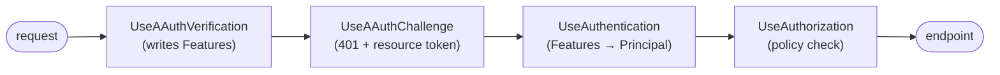

# Authentication and Authorization

How the AAuth SDK turns a verified request into an ASP.NET Core `ClaimsPrincipal`
and enforces access, plus how to wire it up in both hosting styles — minimal APIs
and classic MVC controllers.

This page ties together two adjacent topics:

- [Verification Middleware](verification-middleware.md) — proof-of-possession and
  token verification (the authN *input*).
- [Authorization Policies](authorization-policies.md) — scope, role, and level
  policies (the authZ *rules*).

## Pipeline at a glance

AAuth runs as three ordered layers. The order matters: each layer consumes what
the previous one produced.

1. **Verification** (`UseAAuthVerification`) — verifies the HTTP signature
   (RFC 9421) and, for three-party flows, the auth token against the issuer's
   JWKS. It writes an `AAuthVerificationResult` to `HttpContext.Features`.
2. **Challenge** (`UseAAuthChallenge`, three-party endpoints only) — when only an
   agent token is presented, returns a `401` with a resource token requesting the
   endpoint's scope.
3. **Authentication + authorization** (`UseAuthentication` / `UseAuthorization`) —
   `AAuthAuthenticationHandler` maps the verification result to a
   `ClaimsPrincipal`; scope/role/level policies then decide access per endpoint.



> **Well-known endpoints come first.** Map `MapAAuthResourceWellKnown(...)`
> *before* `UseAAuthVerification` so the metadata document and JWKS stay reachable
> without an AAuth signature.

## Authentication (authN)

`AAuthAuthenticationHandler` is the bridge from verification to identity. It reads
`AAuthVerificationResult` from `HttpContext.Features` and produces a
`ClaimsPrincipal`. Register it with `AddAAuthAuthentication()`.

### Level mapping

The verification *level* records how strongly the caller is identified:

```csharp
public enum AAuthLevel
{
    Pseudonymous,  // hwk scheme — key-only identity
    Identified,    // jwt / jwks_uri — agent identity known
    Authorized,    // aa-auth+jwt — full PS/AS authorization
}
```

- **Pseudonymous** — the request proved possession of a key (`hwk`/`jkt-jwt`) but
  carries no agent identity.
- **Identified** — the agent's identity is verified (`jwt`/`jwks_uri`), but no PS
  has authorized access.
- **Authorized** — a verified `aa-auth+jwt` is present; the PS/AS has authorized
  the agent for the asserted scope.

### Claim mapping and PS namespacing

The handler maps the verification result to claims (see
[Authorization Policies](authorization-policies.md#aauthauthenticationhandler) for
the full table). The identity claims asserted by a Person Server — `sub`
(`NameIdentifier`), each `role`, and each `aauth:group` — carry
`Claim.Issuer == iss`, the asserting PS. The canonical user key is therefore the
`(iss, sub)` pair, surfaced as the composite `aauth:sub_iss` claim
(`AAuthAuthenticationHandler.SubjectIssuerClaimType`).

> **`sub` alone is not an identity.** The same `sub` asserted by two different
> Person Servers is two different users. Key your application records on
> `(iss, sub)` (or the `aauth:sub_iss` claim), never on `sub` alone. Issuer trust
> is fail-closed: only auth tokens whose `iss` is in
> `AAuthVerificationOptions.TrustedAuthTokenIssuers` are honored.

## Authorization (authZ)

Register the handlers and built-in policies with `AddAAuthAuthorization()`, then
add named policies:

```csharp
builder.Services.AddAAuthAuthentication();
builder.Services.AddAAuthAuthorization();
builder.Services.AddAAuthScopePolicy("AAuth.Scope.data:read", "data:read");
builder.Services.AddAAuthRolePolicy("AAuth.Role.admin", "admin");
```

`AddAAuthAuthorization()` registers the built-in level policies
`AAuth.Authenticated`, `AAuth.Identified`, and `AAuth.Authorized`.

Scope and role policies both require `AAuthLevel.Authorized` — a signature-only or
agent-token-only request can never satisfy them, even if it carried a matching
scope claim. See [Authorization Policies](authorization-policies.md) for the scope
handler semantics and the role/group discussion.

## Wiring style 1 — Minimal APIs

This is what the [WhoAmI sample](../../samples/WhoAmI/) uses. Per-mode
verification branches with `UseWhen`, then per-endpoint policies with
`RequireAuthorization`.

```csharp
var builder = WebApplication.CreateBuilder(args);

builder.Services.AddSingleton(new AAuthVerifier());
builder.Services.AddSingleton<IJtiStore, InMemoryJtiStore>();
builder.Services.AddAAuthAuthentication();
builder.Services.AddAAuthAuthorization();
builder.Services.AddAAuthScopePolicy("AAuth.Scope.whoami", "whoami");
builder.Services.AddAAuthScopePolicy("AAuth.Scope.whoami:admin", "whoami:admin");
builder.Services.AddAAuthRolePolicy("AAuth.Role.whoami-admin", "whoami-admin");

var app = builder.Build();

// Reachable without a signature.
app.MapAAuthResourceWellKnown(metadataOptions);

// Three-party branch: verify the auth token, challenge for the scope.
app.UseWhen(
    ctx => ctx.Request.Path.StartsWithSegments("/jwt"),
    branch =>
    {
        branch.UseAAuthVerification(new AAuthVerificationOptions
        {
            ResourceIdentifier = resourceUrl,
            RequireIssuerVerification = true,
            TrustedAuthTokenIssuers = trustedPersonServers,
        });
        branch.UseAAuthChallenge(challengeOptions);
    });

app.UseAuthentication();
app.UseAuthorization();

app.MapGet("/jwt", (HttpContext ctx) => Results.Ok(/* ... */))
    .RequireAuthorization("AAuth.Scope.whoami");

app.MapGet("/jwt/roles", (HttpContext ctx) => Results.Ok(/* ... */))
    .RequireAuthorization("AAuth.Role.whoami-admin");

app.Run();
```

`MapGroup` works the same way when several endpoints share a policy:

```csharp
var admin = app.MapGroup("/admin").RequireAuthorization("AAuth.Scope.whoami:admin");
admin.MapGet("/profile", () => Results.Ok(/* ... */));
admin.MapPost("/profile", () => Results.Ok(/* ... */));
```

## Wiring style 2 — Classic MVC controllers

Service registration is identical. The difference is only how endpoints declare
their policies — via `[Authorize]` attributes instead of `RequireAuthorization`.

```csharp
var builder = WebApplication.CreateBuilder(args);

builder.Services.AddControllers();
builder.Services.AddSingleton(new AAuthVerifier());
builder.Services.AddSingleton<IJtiStore, InMemoryJtiStore>();
builder.Services.AddAAuthAuthentication();
builder.Services.AddAAuthAuthorization();
builder.Services.AddAAuthScopePolicy("AAuth.Scope.data:read", "data:read");
builder.Services.AddAAuthRolePolicy("AAuth.Role.admin", "admin");

var app = builder.Build();

app.MapAAuthResourceWellKnown(metadataOptions);

app.UseAAuthVerification(new AAuthVerificationOptions
{
    ResourceIdentifier = resourceUrl,
    RequireIssuerVerification = true,
    TrustedAuthTokenIssuers = trustedPersonServers,
});
app.UseAAuthChallenge(challengeOptions);

app.UseAuthentication();
app.UseAuthorization();

app.MapControllers();
app.Run();
```

```csharp
[ApiController]
[Route("data")]
public sealed class DataController : ControllerBase
{
    // Scope policy: requires Authorized level + the `data:read` scope.
    [HttpGet]
    [Authorize("AAuth.Scope.data:read")]
    public IActionResult Get() => Ok(/* ... */);

    // Role policy: requires Authorized level + the `admin` role.
    [HttpDelete("{id}")]
    [Authorize("AAuth.Role.admin")]
    public IActionResult Delete(string id) => NoContent();

    // Roles also work with the framework's RequireRole / Roles syntax,
    // because AAuth maps the `roles` claim to ClaimTypes.Role.
    [HttpPost]
    [Authorize(Roles = "admin")]
    public IActionResult Create() => Created(string.Empty, null);
}
```

> **Roles are PS-namespaced here too.** `[Authorize(Roles = "admin")]` matches a
> role asserted by *any* trusted PS. If you need to bind a role to a specific
> issuer, enforce it in a custom policy that inspects `Claim.Issuer` or the
> `(iss, sub)` pair from `AAuthVerificationResult`.

## Reading the verified identity in handlers

Both styles expose the same data. From the `ClaimsPrincipal`:

```csharp
var subIss = User.FindFirst(AAuthAuthenticationHandler.SubjectIssuerClaimType)?.Value; // "iss|sub"
var issuer = User.FindFirst(ClaimTypes.NameIdentifier)?.Issuer;                         // asserting PS
```

Or directly from the verification feature:

```csharp
var result = HttpContext.Features.Get<AAuthVerificationResult>();
// result.Level, result.Subject, result.Issuer, result.Scopes, result.Roles, result.Groups
```

## Further Reading

- [Verification Middleware](verification-middleware.md) — PoP + token verification
- [Authorization Policies](authorization-policies.md) — scope/role/level policies
- [Challenge Middleware](challenge-middleware.md) — emitting 401 resource-token challenges
- [Token Issuance](token-issuance.md) — building and verifying tokens
