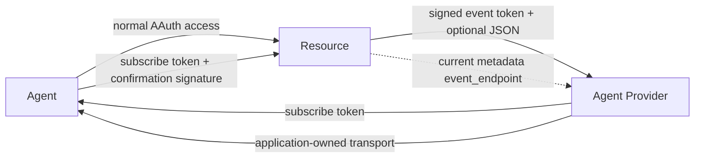
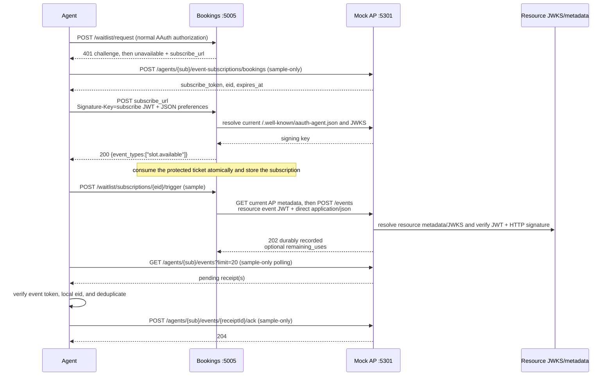

# AAuth Events workflow

> **Preview / draft implementation.** `AAuth.Events` targets the vendored
> `draft-hardt-aauth-events` v09 draft. It is not a standardised AP-to-agent
> transport and it does not make an in-memory store production safe.

AAuth Events lets an Agent Provider (AP) issue a resource-scoped subscribe
token, a resource register that subscription, and the resource later deliver a
signed event envelope to the AP. The AP is the durable inbox intermediary;
applications choose how an agent receives that inbox.

## Roles and boundaries



The protocol defines AP issuance/inbox, resource registration/delivery, and
agent event-envelope verification. It does **not** define AP-to-agent
acquisition, polling, acknowledgements, or a payload schema.

`resourceAudience` is mandatory and canonical. Pass the resource's own
absolute URL; do not infer it from the request `Host` or from the inbound
registration URL.

## Protected subscription and delivery

The following sequence uses the runnable Bookings sample. The acquisition,
polling, and ACK calls are explicitly **non-normative sample transport**.



### Public and protected registration

An AP-issued subscribe JWT has `typ: aa-subscribe+jwt`, `dwk:
aauth-agent.json`, `iss`, agent `sub`, resource `aud`, confirmation
`cnf.jwk`, opaque `eid`, required `iat`/`exp`, and optional positive
`max_uses`. A public channel presents that JWT as the sole `Signature-Key`.
Use `SubscriptionChannel.Public(...)` and
`MapAAuthPublicSubscription(...)`.

`TokenLifetime` only sets the JWT registration window (`exp`); the stored
subscription expiry comes from `SubscriptionLifetime` and is AP policy, not a
wire claim. `TokenLifetime` defaults to one hour, and `SubscriptionLifetime`
is required and must be positive.

> **Interop warning.** v09 has no event `jti`. This SDK deliberately requires a
> fresh, non-empty `jti` on every event token and rejects peers that omit it.
> There is no missing-`jti` fallback: same-second legitimate events can collide
> with exact-token retry identity.

A protected channel first authenticates an application-specific request and
returns an opaque HTTPS, short-lived, single-use ticket URL. The subsequent
registration uses the subscribe token and the ticket URL; the ticket must be
atomically consumed and bound to the token subject and channel. Use
`SubscriptionChannel.Protected(...)` and
`MapAAuthProtectedSubscription(...)`. Registration JSON is direct
`application/json`; its `event_types` preferences are **signature-unbound** and
must never widen authorization.

## Installation and setup

```bash
dotnet add package AAuth.Events --version 0.1.0-alpha.1
```

The package targets `net10.0`, depends only on `AAuth` (the release uses
`AAuth` `0.1.0-alpha.1`), and includes ASP.NET Core integration.

Resource registration:

```csharp
builder.Services.AddAAuthEventsResource(options =>
{
    options.MaxBodyBytes = AAuthEventsConstants.DefaultMaxBodyBytes;
    options.SignatureMaxAge = TimeSpan.FromSeconds(60);
    options.SignatureFutureSkew = TimeSpan.FromSeconds(5);
});

var channel = SubscriptionChannel.Protected(
    "waitlist-subscriptions",
    "/waitlist/subscriptions/{ticket}",
    ["slot.available"],
    resourceAudience: resourceUrl);
app.MapAAuthProtectedSubscription(channel, registrationHandler);
```

The handler implements
`IAAuthSubscriptionRegistrationHandler.RegisterAsync(...)` and owns ticket
consumption, subscription persistence, and the application `ExpiresAt`.

AP setup requires an application store; the package intentionally has no
production default:

```csharp
builder.Services.AddAAuthEventsAgentProvider(
    durableStore,
    options =>
    {
        options.JwtKeyResolver = resolver;
        options.HttpMessageVerifier = new EventsHttpMessageVerifier();
    });
app.MapAAuthEventEndpoint("/events");
```

The `IAAuthAgentProviderEventStore` transaction must atomically perform
subscription lookup/state, exact-token idempotency, use accounting, and inbox
persistence after the endpoint's resolver/verifier chain has already verified
event signature freshness and event-token `exp`/`iat` with the configured
`ClockSkew`. The store does not revalidate event expiry; it only evaluates the
subscription's persisted expiry/state. The AP sees event tokens and payload
bytes; production APs must document retention, confidentiality, and deletion
policy.

Resource delivery resolves the current endpoint rather than copying one from a
token:

```csharp
var policy = new DefaultEventsUrlPolicy();
var endpointResolver = new EventEndpointResolver(urlPolicy: policy);
using var http = EventsHttpClientFactory.Create(policy);
var delivery = new EventDeliveryClient(
    endpointResolver, resourceKey, "bookings-1", http);
var prepared = delivery.Prepare(
    subscription, payload, expiresAt, AAuthEventsConstants.JsonMediaType);
EventDeliveryResult result = await delivery.SendAsync(prepared);
```

Agent setup supplies durable context and replay implementations in production:

```csharp
builder.Services.AddAAuthEventsAgent(
    expectedAudience: agentSubject,
    contextLookup: new DelegateEventContextLookup(
        eid => contexts.TryGetValue(eid, out var value) ? value : null),
    configure: options => options.Deduplicator = durableDeduplicator);
```

`expectedAudience` is required and must be the agent's own identifier; the
agent verifier rejects missing or mismatched audiences.

## Delivery, durability, and status

Event tokens use `typ: aa-event+jwt`, `dwk: aauth-resource.json`, resource
`iss`, agent `aud`, `eid`, required `iat`/`exp`, and a fresh random `jti`.
They contain no event payload. Bodyless requests cover `@method`,
`@authority`, `@path`, and `signature-key`; registration JSON additionally
covers `content-type`; event JSON additionally covers `content-type` and
`content-digest`. The event body is the direct raw JSON bytes.

The AP verifies event-token freshness before the store call using the
configured clock skew. The store then handles subscription state, replay, and
use accounting; it does not re-check the event token expiry.

`EventDeliveryClient` preserves a prepared token/body for an exact retry.
The AP's store uses SHA-256 of the exact compact token as its idempotency key:
an exact retry returns `202` without another inbox write or use increment.
Different events get different `jti` values (C23).

Default registration mapper statuses are:

| Condition | Status |
|---|---:|
| accepted | 200 |
| malformed body/request | 400 |
| invalid signature or JWT | 401 |
| wrong audience or ticket-agent binding | 403 |
| unknown/expired ticket | 404 |
| duplicate `eid` or reused ticket | 409 |

Default AP delivery statuses are `202` for accepted or exact retry, `400` for
malformed body/digest, `401` for invalid/expired event JWT or signature, `403`
for wrong resource or event `aud`, `404` for unknown/expired subscription, and
`429` for exhausted `max_uses`. A successful finite-use response may contain
`{"remaining_uses": n}`.

## Discovery and URL policy

AP metadata at `/.well-known/aauth-agent.json` advertises one absolute
`event_endpoint`. Resources resolve it with `EventEndpointResolver` at delivery
time. `AAuthEventsMetadata.AddEventEndpoint(...)` composes the field without
overwriting a conflicting value. `DefaultEventsUrlPolicy` permits HTTPS and
loopback HTTP, rejects user-info and non-loopback private/link-local IP
literals, disables redirects through `EventsHttpClientFactory`, and supports an
application trust callback. Cross-origin HTTPS endpoints are allowed only after
that policy accepts them.

AsyncAPI support is deliberately focused:

```csharp
var vocabularies = AAuthEventsMetadata.WithAsyncApiVocabulary(
    existingVocabularies, "https://resource.example/asyncapi.json");
var json = AAuthEventsMetadata.ToVocabulariesJson(vocabularies);
AsyncApiAAuthValidator.EnsureValid(asyncApiDocument);
```

The validator checks AsyncAPI `3.0.0`, `aauth_subscribe`, public-operation
security, and protected-ticket annotations. It does not validate general
schemas or `action` direction.

## Draft decisions and explicit limitations

The following are deliberate, documented interpretations of the v09 draft:

| ID | Decision |
|---|---|
| C3 | `{iss,eid}` would discard later events on an unlimited subscription; agent deduplication is pluggable and defaults to SHA-256 of the exact compact event token. |
| C4 | Despite conflicting discovery wording and an AsyncAPI example media type, use the direct AsyncAPI JSON body with `application/json`, not a wrapper or JWT payload field. |
| C5 | The draft shows extra components in examples rather than normative prose; this implementation nevertheless enforces exact profiles: registration adds signed `content-type`; event delivery adds signed `content-type` and `content-digest`. |
| C8 | Subscription lifetime is application policy stored as `ExpiresAt`; no lifetime wire claim is added. |
| C12/C13 | Use the registration and AP status mappings above where the draft is silent. |
| C14 | Exact compact-token retries are idempotent and do not consume another use. The AP and agent use a local SHA-256 key of the compact token; C23's fresh `jti` prevents legitimate same-second collisions. |
| C20 | `iat` is required and future-issued event tokens are rejected before the store call using configured clock skew. |
| C23 | Every event token has a fresh random `jti`; missing/empty `jti` is rejected. This is a deliberate wire extension. |
| RF1 | Although the event-token prose omits the subscribe-token `none` prohibition, both token types reject `none` and unsupported algorithms. |
| RF2 | The event envelope is authenticated, not the payload. `UnauthenticatedEventPayload` is display/relevance data only; consequential details must be re-fetched from the resource with normal AAuth. |
| RF3 | Registration body data is not digest-bound. It is explicitly signature-unbound and cannot grant or widen authorization. |
| RF4 | The draft's examples use `action: receive`, while producer perspective could imply `send`; operation direction is not an AAuth validity rule. |

The AP sees tokens and payloads and must publish retention policy. The sample
EventAgent displays payloads with an **UNAUTHENTICATED PAYLOAD** warning and
causes no action. Neither polling nor ACK is standardized; neither the sample's
in-memory AP store nor its in-memory deduplicator is durable or production
conformant.

## Try the sample

```bash
make events-stack
# in another terminal
make agent-events
```

The stack is AP `http://localhost:5301`, Bookings
`http://localhost:5005`, Person Server `http://localhost:5100`, and the R3
Access Server `http://localhost:5501`. See the
[Bookings](../../samples/MockResourceServers/Bookings/README.md),
[MockAgentProvider](../../samples/MockAgentProvider/README.md), and
[EventAgent](../../samples/EventAgent/README.md) sample notes for exact routes
and configuration.
