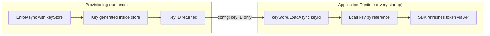
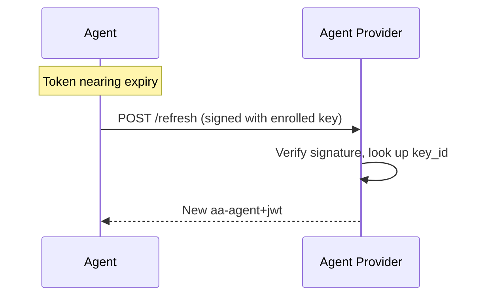
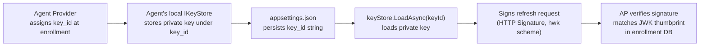

# Bootstrap & Agent Enrollment

> [Signature-Key Schemes](https://explorer.aauth.dev/foundations/schemes)

Overview: CLI tools, desktop apps, and mobile agents that lack a stable URL register with an Agent Provider (AP) to get an agent token. This is the bootstrap step. Hosted services with a stable URL can instead self-issue tokens (see [Getting Started](../getting-started.md#self-issued-agent-tokens-hosted-services)). For `hwk` (pseudonymous), no bootstrap is needed.

## Prerequisites

- An Agent Provider URL (e.g., `https://ap.example`)
- Agent identifier (e.g., `aauth:myapp@ap.example`)


## Enrollment Is a Provisioning Step

Enrollment is **not** part of your application's normal startup — it's a separate operational step, analogous to running a database migration or issuing a TLS certificate. You run it once per device/install (in a CLI tool, setup script, or CI pipeline). The durable signing key is generated **inside a keystore** (HSM, TPM, file store) and never extracted — the application references it by ID.

The agent token is short-lived (typically 1 hour, max 24 hours per spec) and refreshed automatically by the SDK at runtime using the durable key.



## Code Example

### Provisioning: Enrollment Script

Run this in a separate tool, CLI, or setup script — not in your application:

```csharp
using AAuth.Agent;
using AAuth.Crypto;
using AAuth.HttpSig;

// Key is generated INSIDE the store — private material never leaves.
// FileKeyStore.Default() returns the in-process IKeyStore shipped with the SDK
// (file-backed at ~/.aauth/keys/). AzureKeyVaultStore and
// HsmKeyStore are placeholders for your own custom IKeyStore
// implementations — they are NOT part of the SDK.
var keyStore = FileKeyStore.Default(); // or new AzureKeyVaultStore(...), HsmKeyStore(...)

var enrol = await AAuthClientBuilder
    .Bootstrap(
        enrollEndpoint: "https://ap.example/enrol",
        agentId: "aauth:myapp@ap.example")
    .WithPersonServer("https://ps.example")
    .WithKeyStore(keyStore)
    .EnrolAsync();

// Only the key ID needs to go into app config
Console.WriteLine($"Enrolled. KeyId: {enrol.EnrolledKeyId}");
Console.WriteLine($"Add to appsettings: AAuth:KeyId = {enrol.EnrolledKeyId}");
```

### Application: Load Key by ID and Build Client

```csharp
using AAuth.Agent;
using AAuth.Crypto;
using AAuth.HttpSig;

// Key stays in the store — loaded by reference, never extracted
var keyStore = FileKeyStore.Default();
var keyId = configuration["AAuth:KeyId"]!;
var apRefreshEndpoint = configuration["AAuth:ApRefreshEndpoint"]!;
var key = await keyStore.LoadAsync(keyId)
    ?? throw new InvalidOperationException($"Key '{keyId}' not found. Run enrollment.");

// The SDK acquires the agent token lazily on first request
// via WithTokenRefresh, then keeps it fresh automatically.
using var client = new AAuthClientBuilder(key)
    .WithTokenRefresh(AgentProviderTokenRefresher.Create(apRefreshEndpoint, keyId)
        .WithKeyStore(keyStore)
        .Build())
    .WithChallengeHandling(personServer: "https://ps.example")
    .Build();
```

### Manual Enrollment

```csharp
using AAuth.Agent;
using AAuth.Crypto;

var keyStore = new InMemoryKeyStore(); // or FileKeyStore for file-based persistence
var apClient = new AgentProviderClient(new HttpClient(), keyStore);

var result = await apClient.EnrolAsync(
    apIssuer: "https://ap.example",
    agentId: "aauth:myapp@ap.example",
    enrollEndpoint: "https://ap.example/enrol",
    personServer: "https://ps.example" // optional: include if using three-party flows
);

// result.AgentToken = the aa-agent+jwt
// result.Key = the generated signing key
// result.EnrolledKeyId = the key ID at the AP
```

## What Bootstrap Produces

- An `aa-agent+jwt` token signed by the AP, containing:
  - `iss`: AP URL
  - `sub`: agent identifier (`aauth:local@domain`)
  - `cnf.jwk`: the agent's public key (bound to identity)
  - `ps`: Person Server URL (optional, only if agent has a PS)
- The agent's private key stored in `IKeyStore`
- A `key_id` assigned by the AP (stable for the key's lifetime)
- A `jwks_uri` pointing to the per-agent JWKS endpoint where the AP publishes the agent's public key (used with `scheme=jwks_uri`)

## Token Refresh

Agent tokens are short-lived (typically 1 hour, max 24 hours per spec). The SDK refreshes them automatically before expiry using the durable signing key. Two refresh strategies exist depending on whether you use an Agent Provider or self-issue tokens.

### AP-Enrolled Agents (CLI, desktop, mobile)

The AP issued the original token during enrollment. At refresh time the SDK signs a POST to the AP's refresh endpoint with the enrolled key — the AP verifies the signature, looks up the agent by key ID, and returns a fresh token.



```csharp
// keyId = the AP-assigned key identifier from enrollment (e.g. "aauth:myapp@ap.example:c34078382e")
// This is the ID the AP uses to look up the agent's public key for signature verification.
// It is also the filename/reference under which IKeyStore stores the private key.
using var client = new AAuthClientBuilder(key)
    .WithTokenRefresh(AgentProviderTokenRefresher.Create(apRefreshEndpoint, keyId)
        .WithKeyStore(keyStore)
        .Build())
    .Build();
```

### Self-Issued Tokens (hosted services)

Hosted services with a stable HTTPS URL act as their own issuer — no AP is needed. The SDK mints a fresh JWT locally on each refresh, signed with the service's own key.

```csharp
// keyId = any stable identifier you choose for the JWT "kid" header.
// Defaults to the key's JWK thumbprint if omitted via the fluent API.
// Resources resolve this key by fetching your /.well-known/jwks.json.
using var client = new AAuthClientBuilder(key)
    .WithTokenRefresh(SelfIssuedTokenRefresher.Create(key,
            issuer: "https://my-service.example",
            subject: "aauth:my-service@my-service.example")
        .WithPersonServer("https://ps.example")
        .Build())
    .Build();
```

## Key IDs: What Goes Where

The term "key ID" appears in several contexts. This table clarifies which value is which:

| Scenario | Key ID value | Who assigns it | Where it's stored | What uses it |
|----------|-------------|----------------|-------------------|--------------|
| AP-enrolled | `aauth:myapp@ap.example:c34078382e` | Agent Provider (during enrollment) | Agent's local `IKeyStore` (filename) + `appsettings.json` (reference) | `IKeyStore.LoadAsync(keyId)` loads the private key for signing. The AP never receives this string — it identifies the agent by verifying the HTTP signature and matching the JWK thumbprint against its enrollment database. |
| Self-issued | Any stable string (e.g. `"svc-key-1"`) or JWK thumbprint | You (the developer) | Hardcoded or in config | JWT `kid` header — resources use it to select the correct key from your JWKS |

### AP-Enrolled: Key ID Flow



1. **Enrollment** — AP generates `key_id` (e.g. `aauth:myapp@ap.example:c34078382e`) and the SDK stores the private key locally under that ID. The AP stores only the public key, indexed by JWK thumbprint.
2. **Config** — You persist only the `key_id` string in `appsettings.json` (a local keystore reference).
3. **Runtime** — `keyStore.LoadAsync(keyId)` retrieves the private key from the agent's local store. The refresher signs the HTTP request. The AP identifies the agent by verifying the signature against its enrolled public keys (matched by thumbprint) — it never receives the `key_id` string itself.

### Self-Issued: Key ID Flow


1. **Key generation** — You generate a key and choose a `kid` (or let the SDK default to the JWK thumbprint).
2. **JWKS endpoint** — Your service publishes the public key at `/.well-known/jwks.json` with that `kid`.
3. **Runtime** — `SelfIssuedTokenRefresher` mints JWTs with `kid` in the header. Resources fetch your JWKS, find the matching key, and verify.

## Which Flows Need Bootstrap

| Flow | Needs Bootstrap? | Why |
|------|:----------------:|-----|
| Pseudonymous (hwk) | No | Just needs a bare keypair |
| Agent Identity (jwks_uri) | Yes | AP publishes the agent's key at a per-agent JWKS endpoint |
| Three-party (jwt) | Yes | Agent token required for PS interactions |

## Key Persistence

```csharp
// File-based (persists to ~/.aauth/keys/)
var keyStore = FileKeyStore.Default();

// In-memory (testing only)
var keyStore = new InMemoryKeyStore();

// Custom (KMS, HSM, etc.)
class MyKeyStore : IKeyStore { ... }
```

## Further Reading

- [Agent Token mode](../signing-modes/agent-token-jwt.md)
- [Agent Identity mode](../signing-modes/agent-identity-jwks-uri.md)
- [Key Management](../advanced/key-management.md)
