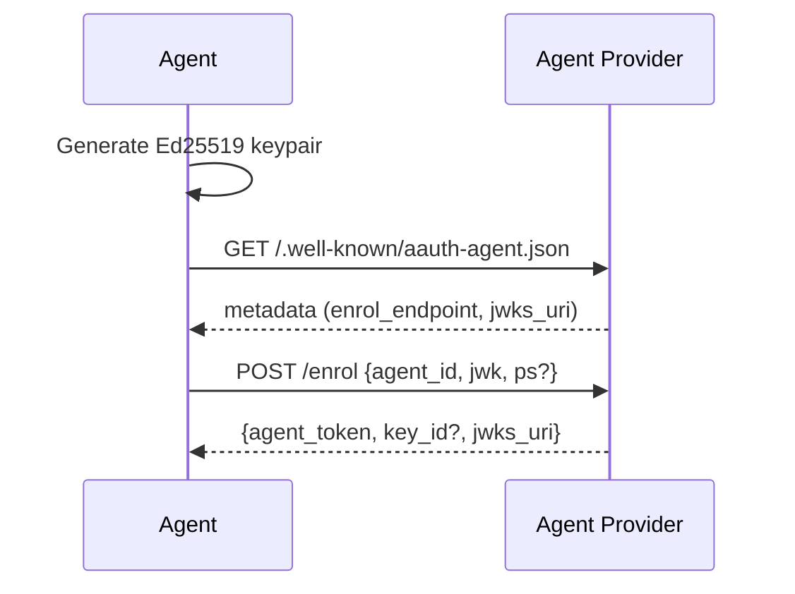
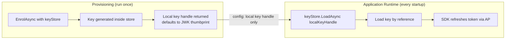
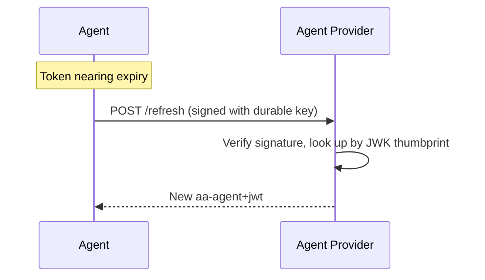
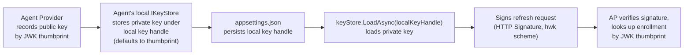

# Bootstrap & Agent Enrollment

> [Signature-Key Schemes](https://explorer.aauth.dev/foundations/schemes)

Overview: CLI tools, desktop apps, and mobile agents that lack a stable URL register with an Agent Provider (AP) to get an agent token. This is the bootstrap step. Hosted services with a stable URL can instead self-issue tokens (see [Getting Started](../getting-started.md#self-issued-agent-tokens-hosted-services)). For `hwk` (pseudonymous), no bootstrap is needed.

## Prerequisites

- An Agent Provider URL (e.g., `https://ap.example`)
- Agent identifier (e.g., `aauth:myapp@ap.example`)



## Enrollment Is a Provisioning Step

Enrollment is **not** part of your application's normal startup — it's a separate operational step, analogous to running a database migration or issuing a TLS certificate. You run it once per device/install (in a CLI tool, setup script, or CI pipeline). The durable signing key is generated **inside a keystore** (HSM, TPM, file store) and never extracted — the application references it by a local handle.

> **The agent and the AP never share a keystore.** The agent holds the **private** durable key locally in its own `IKeyStore`. The AP holds only the **public** key, indexed in its enrollment database by JWK thumbprint. At refresh time the AP identifies the agent from the HTTP signature — never from any string the agent sends.

The agent token is short-lived (typically 1 hour, max 24 hours per spec) and refreshed automatically by the SDK at runtime using the durable key.



## Code Example

### Provisioning: Enrollment Script

Run this in a separate tool, CLI, or setup script — not in your application:

```csharp
using AAuth.Agent;
using AAuth.Crypto;
using AAuth;

// Key is generated INSIDE the store — private material never leaves.
// FileKeyStore.Default() returns the in-process IKeyStore shipped with the SDK
// (file-backed at ~/.aauth/keys/). AzureKeyVaultStore and
// HsmKeyStore are placeholders for your own custom IKeyStore
// implementations — they are NOT part of the SDK.
var keyStore = FileKeyStore.Default(); // or new AzureKeyVaultStore(...), HsmKeyStore(...)

var enrol = await AAuthClientBuilder
    .Bootstrap(
        enrollEndpoint: "https://ap.example/enrol",
        agentId: "aauth:myapp@ap.example")
    .WithPersonServer("https://ps.example")
    .WithKeyStore(keyStore)
    .EnrolAsync();

// Only the local key handle needs to go into app config.
// (Defaults to the durable key's JWK thumbprint — opaque to the AP.)
Console.WriteLine($"Enrolled. Local key handle: {enrol.LocalKeyHandle}");
Console.WriteLine($"Add to appsettings: AAuth:LocalKeyHandle = {enrol.LocalKeyHandle}");
```

### Application: Load Key by Local Handle and Build Client

```csharp
using AAuth.Agent;
using AAuth.Crypto;
using AAuth;

// Key stays in the store — loaded by reference, never extracted
var keyStore = FileKeyStore.Default();
var localKeyHandle = configuration["AAuth:LocalKeyHandle"]!;
var apRefreshEndpoint = configuration["AAuth:ApRefreshEndpoint"]!;
var key = await keyStore.LoadAsync(localKeyHandle)
    ?? throw new InvalidOperationException($"Key '{localKeyHandle}' not found. Run enrollment.");

// The SDK acquires the agent token lazily on first request
// via WithTokenRefresh, then keeps it fresh automatically.
using var client = AAuthClientBuilder.Enrolled(key)
    .RefreshingFrom(apRefreshEndpoint, localKeyHandle)
    .WithKeyStore(keyStore)
    .WithChallengeHandling(personServer: "https://ps.example")
    .Build();
```

### Manual Enrollment

```csharp
using AAuth.Agent;
using AAuth.Crypto;

var keyStore = new InMemoryKeyStore(); // or FileKeyStore for file-based persistence
var apClient = new AgentProviderClient(new HttpClient(), keyStore);

var result = await apClient.EnrolAsync(
    apIssuer: "https://ap.example",
    agentId: "aauth:myapp@ap.example",
    enrollEndpoint: "https://ap.example/enrol",
    personServer: "https://ps.example" // optional: include if using three-party flows
);

// result.AgentToken     = the aa-agent+jwt issued by the AP
// result.Key            = the generated durable signing key
// result.LocalKeyHandle = agent-local IKeyStore handle (defaults to the JWK thumbprint)
// result.AgentTokenKid  = AP-published kid for jwks_uri mode (required for UseJwksUri)
// result.JwksUri        = per-agent JWKS URI (for jwks_uri signing mode)
```

## What Bootstrap Produces

- An `aa-agent+jwt` token signed by the AP, containing:
  - `iss`: AP URL
  - `sub`: agent identifier (`aauth:local@domain`)
  - `cnf.jwk`: the agent's public key (bound to identity)
  - `ps`: Person Server URL (optional, only if agent has a PS)
- The agent's **private** key stored in `IKeyStore` (the AP only ever sees the public key)
- A **local key handle** (`EnrollResult.LocalKeyHandle`) for `IKeyStore.LoadAsync` — defaults to the durable key's JWK thumbprint (RFC 7638). Purely agent-local; never sent to the AP.
- An **AP-published JWT `kid`** (`EnrollResult.AgentTokenKid`) — the AP chooses this value and publishes it in the per-agent JWKS. Required for `jwks_uri` signing mode (passed to `UseJwksUri(url, kid)`); opaque to receivers per spec § "Agent Identifier Strategies".
- A `jwks_uri` pointing to the per-agent JWKS endpoint where the AP publishes the agent's public key (used with `scheme=jwks_uri`)

## Token Refresh

Agent tokens are short-lived (typically 1 hour, max 24 hours per spec). The SDK refreshes them automatically before expiry using the durable signing key. Two refresh strategies exist depending on whether you use an Agent Provider or self-issue tokens.

### AP-Enrolled Agents (CLI, desktop, mobile)

The AP issued the original token during enrollment. At refresh time the SDK signs a POST to the AP's refresh endpoint with the **durable key** — the AP verifies the signature, looks the enrollment up by the key's **JWK thumbprint**, and returns a fresh token. **No identifier travels in the request body**; the signature alone identifies the agent.



```csharp
// localKeyHandle = the agent-local IKeyStore handle returned by EnrolAsync
// (defaults to the durable key's JWK thumbprint).
// Used only by IKeyStore.LoadAsync — it is never sent to the AP.
using var client = AAuthClientBuilder.Enrolled(key)
    .RefreshingFrom(apRefreshEndpoint, localKeyHandle)
    .WithKeyStore(keyStore)
    .Build();
```

### Two-Key Refresh (jkt-jwt — key rotation)

For agents using the `jkt-jwt` signing mode, the refresh flow uses **two keys**: the enrolled durable key for identity proof, and a fresh ephemeral key for signing HTTP requests. This enables key rotation without re-enrollment. The naming JWT is self-issued per [`draft-hardt-httpbis-signature-key-05`](../../aauth-spec/v08/draft-hardt-httpbis-signature-key-05.txt) §3.4: the durable public key travels in the JWT header and the issuer is its own thumbprint URN, so the AP verifies it self-anchored and then binds it to the enrolment record.

```mermaid
sequenceDiagram
    participant Agent
    participant AP as Agent Provider
    Note over Agent: Token nearing expiry
    Agent->>Agent: Generate ephemeral Ed25519 key
    Agent->>Agent: Build naming JWT (jkt-s256+jwt, signed by durable key,<br/>durable jwk in header, iss=urn:jkt:sha-256:&lt;thumbprint&gt;,<br/>ephemeral key as cnf.jwk)
    Agent->>AP: POST /refresh (signed with ephemeral key,<br/>Signature-Key: sig=jkt-jwt;jwt="&lt;naming-jwt&gt;")
    AP->>AP: Self-anchor — thumbprint(header jwk) == iss, verify naming JWT signature
    AP->>AP: Look up enrolment by the durable key thumbprint (bind to record)
    AP->>AP: Verify HTTP signature against ephemeral cnf.jwk
    AP-->>Agent: New aa-agent+jwt (cnf.jwk = ephemeral key)
```

```csharp
// Self-anchored verification (draft-05 §3.4), then the AP looks up the
// enrolment by the durable key's thumbprint and binds it to the record.
using var client = AAuthClientBuilder.Enrolled(key)
    .RefreshingFrom(apRefreshEndpoint, localKeyHandle)
    .WithKeyStore(keyStore)
    .WithRefreshMode(RefreshMode.TwoKey)
    .Build();
```

### Self-Issued Tokens (hosted services)

Hosted services with a stable HTTPS URL act as their own issuer — no AP is needed. The SDK mints a fresh JWT locally on each refresh, signed with the service's own key.

```csharp
// keyId = any stable identifier you choose for the JWT "kid" header.
// Defaults to the key's JWK thumbprint if omitted.
// Resources resolve this key by fetching your /.well-known/jwks.json.
using var client = AAuthClientBuilder.SelfIssuing(key)
    .As("https://my-service.example", "aauth:my-service@my-service.example")
    .WithPersonServer("https://ps.example")
    .WithChallengeHandling()
    .Build();
```

## Key Identifiers: What Goes Where

The term "key ID" gets overloaded in AP enrollment. There are actually **three different identifiers** in play, and the spec keeps them disjoint:

| Identifier | Owner / origin | Travels where | Used for |
|-----------|----------------|---------------|----------|
| **JWK thumbprint** of the durable key (RFC 7638) | derived from the public key | implicit on every signed request | The AP looks the agent up in its enrollment DB by this thumbprint at refresh time |
| **Local key handle** (`EnrollResult.LocalKeyHandle`) | the agent (SDK chooses; defaults to the JWK thumbprint) | never leaves the agent process | `IKeyStore.LoadAsync(localKeyHandle)` — loads the private key at app startup |
| **AP-published JWT `kid`** (`EnrollResult.AgentTokenKid`) | the AP picks (opaque) | inside the issued `aa-agent+jwt` header; in `Signature-Key` for `jwks_uri` mode | Required for `UseJwksUri(url, kid)` — the agent passes it when building the client. Opaque to receivers per spec § "Agent Identifier Strategies". **Not sent back to the AP at refresh** — refresh uses the HTTP signature only. |

For the second flavour of enrollment, **self-issued** (hosted services), only one identifier matters:

| Scenario | Key ID value | Who assigns it | Where it's stored | What uses it |
|----------|-------------|----------------|-------------------|--------------|
| Self-issued | Any stable string (e.g. `"svc-key-1"`) or JWK thumbprint | You (the developer) | Hardcoded or in config | JWT `kid` header — resources use it to select the correct key from your JWKS |

### AP-Enrolled: Key ID Flow



1. **Enrollment** — the agent generates a durable key inside its `IKeyStore`. The AP records only the **public** key, indexed by JWK thumbprint. The SDK stores the **private** key locally under a local key handle (default: the same thumbprint, for convenience).
2. **Config** — you persist only the `localKeyHandle` string in `appsettings.json` (a local keystore reference). The AP doesn't know or care about it.
3. **Runtime** — `keyStore.LoadAsync(localKeyHandle)` retrieves the private key from the agent's local store. The refresher signs the HTTP request with that key. The AP identifies the agent purely by verifying the signature against its enrolled public keys (matched by JWK thumbprint).

### Self-Issued: Key ID Flow


1. **Key generation** — You generate a key and choose a `kid` (or let the SDK default to the JWK thumbprint).
2. **JWKS endpoint** — Your service publishes the public key at `/.well-known/jwks.json` with that `kid`.
3. **Runtime** — `SelfIssuedTokenRefresher` mints JWTs with `kid` in the header. Resources fetch your JWKS, find the matching key, and verify.

## Which Flows Need Bootstrap

| Flow | Needs Bootstrap? | Why |
|------|:----------------:|-----|
| Pseudonymous (hwk) | No | Just needs a bare keypair |
| Agent Identity (jwks_uri) | Yes | AP publishes the agent's key at a per-agent JWKS endpoint |
| Key Rotation (jkt-jwt) | Yes | Durable key must be enrolled; AP issues tokens bound to ephemeral keys |
| Three-party (jwt) | Yes | Agent token required for PS interactions |

## Key Persistence

```csharp
// File-based (persists to ~/.aauth/keys/)
var keyStore = FileKeyStore.Default();

// In-memory (testing only)
var keyStore = new InMemoryKeyStore();

// Custom (KMS, HSM, etc.)
class MyKeyStore : IKeyStore { ... }
```

## Further Reading

- [Agent Token mode](../signing-modes/agent-token-jwt.md)
- [Agent Identity mode](../signing-modes/agent-identity-jwks-uri.md)
- [Key Management](../advanced/key-management.md)
