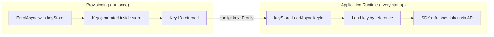

# Bootstrap & Agent Enrollment

> [Signature-Key Schemes](https://explorer.aauth.dev/foundations/schemes)

Overview: CLI tools, desktop apps, and mobile agents that lack a stable URL register with an Agent Provider (AP) to get an agent token. This is the bootstrap step. Hosted services with a stable URL can instead self-issue tokens (see [Getting Started](../getting-started.md#self-issued-agent-tokens-hosted-services)). For `hwk` (pseudonymous), no bootstrap is needed.

## Prerequisites

- An Agent Provider URL (e.g., `https://ap.example`)
- Agent identifier (e.g., `aauth:myapp@ap.example`)


## Enrollment Is a Provisioning Step

Enrollment is **not** part of your application's normal startup — it's a separate operational step, analogous to running a database migration or issuing a TLS certificate. You run it once per device/install (in a CLI tool, setup script, or CI pipeline). The durable signing key is generated **inside a keystore** (HSM, TPM, file store) and never extracted — the application references it by ID.

The agent token is short-lived (typically 1 hour, max 24 hours per spec) and refreshed automatically by the SDK at runtime using the durable key.



## Code Example

### Provisioning: Enrollment Script

Run this in a separate tool, CLI, or setup script — not in your application:

```csharp
using AAuth.Agent;
using AAuth.Crypto;
using AAuth.HttpSig;

// Key is generated INSIDE the store — private material never leaves.
// KeyStore.Default() returns the in-process IKeyStore shipped with the SDK
// (file/keychain-backed depending on platform). AzureKeyVaultStore and
// HsmKeyStore are placeholders for your own custom IKeyStore
// implementations — they are NOT part of the SDK.
var keyStore = KeyStore.Default(); // or new AzureKeyVaultStore(...), HsmKeyStore(...)

var enrol = await AAuthClientBuilder
    .Bootstrap(
        enrollEndpoint: "https://ap.example/enrol",
        agentId: "aauth:myapp@ap.example")
    .WithPersonServer("https://ps.example")
    .WithKeyStore(keyStore)
    .EnrolAsync();

// Only the key ID needs to go into app config
Console.WriteLine($"Enrolled. KeyId: {enrol.KeyId}");
Console.WriteLine($"Add to appsettings: AAuth:KeyId = {enrol.KeyId}");
```

### Application: Load Key by ID and Build Client

```csharp
using AAuth.Agent;
using AAuth.HttpSig;

// Key stays in the store — loaded by reference, never extracted
var keyStore = KeyStore.Default();
var keyId = configuration["AAuth:KeyId"]!;
var apRefreshEndpoint = configuration["AAuth:ApRefreshEndpoint"]!;
var key = await keyStore.LoadAsync(keyId)
    ?? throw new InvalidOperationException($"Key '{keyId}' not found. Run enrollment.");

// The SDK acquires the agent token lazily on first request
// via WithTokenRefresh, then keeps it fresh automatically.
using var client = new AAuthClientBuilder(key)
    .WithTokenRefresh(async (ctx, ct) =>
    {
        var apClient = new AgentProviderClient(new HttpClient(), keyStore);
        return await apClient.RefreshAsync(apRefreshEndpoint, ctx.KeyId, ct);
    })
    .WithChallengeHandling(personServer: "https://ps.example")
    .Build();
```

### Manual Enrollment

```csharp
using AAuth.Agent;
using AAuth.Crypto;

var keyStore = new InMemoryKeyStore(); // or KeyStore for file-based persistence
var apClient = new AgentProviderClient(new HttpClient(), keyStore);

var result = await apClient.EnrolAsync(
    apIssuer: "https://ap.example",
    agentId: "aauth:myapp@ap.example",
    enrollEndpoint: "https://ap.example/enrol",
    personServer: "https://ps.example" // optional: include if using three-party flows
);

// result.AgentToken = the aa-agent+jwt
// result.Key = the generated signing key
// result.KeyId = the key ID at the AP
```

## What Bootstrap Produces

- An `aa-agent+jwt` token signed by the AP, containing:
  - `iss`: AP URL
  - `sub`: agent identifier (`aauth:local@domain`)
  - `cnf.jwk`: the agent's public key (bound to identity)
  - `ps`: Person Server URL (optional, only if agent has a PS)
- The agent's private key stored in `IKeyStore`
- A `key_id` assigned by the AP (stable for the key's lifetime)
- A `jwks_uri` pointing to the per-agent JWKS endpoint where the AP publishes the agent's public key (used with `scheme=jwks_uri`)

## Which Flows Need Bootstrap

| Flow | Needs Bootstrap? | Why |
|------|:----------------:|-----|
| Pseudonymous (hwk) | No | Just needs a bare keypair |
| Agent Identity (jwks_uri) | Yes | AP publishes the agent's key at a per-agent JWKS endpoint |
| Three-party (jwt) | Yes | Agent token required for PS interactions |

## Key Persistence

```csharp
// File-based (persists to ~/.aauth/keys/)
var keyStore = KeyStore.Default();

// In-memory (testing only)
var keyStore = new InMemoryKeyStore();

// Custom (KMS, HSM, etc.)
class MyKeyStore : IKeyStore { ... }
```

## Further Reading

- [Agent Token mode](../signing-modes/agent-token-jwt.md)
- [Agent Identity mode](../signing-modes/agent-identity-jwks-uri.md)
- [Key Management](../advanced/key-management.md)
