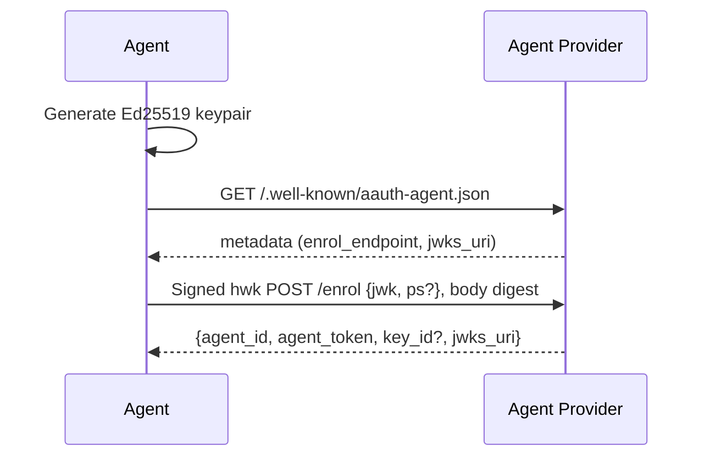
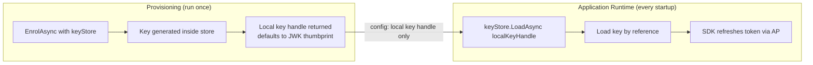
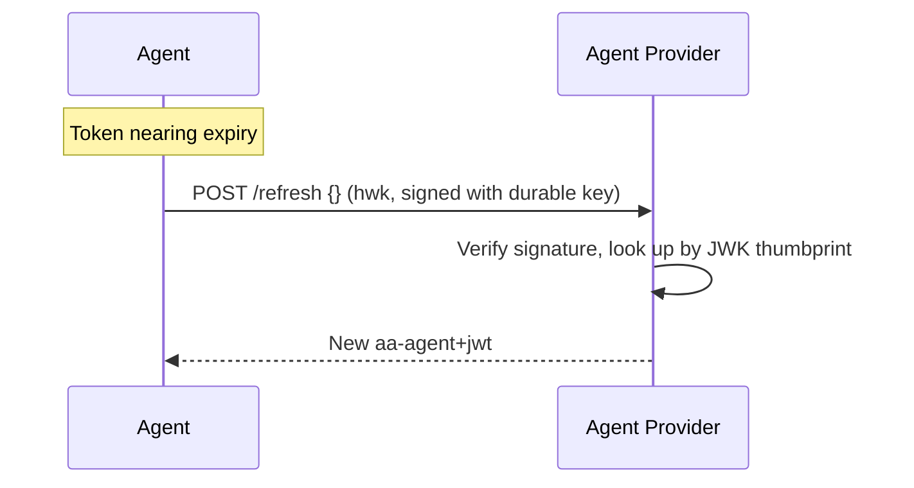
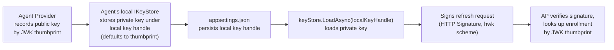

# Bootstrap and Agent Enrollment

## Overview

> [Signature-Key Schemes](https://explorer.aauth.dev/foundations/schemes)

Overview: CLI tools, desktop apps, and mobile agents that lack a stable URL register with an Agent Provider (AP) to get an agent token. This is the bootstrap step. Hosted services with a stable URL can instead self-issue tokens (see [Getting Started](../getting-started.md#self-issued-agent-tokens-hosted-services)). For `hwk` (pseudonymous), no bootstrap is needed.

## Prerequisites

- An Agent Provider URL (e.g., `https://ap.example`)
- A durable signing key; the sample AP assigns its identity


```mermaid
sequenceDiagram
    participant Agent
    participant AP as Agent Provider
    Agent->>Agent: Generate Ed25519 keypair
    Agent->>AP: GET /.well-known/aauth-agent.json
    AP-->>Agent: metadata (enrol_endpoint, jwks_uri)
    Agent->>AP: Signed hwk POST /enrol {jwk, ps?}, body digest
    AP-->>Agent: {agent_id, agent_token, key_id?, jwks_uri}
```

## Enrollment Is a Provisioning Step

Enrollment is normally a separate provisioning step. The sample AP also permits
authenticated same-key reenrollment at startup: its durable registry retains the
assigned identity and kid. Use a persisted key, not a newly generated key on each
restart. FileKeyStore stores software key material locally; it does not provide
hardware-backed or non-exportable key guarantees.

The bootstrap convenience APIs `BootstrapBuilder.WithKey`,
`AgentProviderClient.EnrolWithKeyAsync`, and `EnrollResult.Key` currently use the
concrete Ed25519 `AAuthKey`. They do not provide fluent ES256 enrollment.
This limitation does not apply to `IKeyStore`, signing/verification, or
`AAuthClientBuilder.Enrolled` single-key refresh, which accept `IAAuthKey`.
The sample AP accepts signed ES256 enrollment requests through its HTTP endpoint.

> **The agent and the AP never share a keystore.** The agent holds the **private** durable key locally in its own `IKeyStore`. The AP holds only the **public** key, indexed in its enrollment database by JWK thumbprint. At refresh time the AP identifies the agent from the HTTP signature — never from any string the agent sends.

The agent token is short-lived (typically 1 hour, max 24 hours per spec) and refreshed automatically by the SDK at runtime using the durable key.


```mermaid
flowchart LR
    subgraph Provisioning["Provisioning (run once)"]
        E1[EnrolAsync with keyStore]
        E2[Key generated inside store]
        E3[Local key handle returned<br/>defaults to JWK thumbprint]
        E1 --> E2 --> E3
    end

    subgraph Runtime["Application Runtime (every startup)"]
        R1[keyStore.LoadAsync localKeyHandle]
        R2[Load key by reference]
        R3[SDK refreshes token via AP]
        R1 --> R2 --> R3
    end

    E3 -- "config: local key handle only" --> R1
```

## Code Example

### Provisioning: Enrollment Script

Run this in a separate tool, CLI, or setup script — not in your application:

```csharp
using AAuth.Agent;
using AAuth.Crypto;
using AAuth;

// FileKeyStore persists software key material and loads it into this process.
// FileKeyStore.Default() returns the in-process IKeyStore shipped with the SDK
// (file-backed at ~/.aauth/keys/). AzureKeyVaultStore and
// HsmKeyStore are placeholders for your own custom IKeyStore
// implementations — they are NOT part of the SDK.
var keyStore = FileKeyStore.Default(); // or new AzureKeyVaultStore(...), HsmKeyStore(...)

var enrol = await AAuthClientBuilder
    .Bootstrap(enrollEndpoint: "https://ap.example/enrol")
    .WithKey(keyStore.LoadOrCreate("myapp"))
    .WithPersonServer("https://ps.example")
    .WithKeyStore(keyStore)
    .EnrolAsync();

// Only the local key handle needs to go into app config.
// (Defaults to the durable key's JWK thumbprint — opaque to the AP.)
Console.WriteLine($"Enrolled. Local key handle: {enrol.LocalKeyHandle}");
Console.WriteLine($"Add to appsettings: AAuth:LocalKeyHandle = {enrol.LocalKeyHandle}");
```

### Application: Load Key by Local Handle and Build Client

```csharp
using AAuth.Agent;
using AAuth.Crypto;
using AAuth;

// File-backed software keys are loaded into memory; custom stores define custody.
IKeyStore keyStore = FileKeyStore.Default();
var localKeyHandle = configuration["AAuth:LocalKeyHandle"]!;
var apRefreshEndpoint = configuration["AAuth:ApRefreshEndpoint"]!;
var key = await keyStore.LoadAsync(localKeyHandle)
    ?? throw new InvalidOperationException($"Key '{localKeyHandle}' not found. Run enrollment.");

// The SDK acquires the agent token lazily on first request
// via WithTokenRefresh, then keeps it fresh automatically.
using var client = AAuthClientBuilder.Enrolled(key)
    .RefreshingFrom(apRefreshEndpoint, localKeyHandle)
    .WithKeyStore(keyStore)
    .WithChallengeHandling(personServer: "https://ps.example")
    .Build();
```

### Manual Enrollment

```csharp
using AAuth.Agent;
using AAuth.Crypto;

var keyStore = new InMemoryKeyStore(); // or FileKeyStore for file-based persistence
using var apHttp = AAuth.Discovery.AAuthHttpTransport.CreateClient();
var apClient = new AgentProviderClient(apHttp, keyStore);

var result = await apClient.EnrolAsync(
    apIssuer: "https://ap.example",
    agentId: null,
    enrollEndpoint: "https://ap.example/enrol",
    personServer: "https://ps.example" // optional: include if using three-party flows
);

// result.AgentToken     = the aa-agent+jwt issued by the AP
// result.Key            = the generated durable signing key
// result.LocalKeyHandle = agent-local IKeyStore handle (defaults to the JWK thumbprint)
// result.AgentTokenKid  = AP-published kid for explicit generic UseJwks
// result.JwksUri        = direct per-agent JWKS URL; not metadata discovery
```

## What Bootstrap Produces

- A provider-assigned `EnrollResult.AgentId` when returned by the AP; the sample
    rejects caller-chosen namespaces and unauthorized key replacement
- An `aa-agent+jwt` token signed by the AP, containing:
  - `iss`: AP URL
  - `sub`: agent identifier (`aauth:local@domain`)
  - `cnf.jwk`: the agent's public key (bound to identity)
  - `ps`: Person Server URL (optional, only if agent has a PS)
- The agent's **private** key stored in `IKeyStore` (the AP only ever sees the public key)
- A **local key handle** (`EnrollResult.LocalKeyHandle`) for `IKeyStore.LoadAsync` — defaults to the durable key's JWK thumbprint (RFC 7638). Purely agent-local; never sent to the AP.
- An AP-published key identifier (`EnrollResult.AgentTokenKid`) selects the key in the per-agent JWKS. Generic direct-key demonstrations pass it to `UseJwks(url, kid)`; AAuth requests use the agent token instead.
- A `jwks_uri` response member containing the per-agent key URL for generic direct `scheme=jwks`. AAuth resource requests use the agent JWT instead.

`AAuthClientBuilder.From(result)` uses `result.AgentToken` with `jwt`, whether or
not the result contains a key URL. No network call occurs in this factory.
Add a caller-owned `WithTokenRefresh` for renewal or use the enrolled builder.
Explicit scheme selectors applied after refresh disable it; applying refresh
after a selector chooses JWT. `ToBuilder()` exposes general options from either
provisioning sub-builder without selecting a resource access mode.

Bootstrap, Enrolled and SelfIssuing use production admission by default.
Configure `WithDevelopmentLoopback` only for named local development origins.
Injected `AgentProviderClient` HTTP clients require an explicit admitted
transport contract. Bootstrap owns its temporary client; an enrolled pipeline
owns its refresh client. Keys/stores and injected refreshers remain caller-owned.

## Token Refresh

Agent tokens are short-lived (typically 1 hour, max 24 hours per spec). The SDK refreshes them automatically before expiry using the durable signing key. Two refresh strategies exist depending on whether you use an Agent Provider or self-issue tokens.

### AP-Enrolled Agents (CLI, desktop, mobile)

The AP issued the original token during enrollment. At refresh time the SDK
signs a POST to the AP's refresh endpoint with the durable key. Its JSON body is
`{}`, not zero bytes and not an agent identifier or local key handle. The AP
verifies the proof, looks up the enrolled durable thumbprint, and returns
`{"agent_token":"<aa-agent+jwt>"}`. Tokens and signatures shown in angle brackets
are illustrative values, never usable credentials. Bootstrap is informational;
the signed enrollment and refresh endpoints described here are the sample profile.


```mermaid
sequenceDiagram
    participant Agent
    participant AP as Agent Provider
    Note over Agent: Token nearing expiry
    Agent->>AP: POST /refresh {} (hwk, signed with durable key)
    AP->>AP: Verify signature, look up by JWK thumbprint
    AP-->>Agent: New aa-agent+jwt
```

```csharp
// localKeyHandle = the agent-local IKeyStore handle returned by EnrolAsync
// (defaults to the durable key's JWK thumbprint).
// Used only by IKeyStore.LoadAsync — it is never sent to the AP.
using var client = AAuthClientBuilder.Enrolled(key)
    .RefreshingFrom(apRefreshEndpoint, localKeyHandle)
    .WithKeyStore(keyStore)
    .Build();
```

### Two-Key Refresh (jkt-jwt — key rotation)

The AP refresh ceremony can use `jkt-jwt`: a durable key delegates to a new
ephemeral key. Subsequent AAuth resource requests still use `jwt`, with the
returned agent token and its matching ephemeral key. The naming JWT is
self-anchored under Signature Keys draft 08 section 3.5; the AP also binds the
durable key to its enrollment record.

```mermaid
sequenceDiagram
    participant Agent
    participant AP as Agent Provider
    Note over Agent: Token nearing expiry
    Agent->>Agent: Generate ephemeral Ed25519 key
    Agent->>Agent: Build naming JWT (jkt-s256+jwt, signed by durable key,<br/>durable jwk in header, iss=urn:jkt:sha-256:&lt;thumbprint&gt;,<br/>ephemeral key as cnf.jwk)
    Agent->>AP: POST /refresh {} (signed with ephemeral key,<br/>Signature-Key: sig=jkt-jwt;jwt="&lt;naming-jwt&gt;")
    AP->>AP: Self-anchor — thumbprint(header jwk) == iss, verify naming JWT signature
    AP->>AP: Look up enrolment by the durable key thumbprint (bind to record)
    AP->>AP: Verify HTTP signature against ephemeral cnf.jwk
    AP-->>Agent: New aa-agent+jwt (cnf.jwk = ephemeral key)
```

```csharp
using var apHttp = AAuth.Discovery.AAuthHttpTransport.CreateClient();
var apClient = new AgentProviderClient(apHttp, keyStore);
var refreshed = await apClient.RefreshTwoKeyAsync(apRefreshEndpoint, localKeyHandle);
using var client = new AAuthClientBuilder(refreshed.EphemeralKey)
    .UseJwt(refreshed.AgentToken)
    .Build();
```

`Enrolled(...).WithRefreshMode(TwoKey)` is rejected: its fixed HTTP signing key
cannot follow a newly generated ephemeral key. Advanced rotating clients must
coordinate the returned token/key pair. The disposable
`AgentProviderTokenRefresher.Create(...).Build()` owns only its internally
created HTTP client; the constructor and `WithHttpClient` borrow yours.

### Self-Issued Tokens (hosted services)

Hosted services with a stable HTTPS URL act as their own issuer — no AP is needed. The SDK mints a fresh JWT locally on each refresh, signed with the service's own key.

```csharp
// keyId = any stable identifier you choose for the JWT "kid" header.
// Defaults to the key's JWK thumbprint if omitted.
// Resources resolve this key by fetching your /.well-known/jwks.json.
using var client = AAuthClientBuilder.SelfIssuing(key)
    .As("https://my-service.example", "aauth:my-service@my-service.example")
    .WithPersonServer("https://ps.example")
    .WithChallengeHandling()
    .Build();
```

## Key Identifiers: What Goes Where

The term "key ID" gets overloaded in AP enrollment. There are actually **three different identifiers** in play, and the spec keeps them disjoint:

| Identifier | Owner / origin | Travels where | Used for |
|-----------|----------------|---------------|----------|
| **JWK thumbprint** of the durable key (RFC 7638) | derived from the public key | implicit on every signed request | The AP looks the agent up in its enrollment DB by this thumbprint at refresh time |
| **Local key handle** (`EnrollResult.LocalKeyHandle`) | the agent (SDK chooses; defaults to the JWK thumbprint) | never leaves the agent process | `IKeyStore.LoadAsync(localKeyHandle)` — loads the private key at app startup |
| AP-published key id (`EnrollResult.AgentTokenKid`) | AP chooses | Direct per-agent JWKS key selection | Generic `UseJwks(url, kid)` demonstrations; not sent back to the AP at refresh. |

For the second flavour of enrollment, **self-issued** (hosted services), only one identifier matters:

| Scenario | Key ID value | Who assigns it | Where it's stored | What uses it |
|----------|-------------|----------------|-------------------|--------------|
| Self-issued | Any stable string (e.g. `"svc-key-1"`) or JWK thumbprint | You (the developer) | Hardcoded or in config | JWT `kid` header — resources use it to select the correct key from your JWKS |

### AP-Enrolled: Key ID Flow


```mermaid
flowchart LR
    AP["Agent Provider<br/>records public key<br/>by JWK thumbprint"] --> Store["Agent's local IKeyStore<br/>stores private key under<br/>local key handle<br/>(defaults to thumbprint)"]
    Store --> Config["appsettings.json<br/>persists local key handle"]
    Config --> Load["keyStore.LoadAsync(localKeyHandle)<br/>loads private key"]
    Load --> Sign["Signs refresh request<br/>(HTTP Signature, hwk scheme)"]
    Sign --> APVerify["AP verifies signature,<br/>looks up enrollment<br/>by JWK thumbprint"]
```

1. **Enrollment** — the agent generates a durable key inside its `IKeyStore`. The AP records only the **public** key, indexed by JWK thumbprint. The SDK stores the **private** key locally under a local key handle (default: the same thumbprint, for convenience).
2. **Config** — you persist only the `localKeyHandle` string in `appsettings.json` (a local keystore reference). The AP doesn't know or care about it.
3. **Runtime** — `keyStore.LoadAsync(localKeyHandle)` retrieves the private key from the agent's local store. The refresher signs the HTTP request with that key. The AP identifies the agent purely by verifying the signature against its enrolled public keys (matched by JWK thumbprint).

### Self-Issued: Key ID Flow


```mermaid
flowchart LR
    Dev["Developer<br/>chooses kid"] --> JWT["SelfIssuedTokenRefresher<br/>mints JWT with kid header"]
    JWT --> Resource["Resource fetches<br/>/.well-known/jwks.json"]
    Resource --> Verify["Matches kid → verifies signature"]
```

1. **Key generation** — You generate a key and choose a `kid` (or let the SDK default to the JWK thumbprint).
2. **JWKS endpoint** — Your service publishes the public key at `/.well-known/jwks.json` with that `kid`.
3. **Runtime** — `SelfIssuedTokenRefresher` mints JWTs with `kid` in the header. Resources fetch your JWKS, find the matching key, and verify.

## Which Flows Need Bootstrap

| Flow | Needs Bootstrap? | Why |
|------|:----------------:|-----|
| Pseudonymous (hwk) | No | Just needs a bare keypair |
| Agent Identity (jwks_uri) | Yes | AP publishes the agent's key at a per-agent JWKS endpoint |
| Key Rotation (jkt-jwt) | Yes | Durable key must be enrolled; AP issues tokens bound to ephemeral keys |
| Three-party (jwt) | Yes | Agent token required for PS interactions |

## Key Persistence

```csharp
// File-based (persists to ~/.aauth/keys/)
IKeyStore fileStore = FileKeyStore.Default();

// In-memory (testing only)
IKeyStore memoryStore = new InMemoryKeyStore();
```

Custom KMS/HSM stores implement the complete [IKeyStore contract](../advanced/key-management.md).
The SDK does not include a `MyKeyStore`, Azure or HSM implementation.

## Further Reading

- [Agent Token mode](../signing-modes/agent-token-jwt.md)
- [Agent Identity mode](../signing-modes/agent-identity-jwks-uri.md)
- [Key Management](../advanced/key-management.md)
