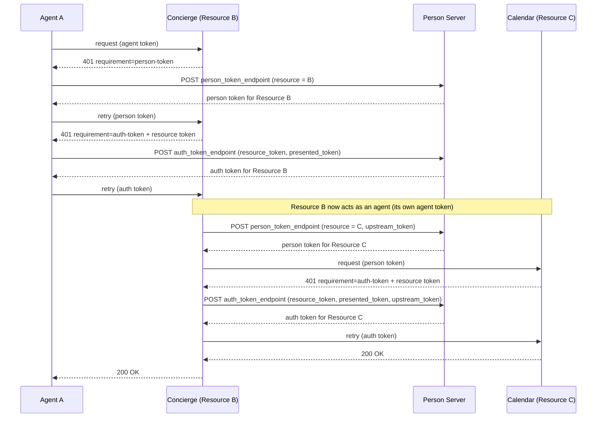

# Call Chaining

Call chaining enables multi-hop access where a resource acts as an agent to
downstream resources on behalf of its caller. The intermediary presents the
token its caller presented to it as `upstream_token`; the person server
authorizes every hop and holds the chain. Tokens carry no delegation chain
claim (§Why There Is No Delegation Chain Claim).

## Scenario



1. Agent A calls Resource B with an agent token → Resource B asks for a person token
2. Agent A obtains a person token for Resource B and retries → Resource B
   challenges with a resource token naming that person token
3. Agent A exchanges the resource token and the person token (`presented_token`)
   at its PS → gets an auth token for Resource B, retries, and Resource B accepts
4. Resource B, signing with its own agent token, requests a person token for
   Resource C at the PS the upstream token names, with Agent A's auth token as
   `upstream_token`
5. Resource B presents that person token at Resource C → Resource C challenges
6. Resource B sends the resource token, its person token as `presented_token`,
   and the same `upstream_token` to the PS → gets an auth token for Resource C
   that carries the upstream `mission_s256` (if any) and expires no later than
   the upstream token
7. Resource C verifies the auth token like any other; it sees the person
   (`ps`, `sub`) and the signing intermediary, not the upstream parties

## Running the Sample

```bash
make demo   # starts the resource servers (Profile, Calendar, Trips, Wallet, Inbox), PS, AP, Concierge, stub Access Server, both UIs
```

Then open <http://localhost:5240/call-chain> to see the flow in action.
The Concierge runs on port 5200, acting as both resource (verifies callers) and agent (calls Calendar's three-party `/events` endpoint on port 5001).

## SDK Support

### Client Side — Challenge Handling (Transparent)

The calling agent uses standard challenge handling. The SDK automatically handles
the person-token and auth-token challenges and the retries:

```csharp
using AAuth.Agent;
using AAuth.Crypto;
using AAuth;

IKeyStore keyStore = FileKeyStore.Default();
var localKeyHandle = configuration["AAuth:LocalKeyHandle"]!;
var key = await keyStore.LoadAsync(localKeyHandle)
    ?? throw new InvalidOperationException("Key not found.");
var refreshEndpoint = configuration["AAuth:ApRefreshEndpoint"]!;

using var client = AAuthClientBuilder.Enrolled(key)
    .RefreshingFrom(refreshEndpoint, localKeyHandle)
    .WithKeyStore(keyStore)
    .WithChallengeHandling(personServer)
    .Build();

// The Concierge challenges for a person token, then for an auth token.
// SDK handles both exchanges transparently.
var response = await client.GetAsync("https://concierge.example");
```

### Intermediate Service — Resource + Agent Pattern

The intermediate service (Concierge) acts as both a resource and an agent. It
must be its own agent provider: it publishes `/.well-known/aauth-agent.json` on
its own origin and signs downstream requests with an agent token it issued to
itself, so the upstream token's `aud` (the Concierge) equals that agent token's
`iss` (§Intermediary Agent Identity).

#### Simplified Pattern (Recommended)

Use `UseAAuthIntermediary` for verification + challenge, and `WithCallChaining(ctx)` for automatic downstream routing:

```csharp
// Middleware: verify callers + auto-challenge for person and auth tokens
app.UseWhen(
    ctx => !ctx.Request.Path.StartsWithSegments("/.well-known"),
    branch => branch.UseAAuthIntermediary(
        verification => verification.ResourceIdentifier = conciergeUrl,
        challenge =>
        {
            challenge.AccessMode = AAuthAccessMode.RequireAuthToken;
            challenge.ResourceSigningKeys = new AAuthSigningKeySet("orch-1", conciergeKey);
            challenge.ResourceIdentifier = conciergeUrl;
        }));

// Only auth-token callers reach this handler
app.MapGet("/", async (HttpContext ctx) =>
{
    using var downstream = new AAuthClientBuilder(myKey)
        .WithTokenRefresh(refreshFunc)
        .WithCallChaining(ctx)  // reads upstream token from UpstreamAuthTokenFeature
        .Build();

    var response = await downstream.GetAsync(downstreamUrl);
    var body = await response.Content.ReadAsStringAsync();
    return Results.Ok(JsonNode.Parse(body));
});
```

`WithCallChaining(ctx)` automatically:
- Reads the upstream person or auth token from `UpstreamAuthTokenFeature` (set by verification middleware)
- Routes every downstream token request to the PS the upstream token names (a
  person token's `iss`, an auth token's `ps`) via `CallChainingRouter` — never
  the `ps` of the intermediary's own agent token
- Sends `upstream_token` on the downstream person token request and on the auth
  token request, and sends no `mission_s256` of its own (the PS carries the
  upstream token's mission forward)
- Handles the person-token and auth-token challenges and retries transparently

#### Lower-Level Pattern

For full control over the exchange, use the building blocks directly:

```csharp
// 1. Verify incoming requests with full issuer verification
app.UseAAuthVerification(options => options.ResourceIdentifier = conciergeUrl);

app.MapGet("/", async (HttpContext ctx) =>
{
    var tokenType = ctx.GetAAuthTokenType();

    // Agent token → ask the caller for a person token
    if (tokenType == AAuthTokenType.AgentToken)
    {
        ctx.Response.Headers[AAuthRequirementHeader.Name] = AAuthRequirementHeader.FormatPersonToken();
        return Results.Unauthorized();
    }

    // Person token → challenge for an auth token with a resource token naming it
    var presented = ctx.GetAAuthVerifiedAssertion()!;
    if (tokenType == AAuthTokenType.PersonToken)
        return ctx.ChallengeAAuth(
            await AAuthChallengeMiddleware.BuildResourceTokenAsync(challengeOptions, presented, scope: "concierge"));

    // Auth token → it is the upstream token for downstream requests
    var upstream = presented.CompactToken;
    var downstreamPs = CallChainingRouter.ResolveDownstreamServer(upstream, exchangeClient.EgressPolicy);

    // 2. Person token for the downstream resource, under the upstream token
    var personToken = await exchangeClient.RequestPersonTokenAsync(
        downstreamPs, downstreamResource, new TokenExchangeRequest { UpstreamToken = upstream });

    // ...present personToken downstream; its 401 carries resourceToken...

    // 3. Auth token request: resource_token + presented_token + upstream_token
    var chained = await exchangeClient.ExchangeAsync(
        downstreamPs, resourceToken,
        new TokenExchangeRequest { PresentedToken = personToken, UpstreamToken = upstream });

    // 4. Call downstream with the chained auth token
    using var downstream = new AAuthClientBuilder(myKey)
        .UseJwt(chained)
        .Build();
    var result = await downstream.GetAsync(calendarUrl); // e.g. http://localhost:5001/events
    return Results.Json(await result.Content.ReadFromJsonAsync<JsonNode>(),
        statusCode: (int)result.StatusCode);
});
```

### UseJwt — Presenting a Pre-Acquired Token

When an intermediary already holds a token (from exchange), use `UseJwt` to present it directly without token refresh:

```csharp
// UseJwt(string) — static token
using var fixedTokenClient = new AAuthClientBuilder(key)
    .UseJwt(chainedAuthToken)
    .Build();

// UseJwt(Func<string>) — dynamic token
using var dynamicTokenClient = new AAuthClientBuilder(key)
    .UseJwt(() => GetLatestToken())
    .Build();
```

### Token Exchange with upstream_token

When calling `TokenExchangeClient.ExchangeAsync`, pass the upstream token beside
the token you presented downstream:

```csharp
var exchange = new TokenExchangeClient(signedClient, metadata);
var downstreamToken = await exchange.ExchangeAsync(
    personServer: "https://ps.example",
    resourceToken: resourceToken,
    new TokenExchangeRequest
    {
        PresentedToken = heldToken,       // the downstream person token the resource token names
        UpstreamToken = incomingAuthToken, // the token the caller presented to this intermediary
    });
```

The SDK includes the upstream token as `upstream_token` in the POST body to the
PS auth token endpoint. An intermediary may reuse the same upstream token for any
number of downstream requests until it expires; downstream tokens never outlive
it. A revoked upstream token is `400 revoked_upstream_token` on a new request,
and a pending downstream request whose upstream token expires ends with
`408 expired` (or `403 revoked` if it is revoked while pending).

The PS also answers `revoked_upstream_token` when it has revoked the calling
agent (the agent it issued the upstream token to): its agent token, or its
agent-person binding. Every token the PS issues directly to an agent is recorded
against that agent's binding, so revoking the binding blocks the agent, even
after it refreshes its agent token, and every chain that started from it. A
later enrollment creates a new binding generation; it does not un-revoke the old
chains. Register the inventory and the binding store on the Person Server
builder so the host holds both. Binding revocation records the inventory
generation before opening the binding store for a future enrollment; if the
inventory write fails, the old binding remains live and no new person can bind
against still-live grants.

```csharp
var inventory = new InMemoryJtiStore();   // use a durable IJtiStore in production
var bindings = new InMemoryAgentPersonBindingStore();
builder.Services.AddAAuthPersonServer(configure: options =>
    {
        options.Issuer      = psIssuer;
        options.SigningKeys = new AAuthSigningKeySet(PsKid, psKey);
    })
    .UseAgentPersonBindingStore(bindings)
    .UseTokenInventory(inventory);

// Later, when the person unlinks the agent:
await AgentPersonBinding.RevokeAsync(inventory, bindings, psIssuer, "https://ap.example", "aauth:assistant@ap.example");
```

### Downstream Auth Tokens Carry No Delegation Chain

A chained auth token looks like any other auth token. It names the person
(`ps`, `sub`), binds the intermediary's key through `cnf.jwk`, and carries the
upstream `mission_s256` when there is one. It has no `agent` or `act` claim: the
downstream resource already knows its immediate caller from the signature, and
the PS, which authorized every hop, holds the chain in its mission log.

```json
{
  "iss": "https://ps.example",
  "dwk": "aauth-person.json",
  "aud": "https://calendar.example",
  "ps": "https://ps.example",
  "sub": "pairwise-sub",
  "scope": "calendar.read",
  "mission_s256": "dBjftJeZ4CVP-mB92K27uhbUJU1p1r_wW1gFWFOEjXk"
}
```

A PS that mints the downstream token by hand bounds it by the verified upstream
token and copies its mission:

```csharp
var token = await new AuthTokenBuilder
{
    AgentTokenExpiresAt = verifiedAgent.ExpiresAt,
    AuthorizationExpiresAt = verifiedUpstream.ExpiresAt, // never outlives the upstream token
    Issuer = psIssuer,
    Audience = downstreamResource,
    PersonServer = psIssuer,
    Subject = directedSubject,                  // sub from the downstream resource token
    AgentConfirmationKey = resourceBKey,        // the intermediary's key
    MissionS256 = verifiedUpstream.MissionS256, // the upstream mission, unchanged
    Key = psKey,
    KeyId = "ps-key-1",
    Scope = "downstream:read",
}.BuildAsync();
```

## AgentConsole Support

Pass `--upstream-token` to include an upstream token in the exchange:

```bash
dotnet run --project samples/AgentConsole -- http://localhost:5001/events \
  --ap http://localhost:5301 --ps http://localhost:5100 \
  --upstream-token "eyJ..."
```

Or test the full call chain through the Concierge:

```bash
dotnet run --project samples/AgentConsole -- http://localhost:5200 \
  --ap http://localhost:5301 --ps http://localhost:5100
```

## Verification at the Final Resource

The final resource (Calendar) validates the chained auth token using standard middleware. JWT issuer verification is mandatory. The middleware verifies:

- JWT signature against the PS's JWKS
- `aud` matches the resource's identifier
- `cnf.jwk` matches the request signing key (PoP binding)

There is nothing chain-specific to check: the resource enforces the token it
receives, and the PS attributes the chain.

## PS-Side — Upstream Token Validation

When a PS receives an `upstream_token` parameter during a call-chaining request,
it must validate the token per §Upstream Token Verification. `MapAAuthPersonServer`
does this for SDK-hosted endpoints through `AgentIssuanceContext.VerifyAsync` and
the PS token inventory (`IJtiStore`). Manual endpoints must use the PS-aware
primitive, not the steps-1–3 helper alone:

```csharp
var result = await new UpstreamTokenValidator(metadata, jwks, tokenVerifier)
    .ValidateAtPersonServerAsync(
        upstreamToken,
        intermediary: intermediaryResourceUrl, // aud equals intermediary agent-token iss
        personServer: psIssuer,                // person iss / auth ps
        inventory: jtiStore,                   // PS provenance inventory
        isTrustedAuthTokenIssuer: (iss, ct) =>
            ValueTask.FromResult(trustedAccessServers.Contains(iss)),
        CancellationToken.None);

if (!result.IsValid)
    return AAuthProblemDetails.TokenFailure(
        new TokenVerificationException(result.FailureCode, result.Error ?? "Invalid upstream token.")
        {
            Credential = TokenCredential.Upstream,
        });
```

The full PS validator performs §Upstream Token Verification steps 1–5:
1. Verifies the token as a person token or an auth token (by `typ`) via issuer
   JWKS discovery; `cnf.jwk` is the calling agent's key and is not compared with
   the intermediary's signing key
2. Checks the issuer: the PS a person token's `iss` or an auth token's `ps`
   names must equal this PS. For an AS-issued auth token, static
   `Trust.AccessServers` may further restrict acceptable AS issuers but is never
   sufficient by itself
3. Checks that the upstream `aud` equals the intermediary's agent-token `iss`
4. Looks up the PS provenance record for the upstream token in `IJtiStore`. A
   missing record (for example after in-memory store loss) fails closed as
   `invalid_upstream_token`; registering an unseen upstream token never creates
   provenance
5. Identifies the original calling agent from that provenance. If the recorded
   agent token or agent-person binding is revoked, the PS rejects the request as
   `revoked_upstream_token`

Every PS-issued person/auth token and every federated AS auth token is recorded
atomically with grant registration. Before the PS presents a source token to an
AS, it rechecks both revocation and local inventory presence for the registered
source dependencies. Losing the inventory for a pending request is treated as a
terminal revocation-style failure rather than allowing the token to be sent
without proof it is still live. Provenance records are pruned at token
`exp + skew`, and the default inventory enforces per-agent distinct-resource
quotas: quota breach returns `429 invalid_request` before a token is minted.
Failures map to `invalid_upstream_token`, `expired_upstream_token`, or
`revoked_upstream_token` (all `400`, except quota backpressure).

## PS-Side — Auth Token Delivery Validation

When the PS receives an auth token response from an AS (four-party flow), it must verify the response before returning it to the agent. Use `AuthTokenResponseValidator`:

```csharp
var deliveryValidator = new AuthTokenResponseValidator(metadata, jwks);

var result = await deliveryValidator.ValidateAsync(
    authToken: responseFromAs,
    expectedIssuer: asUrl,             // must match the AS we sent to
    expectedAudience: resourceUrl,     // downstream resource
    expectedSubject: directedSubject,  // the directed sub from the resource token
    expectedPersonServer: psIssuer,    // this PS, as ps
    agentKey: agentSigningKey,         // cnf.jwk binding check
    presentedTokenExpiresAt: verifiedToken.ExpiresAt, // never outlives the presented token
    requestedScope: "data.read");      // scope narrowing check

if (!result.IsValid)
    return AAuth.Server.AAuthProblemDetails.Create("as_unreachable", statusCode: 502);
```

## See Also

- [Interaction Chaining](../advanced/interaction-chaining.md) — propagating a downstream consent requirement back up the chain when a hop needs human approval (the multi-actor, human-in-the-loop variant of this workflow).
- [Deferred Consent](deferred-consent.md) — agent-side handling of a `202` interaction requirement.
- [Missions](../advanced/missions.md#missions-in-a-call-chain) — how the upstream token's `mission_s256` carries across hops.
