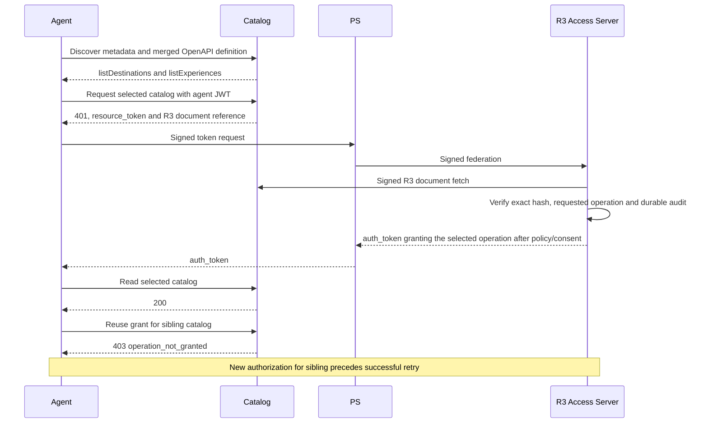

# Travel Catalog Authorization

Catalog aggregates a Destinations backend and an Experiences backend behind one
resource identifier. Both backends expose an operation named `list`. R3 draft-11
removed the OpenAPI Gateway vocabulary, so an aggregating resource must either
publish one valid merged definition, renaming colliding identifiers, or expose
each backend under its own resource identifier
([operation identifier scope](../../aauth-spec/v11/draft-hardt-aauth-r3.md#operation-identifier-scope)).
Catalog publishes one merged OpenAPI 3.1 definition in which the colliding
operations become `listDestinations` and `listExperiences`.

## Run the Catalog

Run `make demo` and open
[SampleApp](http://localhost:5240/catalog-gateway) or the
[GuidedTour](http://localhost:5400/tour?flow=Catalog) (flow 15). Catalog listens on
`http://localhost:5006`; its one purpose is reading travel catalogs. Choose
destinations or experiences and advance the five steps. The tour breaks the same
five steps into its standard per-exchange steps (16 with one consent). Reset
re-enrolls a new agent; catalog definitions and domain data remain immutable.

1. Discover `aauth-resource.json`, whose `r3_vocabularies` entry for
   `urn:aauth:vocabulary:openapi` points at the merged `/openapi.json`.
2. Authorize the selected operation through the PS and R3 AS, completing consent.
3. Read that catalog with the resulting grant.
4. Try the sibling catalog with the same grant. The resource rejects it with 403
   `operation_not_granted`.
5. Authorize the sibling operation explicitly and retry successfully.

The R3 identity is the vocabulary plus `operationId`. A grant for
`listDestinations` never authorizes `listExperiences`, because the merged
definition gives each backend operation a unique identifier.

The scenario is a real HTTP integration. It does not claim to host native
gRPC, GraphQL, MCP, SOAP or OData transports merely because their vocabulary
models exist. Account-aware reservations and Events remain in Bookings.

## Source and Checks

- [Catalog resource](../../samples/MockResourceServers/Catalog/README.md)
- [Shared runtime](../../samples/CapabilitySupport/CatalogDemoSession.cs)
- [Displayed enforcement example](../../samples/CapabilitySupport/CatalogWalkthrough.razor)
- [Shared browser assertions](../../tests/e2e/helpers/catalog.ts), used by both app projects
- [Operation identifier scope (draft-11)](../../aauth-spec/v11/draft-hardt-aauth-r3.md#operation-identifier-scope)
- [OpenAPI vocabulary (draft-11)](../../aauth-spec/v11/draft-hardt-aauth-r3.md#openapi-vocabulary)
- [R3 workflow](rich-resource-requests.md)

The browser checks both catalog selections, the merged definition, sibling rejection, recovery, exact
step/sequence counts, reset and desktop/narrow layouts. The sample uses the
existing demo lifecycle and explicit loopback admission, with no reset endpoint
or additional external database.