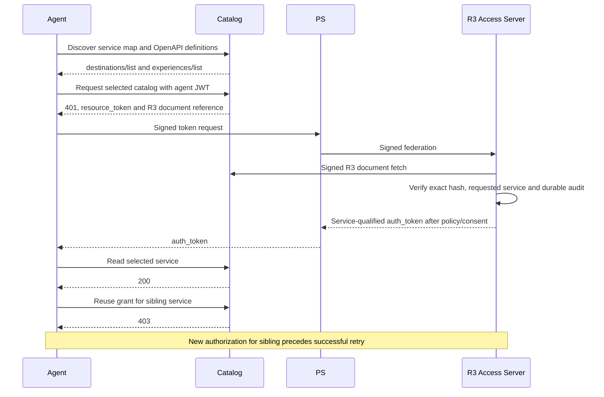

## Run the Catalog

Run `make demo` and open `/catalog-gateway` in
[SampleApp](http://localhost:5240/catalog-gateway) or
[GuidedTour](http://localhost:5400/catalog-gateway). Catalog listens on
`http://localhost:5006`; its one purpose is reading travel catalogs. Choose
destinations or experiences and advance the five steps. Reset re-enrolls a new agent;
catalog definitions and domain data remain immutable.

1. Discover the service-label map and each OpenAPI definition. Both services
   declare an operation named `list`.
2. Authorize the selected service through the PS and R3 AS, completing consent.
3. Read that catalog with the resulting grant.
4. Try the sibling service with the same grant. The resource rejects it with 403.
5. Authorize the sibling explicitly and retry successfully.

The R3 identity includes vocabulary, service and operation ID. A grant for
`destinations/list` never becomes `experiences/list` by matching only `operationId`.

The scenario is a real HTTP gateway integration. It does not claim to host native
gRPC, GraphQL, MCP, SOAP or OData transports merely because their vocabulary
models exist. Account-aware reservations and Events remain in Bookings.

## Source and Checks

- [Catalog resource](../../samples/MockResourceServers/Catalog/README.md)
- [Shared runtime](../../samples/CapabilitySupport/CatalogDemoSession.cs)
- [Displayed enforcement example](../../samples/CapabilitySupport/CatalogWalkthrough.razor)
- [Shared browser assertions](../../tests/e2e/helpers/catalog.ts), used by both app projects
- [OpenAPI gateway vocabulary](../../aauth-spec/v10/draft-hardt-aauth-r3.md#openapi-gateway-vocabulary)
- [R3 workflow](rich-resource-requests.md)

The browser checks both service selections, sibling rejection, recovery, exact
step/sequence counts, reset and desktop/narrow layouts. The sample uses the
existing demo lifecycle and explicit loopback admission, with no reset endpoint
or additional external database.