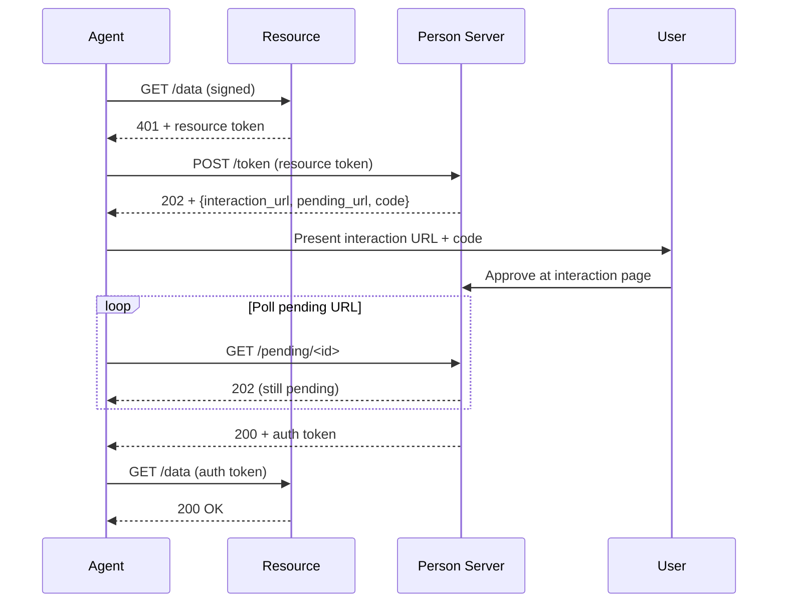

# Deferred Consent (User Approval)

> [PS-Asserted Demo](https://explorer.aauth.dev/access/ps-asserted)

Overview: When the Person Server doesn't have standing consent for the requested access, it returns a 202 with an interaction URL and a pending URL. The agent must present the interaction to the user and poll the pending URL until the PS mints the auth token.



## Manual Polling

```csharp
using AAuth.Agent;
using AAuth.Headers;

var exchange = new TokenExchangeClient(signedClient, metadata);

try
{
    var authToken = await exchange.ExchangeAsync(
        "https://ps.example",
        resourceToken,
        onInteractionRequired: async (interaction, ct) =>
        {
            // Present to user — open browser, show notification, etc.
            Console.WriteLine($"Approve at: {interaction.Url}");
            Console.WriteLine($"Code: {interaction.Code}");
        },
        pollerOptions: new DeferredPollerOptions
        {
            MaxTotalWait = TimeSpan.FromMinutes(5),
            DefaultPollInterval = TimeSpan.FromSeconds(2),
            // Long-poll: server holds connection open up to 30s (RFC 7240)
            PreferWaitSeconds = 30,
        });
}
catch (AAuthInteractionDeniedException)
{
    // User explicitly denied
}
catch (AAuthInteractionTimeoutException)
{
    // Polling timed out without resolution
}
```

## Automatic with AAuthClientBuilder

```csharp
using var client = new AAuthClientBuilder(key)
    .WithTokenRefresh(async (ctx, ct) =>
    {
        var apClient = new AgentProviderClient(new HttpClient(), keyStore);
        return await apClient.RefreshAsync(apRefreshEndpoint, ctx.KeyId, ct);
    })
    .WithChallengeHandling("https://ps.example", options =>
    {
        options.PollingTimeout = TimeSpan.FromMinutes(5);
        options.PreferWaitSeconds = 30; // long-poll (RFC 7240 §4.3)
        options.OnInteractionRequired = async (interaction, ct) =>
        {
            Console.WriteLine($"Approve at: {interaction.Url}");
            Console.WriteLine($"Code: {interaction.Code}");
        };
    })
    .Build();
```

## DI Registration

```csharp
var key = await keyStore.LoadAsync(configuration["AAuth:KeyId"]!);

builder.Services.AddAAuthAgent("deferred", options =>
{
    options.Key = key!;
    options.PersonServer = "https://ps.example";
    options.TokenRefresher = tokenRefresher;
    options.PollingTimeout = TimeSpan.FromMinutes(5);
    options.OnInteractionRequired = async (interaction, ct) =>
    {
        // Present to user — push notification, SignalR, etc.
        await notifier.SendAsync(interaction.Url, interaction.Code, ct);
    };
});
```

See [Dependency Injection](../reference/dependency-injection.md) for full options reference.

<details>
<summary>Manual ChallengeHandler Setup (Advanced)</summary>

```csharp
var challengeHandler = new ChallengeHandler(
    exchange, tokenHolder, "https://ps.example",
    onInteractionRequired: async (interaction, ct) =>
    {
        await new ConsoleInteractionPresenter().PresentAsync(interaction, ct);
    },
    pollerOptions: new DeferredPollerOptions
    {
        MaxTotalWait = TimeSpan.FromMinutes(5)
    })
{
    InnerHandler = signingHandler
};
```

</details>

## Using `IInteractionPresenter`

```csharp
// Built-in: writes to console
var presenter = new ConsoleInteractionPresenter();

// Custom: open browser, send push notification, etc.
class BrowserPresenter : IInteractionPresenter
{
    public Task PresentAsync(AAuthInteraction interaction, CancellationToken ct)
    {
        Process.Start(new ProcessStartInfo(interaction.Url) { UseShellExecute = true });
        return Task.CompletedTask;
    }
}
```

## `DeferredPollerOptions`

| Property | Default | Description |
|----------|---------|-------------|
| `MaxTotalWait` | 5 minutes | Maximum total polling time before timeout |
| `DefaultPollInterval` | 5 seconds | Time between polls (server may override via Retry-After) |
| `MinPollInterval` | 100ms | Floor for poll interval |

## Error Scenarios

- `AAuthInteractionDeniedException` — user clicked "Deny"
- `AAuthInteractionTimeoutException` — `MaxTotalWait` elapsed
- PS returns `slow_down` — poller backs off automatically

## Further Reading

- [PS-Asserted Access](ps-asserted-access.md)
- [Error Handling](../advanced/error-handling.md)
