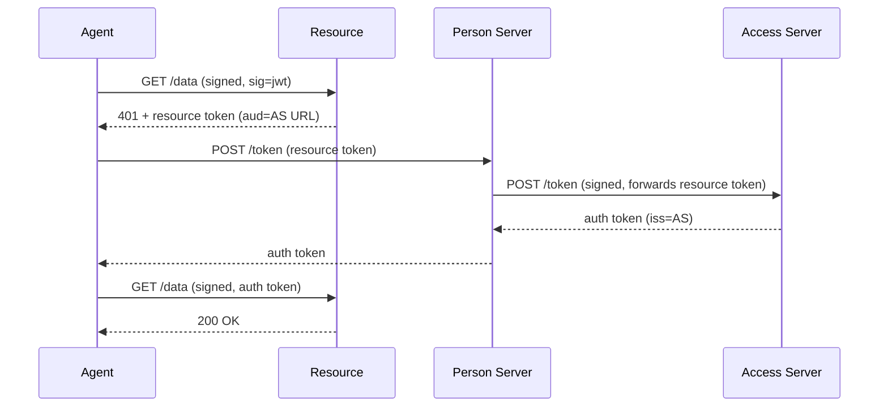
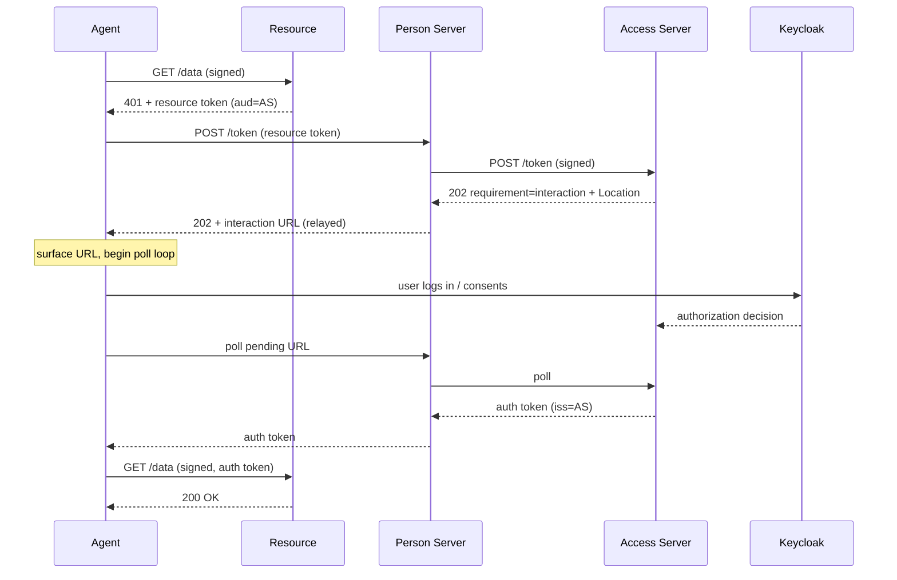

# Federated Access (Four-Party)

> [Live demo](https://explorer.aauth.dev/access/federated) | [Access Mode Comparison](https://explorer.aauth.dev/access/compare)

Overview: The resource has its own Access Server (AS) that enforces policy. The PS federates with the AS to obtain the auth token. From the agent's perspective, the flow looks identical to PS-asserted — the federation happens between PS and AS transparently.



## Agent-Side Code

Identical to PS-asserted — `WithChallengeHandling()` handles it transparently. The only difference is the resource token's `aud` points to the AS URL instead of the PS URL.

```csharp
using AAuth.Agent;
using AAuth.Crypto;
using AAuth;

var keyStore = FileKeyStore.Default();
var key = await keyStore.LoadAsync(configuration["AAuth:LocalKeyHandle"]!)
    ?? throw new InvalidOperationException("Key not found. Run enrollment first.");
var apRefreshEndpoint = configuration["AAuth:ApRefreshEndpoint"]!;

using var client = AAuthClientBuilder.Enrolled(key)
    .RefreshingFrom(apRefreshEndpoint, configuration["AAuth:LocalKeyHandle"]!)
    .WithKeyStore(keyStore)
    .WithChallengeHandling(personServer: "https://ps.example")
    .Build();

var response = await client.GetAsync("https://resource.example/data");
```

## DI Registration

Identical to PS-asserted — the federation is transparent to the agent:

```csharp
using AAuth.Agent;
using AAuth.Crypto;

var keyStore = FileKeyStore.Default();
var key = await keyStore.LoadAsync(configuration["AAuth:LocalKeyHandle"]!);
var apRefreshEndpoint = configuration["AAuth:ApRefreshEndpoint"]!;

builder.Services.AddAAuthAgent("federated", options =>
{
    options.Key = key!;
    options.PersonServer = "https://ps.example";
    options.TokenRefresher = AgentProviderTokenRefresher.Create(apRefreshEndpoint, configuration["AAuth:LocalKeyHandle"]!)
        .WithKeyStore(keyStore)
        .Build();
});
```

See [Dependency Injection](../reference/dependency-injection.md) for full reference.

## Key Difference from PS-Asserted

The resource token `aud` = AS URL (not PS URL). The PS recognizes this and federates to the AS rather than issuing the auth token itself.

## Person-Server-Side Code (federation)

The federation happens at the Person Server. When the PS receives `POST /token`,
it peeks the resource token's `aud`: if it is the PS itself, the PS asserts
access directly (three-party). If it is a **trusted Access Server**, the PS makes
a signed server-to-server call to the AS and relays the AS-minted auth token back
to the agent.

```csharp
// MockPersonServer — federation branch (simplified).
var aud = PeekJwtAudience(resourceToken);

if (aud == psIssuer)
{
    // Three-party: the PS asserts access itself.
    return Results.Json(new { auth_token = MintLocally(...) });
}

if (!trustedAccessServers.Contains(aud))
{
    return Results.Json(new { error = "untrusted_access_server" }, statusCode: 403);
}

// Four-party: federate to the AS. The PS signs the call with the `jwks_uri`
// scheme so the AS can pin the caller to a trusted Person Server.
// `FederateAsync` drives the whole AS exchange — including polling any
// `202` deferred/interaction/claims requirement to completion — and returns
// the verified `aa-auth+jwt` directly.
var authToken = await accessServerClient.FederateAsync(aud, new AccessServerRequest
{
    ResourceToken    = resourceToken,
    AgentToken       = agentToken,
    ExpectedAudience = resourceUrl,   // resource token `iss`
    ExpectedAgentId  = agentId,
    AgentKey         = agentConfirmationKey,
}, ct);

return Results.Json(new { auth_token = authToken });
```

> Both branches above — the three-party mint and the four-party federation — are
> packaged in the one-call host helper `MapAAuthPersonServer` (set
> `TrustedAccessServers` to enable the federation branch). See
> [Token Issuance → One-Call Person Server](../server/token-issuance.md#one-call-person-server-mapaauthpersonserver).

## Access-Server-Side Code

The Access Server is the fourth party. The whole token-endpoint pipeline ships
as a single host helper, `MapAAuthAccessServer`: it publishes the
`/.well-known/aauth-access.json` metadata + JWKS, verifies the RFC 9421 request
signature (pinning the caller's `jwks_uri` host to a trusted Person Server),
verifies the agent and resource tokens, evaluates policy through a pluggable
`IAccessPolicy`, and mints the auth token.

```csharp
using AAuth.Access;

// Register the policy decision point (stub | keycloak) and the store that
// parks deferred decisions (§Claims Required / interactive consent).
builder.Services.AddSingleton<IAccessPolicy>(new StubAccessPolicy(requiredClaims));
builder.Services.AddSingleton<IAccessPendingStore, InMemoryAccessPendingStore>();

var app = builder.Build();

// One call maps /.well-known + JWKS, request-signature verification, and
// POST /token + GET|POST /pending/{id}.
app.MapAAuthAccessServer(new AAuthAccessServerOptions
{
    Issuer               = asIssuer,
    SigningKeys          = new Dictionary<string, AAuthKey> { [AsKid] = asKey },
    DefaultScope         = "whoami",
    TrustedPersonServers = trustedPersonServers,
});
```

The helper resolves `IAccessPolicy` and `IAccessPendingStore` from DI. The
policy returns one of `Allow` / `Deny` / `NeedsInteraction` / `NeedsClaims` /
`NeedsPayment`; the helper maps those to a minted auth token, `403`, or a `202`
that parks the decision and advertises the requirement to the PS.
### The `dwk=aauth-access.json` tell

The auth token's `dwk` (discovery well-known) claim points at
`/.well-known/aauth-access.json` — **not** `/.well-known/aauth-person.json`. This
is how the resource knows the token was minted by an Access Server and verifies
it against the AS's JWKS rather than the PS's.

| Minted by | `dwk` | `iss` |
| --- | --- | --- |
| Person Server (three-party) | `aauth-person.json` | PS URL |
| Access Server (four-party) | `aauth-access.json` | AS URL |

## Keycloak-Backed Access Server

The reference [Mock Access Server](../../samples/MockAccessServer/README.md)
ships a pluggable `IAccessPolicy`. The `keycloak` provider makes Keycloak the
policy decision point: the AS adapter performs the AAuth crypto while Keycloak
handles the interactive user login and the authorization decision (UMA
`uma-ticket` grant). The realm models the resource scopes (`whoami`,
`whoami:admin`) and an admin role.

See the [Mock Access Server README](../../samples/MockAccessServer/README.md)
for the realm/client/resource/scope/policy setup and the claim mapping.

## Consent Bubble-Up (interactive AS)

When the AS policy engine needs an interactive user login/consent, the
AS cannot decide synchronously. It returns `202` with
`AAuth-Requirement: requirement=interaction` and a `Location` URL. The PS
**relays** that `202` back to the agent on the same challenge pipeline, and the
agent surfaces the AS interaction URL and polls until the verdict resolves —
structurally identical to PS-asserted deferred consent, but the consent screen is
the AS's, not the Person Server's. Both AS policies exercise this path: the
`stub` policy renders its own Approve/Deny consent page
(`AccessServer:RequireConsent`), and the `keycloak` policy hands off to
Keycloak's login/consent screen.



Because the relay rides the existing `WithChallengeHandling` /
`OnInteractionRequired` callback, the agent code is unchanged from PS-asserted
deferred consent — federation (and any AS interaction) is transparent.

## Try It

| Demo | Command | AS policy |
| --- | --- | --- |
| Both UIs, no Docker | `make demo` | `stub` (interactive consent) |
| Both UIs, real Keycloak | `make demo-keycloak` | `keycloak` (interactive) |

In the GuidedTour pick **Federated** mode; in the SampleApp open the
**Federated (Four-Party)** page. With the Keycloak policy, log in as `demo`/`demo`
(admin, full access) or `guest`/`guest` (limited).

## PS-AS Collapse

When the PS and AS are the same server, the wire protocol is unchanged — it's just an internal evaluation. No code changes needed on either side.

## Identity-Claims Push (`requirement=claims`)

When an Access Server needs identity claims it does not hold to make a policy
decision, it answers the PS's token request with `202` and
`AAuth-Requirement: requirement=claims`, listing the claim names in the body's
`required_claims` array (AAuth §Claims Required):

```http
HTTP/1.1 202 Accepted
Location: https://as.example/pending/xyz
AAuth-Requirement: requirement=claims
Content-Type: application/json

{ "status": "pending", "required_claims": ["email", "tenant"] }
```

The Person Server is the identity authority, so it supplies the requested
claims — including a directed pseudonymous `sub` — by POSTing a **signed**
request to the `Location` URL, then resumes polling that same URL for the
issued auth token. In the SDK this is a single additive callback on the PS's
federation request:

```csharp
var fedRequest = new AccessServerRequest
{
    ResourceToken = resourceTokenJwt,
    AgentToken = agentTokenJwt,
    ExpectedAudience = resourceUrl,
    ExpectedAgentId = agentId,
    AgentKey = agentConfirmationKey,
    RequestedScope = scope,
    // The AS asked for identity claims; answer with a directed sub + claims.
    OnClaimsRequired = (requirement, ct) =>
    {
        var claims = new Dictionary<string, JsonNode?>(StringComparer.Ordinal);
        foreach (var name in requirement.RequiredClaims)
        {
            if (heldClaims.TryGetValue(name, out var value))
            {
                claims[name] = value;
            }
        }
        return Task.FromResult(new ClaimsResponse
        {
            Subject = directedSubject,
            Claims = claims,
        });
    },
};
```

`AccessServerClient.FederateAsync` reads `required_claims`, invokes the
callback, POSTs the returned `ClaimsResponse` (signed, origin-pinned to
the AS) to the `Location`, and continues the poll loop to the `200` auth token.
The `Subject` (directed `sub`) is mandatory — leaving it blank surfaces an
`InvalidOperationException`. The issued auth token asserts the pushed claims
(the AS sets `sub` to the directed identifier, promotes `tenant` to the named
`tenant` claim, and echoes the recognized claims). Try it with the stub policy
by configuring the Access Server with `AccessServer:RequireClaims` (e.g.
`AccessServer__RequireClaims__0=email`); the demo Person Server releases
`email`, `tenant`, and `name` for its bound principal.

## Further Reading

- [PS-Asserted Access](ps-asserted-access.md)
- [Mock Access Server](../../samples/MockAccessServer/README.md)
- [Access Mode Comparison](https://explorer.aauth.dev/access/compare)
