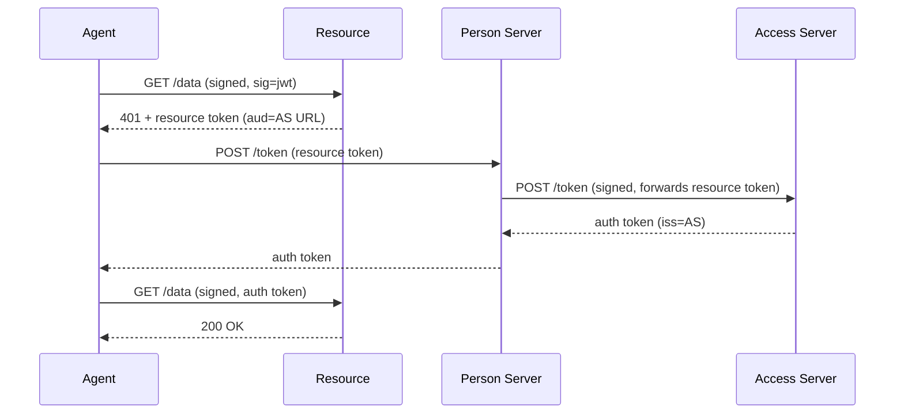

# Federated Access (Four-Party)

> [Live demo](https://explorer.aauth.dev/access/federated) | [Access Mode Comparison](https://explorer.aauth.dev/access/compare)

Overview: The resource has its own Access Server (AS) that enforces policy. The PS federates with the AS to obtain the auth token. From the agent's perspective, the flow looks identical to PS-asserted — the federation happens between PS and AS transparently.



## Agent-Side Code

Identical to PS-asserted — `WithChallengeHandling()` handles it transparently. The only difference is the resource token's `aud` points to the AS URL instead of the PS URL.

```csharp
var apRefreshEndpoint = configuration["AAuth:ApRefreshEndpoint"]!;

using var client = new AAuthClientBuilder(key)
    .WithTokenRefresh(async (ctx, ct) =>
    {
        var apClient = new AgentProviderClient(new HttpClient(), keyStore);
        return await apClient.RefreshAsync(apRefreshEndpoint, ctx.KeyId, ct);
    })
    .WithChallengeHandling(personServer: "https://ps.example")
    .Build();

var response = await client.GetAsync("https://resource.example/data");
```

## DI Registration

Identical to PS-asserted — the federation is transparent to the agent:

```csharp
var key = await keyStore.LoadAsync(configuration["AAuth:KeyId"]!);
var apRefreshEndpoint = configuration["AAuth:ApRefreshEndpoint"]!;

builder.Services.AddAAuthAgent("federated", options =>
{
    options.Key = key!;
    options.PersonServer = "https://ps.example";
    options.TokenRefresher = new ApTokenRefresher(keyStore, apRefreshEndpoint);
});

// Sample implementation — not part of the SDK.
// Implements AAuth.Agent.ITokenRefresher for refresh via an Agent Provider.
class ApTokenRefresher(IKeyStore keyStore, string apRefreshEndpoint) : ITokenRefresher
{
    public async Task<string> RefreshAsync(TokenRefreshContext ctx, CancellationToken ct)
    {
        var apClient = new AgentProviderClient(new HttpClient(), keyStore);
        return await apClient.RefreshAsync(apRefreshEndpoint, ctx.KeyId, ct);
    }
}
```

The example uses these SDK types: `IKeyStore` / `ITokenRefresher` / `TokenRefreshContext` (all in `AAuth.Agent`) and `AgentProviderClient` (in `AAuth.Agent`). `ApTokenRefresher` itself is illustrative only — implement your own `ITokenRefresher` for production refresh strategies.

## Key Difference from PS-Asserted

The resource token `aud` = AS URL (not PS URL). The PS recognizes this and federates to the AS rather than issuing the auth token itself.

## PS-AS Collapse

When the PS and AS are the same server, the wire protocol is unchanged — it's just an internal evaluation. No code changes needed on either side.

## Further Reading

- [PS-Asserted Access](ps-asserted-access.md)
- [Access Mode Comparison](https://explorer.aauth.dev/access/compare)
