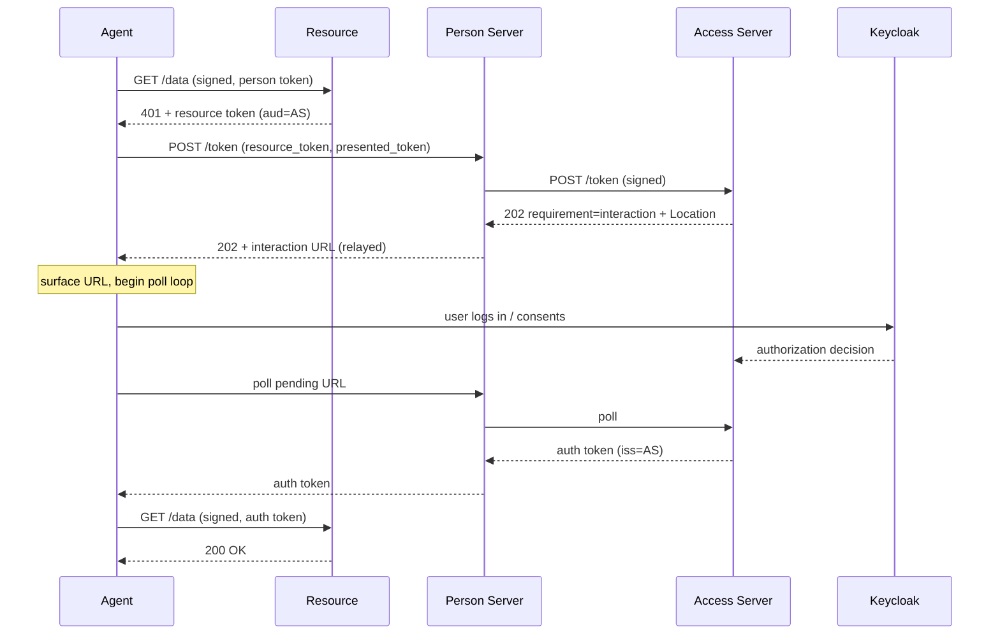

# Federated Access (Four-Party)

> [Live demo](https://explorer.aauth.dev/access/federated) | [Access Mode Comparison](https://explorer.aauth.dev/access/compare)

Overview: The resource has its own Access Server (AS) that enforces policy. The PS federates with the AS to obtain the auth token. From the agent's perspective, the flow looks identical to PS-asserted — the federation happens between PS and AS transparently.

```mermaid
sequenceDiagram
    participant Agent
    participant Resource
    participant PS as Person Server
    participant AS as Access Server
    Agent->>Resource: GET /data (signed, sig=jwt)
    Resource-->>Agent: 401 requirement=person-token
    Agent->>PS: POST /person (resource)
    PS-->>Agent: person token
    Agent->>Resource: GET /data (signed, person token)
    Resource-->>Agent: 401 + resource token (aud=AS URL)
    Agent->>PS: POST /token (resource_token, presented_token)
    PS->>AS: POST /token (signed; resource_token, agent_token, presented_token)
    AS-->>PS: auth token (iss=AS)
    PS-->>Agent: auth token
    Agent->>Resource: GET /data (signed, auth token)
    Resource-->>Agent: 200 OK
```

## Agent-Side Code

Identical to PS-asserted — `WithChallengeHandling()` handles it transparently. The only difference is the resource token's `aud` points to the AS URL instead of the PS URL. The PS passes the person token through to the AS as `presented_token`; the AS verifies it against the resource token and requires its PS (`iss` or `ps`) to be the PS that signed the request.

```csharp
using AAuth.Agent;
using AAuth.Crypto;
using AAuth;

var keyStore = FileKeyStore.Default();
var key = keyStore.Load(configuration["AAuth:LocalKeyHandle"]!)
    ?? throw new InvalidOperationException("Key not found. Run enrollment first.");
var apRefreshEndpoint = configuration["AAuth:ApRefreshEndpoint"]!;

using var client = AAuthClientBuilder.Enrolled(key)
    .RefreshingFrom(apRefreshEndpoint, configuration["AAuth:LocalKeyHandle"]!)
    .WithKeyStore(keyStore)
    .WithChallengeHandling(personServer: "https://ps.example")
    .Build();

var response = await client.GetAsync("https://resource.example/data");
```

## DI Registration

Identical to PS-asserted — the federation is transparent to the agent:

```csharp
using AAuth.Agent;
using AAuth.Crypto;

IKeyStore keyStore = FileKeyStore.Default();
var key = await keyStore.LoadAsync(configuration["AAuth:LocalKeyHandle"]!);
var apRefreshEndpoint = configuration["AAuth:ApRefreshEndpoint"]!;
using var refresher = AgentProviderTokenRefresher.Create(apRefreshEndpoint, configuration["AAuth:LocalKeyHandle"]!)
    .WithKeyStore(keyStore).Build();

builder.Services.AddAAuthAgent("federated", options =>
{
    options.Signer = key!;
    options.PersonServer = "https://ps.example";
    options.TokenRefresher = refresher;
});
```

See [Dependency Injection](../reference/dependency-injection.md) for full reference.

## Key Difference from PS-Asserted

The resource token `aud` = AS URL (not PS URL). The PS recognizes this and federates to the AS rather than issuing the auth token itself.

## Person-Server-Side Code (federation)

The federation happens at the Person Server. When the PS receives `POST /token`,
it peeks the resource token's `aud`: if it is the PS itself, the PS asserts
access directly (three-party). If it is a **trusted Access Server**, the PS makes
a signed server-to-server call to the AS and relays the AS-minted auth token back
to the agent.

```csharp
using AAuth.Person;

builder.Services.AddAAuthPersonServer(configure: options =>
    {
        options.Issuer      = psIssuer;
        options.SigningKeys = new AAuthSigningKeySet(PsKid, psKey);
    })
    .WithTrust(trust => trust.AccessServers.Allowed = trustedAccessServers)
    .UseClaimsAsserter(identityAsserter)
    // The PS→AS client: signs the federated token request as this PS.
    .WithFederation();
var app = builder.Build();
app.MapAAuthPersonServer();
```

> Both branches above — the three-party mint and the four-party federation — are
> packaged in the one-call host helper `MapAAuthPersonServer`, registered with
> `AddAAuthPersonServer`. Federation is open
> by default: with `Trust.AccessServers` unset the PS federates to the AS named
> in a verified resource token's `aud`; set its `Allowed` list (or
> `Predicate`) to pin specific Access Servers, or set `Allowed` empty for three-party only. See
> [Token Issuance → One-Call Person Server](../server/token-issuance.md#one-call-person-server-mapaauthpersonserver).

## Access-Server-Side Code

The Access Server is the fourth party. The whole token-endpoint pipeline ships
as a single host helper, `MapAAuthAccessServer`: it publishes the
`/.well-known/aauth-access.json` metadata + JWKS, verifies the RFC 9421 request
signature (pinning the caller's `jwks_uri` host to a trusted Person Server),
verifies the agent, resource, and presented tokens (the presented token's PS must
be the calling PS), evaluates policy through a pluggable
`IAccessPolicy`, and mints the auth token.

```csharp
using AAuth.Access;

// Register the Access Server with its policy decision point (stub | keycloak).
// Deferred decisions (§Claims Required / interactive consent) park in the
// default InMemoryAccessPendingStore; replace it with UsePendingStore.
builder.Services.AddAAuthAccessServer(configure: options =>
    {
        options.Issuer       = asIssuer;
        options.SigningKeys  = new AAuthSigningKeySet(AsKid, asKey);
        options.DefaultScope = "wallet.read";
    })
    .WithTrust(trust => trust.PersonServers.Allowed = trustedPersonServers)
    .UsePolicy(accessPolicy);

var app = builder.Build();

// One call maps /.well-known + JWKS, request-signature verification, and
// POST /token + GET|POST /pending/{id}.
app.MapAAuthAccessServer();
```

The `IAccessPolicy` is required: startup validation fails without `UsePolicy`
or an `IAccessPolicy` registered in DI. The pending store resolves from
`UsePendingStore`, then an unkeyed `IAccessPendingStore` registration, then the
in-memory default; resolve it in your own endpoints with
`[FromKeyedServices(AAuthAccessServerBuilder.DefaultName)] IAccessPendingStore`. The
policy returns one of `Allow` / `Deny` / `NeedsInteraction` / `NeedsClaims` /
`NeedsPayment`; the helper maps those to a minted auth token, `403`, a `202`
that parks the decision and advertises the requirement to the PS, or a `402`
whose `Location` is the AS pending URL. Payment protocol details live in
`WWW-Authenticate` and/or the response body, not in the `Location`.

> `Trust.PersonServers` follows the same open-by-default rule: unset brokers
> for any *verifiable* Person Server (the spec's "no separate registration
> step"); an empty `Allowed` set denies all; a non-empty set or a `Predicate`
> restricts. Leaving it open logs a startup `Warning`.
### The `dwk=aauth-access.json` tell

The auth token's `dwk` (discovery well-known) claim points at
`/.well-known/aauth-access.json` — **not** `/.well-known/aauth-person.json`. This
is how the resource knows the token was minted by an Access Server and verifies
it against the AS's JWKS rather than the PS's.

| Minted by | `dwk` | `iss` |
| --- | --- | --- |
| Person Server (three-party) | `aauth-person.json` | PS URL |
| Access Server (four-party) | `aauth-access.json` | AS URL |

## Keycloak-Backed Access Server

The reference [Mock Access Server](../../samples/MockAccessServers/Federated/README.md)
ships a pluggable `IAccessPolicy`. The `keycloak` provider makes Keycloak the
policy decision point: the AS adapter performs the AAuth crypto while Keycloak
handles the interactive user login and the authorization decision (UMA
`uma-ticket` grant). The realm models the resource scopes (`wallet.read`,
`wallet.charge`) and a payer role.

See the [Mock Access Server README](../../samples/MockAccessServers/Federated/README.md)
for the realm/client/resource/scope/policy setup and the claim mapping.

## Consent Bubble-Up (interactive AS)

When the AS policy engine needs an interactive user login/consent, the
AS cannot decide synchronously. It returns `202` with
`AAuth-Requirement: requirement=interaction` and a `Location` URL. The PS
**relays** that `202` back to the agent on the same challenge pipeline, and the
agent surfaces the AS interaction URL and polls until the verdict resolves —
structurally identical to PS-asserted deferred consent, but the consent screen is
the AS's, not the Person Server's. Both AS policies exercise this path: the
`stub` policy renders its own Approve/Deny consent page
(`AccessServer:RequireConsent`), and the `keycloak` policy hands off to
Keycloak's login/consent screen.


```mermaid
sequenceDiagram
    participant Agent
    participant Resource
    participant PS as Person Server
    participant AS as Access Server
    participant KC as Keycloak
    Agent->>Resource: GET /data (signed, person token)
    Resource-->>Agent: 401 + resource token (aud=AS)
    Agent->>PS: POST /token (resource_token, presented_token)
    PS->>AS: POST /token (signed)
    AS-->>PS: 202 requirement=interaction + Location
    PS-->>Agent: 202 + interaction URL (relayed)
    Note over Agent: surface URL, begin poll loop
    Agent->>KC: user logs in / consents
    KC-->>AS: authorization decision
    Agent->>PS: poll pending URL
    PS->>AS: poll
    AS-->>PS: auth token (iss=AS)
    PS-->>Agent: auth token
    Agent->>Resource: GET /data (signed, auth token)
    Resource-->>Agent: 200 OK
```

Because the relay rides the existing `WithChallengeHandling` /
`OnInteractionRequired` callback, the agent code is unchanged from PS-asserted
deferred consent — federation (and any AS interaction) is transparent.

## Try It

| Demo | Command | AS policy |
| --- | --- | --- |
| Both UIs, no Docker | `make demo` | `stub` (interactive consent) |
| Both UIs, real Keycloak | `make demo-keycloak` | `keycloak` (interactive) |

In the GuidedTour pick **Federated** mode; in the SampleApp open the
**Federated (Four-Party)** page. With the Keycloak policy, log in as `demo`/`demo`
(admin, full access) or `guest`/`guest` (limited).

## PS-AS Collapse

When the PS and AS are the same origin, roles are still distinct. Collapse is
an explicit declaration: the Person Server configuration names the verified
resource issuer, the linked local Access Server role instance, and the expected
AS issuer. A declared collapse runs the local `IAccessPolicy` internally and
mints an AS-verdict auth token with `dwk=aauth-access.json`. If the linked AS is
missing or its issuer differs from the declaration, the request fails closed;
the SDK never silently falls back to three-party PS assertion. Undeclared
`aud == PS` requests remain normal three-party access and mint
`dwk=aauth-person.json`.

```csharp
builder.Services
    .AddAAuthPersonServer(configure: options =>
    {
        options.Issuer = "https://ps.example";
        options.SigningKeys = new AAuthSigningKeySet("ps-key", AAuthKey.Generate());
    })
    .UseCollocatedAccessServer(
        resourceIssuer: "https://wallet.example",
        accessServerName: "LocalWalletAs",
        expectedAccessServerIssuer: "https://ps.example");

builder.Services
    .AddAAuthAccessServer("LocalWalletAs", options =>
    {
        options.Issuer = "https://ps.example";
        options.SigningKeys = new AAuthSigningKeySet("as-key", AAuthKey.Generate());
    })
    .UsePolicy(new DemoAccessPolicy());

sealed class DemoAccessPolicy : AAuth.Access.IAccessPolicy
{
    public Task<AAuth.Access.AccessDecision> EvaluateAsync(
        AAuth.Access.AccessPolicyRequest request,
        CancellationToken cancellationToken = default) =>
        Task.FromResult(AAuth.Access.AccessDecision.Allow());
}
```

## Payment-required federation

An AS may answer the PS-to-AS token request with `402 Payment Required`. The
SDK owns the loop mechanics: validate the same-origin pending `Location`, call
the PS payment settler, poll the same URL, and compose any later `202`
requirements (claims, interaction, clarification) until `200` or a terminal
error.

```csharp
builder.Services
    .AddAAuthPersonServer(configure: options =>
    {
        options.Issuer = "https://ps.example";
        options.SigningKeys = new AAuthSigningKeySet("ps-key", AAuthKey.Generate());
    })
    .WithFederation()
    .UsePaymentSettler(new DemoPaymentSettler());

sealed class DemoPaymentSettler : AAuth.Access.IAAuthPaymentSettler
{
    public Task<AAuth.Access.AAuthPaymentSettlementResult> SettleAsync(
        AAuth.Access.AAuthPaymentSettlementContext context,
        CancellationToken cancellationToken = default) =>
        Task.FromResult(AAuth.Access.AAuthPaymentSettlementResult.Success);
}
```

`IAAuthPaymentSettler` receives only the payment challenge, AS origin, and
pending URL. It never receives resource, person, agent, or auth JWTs. The
default billing cache is keyed by AS issuer and payment scheme. If no settler is
registered, or settlement is declined, the PS pending request ends as registered
polling error `403 denied` with detail `payment settlement is unavailable`.

## Identity-Claims Push (`requirement=claims`)

When an Access Server needs identity claims it does not hold to make a policy
decision, it answers the PS's token request with `202` and
`AAuth-Requirement: requirement=claims`, listing the claim names in the body's
`required_claims` array (AAuth §Claims Required):

```http
HTTP/1.1 202 Accepted
Location: https://as.example/pending/xyz
AAuth-Requirement: requirement=claims
Content-Type: application/json

{ "status": "pending", "required_claims": ["email", "tenant"] }
```

The Person Server is the identity authority, so it supplies the requested
claims by POSTing a **signed** request to the `Location` URL, then resumes
polling that same URL for the issued auth token. It never pushes `sub`: the
person is already identified by the presented token and the resource token's
`sub`. In the SDK this is a single additive callback on the PS's federation
request:

```csharp
var fedRequest = new AccessServerRequest
{
    ResourceToken = resourceTokenJwt,
    AgentToken = agentTokenJwt,
    PresentedToken = heldToken,                       // the token the resource token's presented_jti names
    PresentedTokenExpiresAt = verifiedToken.ExpiresAt, // bounds the AS-issued auth token
    AuthorizationExpiresAt = verifiedAgent.ExpiresAt,
    ExpectedAudience = resourceUrl,
    ExpectedSubject = directedSubject,                // the resource token's sub
    ExpectedPersonServer = psIssuer,                  // this PS, as the auth token's ps
    AgentKey = agentConfirmationKey,
    RequestedScope = scope,
    // The AS asked for identity claims; answer with the claims this PS holds.
    OnClaimsRequired = (requirement, ct) =>
    {
        var claims = new Dictionary<string, JsonNode?>(StringComparer.Ordinal);
        foreach (var name in requirement.RequiredClaims)
        {
            if (heldClaims.TryGetValue(name, out var value))
            {
                claims[name] = value;
            }
        }
        return Task.FromResult(new ClaimsResponse
        {
            Claims = claims,
        });
    },
};
```

`AccessServerClient.FederateAsync` reads `required_claims`, invokes the
callback, POSTs the returned `ClaimsResponse` (signed, origin-pinned to
the AS) to the `Location`, and continues the poll loop to the `200` auth token.
Protocol-owned names, including `sub`, are rejected when the response is
serialized. The issued auth token keeps the resource token's `sub` and `ps`,
promotes `tenant` to the named `tenant` claim, and echoes the recognized claims.
Try it with the stub policy
by configuring the Access Server with `AccessServer:RequireClaims` (e.g.
`AccessServer__RequireClaims__0=email`); the demo Person Server releases
`email`, `tenant`, and `name` for its bound principal.

## Further Reading

- [PS-Asserted Access](ps-asserted-access.md)
- [Mock Access Server](../../samples/MockAccessServers/Federated/README.md)
- [Access Mode Comparison](https://explorer.aauth.dev/access/compare)
