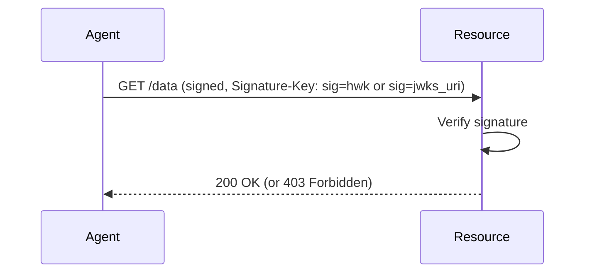

# Identity-Based Access

> [Live demo](https://explorer.aauth.dev/access/identity-based) | [Access Mode Comparison](https://explorer.aauth.dev/access/compare)

## Overview

Simplest access mode. The resource verifies the agent's signature and applies its own access control. No Person Server, no token exchange. The resource decides based on WHO signed the request.

## Sequence Diagram



Valid Signing Modes: `hwk` (pseudonymous) or `jwks_uri` (agent identity). NOT `jwt` — that requires a Person Server.

## Code Example

### Pseudonymous (`hwk`)

```csharp
using AAuth.Crypto;
using AAuth.HttpSig;

var key = AAuthKey.Generate();

using var client = new AAuthClientBuilder(key)
    .UseHwk()
    .Build();

var response = await client.GetAsync("https://resource.example/data");
// 200 if resource's policy allows this key
// 403 if policy denies (signature valid, identity known, access denied)
// 401 if signature invalid (Signature-Error header explains why)
```

### Agent Identity (`jwks_uri`)

```csharp
using var client = new AAuthClientBuilder(key)
    .UseJwksUri("https://ap.example/.well-known/jwks.json", "key-1")
    .Build();
```

## Error Scenarios

| Status | Signature-Error | Cause |
|--------|----------------|-------|
| 401 | `invalid_signature` | Signature doesn't verify |
| 401 | `unknown_key` | For jwks_uri: kid not found in JWKS |
| 401 | `unsupported_algorithm` | Key uses wrong algorithm (only EdDSA supported) |
| 403 | *(none)* | Signature valid but policy denies access |

## Further Reading

- [Signing Modes Overview](../signing-modes/overview.md)
- [Error Model](https://explorer.aauth.dev/foundations/errors)
- [Verification Middleware](../server/verification-middleware.md)
