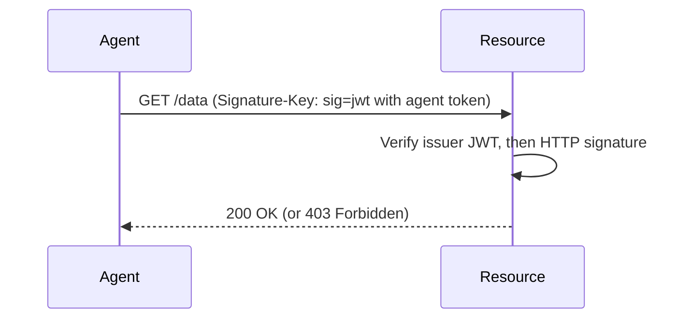

# Identity-Based Access

> [Live demo](https://explorer.aauth.dev/access/identity-based) | [Access Mode Comparison](https://explorer.aauth.dev/access/compare)

## Overview

Simplest access mode. The resource verifies the agent's signature and applies its own access control. No Person Server, no token exchange. The resource decides based on WHO signed the request.

## Sequence Diagram


```mermaid
sequenceDiagram
    participant Agent
    participant Resource
    Agent->>Resource: GET /data (Signature-Key: sig=jwt with agent token)
    Resource->>Resource: Verify issuer JWT, then HTTP signature
    Resource-->>Agent: 200 OK (or 403 Forbidden)
```

The required scheme is `jwt`. An agent token does not require a Person Server.
Generic pseudonymous and direct-key examples are separate Signature Keys uses.

## Code Example

### Agent Token (`jwt`)

```csharp
using AAuth.Crypto;
using AAuth;

// The host publishes this issuer and key in its agent metadata/JWKS.
using var client = AAuthClientBuilder.SelfIssuing(publishedKey)
    .As("https://agent.example", "aauth:agent@agent.example")
    .WithKid(publishedKeyId)
    .Build();

var response = await client.GetAsync("https://resource.example/data");
// 200 if resource's policy allows this key
// 403 if policy denies (signature valid, identity known, access denied)
// 401 if signature invalid (Signature-Error header explains why)
```

### Generic Server Identity (`jwks_uri`)

```csharp
using var client = new AAuthClientBuilder(key)
    .UseJwksUri("https://server.example", "server-configuration", "key-1")
    .Build();
```

## DI Registration

### Agent identity (JWT)

```csharp
using AAuth.Agent;
using AAuth.Crypto;

IKeyStore keyStore = FileKeyStore.Default();
var key = await keyStore.LoadAsync(configuration["AAuth:LocalKeyHandle"]!);

builder.Services.AddAAuthAgent("identity", options =>
{
    options.Signer = key!;
    options.AgentToken = heldAgentToken; // issued for this key; renew externally or set TokenRefresher
});
```

### Generic server identity (jwks_uri)

```csharp
builder.Services.AddAAuthAgent("identity-jwks", options =>
{
    options.Signer = key!;
    options.SignatureKeyProvider = new JwksUriSignatureKeyProvider(
        "https://server.example", "server-configuration", "key-1");
    // Generic signing, not an AAuth resource access mode.
});
```

Inject via `IHttpClientFactory.CreateClient("identity")`. See [Dependency Injection](../reference/dependency-injection.md) for full reference.

## Error Scenarios

| Status | Signature-Error | Cause |
|--------|----------------|-------|
| 401 | `invalid_signature` | Signature doesn't verify |
| 401 | `unknown_key` | For jwks_uri: kid not found in JWKS |
| 401 | `unsupported_algorithm` | Missing or unsupported fully specified alg; Ed25519 and ES256 are accepted |
| 403 | *(none)* | Signature valid but policy denies access |

## Further Reading

- [Signing Modes Overview](../signing-modes/overview.md)
- [Error Model](https://explorer.aauth.dev/foundations/errors)
- [Verification Middleware](../server/verification-middleware.md)
