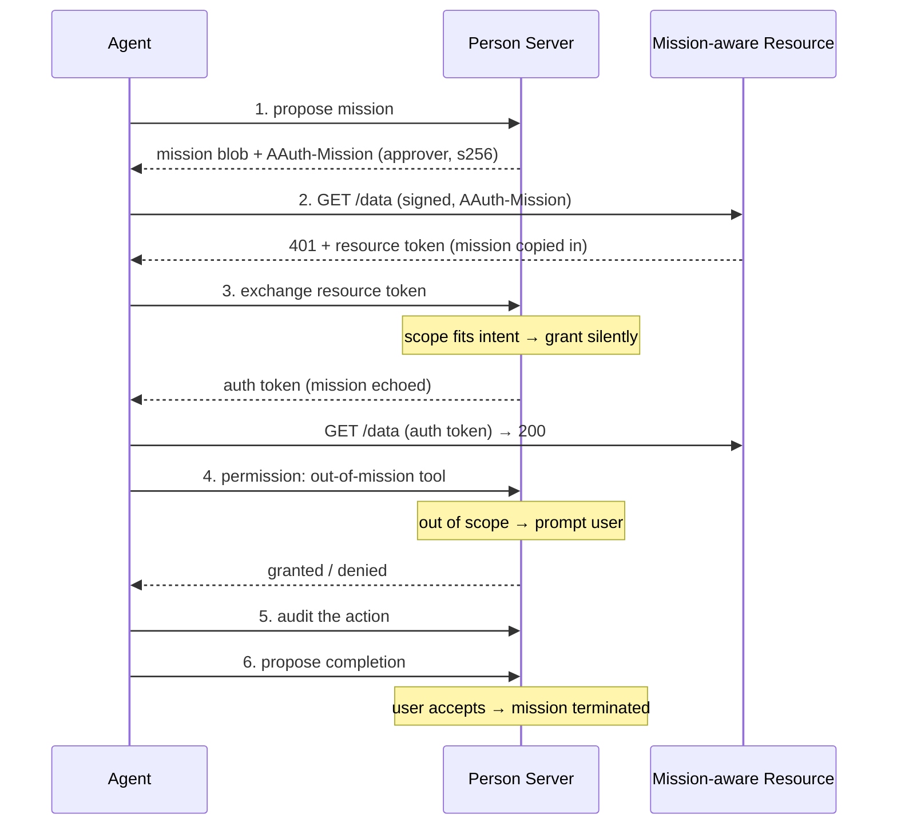

# Mission-Governed Access

> [Mission Lifecycle](https://explorer.aauth.dev/missions/lifecycle)

## Scenario

An agent runs a multi-step task on the user's behalf, governed by a single
approved mission. Throughout the task it mixes two kinds of authority:

- **Resource access** (scopes) — reading and writing remote APIs, carried in auth
  tokens through the usual challenge → exchange → retry pattern.
- **Local actions** (tools) — things the agent does itself, gated at the PS
  permission endpoint.

The PS evaluates each step against the mission's intent: fitting requests resolve
silently, out-of-mission requests prompt the user, and once the mission is
terminated everything is refused. This walkthrough ties together
[Missions](../advanced/missions.md),
[Mission Governance Clients](../advanced/mission-governance-clients.md), and
[Mission Governance (Server)](../server/mission-governance.md).

## The flow at a glance



## 1. Propose the mission

The agent states its intent and the tools it wants pre-approved. The PS may run a
[clarification chat](../advanced/clarification-chat.md) before approving.

```csharp
var governance = new AAuthClientBuilder(key)
    .UseJwt(agentToken)
    .WithPersonServer("https://ps.example")
    .BuildGovernance();

MissionSession session = await governance.ProposeMissionAsync(
    new MissionProposal("Plan my weekend trip to Seattle.")
    {
        Tools = new[] { new MissionTool("add_to_calendar", "Add an itinerary item to the calendar.") },
    });

Mission mission = session.Mission;
```

## 2–3. Access a resource (scope evaluated in context)

Resource access uses the ordinary access flow with the `AAuth-Mission` header
added. A mission-aware resource copies the mission into its resource token, so the
PS sees the mission when it evaluates the requested scope. If the scope fits the
mission's intent, the PS grants the auth token silently and remembers the decision
for the rest of the mission.

```csharp
// WithMission emits the AAuth-Mission header on every request and composes with
// the challenge handler, so the whole 401 → exchange → retry leg is automatic.
using var client = new AAuthClientBuilder(key)
    .UseJwt(agentToken)
    .WithPersonServer("https://ps.example")
    .WithMission(mission)
    .WithChallengeHandling()
    .Build();

// Challenge → exchange → retry happens transparently; the PS judged the scope
// against the mission intent during the exchange.
var response = await client.GetAsync("https://trips.example/trips");
```

A later request for a scope the PS has not seen and that does not fit the intent
is deferred to the user (gate 2). See
[Token Issuance](../server/token-issuance.md#mission-claims) for how the resource
and PS carry the mission claim through the tokens.

## 4. Request permission for a local tool

A tool is an action the agent runs itself. Pre-approved tools resolve locally; any
other action goes to the PS, which prompts the user when it is out of mission.

```csharp
// Pre-approved tool → granted silently.
var add = await session.RequestPermissionAsync(new MissionAction("add_to_calendar"));

// Out-of-mission tool → the PS prompts the user (gate 3).
var cancel = await session.RequestPermissionAsync(
    new MissionAction("cancel_booking"),
    description: "Cancel the existing hotel reservation the user flagged.");

if (!cancel.IsGranted)
{
    Console.WriteLine($"Not allowed: {cancel.Reason}");
}
```

## 5. Audit what happened

After acting, the agent reports it. Auditing always carries the mission and is
fire-and-forget.

```csharp
await session.RecordAuditAsync(
    new MissionAction("add_to_calendar"),
    description: "Added the flight and hotel to the user's calendar.",
    result: new JsonObject { ["items"] = 2 });
```

## 6. Close the mission out

When the work is done the agent proposes completion. The user accepts the summary,
and the PS terminates the mission.

```csharp
bool terminated = await session.ProposeCompletionAsync(
    "Planned the weekend trip: compared 3 flights and 2 hotels, saved the itinerary.");
```

If the PS's interaction relay cannot reach the user synchronously, it returns
`InteractionRelayResult { Pending = true }`; the governance mapper then answers the
completion proposal with a deferred `202` + poll `Location` (§Deferred Consent), and
the agent's `InteractionClient` polls until the user accepts or declines — the same
park-and-poll mechanics used for deferred permission consent.

After termination, any further governed request returns `403 mission_terminated`,
surfaced to the agent as `AAuthMissionTerminatedException` (see
[Error Handling](../advanced/error-handling.md#mission-termination)).

## The binding chain

Across all of these steps the mission travels as the same `{ approver, s256 }`
pair: declared on requests via the `AAuth-Mission` header, copied into the
resource token by a mission-aware resource, and echoed into the auth token by the
PS. The mission content never leaves the PS — only the pointer and its hash do.

## Further reading

- [Missions](../advanced/missions.md) — the mission model and binding chain
- [Mission Governance Clients](../advanced/mission-governance-clients.md) — the agent-side clients
- [Mission Governance (Server)](../server/mission-governance.md) — the PS-side seams and three gates
- [Clarification Chat](../advanced/clarification-chat.md) — refining intent during approval
- [Call Chaining](call-chaining.md) — forwarding a mission across hops
