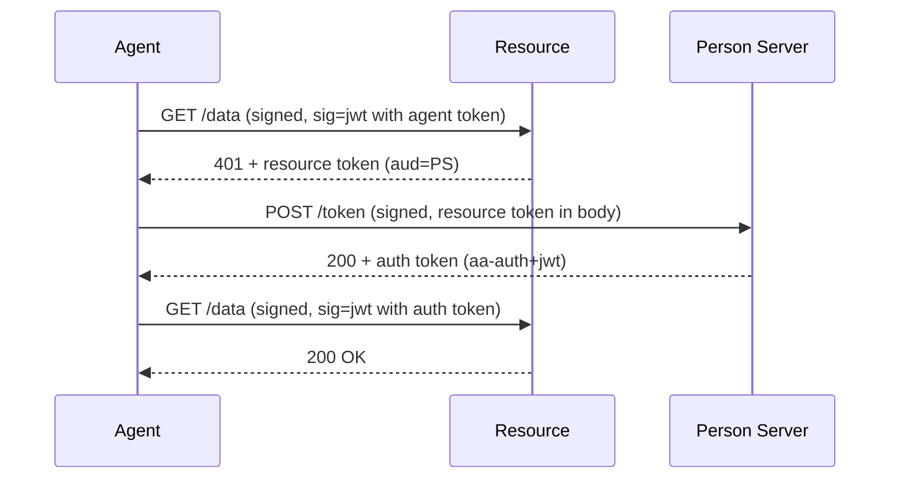

# PS-Asserted Access (Three-Party)

> [Live demo](https://explorer.aauth.dev/access/ps-asserted) | [Access Mode Comparison](https://explorer.aauth.dev/access/compare)

## Overview

The resource doesn't handle authorization itself — it delegates to the agent's Person Server. The resource issues a resource token; the agent exchanges it at the PS for an auth token; then presents the auth token back. Requires `sig=jwt` signing mode.

## Sequence Diagram



## Code Example

Automatic handling with `AAuthClientBuilder`:

```csharp
using AAuth.Agent;
using AAuth.HttpSig;

var keyStore = KeyStore.Default();
var key = await keyStore.LoadAsync(configuration["AAuth:KeyId"]!)
    ?? throw new InvalidOperationException("Key not found. Run enrollment first.");
var apRefreshEndpoint = configuration["AAuth:ApRefreshEndpoint"]!;

using var client = new AAuthClientBuilder(key)
    .WithTokenRefresh(async (ctx, ct) =>
    {
        var apClient = new AgentProviderClient(new HttpClient(), keyStore);
        return await apClient.RefreshAsync(apRefreshEndpoint, ctx.KeyId, ct);
    })
    .WithChallengeHandling(personServer: "https://ps.example")
    .Build();

var response = await client.GetAsync("https://resource.example/data");
// ChallengeHandler intercepts the 401, exchanges the resource token,
// swaps to the auth token, and retries automatically.
```

<details>
<summary>Manual Setup (Advanced)</summary>

This shows the internal handler pipeline for educational purposes. Use `WithTokenRefresh` + `WithChallengeHandling` in production code.

```csharp
using AAuth.Agent;
using AAuth.Discovery;
using AAuth.HttpSig;

var keyStore = KeyStore.Default();
var key = await keyStore.LoadAsync(configuration["AAuth:KeyId"]!);
var agentToken = "..."; // acquired via AP refresh endpoint
var tokenHolder = new AAuthTokenHolder(agentToken);

var signingHandler = new AAuthSigningHandler(key!,
    new JwtSignatureKeyProvider(() => tokenHolder.Current))
{
    InnerHandler = new HttpClientHandler()
};

var signedClient = new HttpClient(signingHandler);
var metadata = new MetadataClient(new HttpClient());
var exchange = new TokenExchangeClient(signedClient, metadata);

var challengeHandler = new ChallengeHandler(
    exchange, tokenHolder, "https://ps.example")
{
    InnerHandler = signingHandler
};

using var client = new HttpClient(challengeHandler);
var response = await client.GetAsync("https://resource.example/data");
```

</details>
```

## DI Registration

```csharp
var key = await keyStore.LoadAsync(configuration["AAuth:KeyId"]!);
var apRefreshEndpoint = configuration["AAuth:ApRefreshEndpoint"]!;

builder.Services.AddAAuthAgent("ps-asserted", options =>
{
    options.Key = key!;
    options.PersonServer = "https://ps.example";
    options.TokenRefresher = new DelegateTokenRefresher(async (ctx, ct) =>
    {
        var apClient = new AgentProviderClient(new HttpClient(), keyStore);
        return await apClient.RefreshAsync(apRefreshEndpoint, ctx.KeyId, ct);
    });
});
```

This registers a named `HttpClient` with signing + automatic challenge handling. Inject via `IHttpClientFactory.CreateClient("ps-asserted")`. The `ChallengeHandler` intercepts 401 responses, exchanges the resource token at the PS, and retries transparently.

See [Dependency Injection](../reference/dependency-injection.md) for full options reference.

## Token Flow

1. Agent sends signed request with agent token → resource returns 401 + resource token
2. `ChallengeHandler` intercepts: extracts resource token from response
3. `TokenExchangeClient.ExchangeAsync()` posts resource token to PS's `token_endpoint`
4. PS verifies agent identity, checks consent, returns auth token
5. `AAuthTokenHolder` is updated with the auth token
6. `ChallengeHandler` retries the original request (now with auth token in Signature-Key)

## Autonomous vs Deferred

- **Autonomous**: PS has standing consent → returns auth token immediately (step 3→4)
- **Deferred**: PS requires user approval → returns 202 + pending URL → agent polls (see [Deferred Consent](deferred-consent.md))

## Error Scenarios

| Status | Header/Token | Cause |
|--------|-------------|-------|
| 401 | `Signature-Error: invalid_signature` | Signature doesn't verify at resource |
| 401 | Resource token with `error` claim | Resource rejects agent identity |
| 403 | Auth token denied | PS issued auth token but resource policy still denies |
| 202 | Pending URL from PS | Deferred consent — user approval required |

## Further Reading

- [Agent Token mode](../signing-modes/agent-token-jwt.md)
- [Deferred Consent](deferred-consent.md)
- [Federated Access](federated-access.md)
- [Token Issuance (server)](../server/token-issuance.md)
