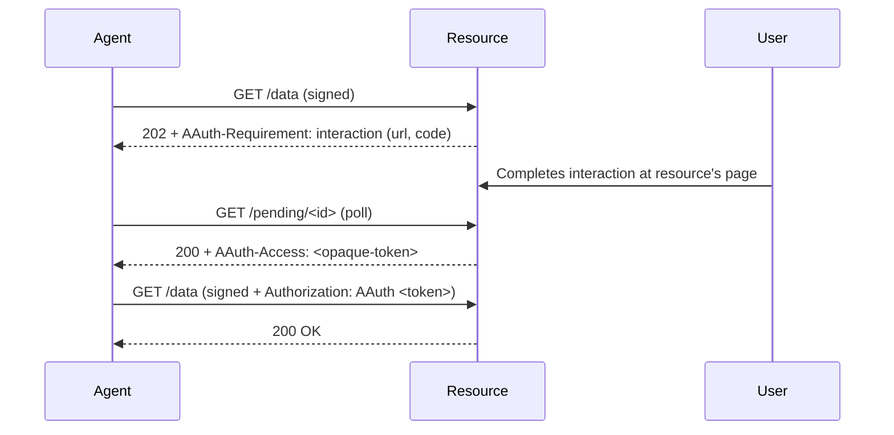

# Resource-Managed Access

> [Live demo](https://explorer.aauth.dev/access/resource-managed) | [Access Mode Comparison](https://explorer.aauth.dev/access/compare)

## Overview

The resource handles authorization itself — via user interaction, existing OAuth/OIDC, or internal policy. After authorization, the resource returns an opaque access token for subsequent calls. Two-party only (agent + resource).

This is the AAuth mode for resources that authorize requests themselves — the role a first-party OAuth deployment fills when a service runs its own authorization server alongside its API. The resource is both the authority that mints the opaque token and the API that accepts it, and that token MAY wrap an existing OAuth access token. When authorization is instead delegated to a separate authority, that authority is a Person Server or Access Server — see [PS-asserted](ps-asserted-access.md) and [federated](federated-access.md) access.

Runnable demo: the **Inbox** resource server (`samples/MockResourceServers/Inbox`, `:5004`) and the SampleApp [`/inbox`](http://localhost:5240/inbox) page / GuidedTour **Resource-Managed** flow.

## Sequence Diagram



## Code Example

### Client-Side (Agent)

`WithResourceManagedAccess()` captures the `AAuth-Access` token and replays it as `Authorization: AAuth <token68>` (the signer covers `authorization` automatically). Combine with `WithInteractionHandling()` to drive the resource's `202 → consent → 200` handshake:

```csharp
using var client = new AAuthClientBuilder(key)
    .UseHwk()
    .WithResourceManagedAccess()
    .WithInteractionHandling(options =>
    {
        options.OnInteractionRequired = (url, code, ct) =>
        {
            Console.WriteLine($"Approve at: {url}?code={code}");
            return Task.CompletedTask;
        };
    })
    .Build();

// First call drives the 202 → consent → poll handshake; the SDK captures the
// AAuth-Access token. Subsequent calls replay it, bound to the signature.
await client.GetAsync("https://resource.example/messages");
var response = await client.GetAsync("https://resource.example/messages");
```

<details>
<summary>Manual Handling</summary>

```csharp
var response = await client.GetAsync("https://resource.example/messages");
if (response.StatusCode == HttpStatusCode.Accepted)
{
    // Parse AAuth-Requirement header for the interaction URL + code
    var requirement = AAuthRequirementHeader.Parse(
        response.Headers.GetValues("AAuth-Requirement").First());
    // Present the interaction URL to the user, then poll the Location URL.
    // On 200, read AAuth-Access and present it on the next request as
    // Authorization: AAuth <token68> (covered by the signature).
}
```

</details>

### Server-Side (endpoint helpers)

The resource resolves the inbound opaque token, issues new ones, and opens consent interactions via `HttpContext` helpers (the signature binding — that `authorization` is covered — is enforced by `AAuthVerifier`):

```csharp
app.MapGet("/messages", async (HttpContext ctx, IOpaqueTokenStore store) =>
{
    var info = await ctx.ResolveAAuthAccessAsync(store);
    if (info is not null)
        return Results.Ok(new { messages });

    // No token yet → open a consent interaction at the resource's own page.
    return ctx.InteractionRequiredAAuth(consentUrl, code, pendingUrl);
});

// On consent completion (e.g. from the poll target), mint + emit AAuth-Access:
await ctx.IssueAAuthAccessAsync(store, new OpaqueTokenInfo
{
    AgentJkt = ctx.GetAAuthVerification()!.Jkt!,
    Scope = "inbox.read",
    Expiration = DateTimeOffset.UtcNow.AddMinutes(30),
});

// Optional proactive entry point (§Authorization Endpoint Request):
app.MapAAuthAuthorizationEndpoint("/authorize", async (ctx, request) =>
{
    // request.Scope + ctx.GetAAuthVerification() → same decision as /messages
    return /* 202 interaction or issue a token */;
});
```

## DI Registration

### Agent-Side

```csharp
var key = await keyStore.LoadAsync(configuration["AAuth:LocalKeyHandle"]!);

builder.Services.AddAAuthAgent("resource-managed", options =>
{
    options.Key = key!;
    options.EnableResourceManagedAccess = true; // capture + replay AAuth-Access
    options.OnResourceInteraction = async (url, code, ct) =>
    {
        await notifier.SendAsync($"Approve at: {url}?code={code}", ct);
    };
    options.PollingTimeout = TimeSpan.FromMinutes(3);
});
```

### Resource-Side

```csharp
builder.Services.AddAAuthResource(options =>
{
    options.Issuer = "https://resource.example";
    options.SigningKeys = new() { ["key-1"] = resourceKey };
    options.EnableResourceManagedAccess = true; // registers a default IOpaqueTokenStore
});
```

The endpoints then drive the flow with `ResolveAAuthAccessAsync` /
`IssueAAuthAccessAsync` / `InteractionRequiredAAuth` and, optionally,
`MapAAuthAuthorizationEndpoint`.

See [Dependency Injection](../reference/dependency-injection.md) for full reference.

## Error Scenarios

| Status | Header | Cause |
|--------|--------|-------|
| 401 | `Signature-Error: invalid_signature` | Signature doesn't verify |
| 202 | `AAuth-Requirement: interaction` | Authorization pending — user interaction required |
| 403 | *(none)* | Interaction completed but access denied by resource policy |

## Further Reading

- [Access Mode Comparison](https://explorer.aauth.dev/access/compare)
- [Identity-Based Access](identity-based-access.md)
- [PS-Asserted Access](ps-asserted-access.md)
