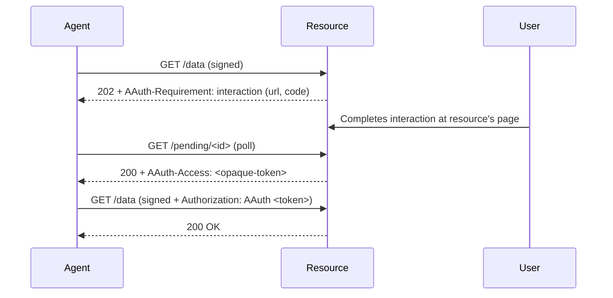

# Resource-Managed Access

> [Live demo](https://explorer.aauth.dev/access/resource-managed) | [Access Mode Comparison](https://explorer.aauth.dev/access/compare)

## Overview

The resource handles authorization itself — via user interaction, existing OAuth/OIDC, or internal policy. After authorization, the resource returns an opaque access token for subsequent calls. Two-party only (agent + resource).

## Sequence Diagram



## Code Example

### Client-Side (Agent)

Use `WithInteractionHandling()` to automatically handle 202 + interaction requirements:

```csharp
using var client = new AAuthClientBuilder(key)
    .UseHwk()
    .WithInteractionHandling(options =>
    {
        options.OnInteractionRequired = async (url, code, ct) =>
        {
            Console.WriteLine($"Approve at: {url}?code={code}");
        };
    })
    .Build();

var response = await client.GetAsync("https://resource.example/data");
// Interaction handling polls until the resource resolves the request
```

<details>
<summary>Manual Handling</summary>

```csharp
var response = await client.GetAsync("https://resource.example/data");
if (response.StatusCode == HttpStatusCode.Accepted)
{
    // Parse AAuth-Requirement header for interaction URL
    var requirement = AAuthRequirementHeader.Parse(
        response.Headers.GetValues("AAuth-Requirement").First());
    // Present interaction URL to user
    // Poll pending URL until resolved
}
```

</details>

### Server-Side (`IOpaqueTokenStore`)

```csharp
// Resource issues opaque tokens after interaction completes
builder.Services.AddSingleton<IOpaqueTokenStore>(new InMemoryOpaqueTokenStore());
```

## DI Registration

### Agent-Side

```csharp
var key = await keyStore.LoadAsync(configuration["AAuth:LocalKeyHandle"]!);

builder.Services.AddAAuthAgent("resource-managed", options =>
{
    options.Key = key!;
    // No TokenRefresher needed — HWK mode (pseudonymous)
    options.OnResourceInteraction = async (url, code, ct) =>
    {
        await notifier.SendAsync($"Approve at: {url}?code={code}", ct);
    };
    options.PollingTimeout = TimeSpan.FromMinutes(3);
});
```

### Resource-Side

```csharp
builder.Services.AddAAuthResource(options =>
{
    options.Issuer = "https://resource.example";
    options.SigningKeys = new() { ["key-1"] = resourceKey };
});
builder.Services.AddSingleton<IOpaqueTokenStore>(new InMemoryOpaqueTokenStore());
```

See [Dependency Injection](../reference/dependency-injection.md) for full reference.

## Error Scenarios

| Status | Header | Cause |
|--------|--------|-------|
| 401 | `Signature-Error: invalid_signature` | Signature doesn't verify |
| 202 | `AAuth-Requirement: interaction` | Authorization pending — user interaction required |
| 403 | *(none)* | Interaction completed but access denied by resource policy |

## Further Reading

- [Access Mode Comparison](https://explorer.aauth.dev/access/compare)
- [Identity-Based Access](identity-based-access.md)
- [PS-Asserted Access](ps-asserted-access.md)
