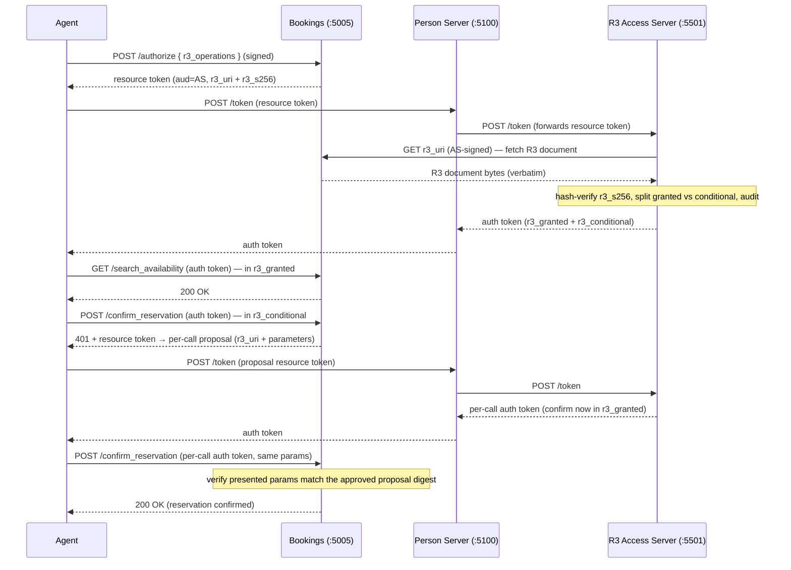

# Rich Resource Requests (R3)

> Preview — R3 is an IETF Exploratory Draft (`draft-hardt-aauth-r3`). It ships in the
> separate [`AAuth.R3`](../../src/AAuth.R3/) preview package, not the core `AAuth` package.

Overview: R3 adds **resource-declared, vocabulary-based** authorization on top of the
four AAuth access modes. Instead of opaque scope strings, the resource publishes a
content-addressed **R3 document** describing the operations a class of access covers
(in a vocabulary the agent already understands — here **OpenAPI** operation IDs) and the
human consequences of granting it. The auth token then carries `r3_granted` (serve
immediately) and `r3_conditional` (needs per-call approval) instead of, or alongside,
`scope`. The **Bookings** sample (a dining & experiences reservation provider) is
guarded by a **dedicated R3 Access Server**.



## What R3 adds to a resource

- **Vocabularies** (`r3_vocabularies` in `/.well-known/aauth-resource.json`) map the
  resource's operations to a format the agent knows. Bookings is an ASP.NET HTTP API,
  so it advertises the **OpenAPI** vocabulary (`urn:aauth:vocabulary:openapi`) pointing
  at its OpenAPI document (`/openapi.json`); operations are `operationId`s.
- **R3 documents** are content-addressed: `r3_s256 = base64url(SHA-256(served bytes))`
  with **no canonicalization** — the resource serializes once and serves those exact
  bytes. Agents never fetch them; only the AS (and PS, for consent display) may, over
  an HTTP Message Signature.
- **Token claims** — the resource token carries `r3_uri` + `r3_s256`; the auth token
  adds `r3_granted` and (optionally) `r3_conditional`.

## Granted vs. conditional

The **Access Server** — not the resource — decides which operations to grant outright
and which to make conditional, from the document's `operations` and its own policy
(r3 §Auth Token Extensions). The dedicated Bookings AS is configured to treat
`confirmReservation` as conditional (override via `R3AccessServer:ConditionalOperations`);
the R3 document itself carries only the spec fields (`operations` + `display`):

- **`r3_granted`** — `searchAvailability`, `holdReservation`: served immediately.
- **`r3_conditional`** — `confirmReservation`: charges a non-refundable deposit, so it
  requires a **per-call proposal**. On first call the resource returns a resource token
  referencing a single-invocation R3 document that carries the concrete `parameters`
  (venue, date, party size, deposit). The AS re-evaluates those parameters and issues a
  per-call auth token; the resource verifies the presented parameters match the approved
  proposal's digest before serving. An approval for one reservation cannot be replayed
  against another.

## Security invariants (enforced + tested)

- **AS-only document fetch** — Bookings serves `r3_uri` only to a trusted fetcher (its
  R3 AS, and the PS for `display`); agent-signed requests are rejected.
- **Hash-verify before use** — the AS rejects a document whose bytes do not match
  `r3_s256`.
- **Atomic audit-with-issuance** — the AS records `r3_uri`/`r3_s256`/agent/timestamp
  before returning a token; if the audit sink fails, no token is issued.
- **Per-call digest match** — the resource rejects a retry whose parameters differ from
  the approved proposal.

## Person-Server trust (spec default)

The R3 AS brokers for Person Servers using the same trust model as the core Access
Server: an **unset** `TrustedPersonServers` list is **open** (broker any *verifiable*
PS — the draft-08 default), an explicit list **narrows** (empty ⇒ deny-all), composed
by AND with an optional `IsTrustedPersonServer` policy. The Bookings demo AS pins the
demo PS (:5100) as the documented four-party pattern.

## Try it

```bash
make demo   # starts Bookings (:5005) + the R3 AS (:5501) alongside the full stack
```

See [`samples/MockResourceServers/Bookings`](../../samples/MockResourceServers/Bookings/)
and [`samples/MockAccessServers/R3`](../../samples/MockAccessServers/R3/), and the
[`AAuth.R3` package](../../src/AAuth.R3/). R3 is exercised by the in-process
[`AAuth.R3.Tests`](../../tests/AAuth.R3.Tests/) suite.
