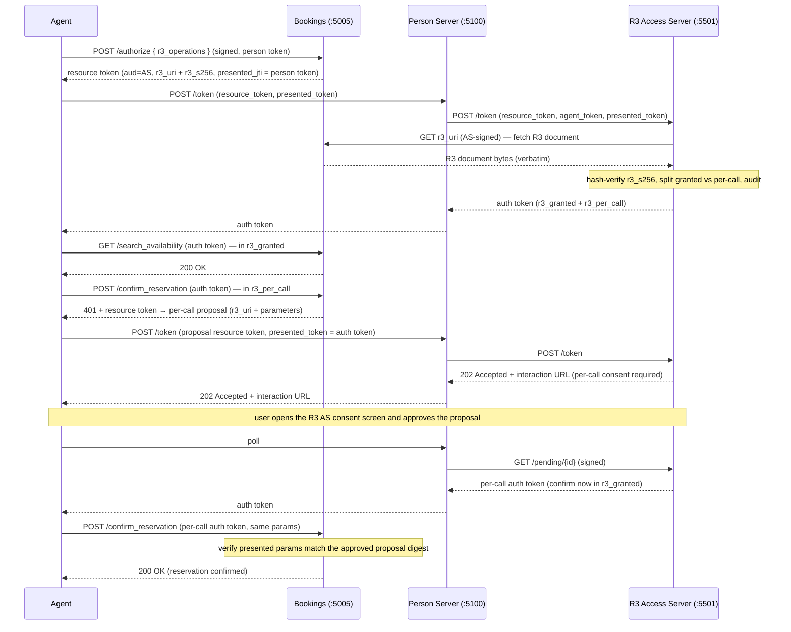

# Rich Resource Requests (R3)

> Preview — R3 is an IETF Exploratory Draft (`draft-hardt-aauth-r3`). It ships in the
> separate [`AAuth.R3`](../../src/AAuth.R3/) preview package, not the core `AAuth` package.

Overview: R3 adds **resource-declared, vocabulary-based** authorization on top of the
four AAuth access modes. Instead of opaque scope strings, the resource publishes a
content-addressed **R3 document** describing the operations a class of access covers
(in a vocabulary the agent already understands — here **OpenAPI** operation IDs) and the
human consequences of granting it. The auth token then carries `r3_granted` (serve
immediately) and `r3_per_call` (needs per-call approval) instead of, or alongside,
`scope`. The **Bookings** sample (a dining & experiences reservation provider) is
guarded by a **dedicated R3 Access Server**.


```mermaid
sequenceDiagram
    participant Agent
    participant Bookings as Bookings (:5005)
    participant PS as Person Server (:5100)
    participant AS as R3 Access Server (:5501)
    Agent->>Bookings: POST /authorize { r3_operations } (signed, person token)
    Bookings-->>Agent: resource token (aud=AS, r3_uri + r3_s256, presented_jti = person token)
    Agent->>PS: POST /token (resource_token, presented_token)
    PS->>AS: POST /token (resource_token, agent_token, presented_token)
    AS->>Bookings: GET r3_uri (AS-signed) — fetch R3 document
    Bookings-->>AS: R3 document bytes (verbatim)
    Note over AS: hash-verify r3_s256, split granted vs per-call, audit
    AS-->>PS: auth token (r3_granted + r3_per_call)
    PS-->>Agent: auth token
    Agent->>Bookings: GET /search_availability (auth token) — in r3_granted
    Bookings-->>Agent: 200 OK
    Agent->>Bookings: POST /confirm_reservation (auth token) — in r3_per_call
    Bookings-->>Agent: 401 + resource token → per-call proposal (r3_uri + parameters)
    Agent->>PS: POST /token (proposal resource token, presented_token = auth token)
    PS->>AS: POST /token
    AS-->>PS: 202 Accepted + interaction URL (per-call consent required)
    PS-->>Agent: 202 Accepted + interaction URL
    Note over Agent,AS: user opens the R3 AS consent screen and approves the proposal
    Agent->>PS: poll
    PS->>AS: GET /pending/{id} (signed)
    AS-->>PS: per-call auth token (confirm now in r3_granted)
    PS-->>Agent: auth token
    Agent->>Bookings: POST /confirm_reservation (per-call auth token, same params)
    Note over Bookings: verify presented params match the approved proposal digest
    Bookings-->>Agent: 200 OK (reservation confirmed)
```

## What R3 adds to a resource

- **Vocabularies** (`r3_vocabularies` in `/.well-known/aauth-resource.json`) map the
  resource's operations to a format the agent knows. Bookings is an ASP.NET HTTP API,
  so it advertises the **OpenAPI** vocabulary (`urn:aauth:vocabulary:openapi`) pointing
  at its OpenAPI document (`/openapi.json`); operations are `operationId`s.
- **R3 documents** are content-addressed: `r3_s256 = base64url(SHA-256(served bytes))`
  with **no canonicalization** — the resource serializes once and serves those exact
  bytes. Agents never fetch them. The designated AS may fetch with an HTTP Message
  Signature; a PS evaluator requires explicit resource policy.
- **Token claims** — the resource token carries `r3_uri` + `r3_s256`; the auth token
  adds `r3_granted` and (optionally) `r3_per_call`.

## Granted vs. per-call

The **Access Server** — not the resource — decides which operations to grant outright
and which to make per-call, from the document's `operations` and its own policy
(r3 §Auth Token Extensions). The dedicated Bookings AS is configured to treat
`confirmReservation` as per-call (override via `R3AccessServer:PerCallOperations`);
the R3 document itself carries only the spec fields (`operations` + `display`):

- **`r3_granted`** — `searchAvailability`, `holdReservation`: served immediately.
- **`r3_per_call`** — `confirmReservation`: charges a non-refundable deposit, so it
  requires a **per-call proposal**. On first call the resource returns a resource token
  referencing a single-invocation R3 document that carries the concrete `parameters`
  (venue, date, party size, deposit). Because the proposal is consequential, the R3 AS
  requires **human consent** (r3 §Per-Call Proposals, Flow step 2): it replies `202` with
  an interaction URL, renders the proposal's `display` at its own consent screen, and
  mints the per-call auth token only after the user approves (the PS polls the signed
  `/pending` Location meanwhile). The resource then verifies the presented parameters
  match the approved proposal's digest before serving. An approval for one reservation
  cannot be replayed against another.

## Security invariants (enforced + tested)

- Designated-AS document access is the default. Bookings explicitly opts its demo
  PS into `Bookings:PersonServerEvaluators` for consent display. AS and PS callers
  must use their respective access/person metadata role; agents are rejected.
  This is the recorded Q4 interpretation of conflicting draft readership clauses.
- **Hash-verify before use** — the AS rejects a document whose bytes do not match
  `r3_s256`.
- Audit persistence is mandatory. The sample commits the token's `jti` and SHA-256
  with `r3_uri`, `r3_s256`, agent, account, and issuance time in one SQLite
  transaction before returning it. Audit failure prevents release.
- Published document/proposal bytes remain available for the resource process
  lifetime. The bounded store refuses new distinct content when full instead of
  evicting content referenced by issued grants. Restart durability remains a
  deployment responsibility, separate from the sample's SQLite issuance audit.
- **Per-call digest match** — the resource rejects a retry whose parameters differ from
  the approved proposal.

## Serving R3 documents

`AddAAuthR3Documents` registers the `R3DocumentReaderPolicy` and an in-memory
`IR3DocumentEntitlements`; `MapR3Document(pattern, getBytes)` resolves both from DI.
Every resource token minted through `R3Challenge` entitles its `aud` (the AS) and
`ps` (the PS) to read the document it names, keyed by the document's `r3_s256`. A
PS evaluator reads only documents it is entitled to (or that the policy's
`IsEntitledPersonServer` predicate admits); other documents look absent (`404`).

```csharp
builder.Services.AddAAuthR3Documents(_ =>
    new R3DocumentReaderPolicy(asIssuer, [psIssuer], egressPolicy));
var documents = new R3ProposalStore();

// After builder.Build():
app.MapR3Document("/r3/{hash}", ctx =>
    documents.TryGet((string)ctx.Request.RouteValues["hash"]!, out var bytes) ? bytes : null);

// ChallengeAsync(context, ...) and per-call ToResultAsync(context, challenge, ...) use
// the DI entitlements; set Entitlements when minting with BuildResourceTokenAsync.
var entitlements = app.Services.GetRequiredService<IR3DocumentEntitlements>();
var challenge = new R3Challenge
{
    ResourceIssuer = resourceUrl, Audience = asIssuer,
    Key = resourceKey, KeyId = ResourceKid, Entitlements = entitlements,
};

// A resource token minted without R3Challenge must entitle its readers itself.
var stored = documents.AddBytes("{}"u8.ToArray(), new Uri(resourceUrl), "/r3");
await entitlements.EntitleAsync(stored.S256, asIssuer);
await entitlements.EntitleAsync(stored.S256, psIssuer);
```

The in-memory entitlements are per process. Behind a load balancer, register a
shared `IR3DocumentEntitlements` before `AddAAuthR3Documents` so every instance
serving the document sees the grants.

Every Bookings route supports granted, per-call, and rejected outcomes;
confirmation is per-call only because of the demo AS policy. GET search/hold
use `searchAvailability` and `holdReservation`; POST variants use
`searchAvailabilityPost` and `holdReservationPost`. All identifiers come from the
same published OpenAPI definition. Per-call parameters bind the HTTP method,
query/body inputs, and selected account. Confirmation requires the reservation
ID, venue, date, party size, deposit, and cancellation policy.

## Vocabulary and API contracts

> **Known non-conformance (remediation Phase 6).** On its own,
> `R3Enforcement.Evaluate` returns `Granted` every time the same per-call auth
> token is presented. R3 requires a per-call grant to be used once. Until
> Phase 6 lands, run the execution through `IAAuthSingleUseGate.ExecuteOnceAsync`
> keyed by the auth token's `jti`, as the Bookings sample does. See the
> [remediation plan](../../.agent/plans/2026-09-30-v11-compliance-remediation/implementation-plan.md).

All seven standard vocabularies have validated operation shapes. OpenAPI
operation identity is the vocabulary plus `operationId`; WSDL may add an optional
`service` member. `R3OperationIdentity` also includes the vocabulary and every
optional member; bare-ID matching is not supported. Third-party schemas are
explicitly supplied through a consumer-local `R3VocabularySchemas` instance.

```csharp
var identity = R3OperationIdentity.OpenApi("confirmReservation");
var grantedClaims = R3ClaimReader.ReadAuthToken(claims);
IReadOnlyDictionary<string, R3Parameter> presentedParameters =
  new Dictionary<string, R3Parameter>();
var result = enforcement.Evaluate(grantedClaims, identity, presentedParameters,
    approvedProposalS256: proposalHash, expectedAccount: account);
```

An approved proposal retry must supply its proposal hash and matching parameters.
For digest parameters, use `R3PresentedParameters` with the actual value bytes.
The resource recovers the exact proposal bytes and rechecks their hash. Callers
must distinguish class grants from proposal grants before serving a request, as
the Bookings sample does using its stored document.

The sample's `R3AccessServer:AuditPath` selects the SQLite file. Its default is
`aauth-samples/r3-audit.sqlite` beneath local application data. Audit survives
restart; pending consent, signing keys, and Bookings documents/proposals do not.
`InMemoryR3AuditSink` is a test-only, non-durable choice. A network fetch callback
must declare and uphold its transport admission contract; returned bytes are
still size-limited and hash-verified by the SDK.

Bookings uses AsyncAPI `receive` grants to issue protected subscription tickets.
The [Events workflow](events.md) exercises registration, self-jwt delivery,
durable AP acceptance and independent agent receipt verification. The separate
[Travel Catalog](catalog-gateway.md) demonstrates one merged OpenAPI definition
that renames colliding operation IDs. Native MCP, gRPC, GraphQL, WSDL and OData hosting
is not implied by the SDK's typed vocabulary support.

## Person-Server trust (spec default)

The R3 AS brokers for Person Servers using the same trust model as the core Access
Server: an **unset** `Trust.PersonServers` rule is **open** (broker any *verifiable*
PS), an explicit `Allowed` list **narrows** (empty ⇒ deny-all), composed
by AND with an optional `Predicate`. The Bookings demo AS pins the
demo PS (:5100) as the documented four-party pattern.

## Try it

```bash
make demo   # starts Bookings (:5005) + the R3 AS (:5501) alongside the full stack
```

See [`samples/MockResourceServers/Bookings`](../../samples/MockResourceServers/Bookings/)
and [`samples/MockAccessServers/R3`](../../samples/MockAccessServers/R3/), and the
[`AAuth.R3` package](../../src/AAuth.R3/). R3 is exercised by the in-process
[`AAuth.R3.Tests`](../../tests/AAuth.R3.Tests/) suite.
