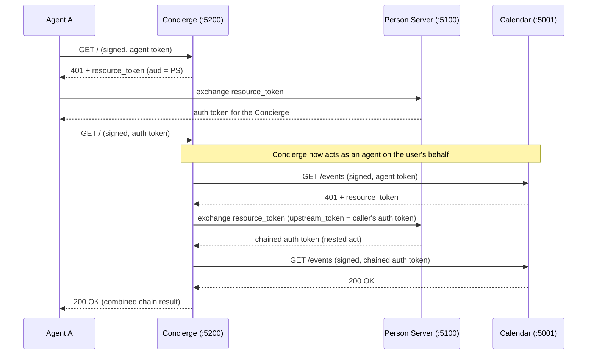

# Concierge

Multi-agent call-chaining sample. The **Concierge** is the service Aria asks to
arrange something on the user's behalf: it acts as both a **resource** (verifies
incoming callers) and an **agent** (calls a downstream Aria server with
delegation), exactly like a travel concierge booking through other providers.

## What It Demonstrates

- Intermediate service pattern: resource + agent in one process
- Proper 401 challenge with resource token when receiving agent tokens
- Token exchange with `upstream_token` for nested `act` delegation
- `UseJwt(string)` to present a pre-acquired auth token downstream
- Full issuer verification (`RequireIssuerVerification = true`)

## Flow



The final response includes:

```json
{
  "chain": "Agent → Concierge → Calendar",
  "upstream": { "agent": "aauth:sample-app@ap.example" },
  "downstream": {
    "mode": "three-party",
    "act": {
      "sub": "aauth:concierge@concierge.example",
      "act": { "sub": "aauth:sample-app@ap.example" }
    }
  }
}
```

## Running

```bash
make demo-sample   # starts all 5 services
```

Or standalone (requires Calendar, PS, and AP already running):

```bash
dotnet run --project samples/Concierge
# → http://localhost:5200
```

## Configuration

| Key | Default | Purpose |
|-----|---------|---------|
| `AAuth:Issuer` | `http://localhost:5200` | Concierge's resource identifier |
| `AAuth:Downstream` | `http://localhost:5001` | Downstream resource (Calendar) URL for the plain chain |
| `AAuth:MissionDownstream` | `http://localhost:5002` | Downstream resource (Trips) URL for the mission chain |
| `AAuth:PersonServer` | `http://localhost:5100` | PS for token exchange |
| `AAuth:AgentId` | `aauth:concierge@localhost:5200` | Concierge's agent identity |

## Using with AgentConsole

```bash
# Pre-grant consent for both hops
curl -X POST http://localhost:5100/admin/consent \
  -H "Content-Type: application/json" \
  -d '{"agent":"aauth:demo@ap.example","resource":"http://localhost:5200"}'

curl -X POST http://localhost:5100/admin/consent \
  -H "Content-Type: application/json" \
  -d '{"agent":"aauth:concierge@localhost:5200","resource":"http://localhost:5001"}'

# Call through the chain
dotnet run --project samples/AgentConsole -- http://localhost:5200 \
  --ap http://localhost:5301 --ps http://localhost:5100
```

## Key Implementation Details

1. **Self-issued identity**: The Concierge acts as its own AP per spec §Self-Hosted Agents — it publishes agent metadata at `/.well-known/aauth-agent.json` and self-signs agent tokens with its published key.
2. **Per-request consent grant**: Grants consent for itself at the PS before each downstream call (demo simplification).
3. **Fallback path**: If the caller used HWK/JWKS-URI (no upstream auth token), falls back to standard challenge handling without chaining.
