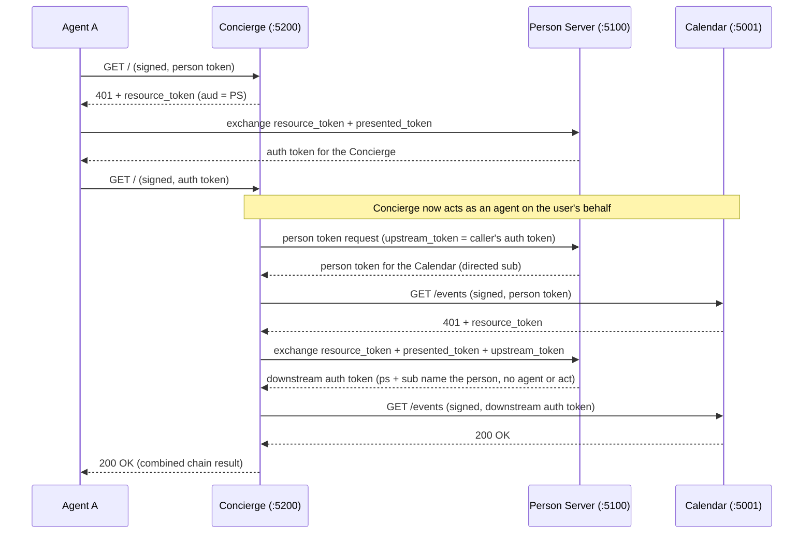

# Concierge

Multi-agent call-chaining sample. The **Concierge** is the service Aria asks to
arrange something on the user's behalf: it acts as both a **resource** (verifies
incoming callers) and an **agent** (calls a downstream Aria server with
delegation), exactly like a travel concierge booking through other providers.

## What It Demonstrates

- Intermediate service pattern: resource + agent in one process
- Proper 401 challenge with resource token when receiving person tokens
- Downstream person and auth token requests carrying `upstream_token`, routed
  to the Person Server the upstream token names (§Call Chaining)
- `WithCallChaining(string)` to drive the downstream leg from the caller's
  auth token
- Mandatory JWT issuer verification

## Flow


```mermaid
sequenceDiagram
    participant A as Agent A
    participant C as Concierge (:5200)
    participant PS as Person Server (:5100)
    participant Cal as Calendar (:5001)

    A->>C: GET / (signed, person token)
    C-->>A: 401 + resource_token (aud = PS)
    A->>PS: exchange resource_token + presented_token
    PS-->>A: auth token for the Concierge
    A->>C: GET / (signed, auth token)

    Note over C,Cal: Concierge now acts as an agent on the user's behalf
    C->>PS: person token request (upstream_token = caller's auth token)
    PS-->>C: person token for the Calendar (directed sub)
    C->>Cal: GET /events (signed, person token)
    Cal-->>C: 401 + resource_token
    C->>PS: exchange resource_token + presented_token + upstream_token
    PS-->>C: downstream auth token (ps + sub name the person, no agent or act)
    C->>Cal: GET /events (signed, downstream auth token)
    Cal-->>C: 200 OK
    C-->>A: 200 OK (combined chain result)
```

The final response includes (values abbreviated):

```json
{
  "chain": "Agent → Concierge → Calendar",
  "upstream": {
    "scheme": "jwt",
    "issuer": "http://localhost:5100",
    "ps": "http://localhost:5100",
    "sub": "…",
    "mission_s256": null,
    "tokenType": "aa-auth+jwt"
  },
  "concierge": {
    "identity": "aauth:concierge@…",
    "action": "call-chained to downstream with upstream_token"
  },
  "downstream": { "…": "the Calendar's response body" }
}
```

## Running

```bash
make demo   # starts the complete sample stack
```

Or standalone (requires Calendar, PS, and AP already running):

```bash
dotnet run --project samples/Concierge
# → http://localhost:5200
```

## Configuration

| Key | Default | Purpose |
|-----|---------|---------|
| `AAuth:Issuer` | `http://localhost:5200` | Concierge's resource identifier |
| `AAuth:Downstream` | `http://localhost:5001` | Downstream resource (Calendar) URL for the plain chain |
| `AAuth:MissionDownstream` | `http://localhost:5002` | Downstream resource (Trips) URL for the mission chain |
| `AAuth:PersonServer` | `http://localhost:5100` | PS for token exchange |
| `AAuth:AgentId` | `aauth:concierge@localhost` | Concierge's agent identity |

## Using with AgentConsole

```bash
# Call through the chain. The trailing "/" targets the Concierge root; without it
# AgentConsole would append its default /events path.
dotnet run --project samples/AgentConsole -- http://localhost:5200/ \
  --ap http://localhost:5301 --ps http://localhost:5100
```

Under `make demo` (PS `RequireConsent=true`) the chain asks for consent twice:

1. **Agent → Concierge** (scope `concierge`): AgentConsole prints a PS
   interaction URL and dashboard link.
2. **Concierge → Calendar** (scope `calendar.read`): the Concierge relays the
   downstream prompt as its own `202` + `requirement=interaction`, and
   AgentConsole prints a `/chain-interaction/...` URL that redirects to the PS.

Approve each in the browser or on the PS dashboard
(`http://localhost:5100/dashboard`). Pre-granting through `/admin/consent` is
not practical for the second hop: consent is keyed by the agent's key, and
the Concierge generates a new key every time it starts.

## Key Implementation Details

1. **Self-issued identity**: The Concierge acts as its own AP per spec §Self-Hosted Agents — it publishes agent metadata at `/.well-known/aauth-agent.json` and self-signs agent tokens with its published key.
2. **Per-request consent grant**: Grants consent for itself at the PS before each downstream call (demo simplification).
3. **Fallback path**: If the caller used a generic Signature-Key demonstration (no upstream auth token), falls back to standard challenge handling without chaining.
