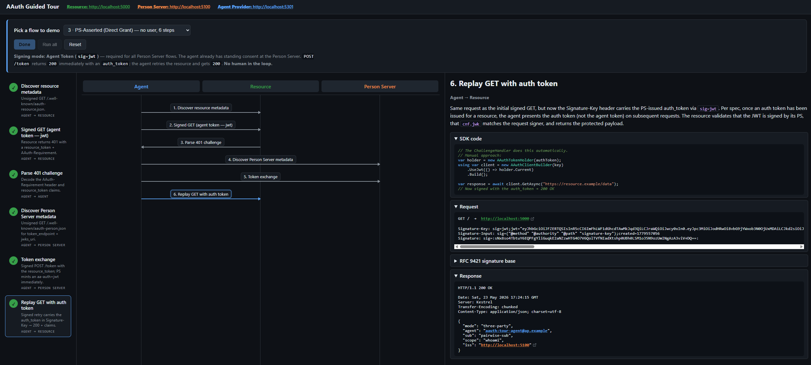

# AAuth Guided Tour

A Blazor Server walk-through of the AAuth protocol flows, aimed at folks
learning the spec for the first time. It runs the same SDK code that
`samples/AgentConsole` does, but pauses between each step so you can see
the signature base, the JWTs, and the request/response payloads at every
hop.

## What you'll see



A swim-lane sequence diagram across up to four actors — **Agent**,
**Orchestrator**, **Resource**, **Person Server** — with a payload
inspector on the right that decodes each JWT and shows the canonical
RFC 9421 signature base for every signed request. Seven flows are
available, switchable at runtime from the topbar **Mode** picker:

* **Bootstrap** (2–3 steps) — generate the agent's signing key and build
  (or obtain) an agent token. Default.
* **Identity-based** (2 steps) — resource trusts the agent token directly;
  no PS involvement.
* **PS-Asserted (Direct Grant)** (6 steps) — three-party flow where the
  PS mints the `auth_token` synchronously; no user interaction.
* **PS-Asserted (Deferred)** (9 steps) — three-party flow where the PS
  parks the request on `202 Accepted` and asks the user to consent before
  the `auth_token` is issued.
* **Call Chain / Multi-Agent** (7 steps) — the agent calls an Orchestrator
  (intermediate service) which chains downstream to a Resource, producing
  nested `act` claims that record the full delegation path.
* **Federated (Four-Party)** (7 steps; 10 on the interactive path) — the
  resource has its own **Access Server**. The resource token's `aud` is the
  AS, so the PS federates to the AS, which evaluates policy and mints the
  `aa-auth+jwt` (`dwk=aauth-access.json`). A dedicated red **Access Server**
  swimlane is shown. With a Keycloak AS policy the AS returns `202
  requirement=interaction`; the PS relays it and the agent surfaces the
  Keycloak login URL. Requires an Access Server URL (`AccessServerUrl`);
  run it with `make demo-tour-keycloak` (Keycloak) or `make demo-tour`
  (stub AS, no Docker).
* **Mission (PS-Governed)** (20 steps; three prompts) — the optional,
  orthogonal **agent governance** layer (§Agent Governance). The agent
  proposes a human-approved mission, then asks the PS for permission on
  each action, records audit, and relays interactions — the PS is the
  contextual policy point. A mission-aware Resource copies the
  `AAuth-Mission` claim into its resource token. Requires a Person Server
  URL; drive the same flow from the CLI with `make demo-mission`.

When `PersonServerUrl` is empty in `appsettings.json`, the picker locks
to Identity-based (the three-party options are disabled). You can also set
the default in `appsettings.json`:

```json
"GuidedTour": { "Mode": "Deferred" }
```

The Identity flow also exposes a **Signing Mode** picker (`hwk` or
`jwks_uri`); three-party flows always use `jwt` per spec.

WhoAmI now serves each flow from an isolated, per-mode endpoint rather
than a single root path: `GET /hwk` and `GET /jkt-jwt` (pseudonymous),
`GET /jwks-uri` (agent identity), and `GET /jwt` (three-party PS-asserted).
WhoAmI also exposes `GET /jwt/admin` (elevated scope `whoami:admin`) and
`GET /jwt/roles` (RBAC roles + groups); the tour exercises the base
`GET /jwt` path. `GET /` is an unauthenticated index listing the flows.

### Bootstrap (2–3 steps)

When no Agent Provider URL is configured (local bootstrap):

1. Generate Ed25519 keypair.
2. Build agent token — agent self-signs an `aa-agent+jwt` (demo mode).

When `AgentProviderUrl` is set, the tour enrols with a real AP:

1. Generate Ed25519 keypair.
2. Discover Agent Provider — `GET /.well-known/aauth-agent.json` to learn
   the AP's `enrol_endpoint`.
3. Enrol with Agent Provider — `POST /enrol` with `{agent_id, jwk}`; AP
   issues `aa-agent+jwt`.

### Identity-based (2 steps)

Assumes the agent is already bootstrapped (key + token exist).

1. Discover resource metadata — unsigned `GET /.well-known/aauth-resource.json`.
2. Signed `GET /hwk` or `GET /jwks-uri` → 200 + claims (path depends on signing mode picker).

### PS-Asserted / Direct Grant (6 steps)

Assumes the agent is already bootstrapped.

1. Discover resource metadata — unsigned `GET /.well-known/aauth-resource.json`.
2. Signed `GET /jwt` → **`401`** with a `resource_token` + `AAuth-Requirement`.
3. Parse the 401 challenge (decode header + `resource_token` claims).
4. Discover Person Server — unsigned `GET /.well-known/aauth-person.json`.
5. Signed `POST /token` (exchange) → **`200`** + `auth_token`.
6. Signed `GET /jwt` carrying the `auth_token` → 200 + claims.

### PS-Asserted / Deferred (9 steps)

Steps 1–4 are the same as **Direct Grant**. From step 5 onward:

<!-- markdownlint-disable-next-line MD029 -->
5. Signed `POST /token` → **`202 Accepted`** with `Location: /pending/{id}`
   and interaction URL + single-use code.
6. Agent surfaces the user-facing `{url}?code={code}` link.
7. **User opens the PS's consent page.** The "Open consent page ↗"
   button opens `{url}?code={code}` in a new browser tab. The Person
   Server renders its own consent screen (agent + resource + scope); the
   user clicks **Approve** or **Deny** there and the PS records the
   choice. The agent is not on this channel. A "Simulate deny" button in
   the tour topbar is wired to the same denial endpoint for quick
   exercising of the denial path.
8. Agent polls `Location` with a signed `GET`. While polling, the
   sequence diagram shows a loop box with a live spinner and poll count.
   The loop resolves in one of three ways:
    * **Approve** → 200 + `auth_token`; the loop box turns solid green.
    * **Deny** → 403 + `{"error":"denied"}` → SDK throws
      `AAuthInteractionDeniedException`; the loop box turns red.
    * **Polling budget expires** (5 minutes by default) → SDK throws
      `AAuthInteractionTimeoutException`; the loop box turns amber.
9. Signed `GET /jwt` carrying the `auth_token` → 200 + claims (only on the
   approve path).

### Call Chain / Multi-Agent (7 steps)

Demonstrates multi-agent delegation. The agent calls an Orchestrator
(an intermediate AAuth-protected service) which itself calls a downstream
Resource (WhoAmI), forwarding the caller's auth_token as `upstream_token`
to produce a nested `act` claim.

1. Discover Orchestrator metadata — unsigned `GET /.well-known/aauth-resource.json`.
2. Signed `GET /` → **`401`** (agent token challenge from Orchestrator).
3. Parse the Orchestrator's 401 challenge (resource_token).
4. Discover Person Server — unsigned `GET /.well-known/aauth-person.json`.
5. Signed `POST /token` (exchange) → **`200`** + `auth_token` scoped to
   the Orchestrator.
6. Signed `GET /` carrying the `auth_token` → **`200`**. Internally the
   Orchestrator performs its own challenge/exchange/retry cycle against
   WhoAmI's `GET /jwt` endpoint, shown as sub-step arrows in the sequence
   diagram.
7. Inspect multi-agent result — view the combined response with nested
   `act` claims proving the full Agent → Orchestrator → Resource chain.

> [!TIP]
> The PS-Asserted (Deferred) flow only fires when the Person Server is
> configured with `MockPersonServer:RequireConsent=true`. `make demo` from
> the repo root launches all five services with consent gating enabled.

## Run it

### Option 1: `make demo` (recommended)

From the repo root:

```bash
make demo
```

Starts WhoAmI, Orchestrator, MockPersonServer (with `RequireConsent=true`),
MockAgentProvider, and the Guided Tour together. Open
<http://localhost:5400> and flip the topbar mode picker to **Call Chain**
or **Deferred** to exercise those paths.

### Option 2: five terminals

```bash
# Terminal 1 — Resource (port 5000)
dotnet run --project samples/WhoAmI

# Terminal 2 — Orchestrator (port 5200)
dotnet run --project samples/Orchestrator

# Terminal 3 — Person Server (port 5100)
MockPersonServer__RequireConsent=true dotnet run --project samples/MockPersonServer

# Terminal 4 — Agent Provider (port 5301)
dotnet run --project samples/MockAgentProvider

# Terminal 5 — Tour UI (port 5400)
dotnet run --project samples/GuidedTour
```

Then open <http://localhost:5400> and click **Run all** (or step through
with **Run step**).

## Configuration

`appsettings.json`:

| Key | Default | Meaning |
| --- | --- | --- |
| `GuidedTour:WhoAmIUrl` | `http://localhost:5000` | Resource server base URL. |
| `GuidedTour:OrchestratorUrl` | `http://localhost:5200` | Orchestrator base URL for the call-chain flow. Set empty to disable that picker option. |
| `GuidedTour:PersonServerUrl` | `http://localhost:5100` | PS base URL. Set empty to lock the picker to identity-based mode. |
| `GuidedTour:AgentProviderUrl` | `http://localhost:5301` | AP base URL. When set, bootstrap enrols with the real AP instead of self-signing. |
| `GuidedTour:AgentId` | `aauth:tour-agent@ap.example` | Value placed in the agent token's `sub`. |
| `GuidedTour:Mode` | `Bootstrap` | Default flow on startup. `Bootstrap`, `Identity`, `Autonomous` (Direct Grant), `Deferred`, `CallChain`, `Federated`, or `Mission`. The topbar picker overrides this at runtime. |

