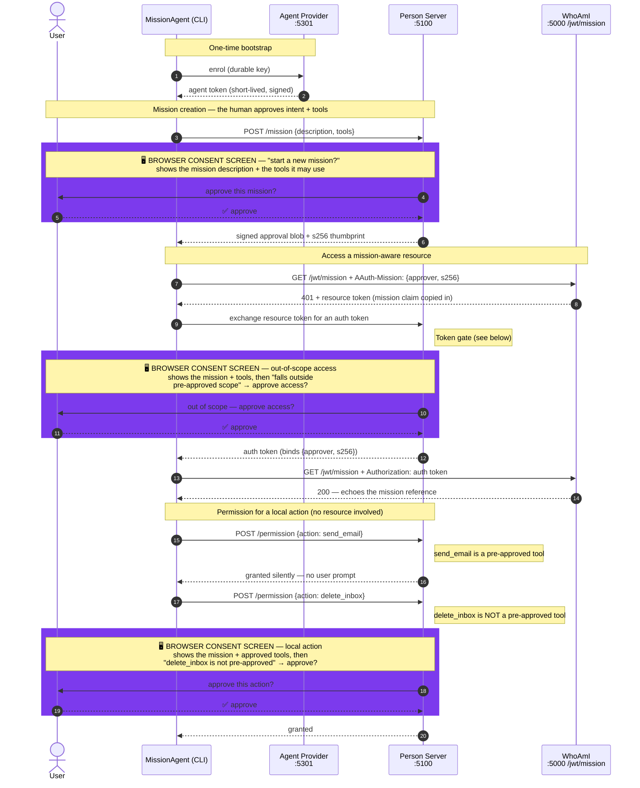
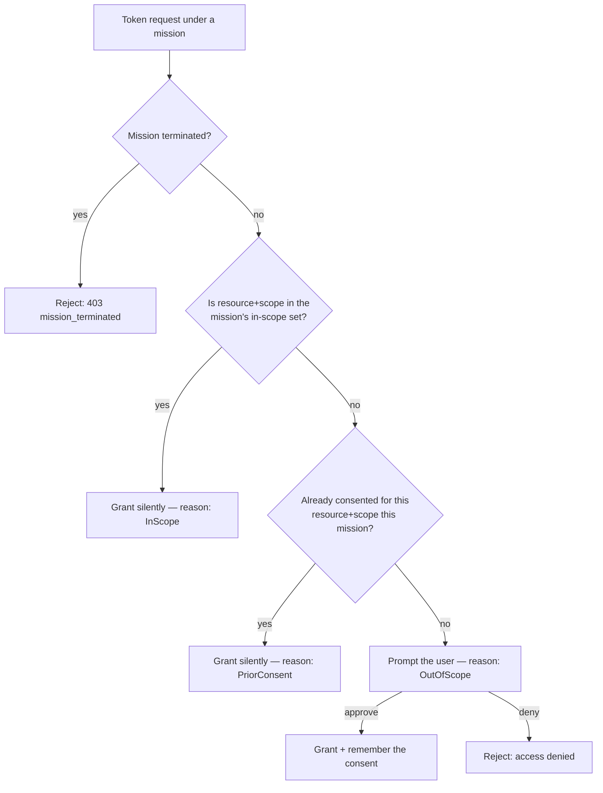

# MissionAgent

A console showcase of the AAuth **mission** model, with the Person Server (PS)
acting as the policy-enforcement point for everything the agent does.

A *mission* is a durable, human-approved statement of intent plus the tools the
agent may use (§Missions). Once approved, the PS governs every downstream token
and permission request **under** that mission with a three-gate model
(§Agent Token Request):

| Gate | Situation | Outcome |
| --- | --- | --- |
| 1 | Mission terminated | Rejected outright |
| 2a | (resource, scope) is in the mission's approved scope | Granted silently |
| 2b | Already consented earlier in this mission | Granted silently |
| 3 | Out of scope | The user is prompted to decide |

This sample drives the whole lifecycle against the live mock servers:

```text
MockAgentProvider (:5301)  ->  MockPersonServer (:5100)  ->  WhoAmI (:5000)
        enrol                       govern                 mission-aware
                                                            resource
```

## What it demonstrates

1. **Enrol** with the Agent Provider to obtain a signing key + agent token.
2. **Propose a mission** (with two approved tools) — the PS returns the signed
   approval blob and its `s256` thumbprint.
3. **Access a mission-aware resource** (`WhoAmI /jwt/mission`). The resource
   copies the mission claim from the signed `AAuth-Mission` header into the
   resource token it issues (§Terminology), so the PS governs the exchange. The
   first call is **out of scope** → the user is prompted.
4. **Access it again** — now granted **silently** via prior consent (gate 2b).
5. **Request a pre-approved tool** permission (`send_email`) — granted silently,
   without ever calling the PS (§Permission Endpoint).
6. **Request a non-pre-approved tool** permission (`delete_inbox`) — the PS is
   consulted and the user is prompted.
7. **Report an action** to the audit endpoint (§Audit Endpoint).
8. **Ask the user a question** via the interaction endpoint.
9. **Propose mission completion**, which terminates the mission.

## How the flow works

There are three parties. The agent never talks to a resource with a long-lived
credential — every resource call is brokered by the agent's **Person Server**,
which is the single point that enforces the mission.



> 🖥️ The **purple** blocks are the three browser-based **consent screens** (the
> PS's `/interaction` page). **(1) Mission creation** — the human approves the
> mission's intent and the tools it may use; this is the authority every later
> request is checked against. **(2) Out-of-scope token gate** — shows the
> mission + tools as context before approving the resource access. **(3)
> Out-of-tool permission** — a local `action` (`delete_inbox`) that isn't one of
> the mission's `approved_tools`, so the PS asks. A pre-approved tool
> (`send_email`, step 5) is granted **silently** and never reaches a screen. In
> `--auto` mode each screen is resolved by the PS's scripted default instead of
> a human click, but they are the same decision points.
>
> The spec distinguishes the two words: a mission pre-approves **`approved_tools`**
> (tools), while each per-call permission request carries an **`action`**. The
> agent calls the permission endpoint only for actions not covered by a
> pre-approved tool (§Permission Endpoint).


### The token gate — why the first call says "out of scope"

When the PS is asked to mint an auth token under a mission, it runs a
**three-gate** decision (§Agent Token Request). Crucially, this gate is about
**resource + scope**, *not* about the approved tools:



A mission carries **two independent** notions of "approved":

- **Approved tools** (`send_email`, `summarize`) gate the **permission**
  endpoint (step 5/6), *not* token issuance.
- **In-scope `(resource, scope)` pairs** gate **silent token issuance**
  (gate 2a). This sample seeds **no** in-scope pairs, so the very first call to
  `WhoAmI /jwt/mission` (`resource=:5000`, `scope=whoami`) matches neither gate
  2a nor 2b and therefore falls through to **gate 3 → prompt**. That is what the
  "falls outside the agent's pre-approved mission scope" message means — the
  resource/scope wasn't on the mission's silent-allow list, **not** that any
  tool was unapproved.

Once you approve that first prompt, the PS records the consent. The **second**
call (step 4) hits **gate 2b (prior consent)** and is granted **silently** — no
prompt. That contrast (prompt → then silent) is the core thing this sample
demonstrates.

> To see **gate 2a** instead (silent from the very first call), a PS could
> pre-seed an in-scope `(resource, scope)` pair at mission approval. This sample
> deliberately leaves it empty so the out-of-scope prompt is visible.

## Running it


Start the three servers (each in its own terminal):

```bash
dotnet run --project samples/MockAgentProvider   # :5301
dotnet run --project samples/MockPersonServer     # :5100
dotnet run --project samples/WhoAmI               # :5000
```

Then run the agent:

```bash
dotnet run --project samples/MissionAgent
```

By default each out-of-scope prompt is **interactive**: the agent prints the
Person Server's consent URL (and tries to open it) and waits while you click
**Approve** or **Deny** in your browser. The PS holds the request at `202` until
you decide, then the agent's next poll resolves.

For an unattended run (CI, smoke tests), use `--auto` to resolve every prompt
via the PS's scripted defaults:

```bash
dotnet run --project samples/MissionAgent -- --auto
```

## Options

| Flag | Default | Description |
| --- | --- | --- |
| `--ap <url>` | `http://localhost:5301` | Agent Provider base URL |
| `--ps <url>` | `http://localhost:5100` | Person Server base URL |
| `--resource <url>` | `http://localhost:5000/jwt/mission` | Mission-aware resource endpoint |
| `--sub <agent-id>` | `aauth:mission-demo@ap.example` | Agent identifier to enrol as |
| `--auto` | _(off)_ | Resolve prompts via scripted PS defaults instead of waiting for a browser decision |
