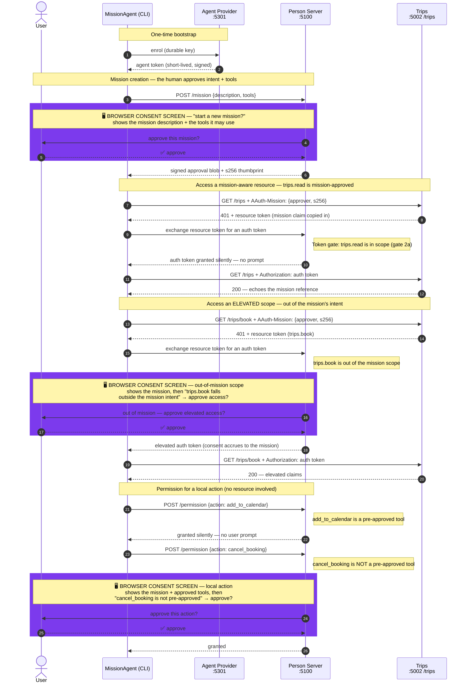
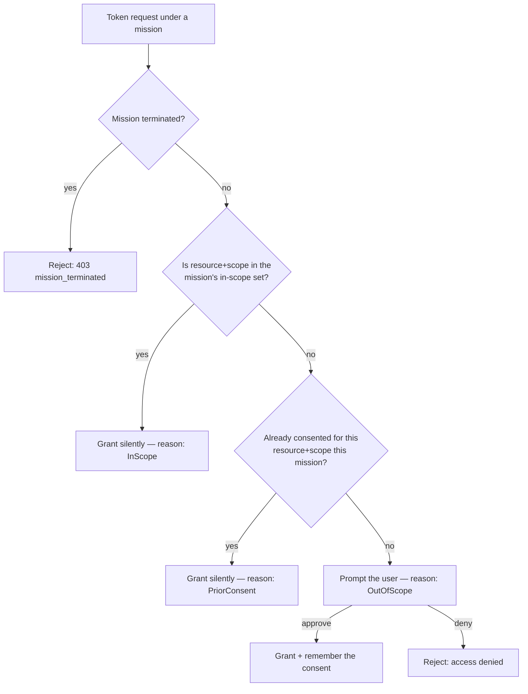

# MissionAgent

A console showcase of the AAuth **mission** model, with the Person Server (PS)
acting as the policy-enforcement point for everything the agent does.

A *mission* is a durable, human-approved statement of intent plus the tools the
agent may use (§Missions). Once approved, the PS governs every downstream token
and permission request **under** that mission with a three-gate model
(§Agent Token Request):

| Gate | Situation | Outcome |
| --- | --- | --- |
| 1 | Mission terminated | Rejected outright |
| 2a | (resource, scope) is in the mission's approved scope | Granted silently |
| 2b | Already consented earlier in this mission | Granted silently |
| 3 | Out of scope | The user is prompted to decide |

### Scope (remote) vs tool (local)

A mission grants two distinct kinds of authority, and they travel through
different PS endpoints:

- **Scope — remote.** A scope authorizes access to a remote **resource** (an
  API). The resource defines its scopes and protects its endpoints with them;
  the granted scope is carried in an **auth token** the PS mints during the
  challenge → exchange → retry flow (§Scopes). The gate table above governs
  scope requests at the PS **token endpoint**.
- **Tool — local.** A tool is an action the agent runs **itself** (a tool call,
  file write, sending a message) — no resource is involved. Tools are governed
  at the PS **permission endpoint**: a mission's `approved_tools` are
  pre-approved and resolve without a PS round-trip, while any other action is
  referred to the user (§Permission Endpoint).

So `trips.read` and `trips.book` are **scopes** (steps 3–5, via the
token endpoint) and `add_to_calendar` / `cancel_booking` are **tools** (steps 6–7, via
the permission endpoint).

This sample drives the whole lifecycle against the live mock servers:

```text
MockAgentProvider (:5301)  ->  MockPersonServer (:5100)  ->  Trips (:5002)
        enrol                       govern                 mission-aware
                                                            resource
```

## What it demonstrates

1. **Enrol** with the Agent Provider to obtain a signing key + agent token.
2. **Propose a mission** (with two approved tools) — the PS returns the signed
   approval blob and its `s256` thumbprint.
3. **Access a mission-aware resource** (`Trips /trips`). The resource
   copies the mission claim from the signed `AAuth-Mission` header into the
   resource token it issues (§Terminology), so the PS governs the exchange.
   `trips.read` is **mission-approved** by default, so this call is granted
   **silently** (gate 2a — in scope), matching the SampleApp mission demo.
4. **Access it again** — still granted **silently** (gate 2a, in scope).
5. **Access an elevated scope** (`Trips /trips/book`, requiring
   `trips.book`). This scope falls **outside** the mission's intent,
   so the PS prompts (gate 3) — out-of-mission scopes are never
   auto-denied (§Scopes).
6. **Request a pre-approved tool** permission (`add_to_calendar`) — granted silently,
   without ever calling the PS (§Permission Endpoint).
7. **Request a non-pre-approved tool** permission (`cancel_booking`) — the PS is
   consulted and the user is prompted.
8. **Report an action** to the audit endpoint (§Audit Endpoint).
9. **Ask the user a question** via the interaction endpoint.
10. **Propose mission completion**, which terminates the mission.

## How the flow works

There are three parties. The agent never talks to a resource with a long-lived
credential — every resource call is brokered by the agent's **Person Server**,
which is the single point that enforces the mission.



> 🖥️ The **purple** blocks are the three browser-based **consent screens** (the
> PS's `/interaction` page). **(1) Mission creation** — the human approves the
> mission's intent and the tools it may use; this is the authority every later
> request is checked against. **(2) Out-of-mission scope** — the elevated
> `trips.book` falls outside the mission's intent, so the PS asks
> before issuing the elevated token. **(3) Out-of-tool permission** — a local
> `action` (`cancel_booking`) that isn't one of the mission's `approved_tools`, so
> the PS asks. The `trips.read` token gate (steps 3–4) and the pre-approved
> `add_to_calendar` tool (step 6) are granted **silently** and never reach a screen.
> In `--auto` mode each screen is resolved by the PS's scripted default instead
> of a human click, but they are the same decision points.
>
> The spec distinguishes the two words: a mission pre-approves **`approved_tools`**
> (tools), while each per-call permission request carries an **`action`**. The
> agent calls the permission endpoint only for actions not covered by a
> pre-approved tool (§Permission Endpoint).


### The token gate — why the trips.read calls are silent

When the PS is asked to mint an auth token under a mission, it runs a
**three-gate** decision (§Agent Token Request). Crucially, this gate is about
**resource + scope**, *not* about the approved tools:



A mission carries **two independent** notions of "approved":

- **Approved tools** (`add_to_calendar`, `compare_options`) gate the **permission**
  endpoint (step 6/7), *not* token issuance.
- **In-scope `(resource, scope)` pairs** gate **silent token issuance**
  (gate 2a). By default this sample declares `trips.read` as mission-approved
  (mirroring the SampleApp mission demo), so the calls to
  `Trips /trips` (`resource=:5002`, `scope=trips.read`) match **gate 2a** and
  are granted **silently** — no prompt. The elevated `trips.book` is
  **not** in scope, so it falls through to **gate 3 → prompt** (step 5).

> To see the **out-of-scope prompt** for `trips.read` instead, replace the default
> in-scope set so it no longer contains `trips.read` (for example
> `--mission-approved trips.book`). The first `trips.read` call then hits
> **gate 3 → prompt**; once you approve, the PS records the consent and the
> **second** call hits **gate 2b (prior consent)** and is silent. That
> prompt → prior-consent contrast is exactly what the default `trips.read` grant
> skips.

## Running it


Start the three servers (each in its own terminal):

```bash
dotnet run --project samples/MockAgentProvider   # :5301
dotnet run --project samples/MockPersonServer     # :5100
dotnet run --project samples/MockResourceServers/Trips  # :5002
```

Then run the agent:

```bash
dotnet run --project samples/MissionAgent
```

### Using the Makefile

The repo ships two convenience targets. Start the backend stack (AP + PS +
Trips) in one terminal:

```bash
make demo-mission
```

Then drive the agent from another terminal:

```bash
make agent-mission                                       # interactive (decide in your browser)
make agent-mission MISSION_APPROVED=trips.book           # silence the elevated scope instead of trips.read
make agent-mission AUTO=1                                 # unattended (scripted PS defaults — no browser screens)
```

`MISSION_APPROVED="<scope>..."` maps to `--mission-approved <scope>` and `AUTO=1`
maps to `--auto` (both described below). By default `trips.read` is mission-approved,
so the Trips token gate is silent; pass a different `MISSION_APPROVED` set to
change which scopes are in-scope. Under `AUTO=1` there are no browser screens, so
the in-scope set only changes the PS's decision reason (silent `InScope` at gate
2a vs a scripted out-of-scope approval) — handy for tests, not for a human
watching.

By default each out-of-scope prompt is **interactive**: the agent prints the
Person Server's consent URL (and tries to open it) and waits while you click
**Approve** or **Deny** in your browser. The PS holds the request at `202` until
you decide, then the agent's next poll resolves.

For an unattended run (CI, smoke tests), use `--auto` to resolve every prompt
via the PS's scripted defaults:

```bash
dotnet run --project samples/MissionAgent -- --auto
```

### Mission-approved scopes (controlling the silent set)

By default the mission declares `trips.read` as **in scope**, so the Trips token
gate (steps 3–4) is granted **silently** at gate 2a (reason `InScope`) and no
token consent screen appears — matching the SampleApp mission demo. The
`--mission-approved <scope>` flag **replaces** this default set so you can choose
which scopes are silent:

```bash
# default: trips.read is in scope, so the Trips token gate is silent
dotnet run --project samples/MissionAgent

# silence the elevated scope instead — now the FIRST trips.read call is out of
# scope and prompts (gate 3), then the second is silent via prior consent (2b)
dotnet run --project samples/MissionAgent -- --mission-approved trips.book

# or, via the Makefile:
make agent-mission MISSION_APPROVED=trips.book
```

Each scope is seeded against the resource's **origin** (`http://localhost:5002`),
which is what the PS compares against the resource token's `iss`. Pass
`--mission-approved` more than once to declare several scopes in scope; the first
use clears the default `trips.read` grant.

## Options

| Flag | Default | Description |
| --- | --- | --- |
| `--ap <url>` | `http://localhost:5301` | Agent Provider base URL |
| `--ps <url>` | `http://localhost:5100` | Person Server base URL |
| `--resource <url>` | `http://localhost:5002/trips` | Mission-aware resource endpoint |
| `--sub <agent-id>` | `aauth:mission-demo@ap.example` | Agent identifier to enrol as |
| `--mission-approved <scope>` | `trips.read` | Replace the default in-scope set; each `(resource origin, scope)` is granted silently (gate 2a). Repeatable; the first use clears the default |
| `--auto` | _(off)_ | Resolve prompts via scripted PS defaults instead of waiting for a browser decision |
