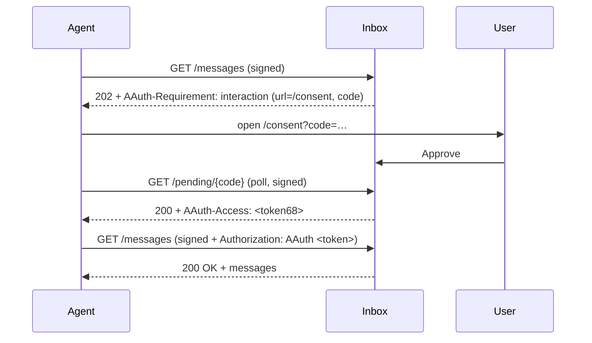

# Inbox — Resource-Managed (Two-Party) Resource Server

Aria's email service, on **`:5004`**. The **Inbox** demonstrates the
**resource-managed** access mode (`access_mode: "aauth-access-token"`): the
resource manages authorization **itself**, via its **own** consent page, with no
Person Server and no Access Server. After the user approves, the Inbox hands the
agent an opaque access token (`AAuth-Access`) that the agent replays — bound to
its HTTP-message signature — on subsequent calls.

> This is the AAuth mode for resources that authorize requests themselves — the
> role a first-party OAuth deployment plays when a service runs its own
> authorization server alongside its API
> ([draft-hardt-oauth-aauth-protocol §Resource-Managed Access](../../../aauth-spec/v08/draft-hardt-oauth-aauth-protocol.md)):
> the opaque token models a resource's existing OAuth access token, wrapped so it
> is useless without a valid AAuth signature.

> **Sample only — not part of the AAuth SDK.** Illustrative wiring built on top of
> the SDK's resource-managed helpers. Do not depend on its HTTP surface in
> production code.

## Narrative

Aria imports the traveler's trip confirmations from their inbox. The Inbox is a
third-party service Aria connects to via the inbox's **own** login/consent — not
the user's Person Server. Two parties only: agent + resource.

## Endpoints

| Path | Auth | Purpose |
|------|------|---------|
| `GET /` | none | Flow index (lists the two entry points) |
| `GET /messages` | signed | **Reactive** entry point. Serves messages when a valid `Authorization: AAuth` token is presented; otherwise returns `202` + `AAuth-Requirement: requirement=interaction` pointing at `/consent` |
| `POST /authorize` | signed | **Proactive** entry point (`{ "scope": "inbox.read" }`, §Authorization Endpoint Request) — same consent path |
| `GET /pending/{code}` | signed | Deferred-response poll target: `202` while pending, then `200` + `AAuth-Access` once approved |
| `GET /consent?code=…` | none | The Inbox's **own** consent page (the user approves here) |
| `POST /consent/approve` | none | Records the user's approval |

`/.well-known/aauth-resource.json` advertises `access_mode = "aauth-access-token"`
and the `authorization_endpoint`. `/.well-known/jwks.json` serves the resource key.

## The flow



The agent MUST cover `authorization` in its signature when presenting the token
(the SDK's signer does this automatically), binding the opaque token to the
request so it cannot be replayed as a standalone bearer token.

## Running

```bash
dotnet run --project samples/MockResourceServers/Inbox    # :5004
```

Or as part of the full stack:

```bash
make resources   # all five Aria resource servers
make demo        # full stack + both UIs
```

Override the issuer: `--AAuth:Issuer https://my-inbox.example` (or the
`AAuth__Issuer` env var).

## SDK surface used

- Agent: `AAuthClientBuilder.WithResourceManagedAccess()` +
  `WithInteractionHandling(...)` — captures `AAuth-Access`, replays
  `Authorization: AAuth`, drives the `202 → consent → 200` handshake.
- Resource: `HttpContext.ResolveAAuthAccessAsync` / `IssueAAuthAccessAsync` /
  `InteractionRequiredAAuth`, `MapAAuthAuthorizationEndpoint`, and
  `IOpaqueTokenStore`.

See [Resource-Managed Access](../../../docs/workflows/resource-managed-access.md).
